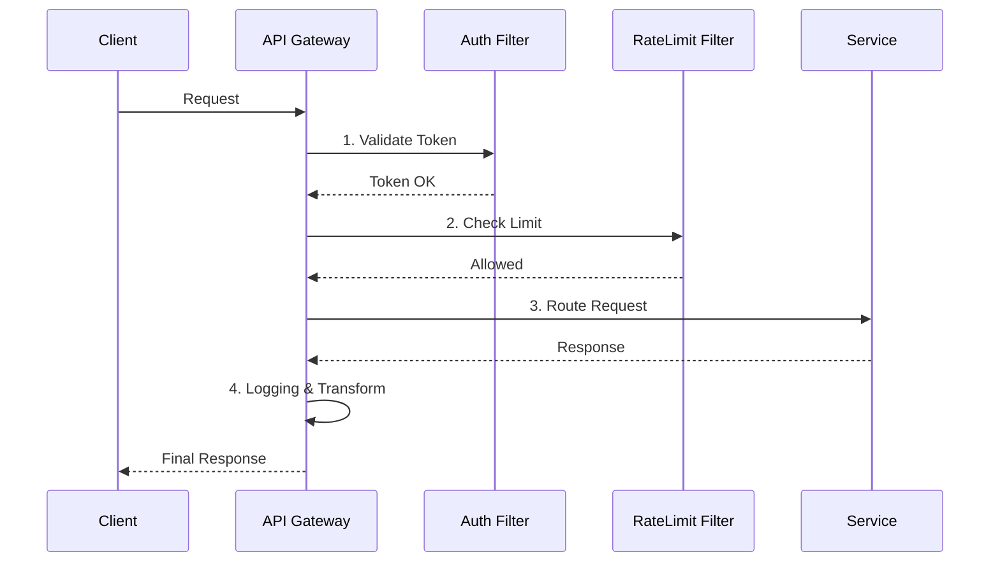
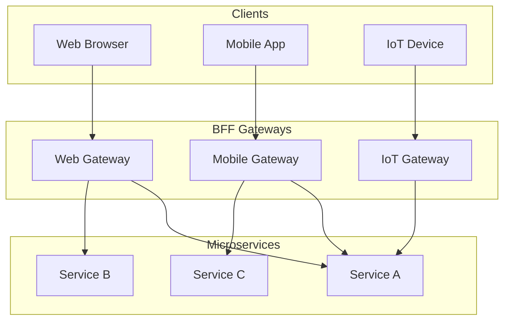

## 🚪 1. 클라이언트가 모든 서비스를 다 알아야 할까?

MSA 환경에서 서비스가 100개가 넘는다고 칩시다.
쇼핑 앱이 주문 서버, 배송 서버, 회원 서버 주소를 다 알고 각각 호출해야 할까요?

**API Gateway**가 모든 요청을 받아 적절한 곳으로 배달해줍니다.

```mermaid
graph LR
    Client[모바일/웹 앱] --> GW[API Gateway]
    
    subgraph "Backend System"
    GW -->|/user| Auth[회원 서비스]
    GW -->|/order| Order[주문 서비스]
    GW -->|/pay| Pay[결제 서비스]
    end
    
    Note over GW: 인증(Auth), 로깅, 라우팅, Rate Limit 처리
```

---

## 🛡️ 2. Gateway의 핵심 역할

1. **Routing**: `/api/v1/user`는 User 서비스로, `/api/v1/order`는 Order 서비스로.
2. **Auth Offloading**: JWT 검증을 서비스마다 하지 않고, Gateway에서 **딱 한 번** 검증합니다. 뒷단 서비스는 비즈니스 로직에만 집중합니다.
3. **Protocol Translation**: 클라이언트는 HTTP로, 내부 서비스는 gRPC나 AMQP로 통신하게 변환해줍니다.
4. **Resilience**: Rate Limiting, Circuit Breaker를 앞단에서 적용합니다.

### 2-1. Gateway Filter Chain 시각화

Gateway는 단순한 프록시가 아니라, 요청/응답에 대한 **필터 파이프라인**입니다.



---

## 🛠️ 3. 기술 스택: Nginx vs Java

### Spring Cloud Gateway (SCG)
- **장점**: Java/Spring 기반이라 커스텀 필터 짜기가 너무 쉽습니다. (DB 조회해서 동적 라우팅 등)
- **단점**: Nginx보다는 무겁습니다. (Netty 기반 비동기라 성능은 준수함)

### Nginx / Kong
- **장점**: 엄청 빠름. C/Lua 기반.
- **단점**: 커스텀 로직 넣기가 빡빡합니다(Lua 스크립팅 필요).

**선택 기준**:
- "복잡한 비즈니스 로직(동적 라우팅, 권한 체크)이 필요하다" -> **Spring Cloud Gateway**
- "그냥 빠르고 단순한 라우팅이면 된다" -> **Nginx/Kong**

---

## 4. BFF (Backend For Frontend) 패턴

Gateway가 너무 비대해지면(God Object) 관리가 힘듭니다.
그래서 클라이언트 별로 Gateway를 쪼개기도 합니다.

- **Web Gateway**: 데스크탑 웹용 풍부한 데이터 조합.
- **Mobile Gateway**: 모바일용 경량화 데이터.
- **IoT Gateway**: IoT 프로토콜(MQTT 등) 지원.

이를 **BFF (Backend For Frontend)** 패턴이라 합니다.



## 요약

1. **단일 진입점**: 클라이언트는 Gateway 하나만 보면 된다.
2. **Cross-Cutting Concerns**: 인증, 로깅, 제한 등을 한 곳에서 처리한다.
3. **Offloading**: 뒷단 서비스들의 부담을 덜어준다.
