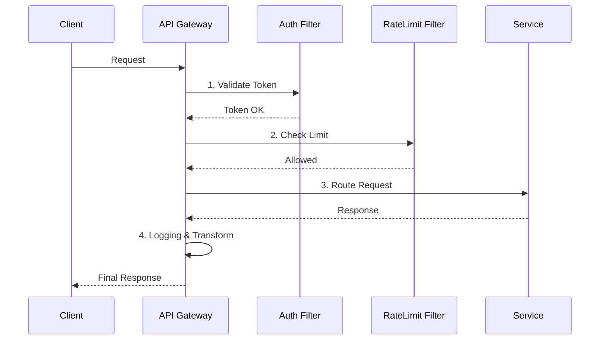
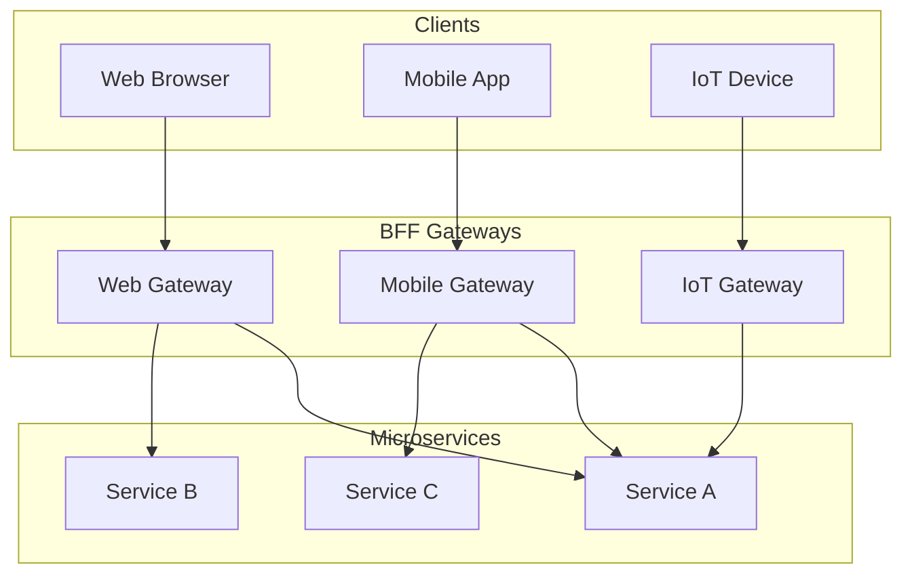

## 🚪 1. 클라이언트가 모든 서비스를 다 알아야 할까?

MSA 환경에서 서비스가 100개가 넘는다고 칩시다.
쇼핑 앱이 주문 서버, 배송 서버, 회원 서버 주소를 다 알고 각각 호출해야 할까요?

**API Gateway**가 모든 요청을 받아 적절한 곳으로 배달해줍니다.

```mermaid
graph LR
    Client[모바일/웹 앱] --> GW[API Gateway]
    
    subgraph "Backend System"
    GW -->|/user| Auth[회원 서비스]
    GW -->|/order| Order[주문 서비스]
    GW -->|/pay| Pay[결제 서비스]
    end
    
    Note over GW: 인증(Auth), 로깅, 라우팅, Rate Limit 처리
```

---

## 🛡️ 2. Gateway의 핵심 역할

1. **Routing**: `/api/v1/user`는 User 서비스로, `/api/v1/order`는 Order 서비스로.
2. **Auth Offloading**: JWT 검증을 서비스마다 하지 않고, Gateway에서 **딱 한 번** 검증합니다. 뒷단 서비스는 비즈니스 로직에만 집중합니다.
3. **Protocol Translation**: 클라이언트는 HTTP로, 내부 서비스는 gRPC나 AMQP로 통신하게 변환해줍니다.
4. **Resilience**: Rate Limiting, Circuit Breaker를 앞단에서 적용합니다.

### 2-1. Gateway Filter Chain 시각화

Gateway는 단순한 프록시가 아니라, 요청/응답에 대한 **필터 파이프라인**입니다.

```mermaid
sequenceDiagram
    participant Client
    participant GW as API Gateway
    participant Auth as Auth Filter
    participant Rate as RateLimit Filter
    participant Service

    Client->>GW: Request
    GW->>Auth: 1. Validate Token
    Auth-->>GW: Token OK
    GW->>Rate: 2. Check Limit
    Rate-->>GW: Allowed
    
    GW->>Service: 3. Route Request
    Service-->>GW: Response
    
    GW->>GW: 4. Logging & Transform
    GW-->>Client: Final Response
```

---

## 🛠️ 3. 기술 스택: Nginx vs Java

### Spring Cloud Gateway (SCG)
- **장점**: Java/Spring 기반이라 커스텀 필터 짜기가 너무 쉽습니다. (DB 조회해서 동적 라우팅 등)
- **단점**: Nginx보다는 무겁습니다. (Netty 기반 비동기라 성능은 준수함)

### Nginx / Kong
- **장점**: 엄청 빠름. C/Lua 기반.
- **단점**: 커스텀 로직 넣기가 빡빡합니다(Lua 스크립팅 필요).

**선택 기준**:
- "복잡한 비즈니스 로직(동적 라우팅, 권한 체크)이 필요하다" -> **Spring Cloud Gateway**
- "그냥 빠르고 단순한 라우팅이면 된다" -> **Nginx/Kong**

---

## 4. BFF (Backend For Frontend) 패턴

Gateway가 너무 비대해지면(God Object) 관리가 힘듭니다.
그래서 클라이언트 별로 Gateway를 쪼개기도 합니다.

- **Web Gateway**: 데스크탑 웹용 풍부한 데이터 조합.
- **Mobile Gateway**: 모바일용 경량화 데이터.
- **IoT Gateway**: IoT 프로토콜(MQTT 등) 지원.

이를 **BFF (Backend For Frontend)** 패턴이라 합니다.

```mermaid
graph TD
    subgraph "Clients"
        Web[Web Browser]
        Mobile[Mobile App]
        IoT[IoT Device]
    end

    subgraph "BFF Gateways"
        WebGW[Web Gateway]
        MobileGW[Mobile Gateway]
        IoTGW[IoT Gateway]
    end

    subgraph "Microservices"
        SvcA[Service A]
        SvcB[Service B]
        SvcC[Service C]
    end

    Web --> WebGW
    Mobile --> MobileGW
    IoT --> IoTGW

    WebGW --> SvcA & SvcB
    MobileGW --> SvcA & SvcC
    IoTGW --> SvcA
```

### 4-1. Gateway와 BFF의 경계 기준

실무에서 자주 헷갈리는 부분은 "Gateway에 어디까지 넣어도 되는가"입니다. 처음에는 인증, 라우팅, 로깅만 넣었는데 어느 순간 주문 상태 계산, 고객 등급 판단, 추천 상품 조합까지 들어오면 Gateway는 작은 모놀리스가 됩니다. 배포도 느려지고, 장애가 나면 모든 서비스의 입구가 같이 흔들립니다.

경계는 아래처럼 잡는 편이 안전합니다.

| 책임 | Gateway에 적합 | BFF/조합 레이어에 적합 | 원 서비스에 남길 것 |
| --- | --- | --- | --- |
| 인증/인가 | JWT 검증, 공통 scope 확인 | 화면별 권한에 필요한 최소 필드 조합 | 도메인 소유권 판단 |
| 라우팅 | path/header 기반 route 선택 | 클라이언트별 API shape 선택 | 서비스 내부 use case |
| 보호 정책 | rate limit, IP allowlist, WAF 연동 | 화면 단위 fallback, optional field 제외 | 재고 차감, 결제 승인 같은 핵심 규칙 |
| 응답 가공 | 표준 error envelope, correlation id | 웹/모바일별 DTO 조합 | 도메인 이벤트와 상태 전이 |

간단히 말하면 Gateway는 **입구 정책**을 맡고, BFF는 **클라이언트 경험에 맞춘 조합**을 맡고, 원 서비스는 **정답을 결정하는 규칙**을 맡습니다. 이 구분이 흐려지면 장애 대응 때 "어디를 고쳐야 하는지"가 바로 보이지 않습니다.

## 5. 운영에서 먼저 정해야 할 것

API Gateway는 코드보다 운영 정책의 영향이 큽니다. 라우트 하나를 추가하는 일도 단순히 `path -> service` 매핑으로 끝나지 않습니다. 최소한 아래 항목은 route 단위로 같이 정리해 두는 것이 좋습니다.

- **Owner**: 이 route의 장애 알림을 누가 받는가?
- **Timeout**: Gateway timeout과 upstream service timeout 중 무엇이 더 짧은가?
- **Rate Limit**: 사용자별, IP별, tenant별 중 어떤 키로 제한하는가?
- **Auth Policy**: 인증 실패와 권한 부족을 각각 401/403으로 분리하는가?
- **Fallback**: upstream timeout 때 전체 실패인지, degraded response인지?
- **Rollback**: route rule을 이전 upstream으로 되돌리는 스위치가 있는가?

특히 timeout은 Gateway에서만 길게 잡아도 해결되지 않습니다. Gateway timeout이 5초인데 upstream service 내부 DB timeout이 10초라면, 사용자는 이미 실패를 받았는데 뒷단은 계속 일하고 있을 수 있습니다. 반대로 Gateway timeout이 너무 짧으면 정상 요청도 중간에서 잘립니다. 그래서 [종단간 Deadline Budget과 Cancellation Propagation](/learning/deep-dive/deep-dive-end-to-end-deadline-cancellation-playbook/)처럼 요청 전체 예산을 앞에서부터 전달하는 방식이 좋습니다.

### 5-1. 관측 지표

Gateway 대시보드는 전체 평균보다 route/upstream별로 쪼개야 쓸모가 있습니다.

| 지표 | 왜 보는가 | 먼저 의심할 것 |
| --- | --- | --- |
| route별 p95/p99 latency | 특정 API만 느린지 확인 | upstream 지연, filter DB 조회, 응답 변환 비용 |
| upstream별 5xx/timeout | 뒷단 장애 전파 확인 | 서비스 장애, connection pool 고갈 |
| 401/403 비율 | 인증/권한 정책 변경 영향 확인 | 토큰 만료, scope 누락, 배포된 클라이언트 버전 |
| 429 비율 | rate limit 정책이 과한지 확인 | tenant별 burst, 잘못된 key 설계 |
| filter chain 처리 시간 | Gateway 자체 병목 확인 | 커스텀 필터, 동기 I/O, 과도한 로깅 |

Gateway 장애는 "모든 것이 조금씩 느려지는" 모양으로 나타날 때가 많습니다. 그래서 route별 p95가 동시에 오르는지, 특정 upstream만 튀는지, 429가 늘면서 5xx가 줄었는지를 같이 봐야 합니다. 429가 늘고 5xx가 줄었다면 보호 정책이 실제로 시스템을 살린 것일 수도 있습니다.

## 함께 보면 좋은 글

- [API Composition과 Aggregation Gateway](/learning/deep-dive/deep-dive-api-composition-aggregation-playbook/) - 화면 단위 조합 API와 Gateway 책임 분리
- [API Rate Limit & Backpressure](/learning/deep-dive/deep-dive-api-rate-limit-backpressure/) - 입구 유입률 제어와 내부 압력 제어
- [Circuit Breaker 패턴](/learning/deep-dive/deep-dive-resilience4j-circuit-breaker/) - upstream 장애 전파 차단

## 요약

1. **단일 진입점**: 클라이언트는 Gateway 하나만 보면 된다.
2. **Cross-Cutting Concerns**: 인증, 로깅, 제한 등을 한 곳에서 처리한다.
3. **Offloading**: 뒷단 서비스들의 부담을 덜어준다.
4. **Boundary**: 도메인 규칙은 원 서비스에 남기고, Gateway/BFF는 입구 정책과 조합 책임까지만 맡긴다.
5. **Operations**: route owner, timeout, rate limit, rollback, observability를 route 추가와 같은 단위로 관리한다.
