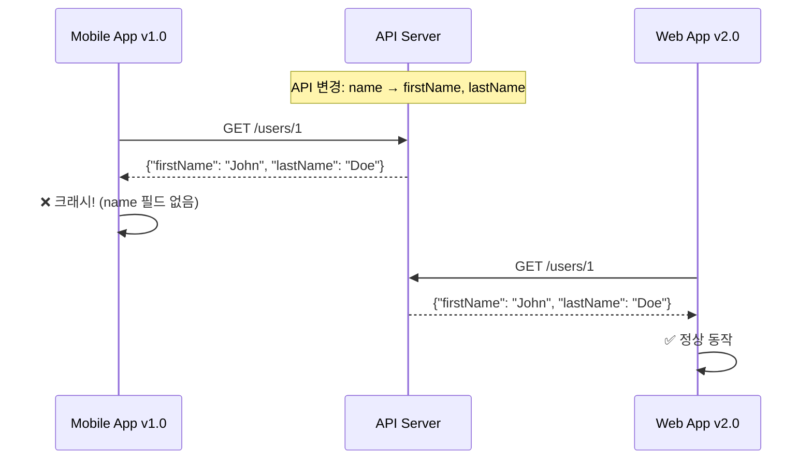
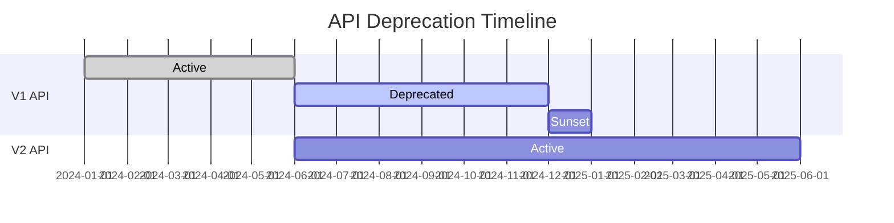

## 이 글에서 얻는 것

- **API 버전 관리 전략**별 장단점을 이해합니다
- **Breaking Change**를 안전하게 처리하는 방법을 알아봅니다
- **Deprecation 정책**으로 클라이언트 마이그레이션을 지원합니다

---

## 왜 API 버전 관리가 필요한가?

### 문제 상황



**모든 클라이언트를 동시에 업데이트할 수 없다!**
- 모바일 앱: 사용자가 업데이트해야 함
- 외부 파트너 API: 협의 필요
- 레거시 시스템: 점진적 마이그레이션

---

## 버전 관리 전략

### 1. URL Path 버전

```
GET /v1/users/1
GET /v2/users/1
```

```java
@RestController
@RequestMapping("/v1/users")
public class UserControllerV1 {
    
    @GetMapping("/{id}")
    public UserV1Response getUser(@PathVariable Long id) {
        return userService.getUserV1(id);
    }
}

@RestController
@RequestMapping("/v2/users")
public class UserControllerV2 {
    
    @GetMapping("/{id}")
    public UserV2Response getUser(@PathVariable Long id) {
        return userService.getUserV2(id);
    }
}
```

| 장점 | 단점 |
|-----|------|
| 직관적, 캐싱 용이 | URL 오염 |
| 브라우저 테스트 쉬움 | 리소스 URI 원칙 위반 |
| 라우팅 간단 | 버전 폭발 가능 |

### 2. Header 버전

```
GET /users/1
Accept: application/vnd.myapi.v1+json
```

```java
@RestController
@RequestMapping("/users")
public class UserController {
    
    @GetMapping(value = "/{id}", headers = "X-API-Version=1")
    public UserV1Response getUserV1(@PathVariable Long id) {
        return userService.getUserV1(id);
    }
    
    @GetMapping(value = "/{id}", headers = "X-API-Version=2")
    public UserV2Response getUserV2(@PathVariable Long id) {
        return userService.getUserV2(id);
    }
}
```

| 장점 | 단점 |
|-----|------|
| 깔끔한 URL | 테스트 번거로움 |
| Content Negotiation 표준 | 캐싱 복잡 |
| 하이퍼미디어 친화적 | 헤더 관리 필요 |

### 3. Query Parameter 버전

```
GET /users/1?version=1
GET /users/1?version=2
```

```java
@RestController
@RequestMapping("/users")
public class UserController {
    
    @GetMapping("/{id}")
    public Object getUser(
            @PathVariable Long id,
            @RequestParam(defaultValue = "1") int version) {
        
        if (version == 1) {
            return userService.getUserV1(id);
        } else {
            return userService.getUserV2(id);
        }
    }
}
```

| 장점 | 단점 |
|-----|------|
| 구현 간단 | 선택적 파라미터 혼란 |
| 기본값 설정 용이 | URL 오염 |
| 테스트 쉬움 | 비표준적 |

### 전략 비교

| 전략 | 인기도 | 추천 상황 |
|------|-------|---------|
| **URL Path** | ⭐⭐⭐⭐⭐ | 공개 API, 외부 파트너 |
| **Header** | ⭐⭐⭐ | 내부 API, REST 순수주의 |
| **Query** | ⭐⭐ | 간단한 API, 프로토타입 |

---

## Breaking Change vs Non-Breaking Change

### Non-Breaking (안전한 변경)

```java
// ✅ 새 필드 추가 (기존 클라이언트 무시)
public class UserResponse {
    private Long id;
    private String name;
    private String email;      // 기존
    private String phone;      // 새로 추가 → OK
    private Address address;   // 새로 추가 → OK
}

// ✅ 새 엔드포인트 추가
@GetMapping("/users/{id}/preferences")  // 새로 추가 → OK
public PreferencesResponse getPreferences(@PathVariable Long id) { ... }

// ✅ Optional 파라미터 추가
@GetMapping("/users")
public List<UserResponse> getUsers(
    @RequestParam(required = false) String status  // 새로 추가 → OK
) { ... }
```

### Breaking Change (주의 필요)

```java
// ❌ 필드 제거
public class UserResponse {
    private Long id;
    // private String name;  // 제거 → Breaking!
    private String firstName;
    private String lastName;
}

// ❌ 필드 타입 변경
public class OrderResponse {
    // private String totalAmount;  // 변경 전
    private BigDecimal totalAmount;   // Breaking!
}

// ❌ 필수 파라미터 추가
@PostMapping("/orders")
public OrderResponse createOrder(
    @RequestParam String paymentMethod  // 새 필수값 → Breaking!
) { ... }

// ❌ 엔드포인트 경로 변경
// @GetMapping("/users/{id}")       // 변경 전
@GetMapping("/members/{id}")         // Breaking!

// ❌ HTTP 메서드 변경
// @PostMapping("/users/{id}/activate")  // 변경 전
@PutMapping("/users/{id}/activate")       // Breaking!
```

---

## Deprecation 전략

### 단계적 Deprecation



### 구현

```java
@RestController
@RequestMapping("/v1/users")
public class UserControllerV1 {
    
    @GetMapping("/{id}")
    public ResponseEntity<UserV1Response> getUser(@PathVariable Long id) {
        UserV1Response response = userService.getUserV1(id);
        
        return ResponseEntity.ok()
            .header("Deprecation", "true")
            .header("Sunset", "Sat, 31 Dec 2024 23:59:59 GMT")
            .header("Link", "</v2/users/" + id + ">; rel=\"successor-version\"")
            .body(response);
    }
}
```

**응답 헤더**:
```http
HTTP/1.1 200 OK
Deprecation: true
Sunset: Sat, 31 Dec 2024 23:59:59 GMT
Link: </v2/users/1>; rel="successor-version"
```

### 응답 본문에 경고 포함

```java
@Getter
public class DeprecatedResponse<T> {
    private T data;
    private DeprecationWarning warning;
    
    @Getter
    public static class DeprecationWarning {
        private String message = "This API version is deprecated";
        private String sunsetDate = "2024-12-31";
        private String migrationGuide = "https://api.example.com/docs/migration/v1-to-v2";
    }
}
```

---

## 실전 패턴

### Adapter 패턴으로 버전 변환

```java
@Service
public class UserServiceAdapter {
    
    @Autowired
    private UserRepository userRepository;
    
    public UserV1Response getUserV1(Long id) {
        User user = userRepository.findById(id).orElseThrow();
        return UserV1Response.builder()
            .id(user.getId())
            .name(user.getFirstName() + " " + user.getLastName())  // V1 형식
            .email(user.getEmail())
            .build();
    }
    
    public UserV2Response getUserV2(Long id) {
        User user = userRepository.findById(id).orElseThrow();
        return UserV2Response.builder()
            .id(user.getId())
            .firstName(user.getFirstName())  // V2 형식
            .lastName(user.getLastName())
            .email(user.getEmail())
            .phone(user.getPhone())
            .build();
    }
}
```

### Content Negotiation

```java
@RestController
@RequestMapping("/users")
public class UserController {
    
    @GetMapping(value = "/{id}", produces = "application/vnd.myapi.v1+json")
    public UserV1Response getUserV1(@PathVariable Long id) {
        return userServiceAdapter.getUserV1(id);
    }
    
    @GetMapping(value = "/{id}", produces = "application/vnd.myapi.v2+json")
    public UserV2Response getUserV2(@PathVariable Long id) {
        return userServiceAdapter.getUserV2(id);
    }
}
```

---

## 요약

### 버전 관리 체크리스트

| 항목 | 권장 |
|------|-----|
| 전략 선택 | 공개 API → URL Path |
| Breaking Change | 새 버전 생성 |
| Non-Breaking | 기존 버전에 추가 |
| Deprecation | 6개월+ 유예 기간 |
| 문서화 | 변경 사항 명시 |

### 핵심 원칙

1. **하위 호환성 유지**: 기존 클라이언트가 깨지지 않게
2. **명확한 버전 정책**: Semantic Versioning 활용
3. **점진적 마이그레이션**: 충분한 유예 기간
4. **문서화**: 변경 로그, 마이그레이션 가이드

---

## 🔗 Related Deep Dive

- **[API Gateway 설계](/learning/deep-dive/deep-dive-api-gateway-design/)**: 버전 라우팅과 트래픽 관리.
- **[GraphQL 심화](/learning/deep-dive/deep-dive-graphql-advanced/)**: Schema Evolution으로 버전 없는 API.
