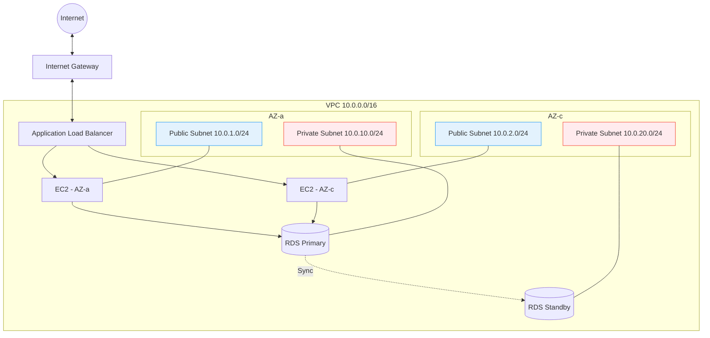

## 이 글에서 얻는 것

- **클라우드 기초**: VPC, Subnet, Security Group이 왜 필요한지 이해합니다
- **서버 구축**: EC2(컴퓨터)를 빌리고, RDS(DB)를 설정하여 연결하는 전체 흐름을 봅니다
- **배포 운영**: `nohup`과 `systemd`의 차이를 알고, "서버 끄면 앱도 꺼지는" 초보 티를 벗습니다
- **IaC 실전**: Terraform으로 인프라를 코드화하여 재현 가능한 환경을 만듭니다
- **보안 하드닝**: IAM 역할·SSM·시크릿 관리 등 프로덕션 수준 보안을 적용합니다
- **자동 배포**: GitHub Actions + CodeDeploy로 Push-to-Deploy 파이프라인을 구축합니다

---

## 1. AWS 네트워크 기본 (VPC)

아마존 클라우드는 거대한 땅입니다. 여기에 **"내 땅(VPC)"** 부터 울타리를 쳐야 합니다.



- **Public Subnet**: 인터넷과 통신 가능 (웹 서버·ALB용)
- **Private Subnet**: 인터넷 직접 통신 불가 (DB용, 보안 강화)
- **Multi-AZ**: 가용 영역 2개 이상을 사용하여 한 쪽이 죽어도 서비스 유지

### VPC 설계 체크리스트

| 항목 | 권장 사항 | 이유 |
|:---|:---|:---|
| CIDR 블록 | `/16` (65,536 IP) | 향후 확장 여유 |
| AZ 수 | 최소 2개 | 가용성 확보 |
| 서브넷 분리 | Public/Private/Isolated | 역할별 격리 |
| NAT Gateway | Private Subnet용 1개 이상 | 외부 패키지 다운로드 |
| VPC Flow Logs | 활성화 | 네트워크 감사·디버깅 |

---

## 2. EC2와 Security Group (방화벽)

EC2를 만들 때 가장 중요한 건 **"누구에게 문을 열어줄 것인가"** 입니다.

### Security Group 설계

```
SG-ALB (Application Load Balancer)
├── Inbound:  80/443 ← 0.0.0.0/0
└── Outbound: ALL → 0.0.0.0/0

SG-Web (EC2 인스턴스)
├── Inbound:  8080 ← SG-ALB (ALB에서만 접근)
├── Inbound:  22   ← Bastion SG 또는 SSM 사용 시 불필요
└── Outbound: ALL → 0.0.0.0/0

SG-DB (RDS)
├── Inbound:  3306 ← SG-Web (웹 서버에서만 접근)
└── Outbound: ALL → SG-Web
```

> **핵심 원칙**: Security Group chaining — IP가 아니라 **SG ID를 소스로 지정**합니다. EC2가 오토스케일링으로 늘어나도, 같은 SG가 붙어 있으면 자동으로 DB 접근이 허용됩니다.

### SSH 접속 vs SSM Session Manager

| 방식 | SSH (22번 포트) | SSM Session Manager |
|:---|:---|:---|
| 포트 오픈 | 필요 | **불필요** |
| 키 관리 | `.pem` 파일 관리 | IAM 역할 기반 |
| 감사 로그 | 별도 설정 | CloudTrail 자동 기록 |
| Bastion 필요 | Yes | **No** |
| **권장도** | 개발/학습용 | **프로덕션 권장** |

```bash
# SSM으로 접속 (포트 22 없이!)
aws ssm start-session --target i-0123456789abcdef0
```

---

## 3. IAM 역할과 인스턴스 프로파일

EC2에 AWS 키를 하드코딩하면 **반드시** 유출됩니다. 대신 **IAM 역할**을 씁니다.

```json
// EC2에 부여할 IAM 역할 정책 예시
{
  "Version": "2012-10-17",
  "Statement": [
    {
      "Effect": "Allow",
      "Action": [
        "s3:GetObject",
        "s3:PutObject"
      ],
      "Resource": "arn:aws:s3:::my-deploy-bucket/*"
    },
    {
      "Effect": "Allow",
      "Action": [
        "secretsmanager:GetSecretValue"
      ],
      "Resource": "arn:aws:secretsmanager:ap-northeast-2:*:secret:prod/myapp/*"
    },
    {
      "Effect": "Allow",
      "Action": [
        "ssm:UpdateInstanceInformation",
        "ssmmessages:*",
        "ec2messages:*"
      ],
      "Resource": "*"
    }
  ]
}
```

**3가지 원칙:**
1. **최소 권한(Least Privilege)**: 필요한 Action과 Resource만 허용
2. **임시 자격 증명**: EC2 메타데이터 서비스에서 자동 갱신되는 임시 토큰 사용
3. **조건 키 활용**: `aws:SourceVpc`, `aws:RequestedRegion` 등으로 범위 제한

---

## 4. Java 앱 배포하기

### 배포 방식 비교

| 방식 | 장점 | 단점 | 적합한 상황 |
|:---|:---|:---|:---|
| `java -jar` | 간단 | 터미널 닫으면 종료 | 테스트 |
| `nohup` | 백그라운드 실행 | 재부팅 시 미시작, 관리 어려움 | 임시 운영 |
| **`systemd`** | 자동 시작/재시작/로그 | 설정 파일 작성 필요 | **프로덕션 권장** |
| **Docker** | 격리, 재현성, 스케일 | 컨테이너 학습 필요 | **현대 프로덕션** |

### systemd 서비스 등록 (프로덕션 수준)

`/etc/systemd/system/myapp.service`:

```ini
[Unit]
Description=My Spring Boot Application
After=network.target
Requires=network.target

[Service]
User=appuser
Group=appuser
WorkingDirectory=/opt/myapp

# 시크릿은 환경 파일에서 로드
EnvironmentFile=/opt/myapp/.env

# JVM 튜닝 포함
ExecStart=/usr/bin/java \
  -Xms512m -Xmx1024m \
  -XX:+UseG1GC \
  -XX:MaxGCPauseMillis=200 \
  -Dspring.profiles.active=prod \
  -jar /opt/myapp/app.jar

# 정상 종료 시그널
SuccessExitStatus=143
KillSignal=SIGTERM
TimeoutStopSec=30

# 비정상 종료 시 자동 재시작
Restart=on-failure
RestartSec=10

# 보안: 파일 시스템 제한
ReadWritePaths=/opt/myapp/logs
ProtectSystem=strict
ProtectHome=true
NoNewPrivileges=true

# 리소스 제한
MemoryMax=1500M
CPUQuota=200%

[Install]
WantedBy=multi-user.target
```

```bash
# 서비스 등록 및 시작
sudo systemctl daemon-reload
sudo systemctl enable myapp    # 부팅 시 자동 시작
sudo systemctl start myapp

# 상태 확인
sudo systemctl status myapp

# 로그 확인 (실시간 스트리밍)
journalctl -u myapp -f --since "10 min ago"
```

### Docker 배포 (현대 방식)

```dockerfile
# Multi-stage Build
FROM eclipse-temurin:17-jdk-alpine AS builder
WORKDIR /build
COPY . .
RUN ./gradlew bootJar --no-daemon

FROM eclipse-temurin:17-jre-alpine
RUN addgroup -S appgroup && adduser -S appuser -G appgroup

WORKDIR /app
COPY --from=builder /build/build/libs/app.jar app.jar

# 비root 사용자 실행
USER appuser

EXPOSE 8080
HEALTHCHECK --interval=30s --timeout=3s \
  CMD wget -qO- http://localhost:8080/actuator/health || exit 1

ENTRYPOINT ["java", \
  "-XX:+UseContainerSupport", \
  "-XX:MaxRAMPercentage=75.0", \
  "-jar", "app.jar"]
```

---

## 5. RDS 프로덕션 설정

### Multi-AZ와 Read Replica 비교

| 기능 | Multi-AZ | Read Replica |
|:---|:---|:---|
| 목적 | **고가용성** (Failover) | **읽기 성능 확장** |
| 동기화 | 동기 복제 | 비동기 복제 |
| Failover | 자동 (60~120초) | 수동 승격 필요 |
| 읽기 분산 | X | O |
| 비용 | 2배 | 복제본 수만큼 |
| **적합 상황** | 모든 프로덕션 | 읽기 비중 높은 서비스 |

### RDS 보안·운영 설정

```yaml
# application-prod.yml (Spring Boot)
spring:
  datasource:
    url: jdbc:mysql://${DB_ENDPOINT}:3306/mydb?useSSL=true&requireSSL=true
    username: ${DB_USERNAME}
    password: ${DB_PASSWORD}  # Secrets Manager에서 주입
    hikari:
      maximum-pool-size: 20
      minimum-idle: 5
      connection-timeout: 3000
      idle-timeout: 600000
      max-lifetime: 1800000
      leak-detection-threshold: 10000
```

**Secrets Manager 연동 (시크릿 자동 회전):**

```java
@Configuration
public class SecretsManagerConfig {
    
    @Bean
    public DataSource dataSource() {
        // AWS SDK로 Secrets Manager에서 DB 자격증명 조회
        String secretJson = getSecret("prod/myapp/db-credentials");
        DbCredentials creds = objectMapper.readValue(secretJson, DbCredentials.class);
        
        HikariConfig config = new HikariConfig();
        config.setJdbcUrl("jdbc:mysql://" + creds.getHost() + ":3306/mydb");
        config.setUsername(creds.getUsername());
        config.setPassword(creds.getPassword());
        config.setMaximumPoolSize(20);
        return new HikariDataSource(config);
    }
    
    private String getSecret(String secretName) {
        SecretsManagerClient client = SecretsManagerClient.builder()
            .region(Region.AP_NORTHEAST_2)
            .build();
        return client.getSecretValue(
            GetSecretValueRequest.builder().secretId(secretName).build()
        ).secretString();
    }
}
```

### RDS 운영 체크리스트

- [ ] Multi-AZ 활성화
- [ ] 자동 백업 활성화 (보존 기간 7일 이상)
- [ ] Enhanced Monitoring 활성화 (1초 간격)
- [ ] Performance Insights 활성화
- [ ] 파라미터 그룹 커스텀 (slow_query_log, long_query_time 설정)
- [ ] 암호화 활성화 (KMS)
- [ ] Secrets Manager로 자격증명 관리 + 자동 회전 (30일)
- [ ] 유지 관리 기간(Maintenance Window) 비피크 시간 설정

---

## 6. IaC — Terraform으로 인프라 코드화

콘솔 클릭으로 만든 인프라는 **재현이 불가능**합니다. Terraform으로 코드화하면 리뷰·버전 관리·자동화가 됩니다.

### 핵심 리소스 정의

```hcl
# provider.tf
terraform {
  required_version = ">= 1.5"
  required_providers {
    aws = {
      source  = "hashicorp/aws"
      version = "~> 5.0"
    }
  }
  
  backend "s3" {
    bucket         = "my-terraform-state"
    key            = "prod/terraform.tfstate"
    region         = "ap-northeast-2"
    dynamodb_table = "terraform-locks"
    encrypt        = true
  }
}

provider "aws" {
  region = "ap-northeast-2"
  
  default_tags {
    tags = {
      Environment = "prod"
      ManagedBy   = "terraform"
      Project     = "myapp"
    }
  }
}
```

```hcl
# vpc.tf
module "vpc" {
  source  = "terraform-aws-modules/vpc/aws"
  version = "~> 5.0"

  name = "myapp-vpc"
  cidr = "10.0.0.0/16"

  azs             = ["ap-northeast-2a", "ap-northeast-2c"]
  public_subnets  = ["10.0.1.0/24", "10.0.2.0/24"]
  private_subnets = ["10.0.10.0/24", "10.0.20.0/24"]

  enable_nat_gateway   = true
  single_nat_gateway   = true   # 비용 절감 (프로덕션은 AZ별 1개 권장)
  enable_dns_hostnames = true
  enable_flow_log      = true

  tags = { Name = "myapp-vpc" }
}
```

```hcl
# ec2.tf
resource "aws_launch_template" "app" {
  name_prefix   = "myapp-"
  image_id      = data.aws_ami.amazon_linux_2023.id
  instance_type = "t3.medium"

  iam_instance_profile {
    name = aws_iam_instance_profile.app.name
  }

  vpc_security_group_ids = [aws_security_group.web.id]

  user_data = base64encode(<<-EOF
    #!/bin/bash
    yum install -y java-17-amazon-corretto
    aws s3 cp s3://my-deploy-bucket/app.jar /opt/myapp/app.jar
    systemctl start myapp
  EOF
  )

  tag_specifications {
    resource_type = "instance"
    tags = { Name = "myapp-web" }
  }
}

resource "aws_autoscaling_group" "app" {
  desired_capacity    = 2
  max_size            = 6
  min_size            = 2
  vpc_zone_identifier = module.vpc.public_subnets
  target_group_arns   = [aws_lb_target_group.app.arn]

  launch_template {
    id      = aws_launch_template.app.id
    version = "$Latest"
  }

  health_check_type         = "ELB"
  health_check_grace_period = 120

  tag {
    key                 = "Name"
    value               = "myapp-asg"
    propagate_at_launch = true
  }
}
```

```hcl
# rds.tf
resource "aws_db_instance" "main" {
  identifier     = "myapp-db"
  engine         = "mysql"
  engine_version = "8.0"
  instance_class = "db.t3.medium"

  allocated_storage     = 50
  max_allocated_storage = 200   # Auto scaling
  storage_encrypted     = true

  db_name  = "mydb"
  username = "admin"
  password = random_password.db.result   # Secrets Manager에 저장

  multi_az               = true
  db_subnet_group_name   = aws_db_subnet_group.main.name
  vpc_security_group_ids = [aws_security_group.db.id]

  backup_retention_period      = 7
  backup_window                = "03:00-04:00"
  maintenance_window           = "sun:04:00-sun:05:00"
  performance_insights_enabled = true
  monitoring_interval          = 60

  skip_final_snapshot = false
  final_snapshot_identifier = "myapp-db-final-${formatdate("YYYYMMDD", timestamp())}"

  tags = { Name = "myapp-db" }
}
```

### Terraform 운영 플로우

```
terraform init     → 프로바이더/모듈 설치
terraform plan     → 변경 사항 미리보기 (★ 반드시 확인)
terraform apply    → 실제 적용
terraform destroy  → 전체 삭제 (주의!)
```

> **팁**: `terraform plan` 출력을 PR에 첨부하면, 인프라 변경도 코드 리뷰가 됩니다.

---

## 7. CI/CD 자동 배포 파이프라인

### GitHub Actions + CodeDeploy

```yaml
# .github/workflows/deploy.yml
name: Deploy to EC2

on:
  push:
    branches: [main]

permissions:
  id-token: write   # OIDC
  contents: read

jobs:
  build:
    runs-on: ubuntu-latest
    steps:
      - uses: actions/checkout@v4

      - name: Set up JDK 17
        uses: actions/setup-java@v4
        with:
          distribution: temurin
          java-version: 17
          cache: gradle

      - name: Build
        run: ./gradlew bootJar --no-daemon

      - name: Configure AWS Credentials (OIDC)
        uses: aws-actions/configure-aws-credentials@v4
        with:
          role-to-assume: arn:aws:iam::123456789012:role/github-actions-deploy
          aws-region: ap-northeast-2

      - name: Upload to S3
        run: |
          aws s3 cp build/libs/app.jar s3://my-deploy-bucket/app.jar
          aws s3 cp appspec.yml s3://my-deploy-bucket/appspec.yml
          aws s3 cp scripts/ s3://my-deploy-bucket/scripts/ --recursive

      - name: Trigger CodeDeploy
        run: |
          aws deploy create-deployment \
            --application-name myapp \
            --deployment-group-name prod \
            --s3-location bucket=my-deploy-bucket,key=app.jar,bundleType=zip
```

### appspec.yml (CodeDeploy)

```yaml
version: 0.0
os: linux

files:
  - source: app.jar
    destination: /opt/myapp/

hooks:
  BeforeInstall:
    - location: scripts/stop.sh
      timeout: 30
  AfterInstall:
    - location: scripts/start.sh
      timeout: 60
  ValidateService:
    - location: scripts/health-check.sh
      timeout: 120
```

### 배포 스크립트

```bash
# scripts/stop.sh
#!/bin/bash
sudo systemctl stop myapp || true
```

```bash
# scripts/start.sh
#!/bin/bash
sudo systemctl start myapp
```

```bash
# scripts/health-check.sh
#!/bin/bash
for i in {1..30}; do
  STATUS=$(curl -s -o /dev/null -w "%{http_code}" http://localhost:8080/actuator/health)
  if [ "$STATUS" == "200" ]; then
    echo "Health check passed"
    exit 0
  fi
  echo "Waiting... ($i/30)"
  sleep 2
done
echo "Health check failed"
exit 1
```

---

## 8. 모니터링과 알람 설정

### CloudWatch 핵심 메트릭

| 대상 | 메트릭 | 임계값 | 알림 |
|:---|:---|:---|:---|
| EC2 | CPUUtilization | > 80% (5분) | SNS → Slack |
| EC2 | StatusCheckFailed | > 0 | 즉시 알림 |
| RDS | CPUUtilization | > 70% | 스케일업 검토 |
| RDS | FreeStorageSpace | < 5GB | 긴급 |
| RDS | DatabaseConnections | > Pool Size × 0.8 | 커넥션 누수 의심 |
| ALB | HTTPCode_Target_5XX | > 1% | 서비스 오류 |
| ALB | TargetResponseTime | p99 > 3s | 성능 저하 |

### CloudWatch Alarm (Terraform)

```hcl
resource "aws_cloudwatch_metric_alarm" "cpu_high" {
  alarm_name          = "myapp-cpu-high"
  comparison_operator = "GreaterThanThreshold"
  evaluation_periods  = 3
  metric_name         = "CPUUtilization"
  namespace           = "AWS/EC2"
  period              = 300
  statistic           = "Average"
  threshold           = 80
  alarm_description   = "EC2 CPU > 80% for 15 minutes"
  alarm_actions       = [aws_sns_topic.alerts.arn]

  dimensions = {
    AutoScalingGroupName = aws_autoscaling_group.app.name
  }
}
```

### 애플리케이션 레벨 모니터링

```yaml
# application-prod.yml
management:
  endpoints:
    web:
      exposure:
        include: health,info,metrics,prometheus
  endpoint:
    health:
      show-details: when-authorized
  metrics:
    export:
      cloudwatch:
        namespace: MyApp
        step: 1m
```

---

## 9. 비용 최적화 가이드

| 전략 | 절감율 | 적합 대상 |
|:---|:---|:---|
| Reserved Instance (1년) | ~40% | 항상 실행되는 인스턴스 |
| Reserved Instance (3년) | ~60% | 장기 운영 확정 |
| Savings Plans | ~30-40% | 유연한 할인 |
| Spot Instance | ~70-90% | 배치 처리, CI/CD 빌드 |
| 인스턴스 Right-sizing | ~20-30% | 과잉 프로비저닝 |
| RDS Reserved | ~40-60% | 프로덕션 DB |

### 비용 모니터링 알람

```hcl
resource "aws_budgets_budget" "monthly" {
  name         = "monthly-budget"
  budget_type  = "COST"
  limit_amount = "100"
  limit_unit   = "USD"
  time_unit    = "MONTHLY"

  notification {
    comparison_operator       = "GREATER_THAN"
    threshold                 = 80
    threshold_type            = "PERCENTAGE"
    notification_type         = "ACTUAL"
    subscriber_email_addresses = ["ops@example.com"]
  }
}
```

---

## 10. 트러블슈팅 가이드

### 자주 겪는 문제 TOP 5

| 증상 | 원인 | 해결 |
|:---|:---|:---|
| EC2에서 RDS 접속 안 됨 | SG 인바운드에 EC2 SG 미추가 | `SG-DB` 인바운드에 `SG-Web` 추가 |
| SSH 접속 타임아웃 | SG에 22번 포트 미오픈 또는 Public IP 없음 | SG 확인 + EIP 또는 SSM 사용 |
| 앱 배포 후 502 Bad Gateway | ALB 헬스체크 실패 | Target Group 헬스체크 경로·포트 확인 |
| RDS 스토리지 부족 | 자동 확장 미설정 | `max_allocated_storage` 설정 |
| 배포 후 롤백 발생 | `health-check.sh` 실패 | 앱 시작 시간 확인, 타임아웃 조정 |

### 디버깅 명령어

```bash
# EC2 메타데이터 확인
TOKEN=$(curl -X PUT "http://169.254.169.254/latest/api/token" \
  -H "X-aws-ec2-metadata-token-ttl-seconds: 21600")
curl -H "X-aws-ec2-metadata-token: $TOKEN" \
  http://169.254.169.254/latest/meta-data/iam/security-credentials/

# Security Group 규칙 확인
aws ec2 describe-security-groups --group-ids sg-xxxx \
  --query 'SecurityGroups[].IpPermissions'

# RDS 연결 테스트
mysql -h myapp-db.xxxx.ap-northeast-2.rds.amazonaws.com \
  -u admin -p --ssl-mode=REQUIRED

# ALB Target 상태 확인
aws elbv2 describe-target-health --target-group-arn arn:aws:...
```

---

## 프로덕션 배포 최종 체크리스트

- [ ] VPC: Multi-AZ, Public/Private 서브넷 분리 완료
- [ ] Security Group: 최소 권한 원칙, SG chaining 적용
- [ ] EC2: IAM 역할 부여, SSH 키 대신 SSM 사용
- [ ] RDS: Private Subnet, Multi-AZ, 암호화, 자동 백업
- [ ] 시크릿: Secrets Manager로 관리, 코드에 평문 없음
- [ ] 배포: systemd 또는 Docker, CI/CD 파이프라인 구축
- [ ] 모니터링: CloudWatch 알람, 애플리케이션 메트릭
- [ ] 비용: Reserved Instance 또는 Savings Plans 적용
- [ ] IaC: Terraform으로 코드화, State 파일 원격 관리
- [ ] DR: 백업 복구 테스트 완료, RTO/RPO 정의

---

## 요약

1. **VPC**: 내 땅을 먼저 확보하고, Multi-AZ로 가용성 확보
2. **보안 그룹**: 포트는 필요한 만큼만, SG chaining으로 동적 관리
3. **RDS**: Private Subnet에 숨기고, Multi-AZ + 암호화 + Secrets Manager
4. **IaC**: Terraform으로 인프라를 코드화하여 재현·리뷰 가능하게
5. **CI/CD**: GitHub Actions + CodeDeploy로 Push-to-Deploy 자동화
6. **모니터링**: CloudWatch 알람으로 장애 조기 감지

## 관련 글

- [Docker 기초](/learning/deep-dive/deep-dive-docker-basics/)
- [Docker Compose와 네트워크](/learning/deep-dive/deep-dive-docker-compose-network/)
- [Kubernetes 기초](/learning/deep-dive/deep-dive-kubernetes-basics/)
- [CI/CD GitHub Actions](/learning/deep-dive/deep-dive-ci-cd-github-actions/)
- [시크릿 관리](/learning/deep-dive/deep-dive-secret-management/)
- [Prometheus + Grafana](/learning/deep-dive/deep-dive-prometheus-grafana/)
- [VPC 네트워크 기초](/learning/deep-dive/deep-dive-vpc-network-basics/)
- [배포 런북](/learning/deep-dive/deep-dive-deployment-runbook/)
- [비용 최적화](/learning/deep-dive/deep-dive-cost-optimization/)
