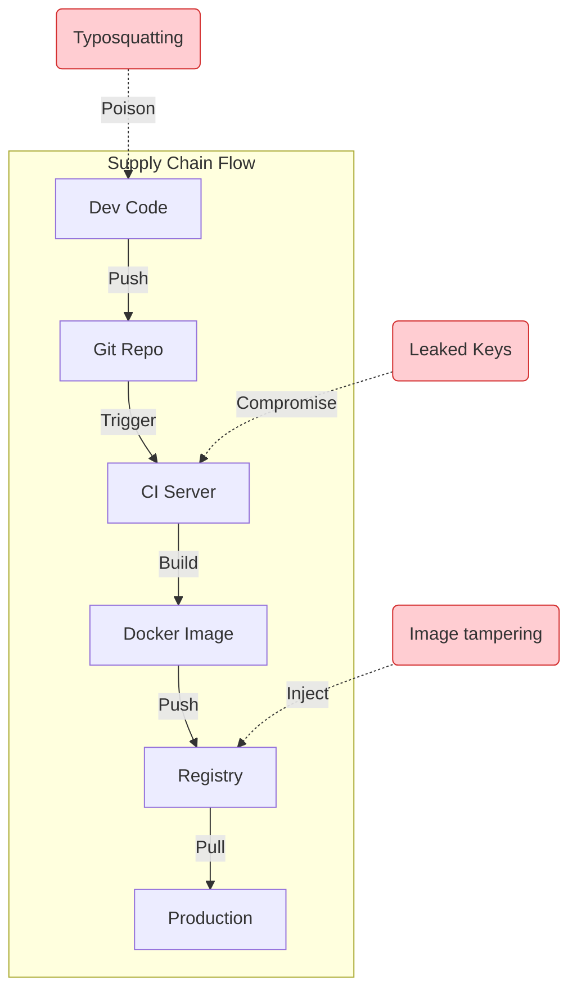
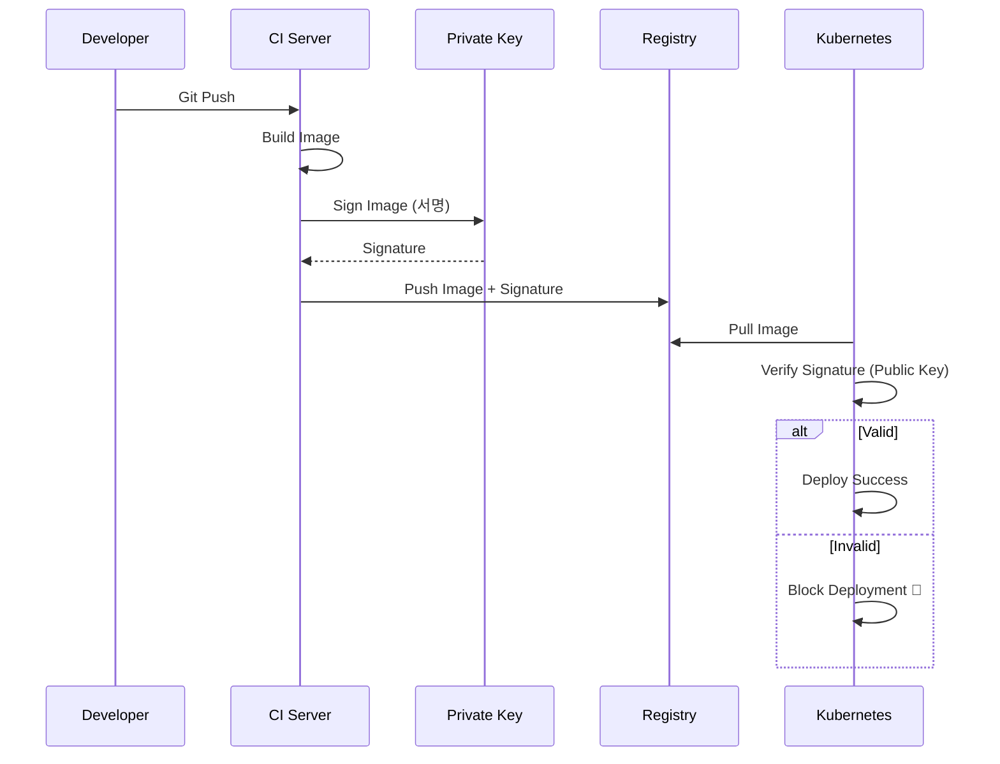

## ⛓️ 1. 공급망 공격(Supply Chain Attack)이란?

해커들이 애플리케이션 보안이 너무 튼튼하니까, **그 애플리케이션을 만드는 도구(파이프라인)** 를 공격하기 시작했습니다.
SolarWinds 사태처럼, 정상적인 업데이트 파일인 줄 알았는데 그 안에 악성코드가 심어져 배포되는 것이죠.

---

## 🏭 2. 파이프라인의 약한 고리들

1. **의존성 오염**: `npm install` 했는데 해커가 만든 가짜 라이브러리가 깔림 (Typosquatting).
2. **CI 탈취**: CI 서버의 환경 변수(AWS Key)를 훔쳐감.
3. **이미지 변조**: 레지스트리에 있는 이미지를 몰래 바꿔치기함.

---

## 🛡️ 3. 방어 전략: "아무도 믿지 마라"

### 3-1. SBOM (Software Bill of Materials)
"이 소프트웨어에 들어간 재료 명세서"입니다.
`log4j` 사태 때, 우리 회사 서비스 중 어디에 log4j가 쓰였는지 몰라 발을 동동 굴렀던 기억이 있나요?
빌드할 때마다 SBOM을 생성해두면, 취약점 발견 즉시 영향 범위를 알 수 있습니다.

### 3-2. 이미지 서명 (Signing)
**"이 이미지는 우리 CI 서버가 만든 게 확실해."** 라고 도장을 찍는 것입니다. (Cosign 등 사용)

- **Build**: 이미지 생성 후 Private Key로 서명.
- **Deploy**: k8s가 Public Key로 서명을 확인. 서명 없으면 배포 거부.

### 3-3. CI 권한 최소화 (Least Privilege)
GitHub Actions에 `Administrator` 권한을 주지 마세요.

| 보안 항목 | 권장 사항 | 이유 |
| :--- | :--- | :--- |
| **Action** | `v1` 태그 대신 **Commit Hash** 사용 | 태그는 덮어쓰기가 가능해 변조 위험 |
| **Secrets** | Long-lived Key 대신 **OIDC** 사용 | 키 유출 시 피해 최소화 (임시 토큰) |
| **MFA** | 모든 개발자 계정 **2FA 강제** | 계정 탈취 방지 |

## 요약

> [!TIP]
> **Secure Supply Chain Checklist**:
> - [ ] **Code**: Main 브랜치 직접 푸시 금지 (PR & 리뷰 필수)
> - [ ] **Build**: 빌드 시 SBOM 생성 및 보관
> - [ ] **Sign**: 모든 컨테이너 이미지 서명 (Cosign)
> - [ ] **Deploy**: 서명 검증된 이미지만 배포 허용 (Policy)

1. **의존성**: 내가 쓰는 라이브러리를 믿지 마라. (Lock file 필수)
2. **CI**: 빌드 환경은 언제든 오염될 수 있다. (일회성 격리 환경 권장)
3. **서명**: 배포되는 아티팩트가 내가 만든 게 맞는지 암호학적으로 검증해라.
