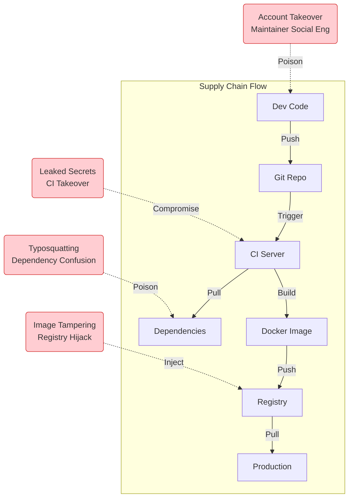
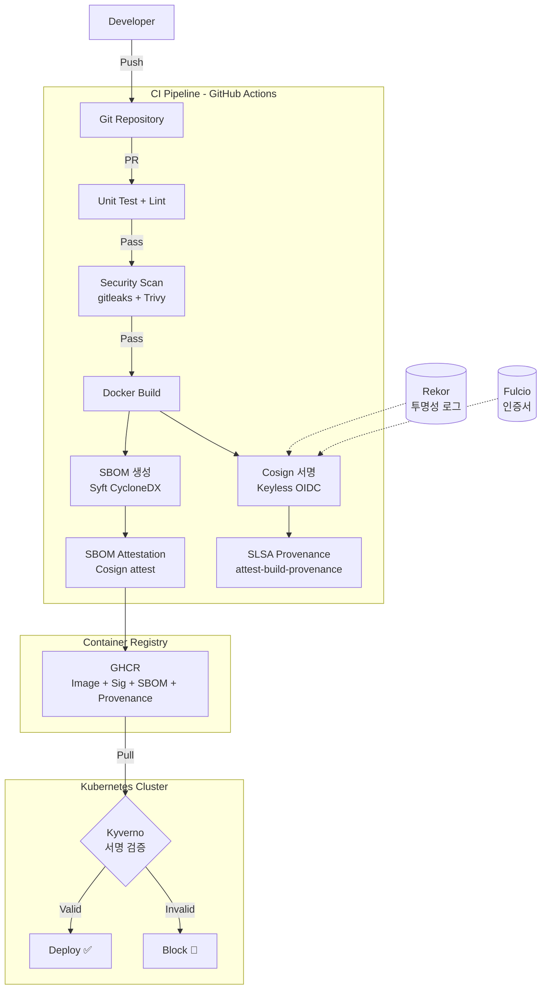

## 이 글에서 얻는 것

- **공급망 공격** 유형과 실제 사례(SolarWinds, codecov, ua-parser-js)를 이해합니다
- **SLSA 프레임워크** 레벨별 요구사항을 이해하고 L3까지의 로드맵을 세울 수 있습니다
- **SBOM 생성**과 취약점 스캔을 CI에 통합할 수 있습니다
- **Sigstore/Cosign**으로 이미지 서명·검증을 구현합니다
- **GitHub Actions 하드닝** 12가지 원칙을 적용합니다
- **Kubernetes Admission Policy**로 서명되지 않은 이미지 배포를 차단합니다

---

## 1. 공급망 공격(Supply Chain Attack)이란?

해커들이 애플리케이션 보안이 너무 튼튼하니까, **그 애플리케이션을 만드는 도구(파이프라인)** 를 공격하기 시작했습니다.

### 실제 사례

| 사례 | 연도 | 공격 벡터 | 영향 |
|:---|:---|:---|:---|
| **SolarWinds** | 2020 | CI/CD 빌드에 백도어 삽입 | 미국 정부 포함 18,000+ 조직 |
| **codecov** | 2021 | Bash Uploader 스크립트 변조 | 환경변수·시크릿 유출 |
| **ua-parser-js** | 2021 | npm 패키지 탈취 → 크립토마이너 | 주당 800만 다운로드 영향 |
| **event-stream** | 2018 | 메인테이너 교체 → 악성코드 삽입 | Bitcoin wallet 탈취 |
| **PyPI typosquatting** | 2022~ | `reqeusts`(오타) → 악성 패키지 | 수천 건 설치 |

### 공급망의 약한 고리


```mermaid
flowchart TD
    subgraph Supply_Chain [Supply Chain Flow]
        Source[Dev Code] -->|Push| Repo[Git Repo]
        Repo -->|Trigger| CI[CI Server]
        CI -->|Pull| Deps[Dependencies]
        CI -->|Build| Artifact[Docker Image]
        Artifact -->|Push| Registry[Registry]
        Registry -->|Pull| Prod[Production]
    end
    
    Attack1(Typosquatting<br/>Dependency Confusion) -.->|Poison| Deps
    Attack2(Leaked Secrets<br/>CI Takeover) -.->|Compromise| CI
    Attack3(Image Tampering<br/>Registry Hijack) -.->|Inject| Registry
    Attack4(Account Takeover<br/>Maintainer Social Eng) -.->|Poison| Source
    
    style Attack1 fill:#ffcdd2,stroke:#d32f2f
    style Attack2 fill:#ffcdd2,stroke:#d32f2f
    style Attack3 fill:#ffcdd2,stroke:#d32f2f
    style Attack4 fill:#ffcdd2,stroke:#d32f2f
```

---

## 2. SLSA 프레임워크 (Supply-chain Levels for Software Artifacts)

Google이 주도하는 공급망 보안 프레임워크입니다. **"이 아티팩트가 어디서, 누가, 어떻게 만들었는지 증명"**하는 것이 핵심입니다.

### SLSA 레벨 요구사항

| 레벨 | 요구사항 | 의미 | 방어하는 공격 |
|:---|:---|:---|:---|
| **L0** | 없음 | 보안 미적용 | — |
| **L1** | 빌드 프로세스 문서화 + 출처(Provenance) 생성 | "어디서 빌드했는지 기록 있음" | 소스 없는 아티팩트 |
| **L2** | 호스팅된 빌드 서비스 + 서명된 Provenance | "변조 감지 가능" | CI 로그 위변조 |
| **L3** | 강화된 빌드 플랫폼 (격리, 재현 가능) | "빌드 자체가 신뢰 가능" | 빌드 서버 탈취 |

### SLSA Provenance 구조

```json
{
  "_type": "https://in-toto.io/Statement/v0.1",
  "subject": [
    {
      "name": "ghcr.io/myorg/myapp",
      "digest": {
        "sha256": "abc123..."
      }
    }
  ],
  "predicateType": "https://slsa.dev/provenance/v1",
  "predicate": {
    "buildDefinition": {
      "buildType": "https://actions.github.io/buildtypes/workflow/v1",
      "externalParameters": {
        "workflow": ".github/workflows/build.yml",
        "ref": "refs/heads/main",
        "inputs": {}
      }
    },
    "runDetails": {
      "builder": {
        "id": "https://github.com/actions/runner"
      },
      "metadata": {
        "invocationId": "https://github.com/myorg/myapp/actions/runs/12345",
        "startedOn": "2026-03-24T02:00:00Z"
      }
    }
  }
}
```

### SLSA 달성 로드맵

```
Month 1 (L1):
├── GitHub Actions 워크플로우 정리
├── SLSA GitHub Generator로 Provenance 생성
└── SBOM 생성 자동화

Month 2-3 (L2):
├── Provenance에 Sigstore 서명 추가
├── 서명 검증 게이트 추가 (CI)
└── 의존성 검증 자동화 (Dependabot + Renovate)

Month 4-6 (L3):
├── 격리된 빌드 환경 (Ephemeral Runner)
├── Hermetic Build (네트워크 차단 빌드)
└── 재현 가능한 빌드 검증
```

---

## 3. SBOM (Software Bill of Materials)

### SBOM이란?

"이 소프트웨어에 들어간 **재료 명세서**"입니다. log4j 사태 때, "우리 서비스 중 어디에 log4j가 쓰였는지" 몰라 발을 동동 굴렀던 경험을 해결합니다.

### SBOM 형식 비교

| 형식 | 관리 주체 | 특징 | 적합 상황 |
|:---|:---|:---|:---|
| **SPDX** | Linux Foundation | ISO 5962 국제 표준 | 규제 준수 필요 시 |
| **CycloneDX** | OWASP | 보안 중심, 취약점 연계 우수 | 보안 스캔 연계 시 |

### CI에서 SBOM 생성

```yaml
# .github/workflows/sbom.yml
name: Build with SBOM

on:
  push:
    branches: [main]

permissions:
  contents: read
  packages: write
  id-token: write   # OIDC

jobs:
  build:
    runs-on: ubuntu-latest
    steps:
      - uses: actions/checkout@b4ffde65f46336ab88eb53be808477a3936bae11  # v4 SHA pin

      - name: Build Docker Image
        run: docker build -t ghcr.io/myorg/myapp:${{ github.sha }} .

      # Syft로 SBOM 생성 (CycloneDX)
      - name: Generate SBOM
        uses: anchore/sbom-action@78fc58e266e87a38d4194b2137a3d4e9bcaf7ca1  # v0.17.0
        with:
          image: ghcr.io/myorg/myapp:${{ github.sha }}
          format: cyclonedx-json
          output-file: sbom.cyclonedx.json

      # Grype로 취약점 스캔
      - name: Vulnerability Scan
        uses: anchore/scan-action@3343887d815d7b07465f6fdcd395bd66508d486a  # v3
        with:
          sbom: sbom.cyclonedx.json
          fail-build: true
          severity-cutoff: high    # High 이상 발견 시 빌드 실패

      # SBOM을 아티팩트로 저장
      - name: Upload SBOM
        uses: actions/upload-artifact@5d5d22a31266ced268874388b861e4b58bb5c2f3  # v4
        with:
          name: sbom
          path: sbom.cyclonedx.json
```

### SBOM 분석 활용

```bash
# Syft로 이미지의 SBOM 생성
syft ghcr.io/myorg/myapp:latest -o cyclonedx-json > sbom.json

# Grype로 취약점 스캔 (SBOM 기반)
grype sbom:sbom.json --only-fixed --fail-on high

# 특정 라이브러리 검색 (log4j 사태 대응)
cat sbom.json | jq '.components[] | select(.name | contains("log4j"))'

# 라이선스 감사
cat sbom.json | jq '[.components[].licenses[]?.license.id] | group_by(.) | map({license: .[0], count: length})'
```

---

## 4. 이미지 서명: Sigstore/Cosign

### Sigstore 생태계

```
Sigstore
├── Cosign:   컨테이너 이미지 서명·검증
├── Fulcio:   단명 인증서 발급 (OIDC → x509)
├── Rekor:    불변 투명성 로그 (서명 기록)
└── Gitsign:  Git 커밋 서명
```

### Cosign 키리스 서명 (OIDC 방식)

키 파일 관리가 필요 없는 현대적 방식입니다. CI의 OIDC 토큰으로 임시 인증서를 발급받아 서명합니다.

```yaml
# .github/workflows/sign.yml
name: Build, Sign, Attest

on:
  push:
    branches: [main]

permissions:
  contents: read
  packages: write
  id-token: write
  attestations: write

env:
  REGISTRY: ghcr.io
  IMAGE: myorg/myapp

jobs:
  build-sign:
    runs-on: ubuntu-latest
    steps:
      - uses: actions/checkout@b4ffde65f46336ab88eb53be808477a3936bae11

      - name: Login to GHCR
        uses: docker/login-action@343f7c4344506bcbf9b4de18042ae17996df046d
        with:
          registry: ${{ env.REGISTRY }}
          username: ${{ github.actor }}
          password: ${{ secrets.GITHUB_TOKEN }}

      - name: Build and Push
        id: build
        uses: docker/build-push-action@0565240e2d4ab88bba5387d719585280857ece09
        with:
          push: true
          tags: ${{ env.REGISTRY }}/${{ env.IMAGE }}:${{ github.sha }}

      # Cosign 설치
      - name: Install Cosign
        uses: sigstore/cosign-installer@59acb6260d9c0ba8f4a2f9d9b48431a222b68e20

      # 키리스 서명 (OIDC → Fulcio 인증서 → Rekor 투명성 로그)
      - name: Sign Image
        env:
          DIGEST: ${{ steps.build.outputs.digest }}
        run: |
          cosign sign --yes \
            ${{ env.REGISTRY }}/${{ env.IMAGE }}@${DIGEST}

      # SBOM 첨부 (Attestation)
      - name: Generate and Attach SBOM
        run: |
          syft ${{ env.REGISTRY }}/${{ env.IMAGE }}@${{ steps.build.outputs.digest }} \
            -o cyclonedx-json > sbom.json
          cosign attest --yes \
            --predicate sbom.json \
            --type cyclonedx \
            ${{ env.REGISTRY }}/${{ env.IMAGE }}@${{ steps.build.outputs.digest }}

      # SLSA Provenance 첨부
      - name: Attest Provenance
        uses: actions/attest-build-provenance@1c608d11d69870c2092266b3f9a6f3abbf17002c
        with:
          subject-name: ${{ env.REGISTRY }}/${{ env.IMAGE }}
          subject-digest: ${{ steps.build.outputs.digest }}
          push-to-registry: true
```

### 이미지 서명 검증

```bash
# 서명 검증 (키리스)
cosign verify \
  --certificate-identity "https://github.com/myorg/myapp/.github/workflows/sign.yml@refs/heads/main" \
  --certificate-oidc-issuer "https://token.actions.githubusercontent.com" \
  ghcr.io/myorg/myapp@sha256:abc123...

# SBOM Attestation 검증
cosign verify-attestation \
  --type cyclonedx \
  --certificate-identity "https://github.com/myorg/myapp/.github/workflows/sign.yml@refs/heads/main" \
  --certificate-oidc-issuer "https://token.actions.githubusercontent.com" \
  ghcr.io/myorg/myapp@sha256:abc123...

# Rekor 투명성 로그 조회
rekor-cli search --sha sha256:abc123...
```

---

## 5. GitHub Actions 하드닝 12원칙

### 5-1. Action 버전 SHA 고정

```yaml
# ❌ 위험: 태그는 덮어쓰기 가능
- uses: actions/checkout@v4

# ✅ 안전: 커밋 해시는 불변
- uses: actions/checkout@b4ffde65f46336ab88eb53be808477a3936bae11  # v4.1.7
```

> **자동화**: Renovate 또는 Dependabot으로 SHA 자동 업데이트

### 5-2. 최소 권한 (permissions)

```yaml
# ❌ 전역 쓰기 권한 (기본값이 위험할 수 있음)
permissions: write-all

# ✅ 필요한 최소 권한만
permissions:
  contents: read
  packages: write
  id-token: write   # OIDC만
```

### 5-3. OIDC로 클라우드 인증 (Long-lived 키 제거)

```yaml
# ❌ 위험: 장기 키 유출 시 무제한 접근
- name: Configure AWS
  env:
    AWS_ACCESS_KEY_ID: ${{ secrets.AWS_KEY }}
    AWS_SECRET_ACCESS_KEY: ${{ secrets.AWS_SECRET }}

# ✅ 안전: 임시 토큰 (15분 유효)
- name: Configure AWS (OIDC)
  uses: aws-actions/configure-aws-credentials@e3dd6a429d7300a6a4c196c26e071d42e0343502
  with:
    role-to-assume: arn:aws:iam::123456789012:role/github-actions
    aws-region: ap-northeast-2
    # AWS IAM Trust Policy에서 repo·branch·workflow를 조건으로 제한
```

### 5-4. PR과 Main 빌드 분리

```yaml
# PR 빌드: 테스트만 (시크릿 접근 불가)
on:
  pull_request:
    branches: [main]

# Main 빌드: 빌드 + 배포 (시크릿 접근 가능)
on:
  push:
    branches: [main]
```

### 5-5. pull_request_target 주의

```yaml
# ❌ 매우 위험: 외부 PR 코드가 시크릿에 접근 가능
on: pull_request_target

# ✅ 안전: 외부 PR에는 시크릿 미노출
on: pull_request
```

### 나머지 7원칙 요약

| # | 원칙 | 설명 |
|:---|:---|:---|
| 6 | **Environment 승인 게이트** | 프로덕션 배포 전 수동 승인 필수 |
| 7 | **Concurrency 제한** | 동시 배포 방지 (`concurrency` 키) |
| 8 | **Step Timeout** | 무한 실행 방지 (`timeout-minutes`) |
| 9 | **Self-hosted Runner 격리** | Ephemeral runner + 네트워크 격리 |
| 10 | **gitleaks** | 커밋 내 시크릿 탐지 (pre-commit + CI) |
| 11 | **Dependabot/Renovate** | 의존성 자동 업데이트 + 취약점 알림 |
| 12 | **OpenSSF Scorecard** | 프로젝트 보안 점수 자동 측정 |

---

## 6. 의존성 보안

### Dependency Confusion 방어

내부 패키지 이름과 동일한 이름을 공개 레지스트리에 올려 탈취하는 공격입니다.

```yaml
# .npmrc (npm)
@myorg:registry=https://npm.pkg.github.com
# 내부 스코프 패키지는 반드시 Private Registry에서만 가져옴

# settings.xml (Maven)
<mirrors>
  <mirror>
    <id>internal-only</id>
    <mirrorOf>*</mirrorOf>
    <url>https://nexus.internal.com/repository/maven-public/</url>
  </mirror>
</mirrors>
```

### Lock 파일 무결성

```yaml
# CI에서 lock 파일 일관성 강제
- name: Install (frozen lockfile)
  run: npm ci    # package-lock.json과 정확히 일치해야 함
  # npm install은 lock 파일을 수정할 수 있어 위험

# Gradle
- name: Verify dependency checksums
  run: ./gradlew --write-verification-metadata sha256
  # gradle/verification-metadata.xml 생성 → CI에서 검증
```

### 취약점 스캔 파이프라인

```yaml
# .github/workflows/security-scan.yml
name: Security Scan

on:
  pull_request:
  schedule:
    - cron: '0 6 * * 1'   # 매주 월요일 06:00 UTC

permissions:
  contents: read
  security-events: write

jobs:
  dependency-scan:
    runs-on: ubuntu-latest
    steps:
      - uses: actions/checkout@b4ffde65f46336ab88eb53be808477a3936bae11

      # Trivy로 종합 취약점 스캔
      - name: Trivy Vulnerability Scan
        uses: aquasecurity/trivy-action@7b7aa354d6fee01c15c5a35820aaca9bb3476551
        with:
          scan-type: fs
          format: sarif
          output: trivy-results.sarif
          severity: CRITICAL,HIGH

      # GitHub Security tab에 결과 업로드
      - name: Upload to Security Tab
        uses: github/codeql-action/upload-sarif@v3
        with:
          sarif_file: trivy-results.sarif

  container-scan:
    runs-on: ubuntu-latest
    steps:
      - name: Build Image
        run: docker build -t myapp:scan .

      - name: Trivy Container Scan
        uses: aquasecurity/trivy-action@7b7aa354d6fee01c15c5a35820aaca9bb3476551
        with:
          image-ref: myapp:scan
          format: table
          severity: CRITICAL,HIGH
          exit-code: 1   # 발견 시 빌드 실패

  secret-scan:
    runs-on: ubuntu-latest
    steps:
      - uses: actions/checkout@b4ffde65f46336ab88eb53be808477a3936bae11
        with:
          fetch-depth: 0    # 전체 히스토리 (과거 커밋 포함)

      - name: gitleaks
        uses: gitleaks/gitleaks-action@cb7149a9b57195b609c63e8518d2c6056677d2d0
        env:
          GITHUB_TOKEN: ${{ secrets.GITHUB_TOKEN }}
```

---

## 7. Kubernetes 배포 게이트: 서명된 이미지만 허용

### Kyverno 정책 (권장)

```yaml
# kyverno-image-verify.yaml
apiVersion: kyverno.io/v1
kind: ClusterPolicy
metadata:
  name: verify-image-signature
spec:
  validationFailureAction: Enforce    # 위반 시 배포 차단
  background: false
  rules:
    - name: verify-cosign-signature
      match:
        any:
          - resources:
              kinds:
                - Pod
      verifyImages:
        - imageReferences:
            - "ghcr.io/myorg/*"
          attestors:
            - entries:
                - keyless:
                    issuer: "https://token.actions.githubusercontent.com"
                    subject: "https://github.com/myorg/*/.github/workflows/*@refs/heads/main"
                    rekor:
                      url: "https://rekor.sigstore.dev"
          attestations:
            - type: https://cyclonedx.org/bom
              conditions:
                any:
                  - all:
                      - key: "{{ components[].name }}"
                        operator: AnyNotIn
                        value: ["blocked-library-v1"]
```

### OPA/Gatekeeper 정책

```rego
# policy.rego
package kubernetes.admission

deny[msg] {
    input.request.kind.kind == "Pod"
    container := input.request.object.spec.containers[_]
    not startswith(container.image, "ghcr.io/myorg/")
    msg := sprintf("Untrusted registry: %v. Only ghcr.io/myorg/ allowed.", [container.image])
}

deny[msg] {
    input.request.kind.kind == "Pod"
    container := input.request.object.spec.containers[_]
    not contains(container.image, "@sha256:")
    msg := sprintf("Image %v must use digest (@sha256:), not tag.", [container.image])
}
```

---

## 8. 전체 파이프라인 흐름도


```mermaid
flowchart TD
    Dev[Developer] -->|Push| Repo[Git Repository]
    
    subgraph CI [CI Pipeline - GitHub Actions]
        Repo -->|PR| Test[Unit Test + Lint]
        Test -->|Pass| SecScan[Security Scan<br/>gitleaks + Trivy]
        SecScan -->|Pass| Build[Docker Build]
        Build --> SBOM[SBOM 생성<br/>Syft CycloneDX]
        Build --> Sign[Cosign 서명<br/>Keyless OIDC]
        SBOM --> Attest[SBOM Attestation<br/>Cosign attest]
        Sign --> Prov[SLSA Provenance<br/>attest-build-provenance]
    end
    
    subgraph Registry [Container Registry]
        Attest --> GHCR[GHCR<br/>Image + Sig + SBOM + Provenance]
    end
    
    subgraph K8s [Kubernetes Cluster]
        GHCR -->|Pull| Verify{Kyverno<br/>서명 검증}
        Verify -->|Valid| Deploy[Deploy ✅]
        Verify -->|Invalid| Block[Block 🛑]
    end
    
    Rekor[(Rekor<br/>투명성 로그)] -.-> Sign
    Fulcio[(Fulcio<br/>인증서)] -.-> Sign
```

---

## 9. 보안 점수 측정: OpenSSF Scorecard

```yaml
# .github/workflows/scorecard.yml
name: OpenSSF Scorecard

on:
  push:
    branches: [main]
  schedule:
    - cron: '0 6 * * 1'

permissions:
  contents: read
  security-events: write

jobs:
  scorecard:
    runs-on: ubuntu-latest
    steps:
      - uses: actions/checkout@b4ffde65f46336ab88eb53be808477a3936bae11
      
      - name: Run Scorecard
        uses: ossf/scorecard-action@62b2cac7ed8198b15735ed49ab1e5cf35480ba46
        with:
          results_file: scorecard.json
          results_format: json

      - name: Upload Results
        uses: github/codeql-action/upload-sarif@v3
        with:
          sarif_file: scorecard.json
```

### Scorecard 체크 항목

| 체크 | 설명 | 목표 점수 |
|:---|:---|:---|
| Branch-Protection | main 브랜치 보호 규칙 | 8+ |
| Code-Review | PR 리뷰 필수 | 8+ |
| Dangerous-Workflow | pull_request_target 등 위험 패턴 | 10 |
| Dependency-Update-Tool | Dependabot/Renovate 활성 | 10 |
| Pinned-Dependencies | Action SHA 고정 | 10 |
| Token-Permissions | 최소 권한 | 10 |
| Vulnerabilities | 알려진 취약점 없음 | 10 |
| SAST | 정적 분석 도구 사용 | 8+ |
| Signed-Releases | 릴리스 서명 | 8+ |

---

## 10. 운영 체크리스트

### 즉시 적용 (Day 1)

- [ ] GitHub Actions `permissions` 최소 권한 설정
- [ ] Action 버전 SHA 고정 + Dependabot 자동 업데이트
- [ ] `pull_request_target` 사용 여부 점검 → 제거
- [ ] gitleaks pre-commit hook + CI 설정
- [ ] Lock 파일 `npm ci` / `pip install --require-hashes` 강제

### 1주 내 적용

- [ ] SBOM 생성 자동화 (Syft)
- [ ] 취약점 스캔 CI 통합 (Trivy/Grype)
- [ ] OIDC 인증 전환 (AWS/GCP Long-lived 키 삭제)
- [ ] Environment 승인 게이트 설정

### 1개월 내 적용

- [ ] Cosign 키리스 이미지 서명
- [ ] SLSA Provenance 생성 (L1→L2)
- [ ] Kyverno/OPA 이미지 검증 정책
- [ ] OpenSSF Scorecard 자동 실행

### 분기별 점검

- [ ] Scorecard 점수 추이 확인 (목표: 7+ → 9+)
- [ ] SBOM 기반 취약점 전수 조사
- [ ] 의존성 라이선스 감사
- [ ] Self-hosted Runner 보안 점검
- [ ] 시크릿 회전 이력 확인

---

## 요약

1. **Trust Nothing**: 소스, 빌드 환경, 의존성, 레지스트리 모두 검증 대상
2. **SLSA로 출처 증명**: Provenance로 "누가, 어디서, 어떻게 빌드했는지" 기록
3. **SBOM으로 가시성 확보**: log4j 같은 사태 시 즉시 영향 파악
4. **Sigstore로 서명**: 키리스 OIDC 방식으로 이미지 무결성 보장
5. **배포 게이트**: 서명되지 않은 이미지는 K8s 진입 차단
6. **지속적 측정**: OpenSSF Scorecard로 보안 수준 정량화

## 관련 글

- [CI/CD GitHub Actions](/learning/deep-dive/deep-dive-ci-cd-github-actions/)
- [GitHub Actions CI 파이프라인](/learning/deep-dive/deep-dive-github-actions-ci-pipeline/)
- [시크릿 관리](/learning/deep-dive/deep-dive-secret-management/)
- [OWASP Top 10 체크리스트](/learning/deep-dive/deep-dive-owasp-top10-checklist/)
- [OAuth2 & OIDC](/learning/deep-dive/deep-dive-oauth2-oidc/)
- [Docker 기초](/learning/deep-dive/deep-dive-docker-basics/)
- [Kubernetes 기초](/learning/deep-dive/deep-dive-kubernetes-basics/)
- [Feature Flags](/learning/deep-dive/deep-dive-feature-flags/)
- [배포 런북](/learning/deep-dive/deep-dive-deployment-runbook/)
