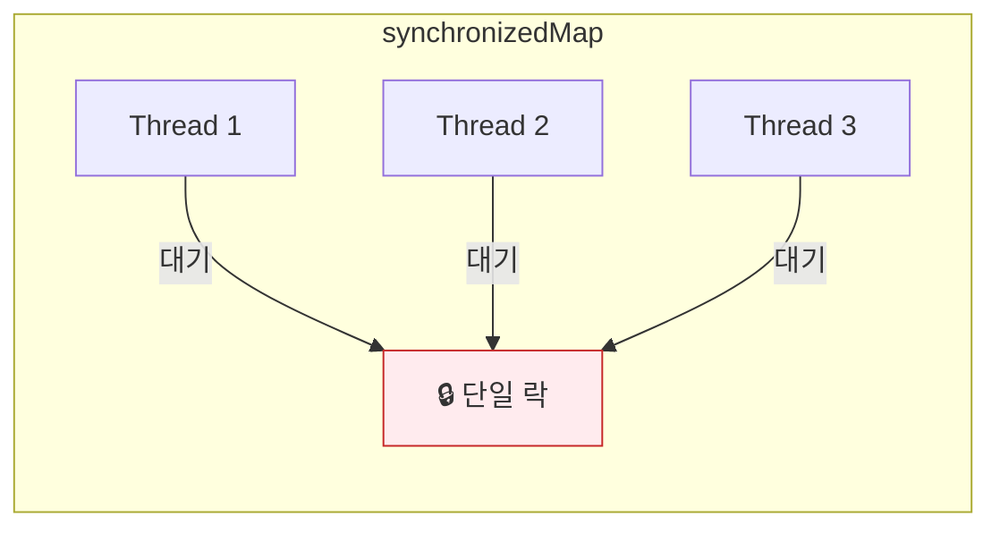
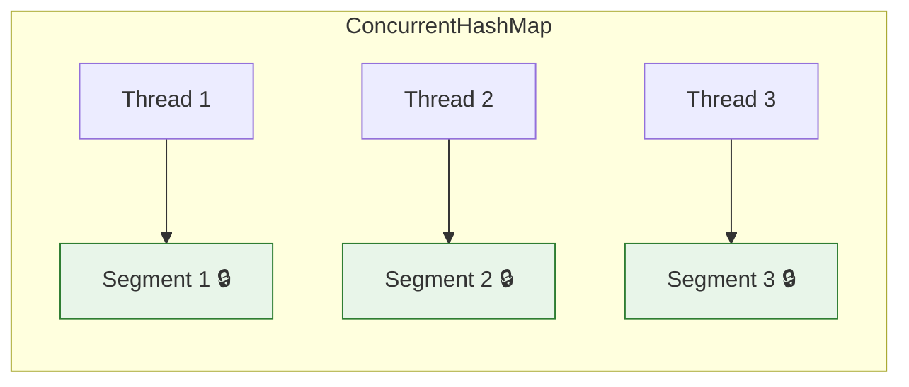
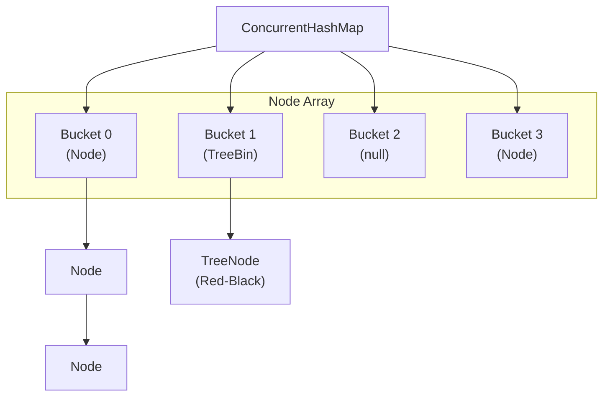
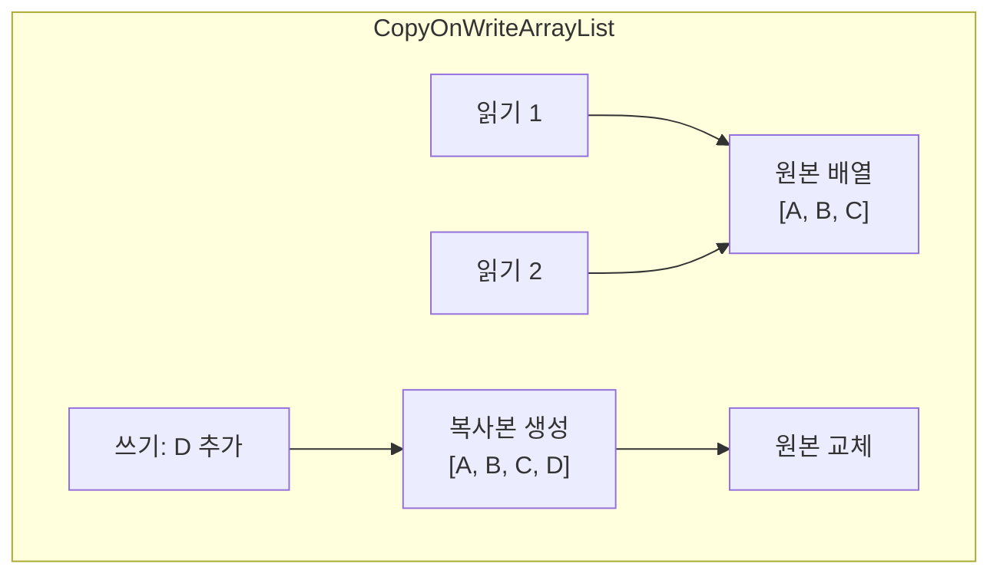
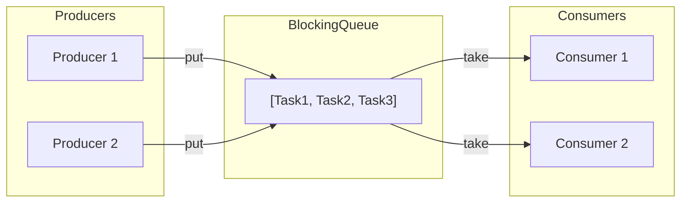
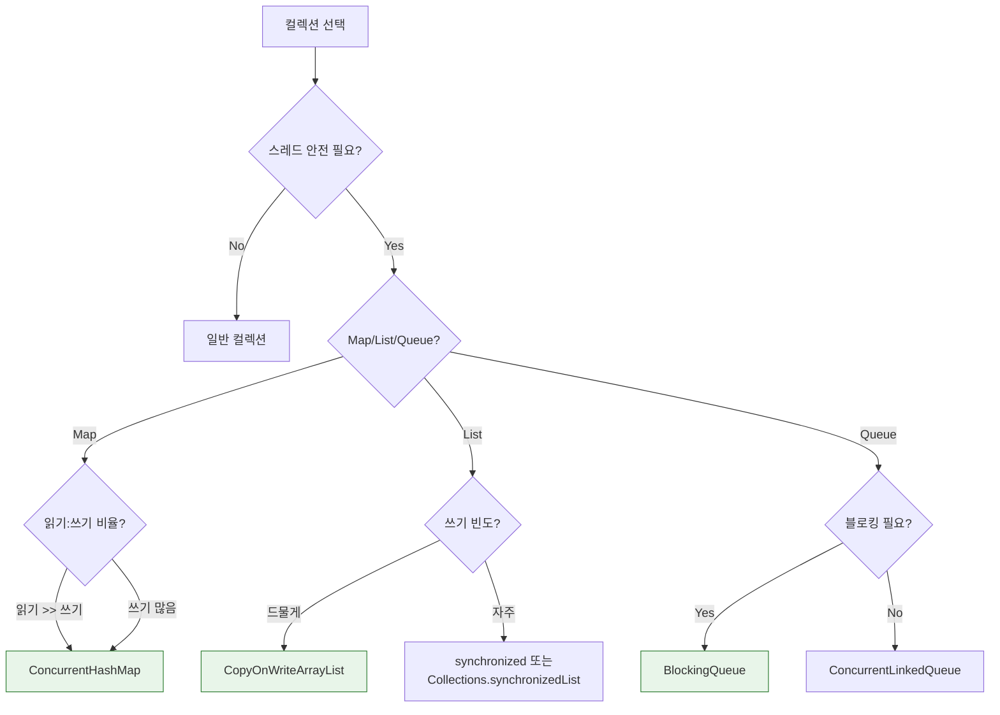

## 이 글에서 얻는 것

- **동기화 컬렉션 vs 동시성 컬렉션**의 차이를 이해합니다
- **ConcurrentHashMap**의 내부 동작과 성능 특성을 알아봅니다
- **BlockingQueue**로 생산자-소비자 패턴을 구현합니다

---

## 왜 동시성 컬렉션인가?

### 문제: 동기화 컬렉션의 한계

```java
// ❌ 동기화 컬렉션 - 전체 락
Map<String, Integer> syncMap = Collections.synchronizedMap(new HashMap<>());

// 모든 연산에 전체 락 →  심각한 병목
syncMap.put("key1", 1);  // 전체 맵 락
syncMap.get("key1");     // 전체 맵 락
```



### 해결: 동시성 컬렉션



**세분화된 락(Fine-grained locking)**으로 동시 접근 허용

---

## ConcurrentHashMap

### 내부 구조 (Java 8+)



**특징**:
- **버킷별 락**: 각 버킷에 독립적 락
- **CAS 연산**: 락 없이 원자적 업데이트
- **TreeBin 변환**: 충돌이 많으면 LinkedList → Red-Black Tree

### 주요 연산

```java
ConcurrentHashMap<String, Integer> map = new ConcurrentHashMap<>();

// 기본 연산 (스레드 안전)
map.put("key1", 1);
map.get("key1");
map.remove("key1");

// 원자적 복합 연산 ⭐
map.putIfAbsent("key", 100);           // 없으면 추가
map.computeIfAbsent("key", k -> 100);  // 없으면 계산 후 추가
map.computeIfPresent("key", (k, v) -> v + 1);  // 있으면 업데이트
map.merge("key", 1, Integer::sum);     // 있으면 합계, 없으면 추가

// ⚠️ 주의: 아래는 원자적이지 않음!
if (!map.containsKey("key")) {  // check
    map.put("key", value);      // then act → 경쟁 조건!
}

// ✅ 올바른 방법
map.computeIfAbsent("key", k -> expensiveComputation());
```

### 성능 비교

| 연산 | HashMap | synchronizedMap | ConcurrentHashMap |
|------|---------|-----------------|-------------------|
| 단일 스레드 | 매우 빠름 | 느림 (락 오버헤드) | 빠름 |
| 다중 스레드 읽기 | N/A (안전하지 않음) | 느림 (경합) | 매우 빠름 |
| 다중 스레드 쓰기 | N/A | 매우 느림 | 빠름 |

### 실무 활용: 캐시 구현

```java
public class SimpleCache<K, V> {
    private final ConcurrentHashMap<K, V> cache = new ConcurrentHashMap<>();
    private final Function<K, V> loader;
    
    public SimpleCache(Function<K, V> loader) {
        this.loader = loader;
    }
    
    public V get(K key) {
        // 원자적으로 캐시 로드
        return cache.computeIfAbsent(key, loader);
    }
    
    public void invalidate(K key) {
        cache.remove(key);
    }
    
    public void invalidateAll() {
        cache.clear();
    }
}
```

---

## CopyOnWrite 컬렉션

### 개념



**동작 원리**:
- **읽기**: 락 없이 현재 배열 참조
- **쓰기**: 전체 배열 복사 → 수정 → 교체

### 사용 사례

```java
// ✅ 읽기가 대부분, 쓰기가 드문 경우
CopyOnWriteArrayList<EventListener> listeners = new CopyOnWriteArrayList<>();

// 읽기: 락 없이 안전한 순회
for (EventListener listener : listeners) {
    listener.onEvent(event);  // ConcurrentModificationException 없음
}

// 쓰기: 전체 복사 (비용 높음)
listeners.add(newListener);

// ✅ 적합한 경우
// - 이벤트 리스너 관리
// - 설정(Configuration) 목록
// - 화이트리스트/블랙리스트

// ❌ 부적합한 경우
// - 자주 변경되는 데이터
// - 대용량 데이터
```

### CopyOnWriteArraySet

```java
// 중복 없는 CopyOnWrite Set
CopyOnWriteArraySet<String> allowedIps = new CopyOnWriteArraySet<>();

allowedIps.add("192.168.1.1");
allowedIps.add("192.168.1.2");

// 읽기 (락 없음)
if (allowedIps.contains(clientIp)) {
    // 허용
}
```

---

## BlockingQueue

### 생산자-소비자 패턴



### 구현체 비교

| 구현체 | 경계 | 특징 |
|--------|------|------|
| `ArrayBlockingQueue` | 유한 | 배열 기반, FIFO |
| `LinkedBlockingQueue` | 유한/무한 | 링크드리스트 기반 |
| `PriorityBlockingQueue` | 무한 | 우선순위 정렬 |
| `SynchronousQueue` | 0 | 직접 전달 (버퍼 없음) |
| `DelayQueue` | 무한 | 지연 후 사용 가능 |

### 사용 예시

```java
// 작업 큐
BlockingQueue<Runnable> workQueue = new LinkedBlockingQueue<>(100);

// 생산자
public void submitTask(Runnable task) throws InterruptedException {
    workQueue.put(task);  // 큐가 가득 차면 블로킹
}

// 소비자 (Worker Thread)
public void processLoop() {
    while (!Thread.currentThread().isInterrupted()) {
        try {
            Runnable task = workQueue.take();  // 비어있으면 블로킹
            task.run();
        } catch (InterruptedException e) {
            Thread.currentThread().interrupt();
            break;
        }
    }
}
```

### 주요 메서드

| 메서드 | 블로킹 | 타임아웃 | 예외 발생 |
|--------|--------|---------|----------|
| `put()` | ✅ 대기 | - | - |
| `offer(timeout)` | - | ✅ | - |
| `take()` | ✅ 대기 | - | - |
| `poll(timeout)` | - | ✅ | - |
| `add()` | - | - | ✅ 예외 |

```java
// 타임아웃 있는 offer
boolean success = queue.offer(task, 5, TimeUnit.SECONDS);
if (!success) {
    // 5초 내 삽입 실패 처리
    handleQueueFull();
}

// 타임아웃 있는 poll
Runnable task = queue.poll(1, TimeUnit.SECONDS);
if (task == null) {
    // 1초 내 작업 없음
    handleIdleState();
}
```

---

## 실무 패턴

### ConcurrentHashMap 기반 카운터

```java
public class ConcurrentCounter {
    private final ConcurrentHashMap<String, LongAdder> counters = 
        new ConcurrentHashMap<>();
    
    public void increment(String key) {
        counters.computeIfAbsent(key, k -> new LongAdder()).increment();
    }
    
    public long get(String key) {
        LongAdder adder = counters.get(key);
        return adder != null ? adder.sum() : 0;
    }
}

// 사용
ConcurrentCounter hitCounter = new ConcurrentCounter();
hitCounter.increment("/api/users");
hitCounter.increment("/api/orders");
```

### 스레드 안전 싱글톤 레지스트리

```java
public class ServiceRegistry {
    private static final ConcurrentHashMap<Class<?>, Object> services = 
        new ConcurrentHashMap<>();
    
    @SuppressWarnings("unchecked")
    public static <T> T getService(Class<T> type, Supplier<T> factory) {
        return (T) services.computeIfAbsent(type, t -> factory.get());
    }
}

// 사용
UserService userService = ServiceRegistry.getService(
    UserService.class, 
    UserServiceImpl::new
);
```

---

## 선택 가이드



---

## 요약

### 동시성 컬렉션 체크리스트

| 요구사항 | 추천 |
|---------|------|
| 스레드 안전 Map | ConcurrentHashMap |
| 읽기 위주 List | CopyOnWriteArrayList |
| 생산자-소비자 | BlockingQueue |
| 스레드 안전 Set | ConcurrentSkipListSet |
| 정렬된 Map | ConcurrentSkipListMap |

### 핵심 원칙

1. **synchronized 대신 동시성 컬렉션**: 더 나은 성능
2. **원자적 복합 연산 사용**: `computeIfAbsent`, `merge`
3. **적절한 구현체 선택**: 읽기/쓰기 패턴 고려
4. **블로킹 vs 논블로킹**: 요구사항에 맞게

---

## 🔗 Related Deep Dive

- **[Java 동시성 기초](/learning/deep-dive/deep-dive-java-concurrency-basics/)**: Thread, synchronized, volatile.
- **[분산 락](/learning/deep-dive/deep-dive-distributed-lock/)**: 단일 JVM을 넘어선 동시성 제어.
