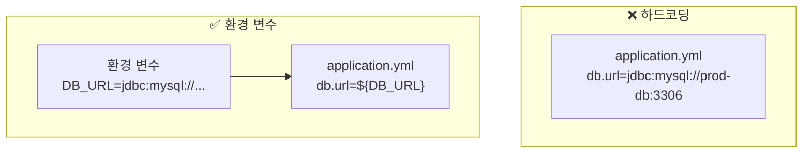
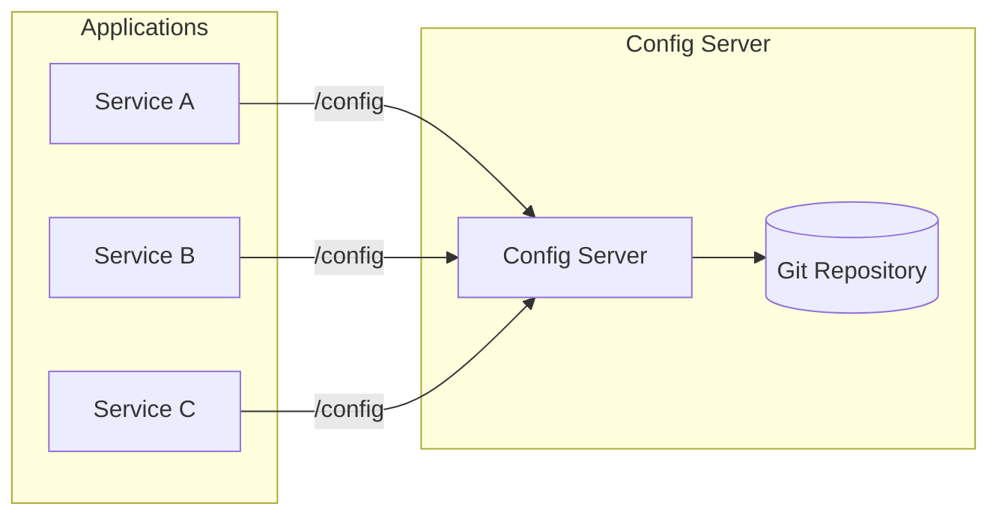
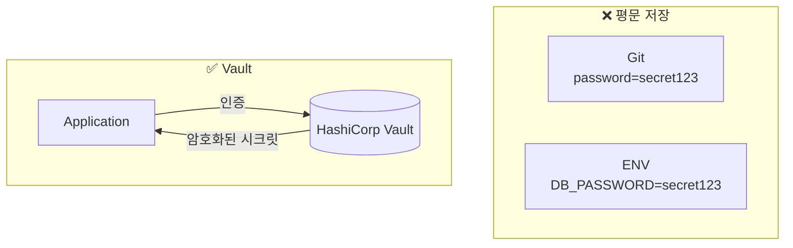

## 이 글에서 얻는 것

- **12-Factor App** 설정 원칙을 이해합니다
- **Spring Cloud Config**로 중앙 설정 관리를 구현합니다
- **Vault**를 활용한 시크릿 관리를 알아봅니다

---

## 12-Factor App 설정 원칙

### Config는 환경에 저장



**원칙**: 설정은 코드와 분리. 환경마다 다른 값을 환경 변수로 주입

---

## Spring Boot 설정 우선순위

```java
// 우선순위 (높은 순)
1. 명령줄 인자: --server.port=8080
2. SPRING_APPLICATION_JSON
3. 시스템 프로퍼티: -Dserver.port=8080
4. OS 환경 변수: SERVER_PORT=8080
5. application-{profile}.yml
6. application.yml
7. @PropertySource
8. 기본값
```

### 환경별 프로파일

```yaml
# application.yml (공통)
spring:
  profiles:
    active: ${SPRING_PROFILES_ACTIVE:local}

server:
  port: 8080

---
# application-local.yml
spring:
  datasource:
    url: jdbc:h2:mem:testdb
    
---
# application-prod.yml
spring:
  datasource:
    url: ${DB_URL}
    username: ${DB_USERNAME}
    password: ${DB_PASSWORD}
```

---

## Spring Cloud Config

### 아키텍처



### Config Server 설정

```java
// Config Server Application
@SpringBootApplication
@EnableConfigServer
public class ConfigServerApplication {
    public static void main(String[] args) {
        SpringApplication.run(ConfigServerApplication.class, args);
    }
}
```

```yaml
# Config Server application.yml
server:
  port: 8888

spring:
  cloud:
    config:
      server:
        git:
          uri: https://github.com/company/config-repo
          default-label: main
          search-paths: '{application}'
```

### Git Repository 구조

```
config-repo/
├── application.yml          # 공통 설정
├── order-service/
│   ├── application.yml      # order-service 기본
│   ├── application-dev.yml  # order-service dev
│   └── application-prod.yml # order-service prod
└── payment-service/
    ├── application.yml
    └── application-prod.yml
```

### Client 설정

```yaml
# bootstrap.yml (Spring Boot 2.4 이전)
spring:
  application:
    name: order-service
  cloud:
    config:
      uri: http://config-server:8888
      profile: ${SPRING_PROFILES_ACTIVE:dev}

# Spring Boot 2.4+ (spring.config.import)
spring:
  config:
    import: configserver:http://config-server:8888
  cloud:
    config:
      profile: ${SPRING_PROFILES_ACTIVE:dev}
```

### 동적 설정 갱신

```java
@RefreshScope  // 설정 갱신 시 빈 재생성
@Component
public class DynamicConfig {
    
    @Value("${feature.new-checkout:false}")
    private boolean newCheckoutEnabled;
    
    public boolean isNewCheckoutEnabled() {
        return newCheckoutEnabled;
    }
}

// POST /actuator/refresh 호출 시 갱신
```

```yaml
# actuator 설정
management:
  endpoints:
    web:
      exposure:
        include: refresh, health
```

---

## Vault 시크릿 관리

### 왜 Vault인가?



**Vault 장점**:
- 시크릿 암호화 저장
- 동적 시크릿 (DB 자격증명 자동 생성)
- 감사 로그
- 시크릿 회전

### Spring Cloud Vault 설정

```xml
<dependency>
    <groupId>org.springframework.cloud</groupId>
    <artifactId>spring-cloud-starter-vault-config</artifactId>
</dependency>
```

```yaml
spring:
  cloud:
    vault:
      uri: http://vault:8200
      token: ${VAULT_TOKEN}
      kv:
        enabled: true
        backend: secret
        default-context: order-service
        profile-separator: '/'
```

### Vault에 시크릿 저장

```bash
# Vault CLI로 시크릿 저장
vault kv put secret/order-service \
    db.username=admin \
    db.password=super-secret-password \
    api.key=abc123

# 개발/운영 환경 분리
vault kv put secret/order-service/dev db.password=dev-password
vault kv put secret/order-service/prod db.password=prod-password
```

### 사용

```java
@Service
public class DatabaseConfig {
    
    @Value("${db.username}")  // Vault에서 자동 주입
    private String username;
    
    @Value("${db.password}")  // Vault에서 자동 주입
    private String password;
}
```

---

## Kubernetes ConfigMap/Secret

### ConfigMap

```yaml
# configmap.yaml
apiVersion: v1
kind: ConfigMap
metadata:
  name: order-service-config
data:
  application.yml: |
    server:
      port: 8080
    feature:
      new-checkout: true
```

```yaml
# deployment.yaml
spec:
  containers:
    - name: order-service
      volumeMounts:
        - name: config
          mountPath: /config
  volumes:
    - name: config
      configMap:
        name: order-service-config
```

### Secret

```yaml
# secret.yaml
apiVersion: v1
kind: Secret
metadata:
  name: order-service-secret
type: Opaque
data:
  db-password: c3VwZXItc2VjcmV0  # base64 encoded
```

```yaml
# 환경 변수로 주입
spec:
  containers:
    - name: order-service
      env:
        - name: DB_PASSWORD
          valueFrom:
            secretKeyRef:
              name: order-service-secret
              key: db-password
```

---

## 설정 검증

### @ConfigurationProperties

```java
@ConfigurationProperties(prefix = "app.feature")
@Validated
@Getter @Setter
public class FeatureProperties {
    
    @NotBlank
    private String name;
    
    @Min(1) @Max(100)
    private int maxConnections = 10;
    
    @NotNull
    private Duration timeout = Duration.ofSeconds(30);
    
    private boolean enabled = false;
}
```

```yaml
app:
  feature:
    name: checkout
    max-connections: 50
    timeout: 5s
    enabled: true
```

### 시작 시 검증

```java
@Component
public class ConfigValidator implements ApplicationRunner {
    
    @Autowired
    private FeatureProperties featureProperties;
    
    @Override
    public void run(ApplicationArguments args) {
        // 필수 설정 검증
        if (featureProperties.getName() == null) {
            throw new IllegalStateException("app.feature.name is required");
        }
        
        log.info("Configuration validated: {}", featureProperties);
    }
}
```

---

## 요약

### 설정 관리 체크리스트

| 항목 | 권장 |
|------|------|
| 환경별 분리 | Spring Profiles |
| 중앙 관리 | Spring Cloud Config |
| 시크릿 | Vault / K8s Secret |
| 동적 갱신 | @RefreshScope |
| 검증 | @ConfigurationProperties + @Validated |

### 핵심 원칙

1. **코드와 설정 분리**: 환경 변수 사용
2. **시크릿은 암호화**: Vault 또는 K8s Secret
3. **중앙 집중 관리**: Config Server
4. **검증**: 시작 시 필수 설정 확인

---

## 🔗 Related Deep Dive

- **[Kubernetes 기본](/learning/deep-dive/deep-dive-kubernetes-basics/)**: ConfigMap, Secret 활용.
- **[피처 플래그](/learning/deep-dive/deep-dive-feature-flags/)**: 동적 설정 기반 기능 제어.
