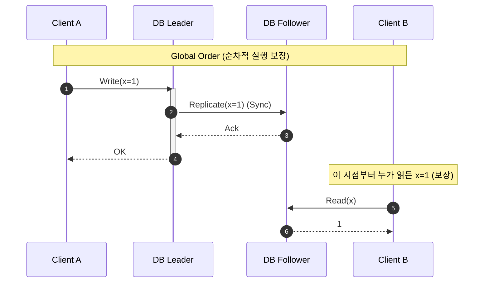
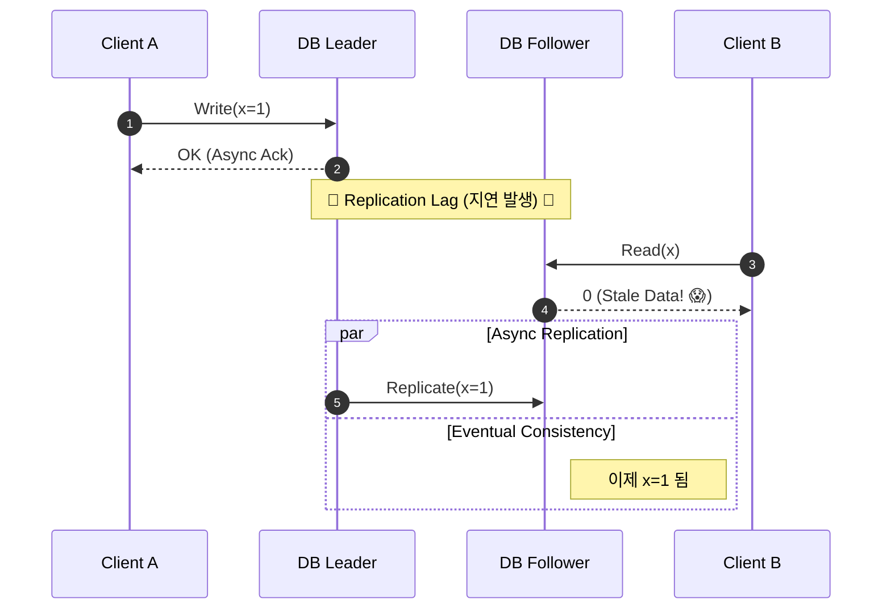
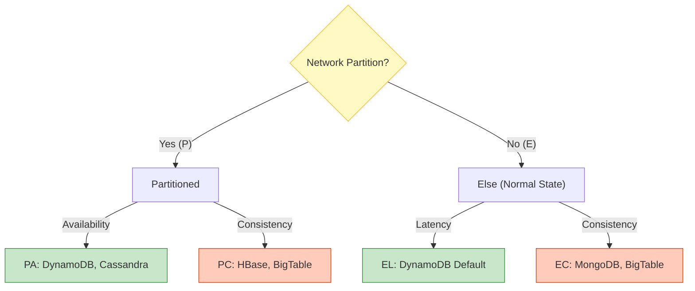

## 이 글에서 얻는 것

- **Linearizability**(강한 정합성)와 **Eventual Consistency**(결과적 정합성)의 차이를 이해합니다.
- 분산 시스템에서 정합성 모델을 선택하는 기준(**PACELC**)을 배웁니다.

---

## 🧐 1. Consistency Model이란?

개발자는 본능적으로 **"방금 쓴(Write) 건 당연히 바로 읽혀야지(Read)"**라고 생각합니다.
하지만 데이터베이스가 여러 대로 쪼개지는 순간(Replication), 이 "당연한 상식"은 유지하기 매우 비싼 비용이 됩니다.

Consistency Model은 **"데이터가 복제되는 동안, 클라이언트에게 어떤 값을 보여줄 것인가?"**에 대한 계약입니다.

---

## 💎 2. Linearizability (Strong Consistency)

가장 강력한 모델입니다. 시스템이 마치 **"단 하나의 데이터 복사본"**만 있는 것처럼 동작합니다.

### 타임라인 시각화

- **특징**: 언제나 최신 데이터를 보장합니다.
- **비용**: 모든 노드가 합의할 때까지 기다려야 하므로 **매우 느립니다 (Latency High)**.
- **사례**: 은행 계좌 잔고, 재고 시스템(Over-selling 방지).

---

## ⏳ 3. Eventual Consistency (결과적 정합성)

가장 현실적인 모델입니다. **"지금은 다를 수 있지만, 언젠가는(Eventually) 같아진다"**는 약속입니다.

### Stale Read (철 지난 데이터 읽기)

- **특징**: 쓰기 응답이 매우 빠릅니다. (복제를 기다리지 않음)
- **비용**: 사용자가 "방금 쓴 글이 안 보이는" 현상을 겪을 수 있습니다.
- **사례**: SNS 피드, 유튜브 조회수 ("조회수 0인데 좋아요 10개").

---

## ⚖️ 4. PACELC 이론: 선택의 문제

CAP 이론("3개 중 2개")은 너무 단순합니다. **PACELC**가 더 정확합니다.

> **P**artition(네트워크 단절) 상황이면 **A**와 **C** 중 선택하고,
> **E**lse(평소)에는 **L**atency(지연)와 **C**onsistency(정합성) 중 선택한다.

| 상황 | 선택 | 설명 |
| :--- | :--- | :--- |
| **장애 (P)** | **PA (Availability)** | 데이터가 틀리더라도 서비스가 죽는 것보다 낫다. (쇼핑몰 장바구니) |
| **장애 (P)** | **PC (Consistency)** | 데이터가 틀리느니 차라리 에러를 뱉겠다. (은행 이체) | 
| **평소 (E)** | **EL (Latency)** | 빠른 응답을 위해 복제 완료를 기다리지 않는다. (Eventual) |
| **평소 (E)** | **EC (Consistency)** | 느리더라도 정확성을 위해 모든 노드 응답을 기다린다. (Strong) |

## 📊 5. Consistency Hierarchy

강한 정합성일수록 느리고, 약한 정합성일수록 빠릅니다.

1.  **Linearizability** (Strongest): 실시간, 전역 순서 보장. (비용: 💰💰💰💰💰)
2.  **Sequential Consistency**: 모든 프로세스가 "동일한 순서"로 보지만, 실시간성은 보장 X.
3.  **Causal Consistency**: "인과 관계"가 있는 이벤트만 순서 보장. (댓글 -> 대댓글)
4.  **Eventual Consistency** (Weakest): 언젠간 같아짐. (비용: 💰)

## 요약

1. **Linearizability**: "지금 쓴 거 지금 보임". 느림. (은행)
2. **Eventual Consistency**: "언젠간 보임". 빠름. (SNS)
3. 무조건 Strong을 고집하면 시스템 성능이 바닥을 칩니다. 비즈니스 요건에 맞춰 타협하세요.
