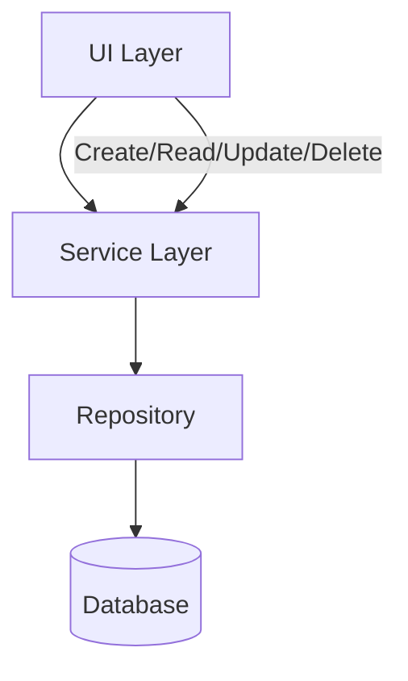
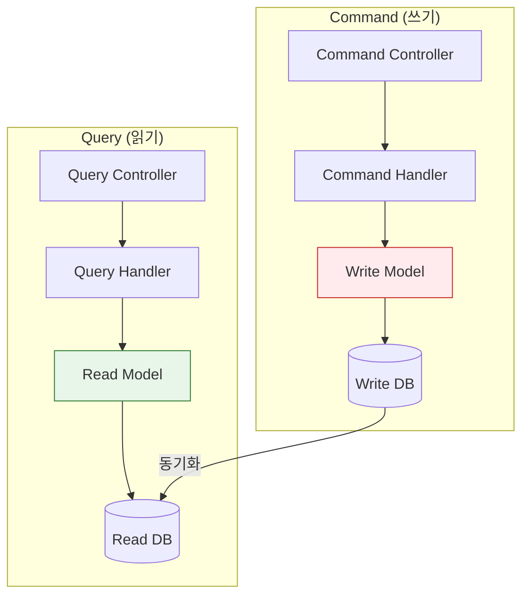
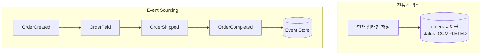
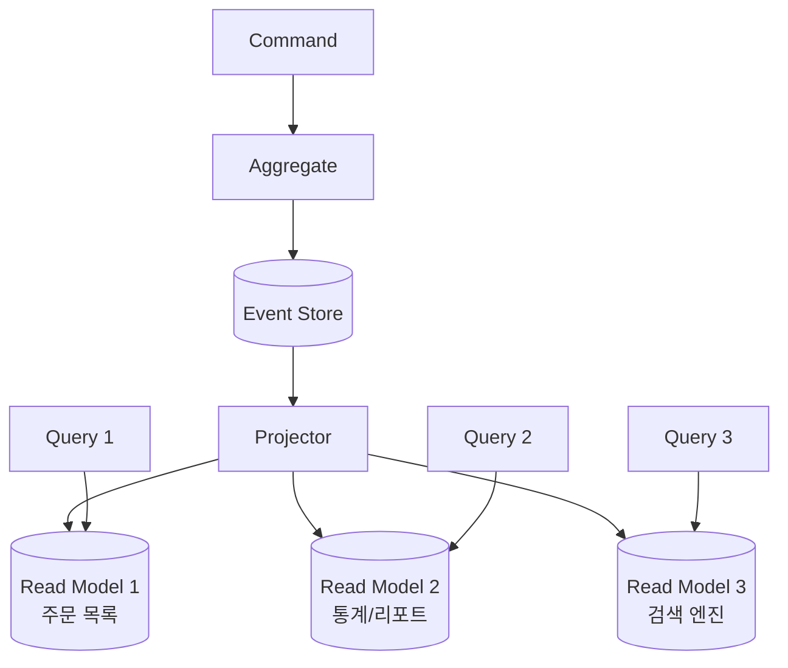
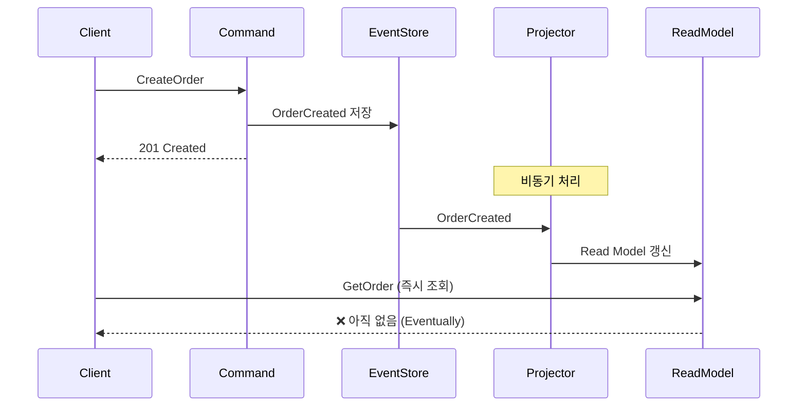

## 이 글에서 얻는 것

- **CQRS 패턴**의 개념과 적용 시점을 이해합니다
- **Command**와 **Query** 모델을 분리하는 방법을 알아봅니다
- **Event Sourcing**과의 조합을 이해합니다

---

## CQRS란?

### 전통적인 CRUD



**문제**:
- 읽기와 쓰기의 요구사항이 다름
- 조회 최적화 ↔ 데이터 정합성 충돌
- 복잡한 도메인에서 모델 비대화

### CQRS (Command Query Responsibility Segregation)



---

## 언제 CQRS를 적용하나?

### ✅ 적합한 경우

- 읽기/쓰기 비율이 극단적 (읽기 >> 쓰기)
- 복잡한 도메인 로직
- 조회 성능 요구사항이 높음
- 다양한 조회 뷰 필요

### ❌ 적합하지 않은 경우

- 단순 CRUD 애플리케이션
- 강한 일관성이 필수
- 팀이 복잡성을 감당할 준비가 안됨

---

## 구현: 단순 CQRS

### Command (쓰기)

```java
// Command 객체
@Getter @AllArgsConstructor
public class CreateOrderCommand {
    private String userId;
    private List<OrderItemDto> items;
    private String shippingAddress;
}

// Command Handler
@Service
public class OrderCommandHandler {
    
    @Autowired
    private OrderRepository orderRepository;
    @Autowired
    private ApplicationEventPublisher eventPublisher;
    
    @Transactional
    public String handle(CreateOrderCommand command) {
        // 도메인 로직 실행
        Order order = Order.create(
            command.getUserId(),
            command.getItems(),
            command.getShippingAddress()
        );
        
        orderRepository.save(order);
        
        // 이벤트 발행 (Read Model 동기화용)
        eventPublisher.publishEvent(new OrderCreatedEvent(order));
        
        return order.getId();
    }
}

// Controller
@RestController
@RequestMapping("/api/orders")
public class OrderCommandController {
    
    @Autowired
    private OrderCommandHandler commandHandler;
    
    @PostMapping
    public ResponseEntity<String> createOrder(@RequestBody CreateOrderCommand command) {
        String orderId = commandHandler.handle(command);
        return ResponseEntity.ok(orderId);
    }
}
```

### Query (읽기)

```java
// Query 객체
@Getter @AllArgsConstructor
public class GetOrdersByUserQuery {
    private String userId;
    private int page;
    private int size;
}

// Read Model (조회 최적화된 DTO)
@Entity
@Table(name = "order_read_model")
public class OrderReadModel {
    @Id
    private String orderId;
    private String userId;
    private String userName;  // 역정규화
    private BigDecimal totalAmount;
    private String status;
    private int itemCount;
    private LocalDateTime createdAt;
}

// Query Handler
@Service
public class OrderQueryHandler {
    
    @Autowired
    private OrderReadModelRepository readModelRepository;
    
    @Transactional(readOnly = true)
    public Page<OrderReadModel> handle(GetOrdersByUserQuery query) {
        return readModelRepository.findByUserId(
            query.getUserId(),
            PageRequest.of(query.getPage(), query.getSize())
        );
    }
}

// Controller
@RestController
@RequestMapping("/api/orders")
public class OrderQueryController {
    
    @Autowired
    private OrderQueryHandler queryHandler;
    
    @GetMapping
    public Page<OrderReadModel> getOrders(
            @RequestParam String userId,
            @RequestParam(defaultValue = "0") int page,
            @RequestParam(defaultValue = "20") int size) {
        
        return queryHandler.handle(new GetOrdersByUserQuery(userId, page, size));
    }
}
```

### Read Model 동기화

```java
@Component
public class OrderReadModelProjector {
    
    @Autowired
    private OrderReadModelRepository readModelRepository;
    @Autowired
    private UserService userService;
    
    @TransactionalEventListener(phase = TransactionPhase.AFTER_COMMIT)
    public void on(OrderCreatedEvent event) {
        Order order = event.getOrder();
        User user = userService.findById(order.getUserId());
        
        OrderReadModel readModel = new OrderReadModel(
            order.getId(),
            order.getUserId(),
            user.getName(),  // 역정규화
            order.getTotalAmount(),
            order.getStatus().name(),
            order.getItems().size(),
            order.getCreatedAt()
        );
        
        readModelRepository.save(readModel);
    }
    
    @TransactionalEventListener(phase = TransactionPhase.AFTER_COMMIT)
    public void on(OrderStatusChangedEvent event) {
        readModelRepository.updateStatus(event.getOrderId(), event.getNewStatus());
    }
}
```

---

## Event Sourcing과 CQRS

### Event Sourcing이란?



**상태 = 이벤트의 누적**

### Event Store 구현

```java
@Entity
@Table(name = "event_store")
public class StoredEvent {
    @Id
    private String eventId;
    private String aggregateId;
    private String aggregateType;
    private String eventType;
    private String payload;  // JSON
    private int version;
    private LocalDateTime occurredAt;
}

@Repository
public interface EventStoreRepository extends JpaRepository<StoredEvent, String> {
    List<StoredEvent> findByAggregateIdOrderByVersionAsc(String aggregateId);
}
```

### Aggregate 재구성

```java
public class Order {
    private String id;
    private String userId;
    private OrderStatus status;
    private List<DomainEvent> uncommittedEvents = new ArrayList<>();
    
    // Event로부터 상태 재구성
    public static Order fromEvents(List<DomainEvent> events) {
        Order order = new Order();
        for (DomainEvent event : events) {
            order.apply(event);
        }
        return order;
    }
    
    private void apply(DomainEvent event) {
        if (event instanceof OrderCreatedEvent e) {
            this.id = e.getOrderId();
            this.userId = e.getUserId();
            this.status = OrderStatus.CREATED;
        } else if (event instanceof OrderPaidEvent e) {
            this.status = OrderStatus.PAID;
        }
        // ... 다른 이벤트 핸들링
    }
    
    // 명령 처리
    public void pay(PaymentInfo paymentInfo) {
        if (this.status != OrderStatus.CREATED) {
            throw new IllegalStateException("Cannot pay");
        }
        
        OrderPaidEvent event = new OrderPaidEvent(this.id, paymentInfo);
        apply(event);
        uncommittedEvents.add(event);
    }
}
```

### CQRS + Event Sourcing 아키텍처



---

## 데이터 일관성

### Eventual Consistency



### 해결 전략

```java
// 1. 생성 후 ID 반환 → 클라이언트가 폴링
@PostMapping
public ResponseEntity<?> createOrder(@RequestBody CreateOrderCommand command) {
    String orderId = commandHandler.handle(command);
    return ResponseEntity.created(URI.create("/orders/" + orderId))
        .body(Map.of("orderId", orderId));
}

// 2. Read-your-writes 보장
@GetMapping("/{orderId}")
public OrderReadModel getOrder(@PathVariable String orderId) {
    // 먼저 Read Model 조회
    Optional<OrderReadModel> readModel = readModelRepository.findById(orderId);
    if (readModel.isPresent()) {
        return readModel.get();
    }
    
    // 없으면 Write Model에서 직접 조회 (폴백)
    Order order = orderRepository.findById(orderId).orElseThrow();
    return toReadModel(order);
}
```

---

## 요약

### CQRS 도입 체크리스트

| 고려사항 | 질문 |
|---------|------|
| 복잡도 | 팀이 감당할 수 있는가? |
| 읽기/쓰기 비율 | 읽기가 압도적으로 많은가? |
| 조회 요구사항 | 다양한 뷰가 필요한가? |
| 일관성 | Eventual Consistency 허용? |

### 적용 수준

| 수준 | 설명 |
|------|------|
| Level 1 | 코드 분리 (같은 DB) |
| Level 2 | Read Model 분리 |
| Level 3 | + Event Sourcing |

---

## 🔗 Related Deep Dive

- **[DDD 전술 설계](/learning/deep-dive/deep-dive-ddd-tactical/)**: Aggregate, Entity, Value Object.
- **[분산 트랜잭션](/learning/deep-dive/deep-dive-distributed-transactions/)**: SAGA 패턴.
