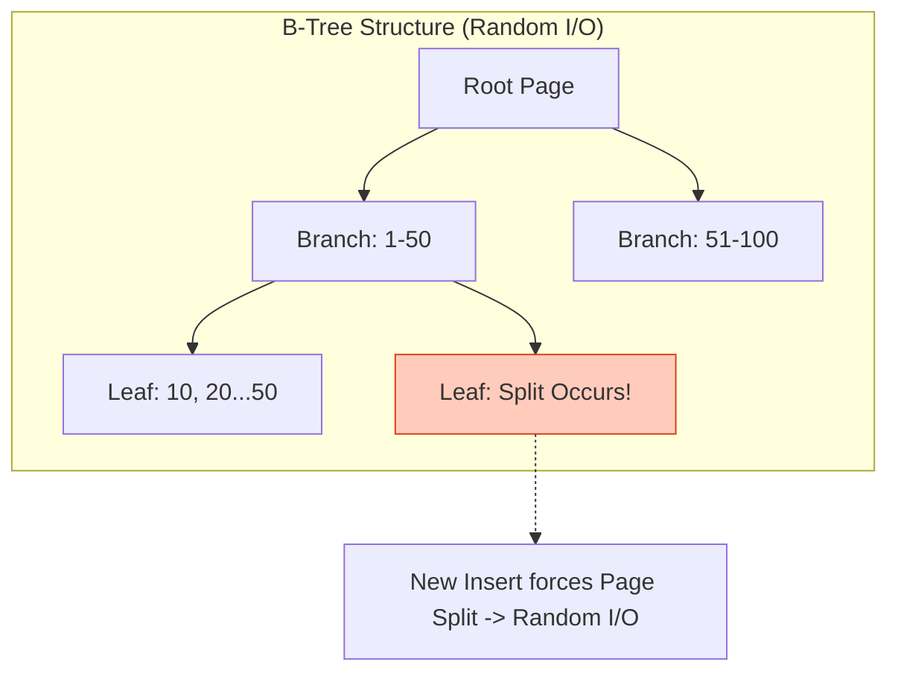
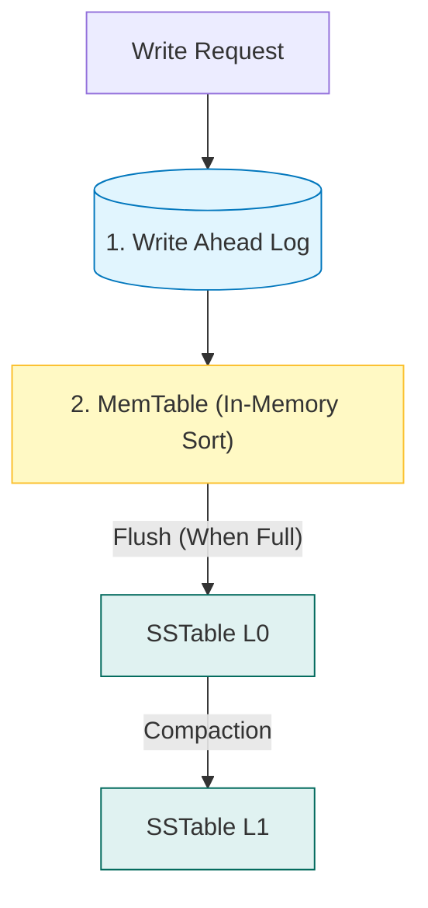
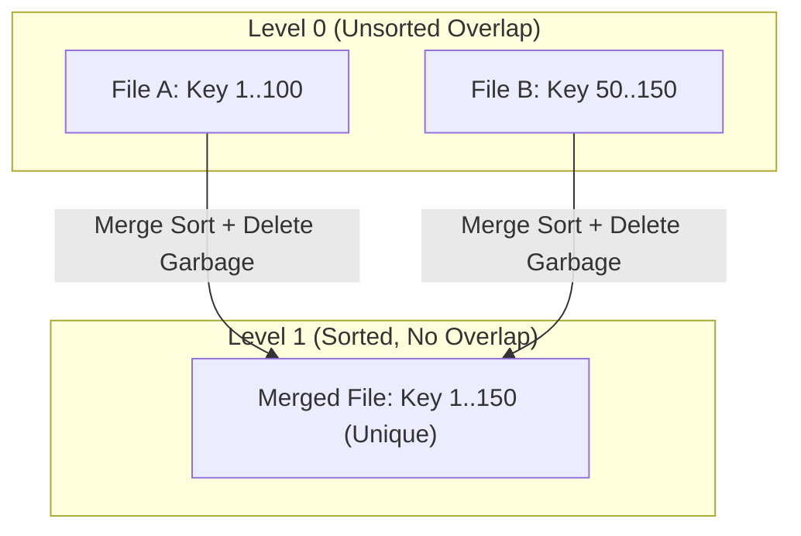

## 💾 1. DB는 어떻게 디스크에 쓸까?

데이터베이스는 마법 상자가 아닙니다. 결국엔 `write()` 시스템 콜을 호출해 하드디스크에 파일을 쓰는 프로그램일 뿐입니다.
하지만 **"어떤 구조로 쓰느냐"**에 따라 성능이 100배 차이 납니다.

두 가지 메이저 진영이 있습니다:
1. **B-Tree**: "읽기 최적화" (MySQL, Oracle)
2. **LSM-Tree**: "쓰기 최적화" (Cassandra, RocksDB)

---

## 🌳 2. B-Tree (Update-in-Place)

데이터를 항상 **정렬된 상태**로 유지합니다.

- **Read**: `O(log N)`으로 기막히게 빠릅니다. 이진 탐색과 비슷합니다.
- **Write**: 새로운 데이터를 넣으려면?
    1. 적절한 위치(Page)를 찾는다.
    2. 빈 공간이 없으면 페이지를 쪼갠다 (Split).
    3. 디스크의 난수 위치에 쓴다 (**Random I/O**).

> **단점**: 쓰기 요청이 폭주하면 디스크 헤드가 널뛰기를 하느라 느려집니다.

---

## 📝 3. LSM-Tree (Log Structured Merge)

LSM은 **"무조건 순차적으로 쓴다(Append Only)"**는 철학을 가집니다.

### 동작 원리

### 3.1 LSM Write Path 상세 (Sequential Write)
1. **WAL (Write Ahead Log)**: 데이터 유실 방지를 위해 로그 파일에 이어쓰기(Append) 합니다. (Sequential I/O -> 매우 빠름)
2. **MemTable**: 메모리 상에서 데이터를 정렬합니다. (Red-Black Tree, Skip List 등)
3. **Internal Flush**: MemTable이 꽉 차면 불변(Immutable) 상태로 전환되고, 백그라운드 스레드가 디스크(SSTable)로 덤프합니다.

### 3.2 Compaction (Merge Sort)
쌓여있는 SSTable 파일들을 병합(Merge)하여 데이터를 정리합니다.

1. **MemTable**: 일단 메모리에 씁니다. (엄청 빠름)
2. **Flush**: 메모리가 차면 디스크에 통째로 씁니다. **순차 쓰기(Sequential Write)**이므로 디스크 속도의 한계까지 씁니다.
3. **SSTable**: 디스크에 저장된 파일은 **불변(Immutable)**입니다. 수정하지 않습니다.
4. **Compaction**: 파일이 너무 많아지면, 백그라운드에서 합치면서 삭제된 데이터를 정리합니다.

### 트레이드오프
- **Write**: B-Tree보다 압도적으로 빠릅니다. (로그 쌓듯이 쓰니까)
- **Read**: 여러 파일을 뒤져야 할 수 있어서 느릴 수 있습니다. (Bloom Filter로 보완)

## 요약

| DB 종류 | 엔진 | 쓰기 패턴 | 강점 | 약점 |
| :--- | :--- | :--- | :--- | :--- |
| **MySQL (InnoDB)** | **B-Tree** | Random I/O (Update-in-Place) | **Read** (Index Search 빠름) | **Write** (Page Split 오버헤드) |
| **Cassandra / RocksDB** | **LSM-Tree** | Sequential I/O (Log-Structured) | **Write** (Append Only) | **Read** (여러 파일 스캔 필요) |

**결론**: 쓰기가 미친듯이 많은 시스템(채팅, 로그)을 만든다면 MySQL을 고집하지 말고 LSM 기반 DB를 검토하세요.
