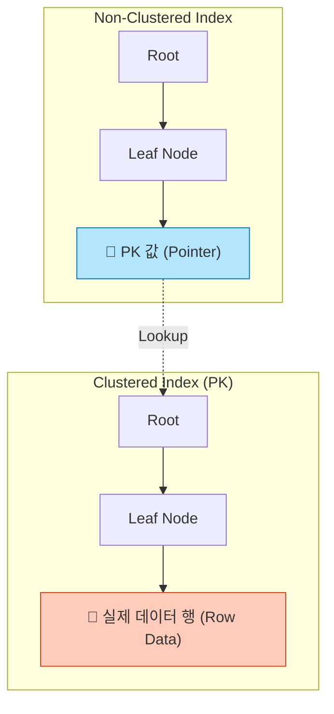
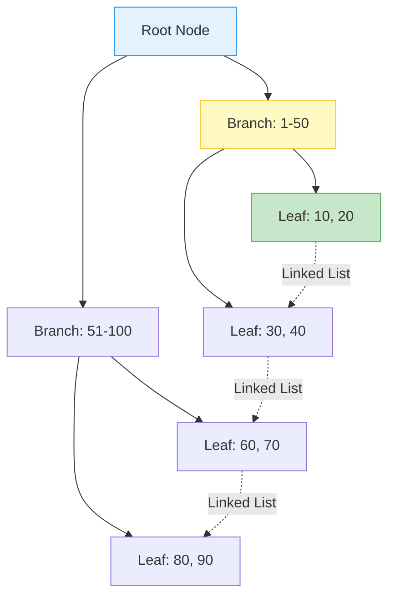
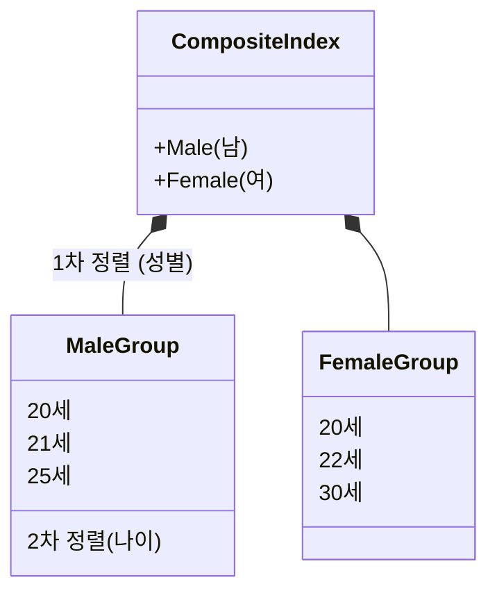
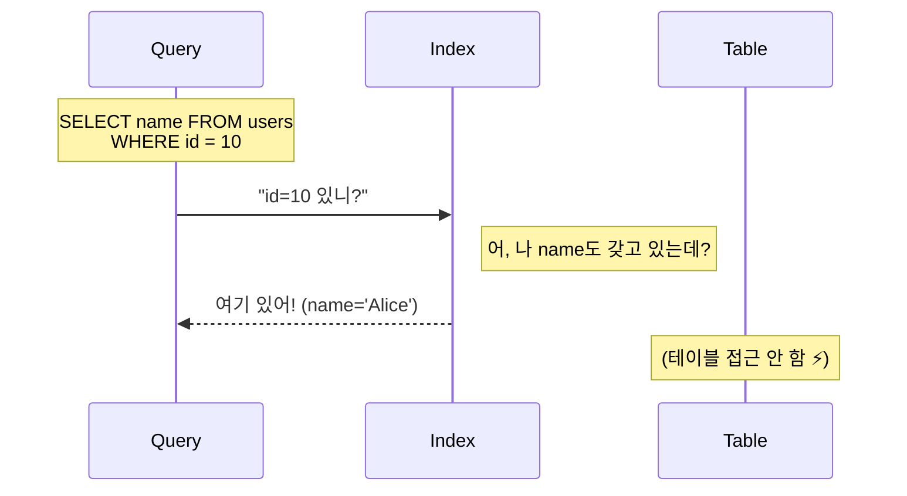

## 🏎️ 1. 인덱스는 '책의 목차'가 아니다

많은 입문서가 인덱스를 책의 목차에 비유하지만, 엔지니어라면 좀 더 정확한 비유가 필요합니다.
인덱스는 **"정렬된 상태를 유지하는 별도의 자료구조"**입니다.

- **Full/Table Scan**: 사전의 첫 페이지부터 끝 페이지까지 단어 하나하나 찾는 것. `O(N)`
- **Index Scan**: 사전의 'ㄱ', 'ㄴ', 'ㄷ' 탭을 이용해 범위를 좁히고 이진 탐색하는 것. `O(log N)`

하지만 공짜 점심은 없습니다. **정렬된 상태**를 유지해야 하므로, **쓰기(Insert/Update/Delete) 성능을 희생**하여 읽기 속도를 얻는 것입니다.

---

## 🏗️ 2. Clustered vs Non-Clustered Index

가장 중요한 개념이자 가장 많이 헷갈리는 개념입니다.



1.  **Clustered Index (PK)**: 책의 **페이지 번호**입니다. 리프 노드에 **실제 데이터(Row)**가 저장됩니다. 테이블당 **하나만** 존재할 수 있습니다.
2.  **Non-Clustered Index**: 책의 **색인(목차)**입니다. 리프 노드에는 **PK 값(주소)**만 있습니다. 이걸 보고 다시 Clustered Index를 뒤져야 실제 데이터를 얻을 수 있습니다 (이 과정을 **Random Access**라고 하며 비쌉니다).

---

## 🌳 2. B-Tree (Balanced Tree) 구조

대부분의 RDBMS(MySQL, Oracle)가 사용하는 기본 인덱스 구조입니다.
핵심은 **트리 높이(Height)를 일정하게 유지**하여, 어떤 데이터를 찾든 균일한 속도(Log N)를 보장하는 것입니다.



### B-Tree vs Hash Index 비교

| 특징 | B-Tree Index | Hash Index |
| :--- | :--- | :--- |
| **구조** | 트리 (Balanced Tree) | 해시 테이블 (Key-Value) |
| **시간 복잡도** | `O(log N)` | `O(1)` (단건 조회 시) |
| **범위 검색** | **가능** (`BETWEEN`, `>`, `<`) | **불가능** (Equality `=` 만 가능) |
| **사용처** | 대부분의 범용 인덱스 | 인메모리 DB, 정확한 일치 검색 |

### 왜 B-Tree일까?
1. **균형(Balanced)**: 데이터가 편향되지 않아 최악의 경우에도 빠릅니다.
2. **범위 검색(Range Scan)**: 리프 노드끼리 **Linked List**로 연결되어 있습니다. "20살부터 30살까지" 찾을 때, 20살만 찾으면 그 뒤는 쭉 읽으면(Scan) 됩니다.

---

## 🧬 3. 복합 인덱스 (Composite Index)

여러 컬럼을 묶어서 인덱스를 만들 때 가장 중요한 규칙은 **순서**입니다.

### 복합 인덱스: (성별, 나이) 순서라면?


```
(남, 20), (남, 21), (남, 25) ... (여, 20), (여, 22) ...
```
-> **성별**끼리 먼저 뭉치고, 그 안에서 **나이**순으로 정렬됩니다.

```sql
-- ✅ 인덱스 잘 탐 (성별로 먼저 거르고 나이 찾음)
SELECT * FROM users WHERE gender = '남' AND age = 20;

-- ❌ 인덱스 못 탐 (성별 없이 나이만? 정렬 안 되어 있음)
SELECT * FROM users WHERE age = 20;
```

> **Leftmost Prefix Rule**: 인덱스의 왼쪽 컬럼부터 차례대로 사용해야 인덱스가 적용됩니다. 중간을 건너뛰면 그 뒤 컬럼은 인덱스 효과가 사라집니다.

---

## 🛡️ 4. 커버링 인덱스 (Covering Index)

쿼리에 필요한 모든 컬럼이 인덱스 안에 다 있다면? 실제 데이터 파일(Table Heap)을 열어볼 필요가 없습니다.



이것을 **커버링 인덱스**라고 하며, 쿼리 튜닝의 **치트키**입니다. 불필요한 `SELECT *`만 피해도 성능이 비약적으로 좋아지는 이유입니다.

## 요약

> [!TIP]
> **Index Design Checklist**:
> - [ ] **Cardinality**: 중복도가 낮은(유니크한) 컬럼에 걸어라. (ex. 성별(X) vs 주민번호(O))
> - [ ] **Update**: 쓰기가 너무 빈번한 테이블은 인덱스를 최소화해라.
> - [ ] **Covering**: 쿼리에 필요한 컬럼을 인덱스에 다 포함시켜 테이블 접근을 막아라.
> - [ ] **Composite**: `WHERE`, `ORDER BY`, `GROUP BY` 컬럼 순서대로 인덱스를 구성해라.

1. **Trade-off**: 인덱스는 **쓰기를 죽이고 읽기를 살리는** 기술이다.
2. **B-Tree**: **정렬**되어 있고 **균형** 잡혀 있다.
3. **복합 인덱스**: **순서**가 생명이다. (Leftmost Prefix).
4. **커버링 인덱스**: 테이블 접근을 생략하는 쿼리 튜닝의 핵심.
