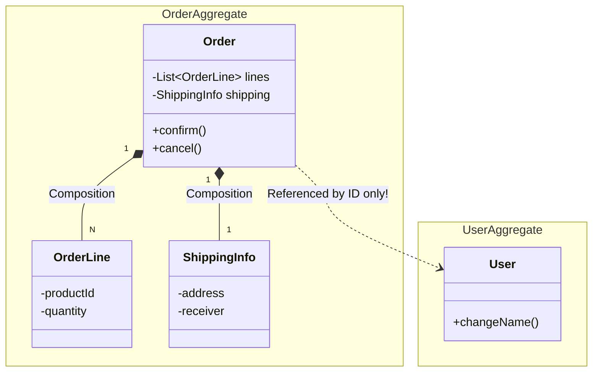
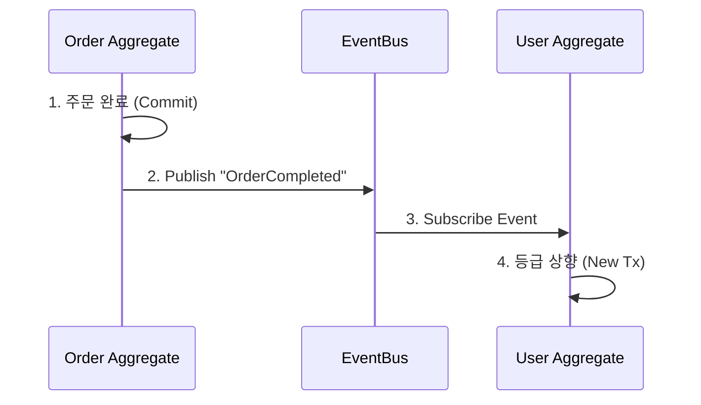

## 🧱 1. Aggregate: 객체들의 운명 공동체

데이터베이스 테이블을 설계할 때 가장 많이 하는 실수가 "모든 테이블을 FK로 엮어버리는 것"입니다.
그러면 **어디까지 조회해야 하고, 어디까지 저장해야 하는지** 경계가 사라집니다.

**Aggregate**는 **"함께 생성되고, 함께 변경되고, 함께 죽는 객체들의 묶음"**입니다.

### 경계의 시각화



- `Order`, `OrderLine`, `ShippingInfo`는 한 묶음입니다.
- **주문(Order)**이 이 구역의 대장(**Aggregate Root**)입니다.
- 외부에서는 `OrderLine`에 직접 접근하면 안 됩니다. 오직 `Order`를 통해서만 명령을 내려야 합니다.

---

## 📏 2. 트랜잭션의 원칙: One Transaction, One Aggregate

가장 중요한 규칙입니다. **"하나의 트랜잭션에서는 하나의 Aggregate만 수정해야 합니다."**

### ❌ 나쁜 설계: 거대 트랜잭션
```java
@Transactional
public void orderAndChangeAddress(OrderId id, String newAddr) {
    Order order = orderRepo.findById(id);
    User user = userRepo.findById(order.getUserId());
    
    order.shipTo(newAddr); // Order 수정
    user.changeAddress(newAddr); // User 수정 (???)
}
```
- 이러면 `Order` 테이블과 `User` 테이블에 동시에 락(Lock)이 걸립니다.
- 트래픽이 늘어나면 DB가 터지는 지름길입니다.

### ✅ 좋은 설계: 결과적 일관성 (Eventual Consistency)
"주문이 완료되면, 사용자 등급을 올려준다"는 요구사항이 있다면?



1. **Order 트랜잭션**: 주문 상태 변경 -> `OrderCompleted` 이벤트 발행 -> 커밋.
2. **비동기 처리**: 이벤트를 받아서 별도의 트랜잭션으로 User를 수정.

> **핵심**: 두 변경 사이에 수 밀리초의 지연이 있지만, 시스템은 훨씬 유연하고 빨라집니다.

## 요약

1. **Aggregate Root**: 문지기. 외부에서는 오직 Root하고만 대화해라.
2. **참조**: 다른 Aggregate는 객체가 아니라 **ID**로 참조해라. (Lazy Loading 지옥 탈출)
3. **이벤트**: 다른 Aggregate를 바꿔야 하면 **도메인 이벤트**를 던져라.
