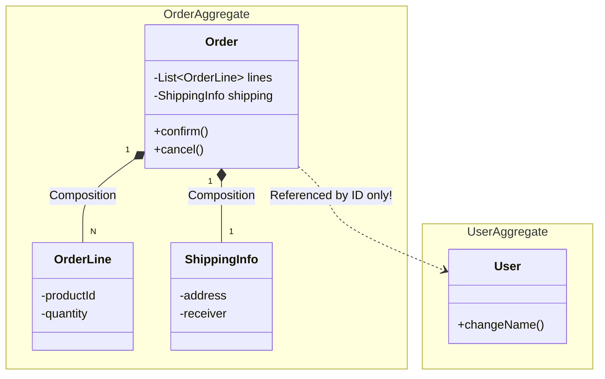
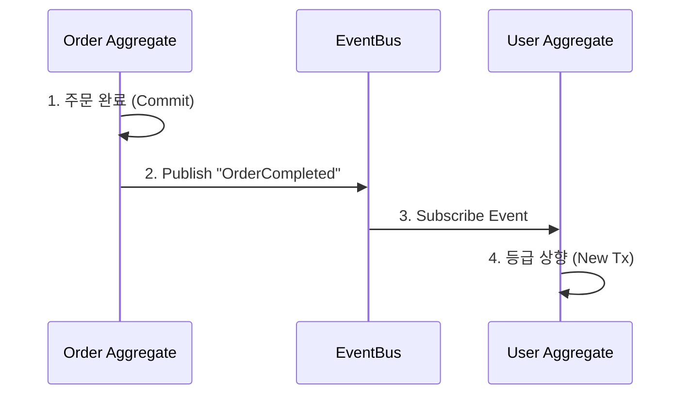

## 🧱 1. Aggregate는 객체 묶음이 아니라 일관성 계약이다

테이블이 비슷하게 생겼다고 한 Aggregate에 넣고, 화면에서 같이 보인다고 같은 트랜잭션에 묶기 시작하면 금방 문제가 생깁니다. Aggregate는 화면 단위도 아니고 ERD 단위도 아닙니다. **강한 일관성을 즉시 보장해야 하는 최소 비즈니스 경계**입니다.

예를 들어 `Order`와 `OrderLine`은 주문 총액, 수량, 배송 가능 여부 같은 규칙을 함께 맞춰야 하므로 한 Aggregate로 묶기 좋습니다. 반면 `User`의 등급, 마케팅 수신 동의, 포인트 적립은 주문과 관련이 있더라도 같은 순간에 꼭 한 트랜잭션으로 묶어야 하는지는 다시 따져봐야 합니다.

### 경계의 시각화


```mermaid
classDiagram
    namespace OrderAggregate {
        class Order {
            +confirm()
            +cancel()
            -List~OrderLine~ lines
            -ShippingInfo shipping
        }
        class OrderLine {
            -productId
            -quantity
        }
        class ShippingInfo {
            -address
            -receiver
        }
    }

    namespace UserAggregate {
        class User {
            +changeName()
        }
    }

    Order "1" *-- "N" OrderLine : Composition
    Order "1" *-- "1" ShippingInfo : Composition
    Order ..> User : Referenced by ID only!
```

- `Order`, `OrderLine`, `ShippingInfo`는 같은 변경 경계에 있습니다.
- `User`는 주문과 연관되지만 다른 Aggregate로 분리됩니다.
- 외부는 `OrderLine`을 직접 수정하지 않고 오직 `Order`를 통해서만 명령을 보냅니다.

## 📏 2. One Transaction, One Aggregate가 중요한 이유

실무에서 가장 자주 보이는 안티패턴은 "편하니까 한 메서드에서 다 바꾸자"입니다. 처음엔 깔끔해 보여도 트래픽이 올라가면 DB 락과 경합, 예외 처리 복잡도가 한 번에 터집니다.

### ❌ 나쁜 설계: 거대 트랜잭션

```java
@Transactional
public void orderAndChangeAddress(OrderId id, String newAddr) {
    Order order = orderRepo.findById(id);
    User user = userRepo.findById(order.getUserId());

    order.shipTo(newAddr); // Order 수정
    user.changeAddress(newAddr); // User 수정
}
```

겉으로는 두 줄뿐이지만 실제로는 다음 문제가 숨어 있습니다.

- `Order`와 `User`가 동시에 잠긴다.
- 재시도 시 어느 시점까지 반영됐는지 판단이 어려워진다.
- 규칙이 커질수록 서비스 메서드가 비대해진다.
- 다른 기능도 같은 Aggregate 조합을 따라 하며 결합도가 퍼진다.

특히 주문, 결제, 정산, 멤버십처럼 핵심 도메인이 얽히면 이 결합은 장애 범위를 크게 키웁니다.

## 3. 그럼 다른 Aggregate는 어떻게 반영할까

정답은 대부분 **도메인 이벤트 + 결과적 일관성**입니다. 즉, 지금 트랜잭션에서는 현재 Aggregate만 확실히 완료하고, 다른 Aggregate로 퍼지는 변화는 별도 흐름으로 넘깁니다.


```mermaid
sequenceDiagram
    participant OrderSvc as Order Aggregate
    participant EventBus
    participant UserSvc as User Aggregate

    OrderSvc->>OrderSvc: 1. 주문 완료 (Commit)
    OrderSvc->>EventBus: 2. Publish "OrderCompleted"

    EventBus->>UserSvc: 3. Subscribe Event
    UserSvc->>UserSvc: 4. 등급 상향 (New Tx)
```

예를 들어 "주문 완료 시 사용자 등급 반영"은 보통 몇 밀리초, 몇 초 늦어도 됩니다. 그런 규칙을 굳이 주문 완료 트랜잭션 안에 묶을 이유가 없습니다.

이 방식의 장점은 분명합니다.

- 주문 완료의 응답 시간이 안정적입니다.
- 실패 지점이 분리되어 재처리 전략을 따로 가져갈 수 있습니다.
- 주문과 회원 도메인이 서로를 덜 오염시킵니다.

물론 대가도 있습니다. 중복 이벤트, 순서 역전, 소비 지연 같은 문제가 생길 수 있으니 [Outbox와 Saga 패턴](/learning/deep-dive/deep-dive-outbox-saga-patterns/) 같은 운영 패턴까지 같이 봐야 합니다.

## 4) Aggregate를 크게 잡을지, 작게 잡을지 판단하는 법

이 질문에는 정답보다 판단 기준이 중요합니다. 저는 보통 아래 세 질문으로 봅니다.

1. **이 규칙은 같은 순간에 반드시 맞아야 하는가?**
2. **동시에 변경될 때 락 경합이 커질 가능성이 큰가?**
3. **실패했을 때 재처리 가능한가, 아니면 즉시 원자성이 필요한가?**

예를 들어 `Order`의 총액과 주문 라인은 같은 순간에 맞아야 하니 한 Aggregate가 자연스럽습니다. 반면 `Order`와 `InventoryReservation`은 시스템에 따라 분리할 수 있습니다. 재고 홀드가 외부 시스템이거나 고부하 구간이라면 별도 Aggregate 또는 별도 서비스로 분리하고 보상 전략을 설계하는 편이 낫습니다.

## 5) 참조는 ID로, 규칙은 Root로

다른 Aggregate를 객체로 직접 물고 가면 경계가 흐려집니다. JPA에서는 특히 연관관계가 자동 탐색을 부추겨서 "조금만 더" 하다가 Aggregate 경계가 무너집니다.

그래서 외부 Aggregate는 보통 **ID만 참조**하는 편이 낫습니다.

- `Order`는 `User` 객체 대신 `userId`를 가진다.
- 필요하면 애플리케이션 서비스가 조회를 조합한다.
- Root 바깥에서 내부 컬렉션을 직접 조작하지 않는다.

이 원칙은 성능보다도 **모델의 의도**를 살려 줍니다. "이 객체는 저 Aggregate를 소유하지 않는다"는 사실이 코드에 드러나기 때문입니다.

## 6) 실무 적용 체크리스트

Aggregate 설계를 리뷰할 때는 개념 설명보다 아래 항목이 훨씬 도움이 됩니다.

- 한 서비스 메서드에서 서로 다른 Aggregate Repository를 여러 개 저장하고 있지 않은가?
- Root가 아닌 내부 Entity를 직접 수정하는 public API가 열려 있지 않은가?
- 도메인 이벤트 발행 후 중복 처리 방지가 있는가?
- 후행 작업 실패를 재시도할 큐, 로그, 메트릭이 있는가?
- 조회 편의 때문에 강한 일관성까지 불필요하게 요구하고 있지 않은가?

이 체크리스트로 보면 Aggregate 문제는 철학이 아니라 운영 문제라는 걸 금방 체감하게 됩니다.

## 요약

1. **Aggregate Root**는 외부 명령이 들어오는 유일한 문지기입니다.
2. **하나의 트랜잭션에서는 하나의 Aggregate만 수정**하는 쪽이 대체로 안전합니다.
3. 다른 Aggregate로 퍼지는 변경은 **도메인 이벤트와 결과적 일관성**으로 분리하세요.
4. 참조는 객체보다 **ID**로 두어 경계를 분명하게 유지하세요.

## 다음 단계

- [DDD 전술적 설계: Entity, VO, 그리고 Aggregate](/learning/deep-dive/deep-dive-ddd-tactical/)
- [육각형 아키텍처 (Hexagonal)](/learning/deep-dive/deep-dive-hexagonal-architecture/)
- [Outbox와 Saga 패턴](/learning/deep-dive/deep-dive-outbox-saga-patterns/)
