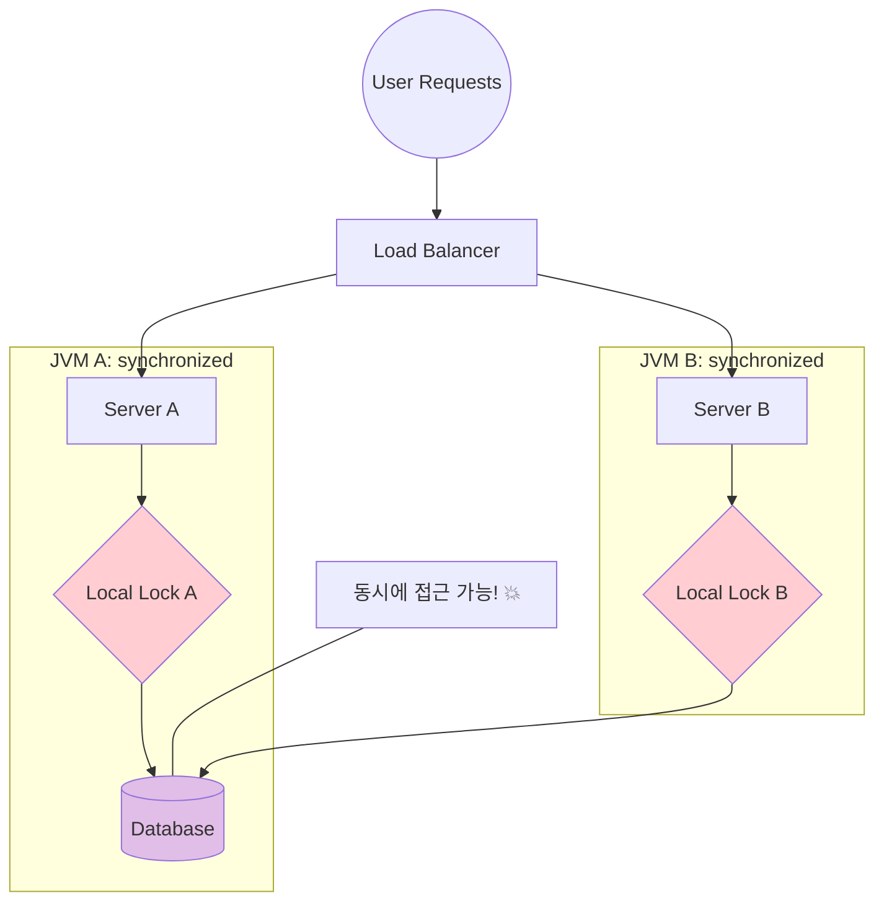
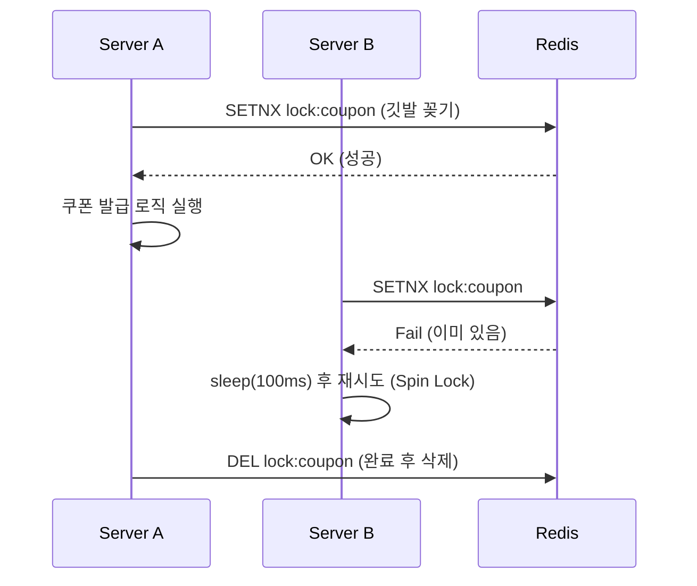
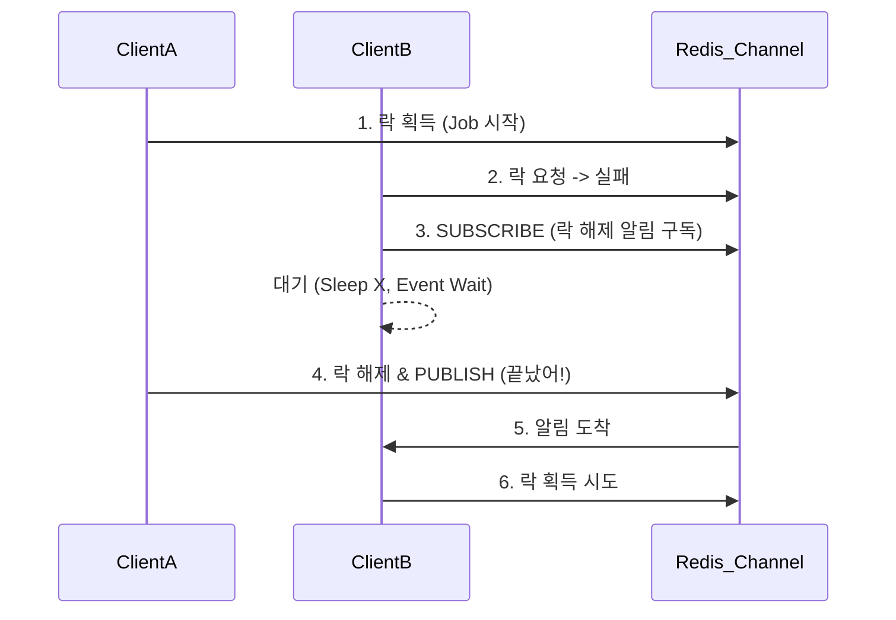

## 🔐 1. 왜 `synchronized`로 안 되나요?

Java의 `synchronized`는 **하나의 프로세스(JVM)** 안에서만 유효합니다.
서버가 2대 이상일 때, 서로 다른 JVM은 서로의 락을 볼 수 없습니다.



결과적으로 DB 업데이트가 덮어씌워지는 **Race Condition**이 발생합니다.

---

## 🧩 2. Redis로 락 구현하기 (Spin Lock)

모든 서버가 공유하는 **Redis**를 이용해 "나 지금 작업 중이야"라고 깃발을 꽂습니다.



### 문제점
1. **Spin Lock**: 락을 얻을 때까지 계속 Redis에 물어봐야 해서(Polling) 부하가 심합니다.
2. **Timeout**: 락을 잡은 서버가 죽으면? 영원히 락이 안 풀립니다(Deadlock). -> **TTL** 필수!

---

## 🚀 3. Redisson: 우아한 해결책

Redisson은 **Pub/Sub** 방식을 써서 Spin Lock의 무한 루프 부하를 해결했습니다.



"락 풀리면 알려줘!"라고 구독하고 대기하는 방식입니다.

```java
RLock lock = redissonClient.getLock("coupon:1234");

try {
    // waitTime: 락 대기 시간 (5초)
    // leaseTime: 락 점유 시간 (10초 지나면 강제 해제)
    boolean available = lock.tryLock(5, 10, TimeUnit.SECONDS);
    
    if (!available) {
        throw new RuntimeException("락 획득 실패");
    }
    
    // 비즈니스 로직
    issueCoupon();
    
} finally {
    lock.unlock(); // 꼭 해제!
}
```

### 동시성 제어 3단계 전략 비교

| 전략 | 메커니즘 | 장점 | 단점 | 추천 상황 |
| :--- | :--- | :--- | :--- | :--- |
| **Optimistic Lock** | Application (`@Version`) | DB 락을 안 걺 (빠름) | 충돌 많으면 재시도 비용 급증 | 충돌이 드문 경우 |
| **Pessimistic Lock** | DB (`SELECT FOR UPDATE`) | 데이터 무결성 확실 | 데드락 위험, 성능 저하 | 충돌이 잦고 데이터가 중요할 때 |
| **Distributed Lock** | Redis / Zookeeper | DB 부하 분산, 여러 자원 제어 | 구현 복잡도 증가, Redis 의존성 | 분산 환경, 외부 API 제어 |

> [!TIP]
> **선택 기준**:
> - **재고 차감**: Pessimistic Lock (가장 안전)
> - **조회수 증가**: Optimistic Lock (충돌나도 재시도하거나 무시)
> - **선착순 쿠폰**: Distributed Lock (Redis 성능 활용)

## 요약

1. **분산 환경**: 서버가 다르면 `synchronized` 못 쓴다.
2. **Redis**: 빠르고 간편해서 분산 락 저장소로 딱이다.
3. **Redisson**: 직접 `SETNX` 짜지 말고 라이브러리 써라. (Pub/Sub, 타임아웃 자동 연장 등 기능 강력)
