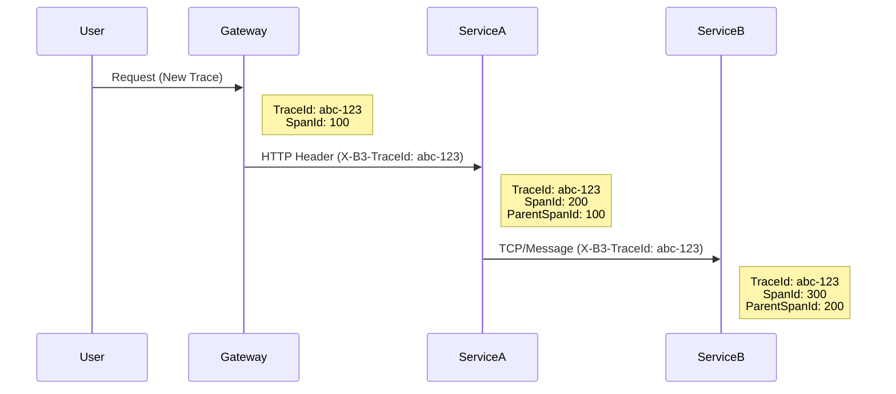
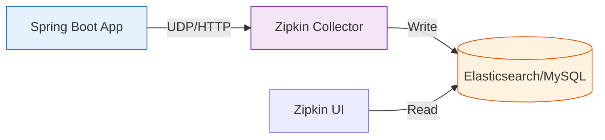

## 이 글에서 얻는 것

- **분산 추적**의 필요성을 이해합니다.
- **Zipkin/Jaeger**로 Trace를 수집합니다.
- **Span**을 분석하여 병목을 찾습니다.
- **Spring Cloud Sleuth**로 통합합니다.

## 1) 분산 추적이란?

### 1.1 Trace Context Propagation

하나의 요청이 여러 서비스를 거칠 때, **Trace ID**가 어떻게 유지될까요? 비밀은 **HTTP Header**에 있습니다.



- **TraceId**: 전체 요청을 식별하는 고유 ID (변하지 않음).
- **SpanId**: 각 구간(서비스/함수)을 식별하는 ID (매번 바뀜).
- **ParentSpanId**: 호출한 상위 Span의 ID (계층 구조 형성).


## 2) Zipkin 설정

## 2. Zipkin Architecture Strategy



### 2.1 Span Timeline Visualization

병목 구간을 찾으려면 **Gantt Chart** 형태의 시각화가 필수적입니다.

```mermaid
gantt
    title Trace ID: abc-123 Timeline
    dateFormat X
    axisFormat %s

    section Gateway
    Gateway (100ms) :done, g1, 0, 100
    
    section Service A
    Service A (200ms) :active, a1, 50, 250
    
    section Service B
    Service B (150ms) :b1, 100, 250
    
    section DB
    Query Users (50ms) :crit, db1, 150, 200
```



위 차트를 보면, `Gateway` -> `Service A` -> `Service B` -> `DB` 순서로 호출되지만, **Service A가 Service B의 응답을 기다리는 시간**(150ms)이 전체 지연의 주원인임을 알 수 있습니다.

## 3. Configuration (Spring Boot 3.0+)

Spring Boot 3.x부터는 `Spring Cloud Sleuth` 대신 **Micrometer Tracing**을 사용합니다.

```gradle
implementation 'io.micrometer:micrometer-tracing-bridge-brave' // or otel
implementation 'io.zipkin.reporter2:zipkin-reporter-brave'
```

```yaml
management:
  tracing:
    sampling:
      probability: 1.0  # Dev: 100%, Prod: 1~5%
  zipkin:
    tracing:
      endpoint: http://localhost:9411/api/v2/spans
```

## 3) Trace 분석

```
Zipkin UI (http://localhost:9411):

1. Trace 검색:
   - 서비스명, 시간 범위, 최소 duration

2. Trace 상세 보기:
   - 전체 Span 타임라인
   - 각 Span의 소요 시간
   - 병목 구간 파악

3. Dependencies:
   - 서비스 간 의존성 그래프
   - 호출 빈도
```

## 4) 커스텀 Span

```java
@Service
public class OrderService {

    @Autowired
    private Tracer tracer;

    public void processOrder(Order order) {
        // 커스텀 Span 생성
        Span span = tracer.nextSpan().name("process-payment");
        
        try (Tracer.SpanInScope ws = tracer.withSpan(span.start())) {
            // 작업 수행
            paymentService.process(order);
            
            // 태그 추가
            span.tag("order.id", order.getId().toString());
            span.tag("amount", order.getAmount().toString());
            
        } finally {
            span.end();
        }
    }
}
```

## 요약

- 분산 추적으로 요청 전체 경로 파악
- Trace = 전체 요청, Span = 각 단계
- Zipkin/Jaeger로 시각화
- 병목 구간 찾아 성능 최적화

## 다음 단계

- APM: `/learning/deep-dive/deep-dive-apm-basics/`
- 마이크로서비스 패턴: `/learning/deep-dive/deep-dive-microservices-patterns/`
