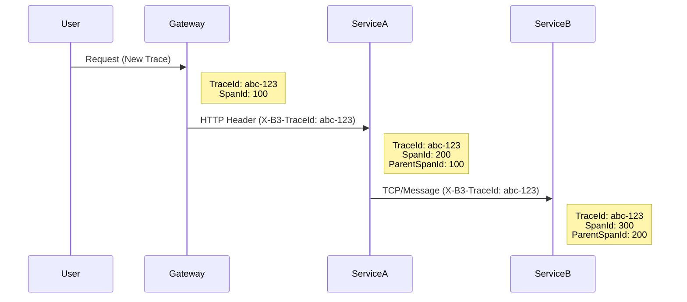
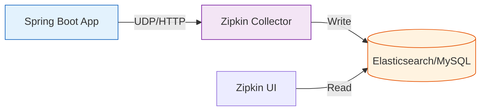

## 이 글에서 얻는 것

- **분산 추적**의 필요성을 이해합니다.
- **Zipkin/Jaeger**로 Trace를 수집합니다.
- **Span**을 분석하여 병목을 찾습니다.
- **Spring Boot 3.x + Micrometer Tracing** 기준으로 운영 설정을 잡습니다.

## 1) 분산 추적이란?

### 1.1 Trace Context Propagation

하나의 요청이 여러 서비스를 거칠 때, **Trace ID**가 어떻게 유지될까요? 비밀은 **HTTP Header**에 있습니다.


```mermaid
sequenceDiagram
    participant User
    participant Gateway
    participant ServiceA
    participant ServiceB
    
    User->>Gateway: Request (New Trace)
    Note right of Gateway: TraceId: abc-123<br/>SpanId: 100
    
    Gateway->>ServiceA: HTTP Header (X-B3-TraceId: abc-123)
    Note right of ServiceA: TraceId: abc-123<br/>SpanId: 200<br/>ParentSpanId: 100
    
    ServiceA->>ServiceB: TCP/Message (X-B3-TraceId: abc-123)
    Note right of ServiceB: TraceId: abc-123<br/>SpanId: 300<br/>ParentSpanId: 200
```

- **TraceId**: 전체 요청을 식별하는 고유 ID (변하지 않음).
- **SpanId**: 각 구간(서비스/함수)을 식별하는 ID (매번 바뀜).
- **ParentSpanId**: 호출한 상위 Span의 ID (계층 구조 형성).


## 2) Zipkin 설정

### 2.1 Zipkin Architecture Strategy


```mermaid
flowchart LR
    App[Spring Boot App] -->|UDP/HTTP| Collector[Zipkin Collector]
    Collector -->|Write| Storage[(Elasticsearch/MySQL)]
    UI[Zipkin UI] -->|Read| Storage
    
    style App fill:#e3f2fd,stroke:#1565c0
    style Collector fill:#f3e5f5,stroke:#7b1fa2
    style Storage fill:#fff3e0,stroke:#e65100
```

구조는 단순해 보이지만 운영에서 중요한 결정은 세 가지입니다.

- **전송 방식**: 애플리케이션이 Zipkin Collector로 직접 보내는지, OpenTelemetry Collector를 중간에 두고 fan-out할지 정합니다. 팀이 Zipkin만 쓴다면 직접 전송이 빠르고, Zipkin/Jaeger/상용 APM을 함께 비교한다면 Collector를 두는 편이 낫습니다.
- **저장소 보존 기간**: Trace는 로그보다 빠르게 커집니다. 장애 분석용이면 7~14일, 장기 추세 분석용이면 집계 지표만 별도로 남기는 식으로 비용 경계를 먼저 정해야 합니다.
- **샘플링 정책**: 개발 환경은 100%가 편하지만 운영 환경은 기본 1~5%에서 시작하고, 에러/느린 요청은 우선 수집하는 head/tail sampling 전략으로 보강합니다.

### 2.2 Span Timeline Visualization

병목 구간을 찾으려면 **Gantt Chart** 형태의 시각화가 필수적입니다.


```mermaid
gantt
    title Trace ID: abc-123 Timeline
    dateFormat X
    axisFormat %s

    section Gateway
    Gateway (100ms) :done, g1, 0, 100
    
    section Service A
    Service A (200ms) :active, a1, 50, 250
    
    section Service B
    Service B (150ms) :b1, 100, 250
    
    section DB
    Query Users (50ms) :crit, db1, 150, 200
```

위 차트를 보면, `Gateway` -> `Service A` -> `Service B` -> `DB` 순서로 호출되지만, **Service A가 Service B의 응답을 기다리는 시간**(150ms)이 전체 지연의 주원인임을 알 수 있습니다.

## 3) Configuration (Spring Boot 3.0+)

Spring Boot 3.x부터는 `Spring Cloud Sleuth` 대신 **Micrometer Tracing**을 사용합니다.

```gradle
implementation 'io.micrometer:micrometer-tracing-bridge-brave' // or otel
implementation 'io.zipkin.reporter2:zipkin-reporter-brave'
```

```yaml
management:
  tracing:
    sampling:
      probability: 1.0  # Dev: 100%, Prod: 1~5%
  zipkin:
    tracing:
      endpoint: http://localhost:9411/api/v2/spans
```

운영 설정에서는 `probability: 1.0`을 그대로 가져가면 안 됩니다. 요청량이 작은 내부 어드민이라면 괜찮을 수 있지만, 공개 API나 배치성 트래픽에서는 저장소 비용과 네트워크 오버헤드가 바로 튑니다.

실무에서는 다음 순서로 시작하는 편이 안전합니다.

1. 개발/스테이징: `1.0`으로 두고 모든 경로의 전파 누락을 먼저 잡습니다.
2. 운영 기본값: `0.01`~`0.05`로 시작합니다.
3. 중요 엔드포인트: 결제, 인증, 주문 같은 경로는 별도 sampler나 Collector rule로 더 높은 비율을 둡니다.
4. 장애 대응: 배포 직후 30분, 특정 tenant, 특정 에러 코드처럼 시간/조건 기반으로 임시 상향합니다.

## 4) Trace 분석

```
Zipkin UI (http://localhost:9411):

1. Trace 검색:
   - 서비스명, 시간 범위, 최소 duration

2. Trace 상세 보기:
   - 전체 Span 타임라인
   - 각 Span의 소요 시간
   - 병목 구간 파악

3. Dependencies:
   - 서비스 간 의존성 그래프
   - 호출 빈도
```

Trace를 볼 때는 "가장 긴 span"만 보면 놓치는 것이 많습니다. 아래 순서로 보면 원인 분리가 더 빨라집니다.

- **Root span duration**: 사용자 관점 전체 지연입니다. p95/p99가 튀는 경로부터 봅니다.
- **Critical path**: 병렬 호출이 있을 때 단순 합계가 아니라 실제 응답 시간을 결정한 경로입니다.
- **Error tag**: HTTP 5xx, gRPC status, DB timeout 같은 실패 태그가 붙은 span을 먼저 엽니다.
- **Missing span**: 중간 서비스가 비어 있으면 실제로 빠른 것이 아니라 propagation 또는 instrumentation이 빠진 것일 수 있습니다.
- **High cardinality tag**: `userId`, `email`, `rawQuery`처럼 값 종류가 폭발하는 태그는 검색 편의보다 저장소 비용과 개인정보 위험이 큽니다.

## 5) 커스텀 Span

```java
@Service
public class OrderService {

    @Autowired
    private Tracer tracer;

    public void processOrder(Order order) {
        // 커스텀 Span 생성
        Span span = tracer.nextSpan().name("process-payment");
        
        try (Tracer.SpanInScope ws = tracer.withSpan(span.start())) {
            // 작업 수행
            paymentService.process(order);
            
            // 태그 추가
            span.tag("order.id", order.getId().toString());
            span.tag("amount", order.getAmount().toString());
            
        } finally {
            span.end();
        }
    }
}
```

커스텀 Span은 "코드가 어디까지 실행됐는지"를 기록하는 장치가 아니라, **운영자가 판단할 단위**를 만드는 도구입니다. 너무 많이 만들면 Trace UI가 소음으로 가득 차고, 너무 적으면 원인 분석이 로그 검색으로 되돌아갑니다.

좋은 커스텀 Span 후보는 다음과 같습니다.

- 외부 결제/인증/배송 API 호출처럼 실패 영향이 큰 구간
- 캐시 miss 후 원본 저장소로 내려가는 fallback 구간
- 큐 메시지 처리에서 deserialize, validation, business handling, ack/nack이 분리되는 구간
- 파일 업로드, 이미지 변환, 대량 export처럼 CPU/IO 비용이 큰 구간

반대로 단순 getter, 짧은 private method, 반복문 내부의 매 item 처리처럼 호출 수가 많은 지점은 피하는 편이 좋습니다. 이런 지점은 Trace보다 metric counter/histogram이나 profiling이 더 적합합니다.

## 6) 운영 체크리스트

분산 추적을 "설치 완료"로 끝내지 않으려면 아래 항목을 배포 체크리스트에 넣습니다.

- **전파 표준**: 신규 서비스는 W3C Trace Context(`traceparent`)를 기본으로 하고, 레거시 연동이 있으면 B3 헤더 호환 여부를 명시합니다.
- **로그 상관관계**: 애플리케이션 로그에 `traceId`와 `spanId`가 들어가는지 확인합니다. Trace UI에서 본 요청을 로그로 바로 좁힐 수 있어야 합니다.
- **샘플링 문서화**: 기본 샘플링 비율, 에러 우선 수집 여부, 장애 때 임시 상향하는 절차를 적어둡니다.
- **태그 금지 목록**: 개인정보, access token, raw SQL parameter, 본문 payload는 span tag로 남기지 않습니다.
- **대시보드 연결**: 서비스별 p95 latency, error rate, trace coverage, missing root span 비율을 함께 봅니다.
- **알람 기준**: "Trace 수집 실패" 자체보다 "특정 서비스 trace coverage 급락"처럼 운영 판단이 가능한 지표로 알립니다.

## 7) 흔한 실패 패턴

1. **Gateway에서 Trace가 새로 시작됨**: upstream에서 받은 `traceparent`를 버리고 매번 새 TraceId를 만들면 클라이언트부터 내부 서비스까지 한 요청으로 이어지지 않습니다.
2. **비동기 큐에서 context가 끊김**: HTTP 요청 안에서는 잘 보이지만 Kafka/RabbitMQ 메시지로 넘어가는 순간 trace가 분리됩니다. producer가 header를 넣고 consumer가 읽는지 확인해야 합니다.
3. **DB 쿼리 태그가 과도함**: SQL 전문이나 파라미터를 그대로 태그에 넣으면 cardinality와 민감정보 문제가 같이 생깁니다. query name, table group, operation 정도로 낮춰야 합니다.
4. **Trace만 보고 용량 계획을 함**: Trace는 요청 단위 원인 분석에 강하지만 전체 추세는 metrics가 더 적합합니다. Trace, metrics, logs를 역할별로 나눠야 합니다.

## 요약

- 분산 추적은 요청 전체 경로를 TraceId로 묶고, 각 처리 단계를 Span으로 나눠 병목을 찾는 방식입니다.
- Spring Boot 3.x에서는 Sleuth가 아니라 Micrometer Tracing 기준으로 설정하고, Zipkin/Jaeger 또는 OpenTelemetry Collector와 연결합니다.
- 운영에서는 100% 수집보다 샘플링, 로그 상관관계, 민감정보 태그 금지, missing span 탐지를 함께 설계해야 합니다.

## 다음 단계

- [APM 기초](/learning/deep-dive/deep-dive-apm-basics/)
- [OpenTelemetry 심화](/learning/deep-dive/deep-dive-opentelemetry/)
- [Observability Baseline](/learning/deep-dive/deep-dive-observability-baseline/)
- [마이크로서비스 패턴](/learning/deep-dive/deep-dive-microservices-patterns/)
