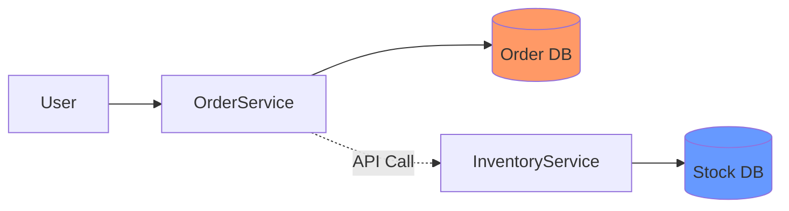
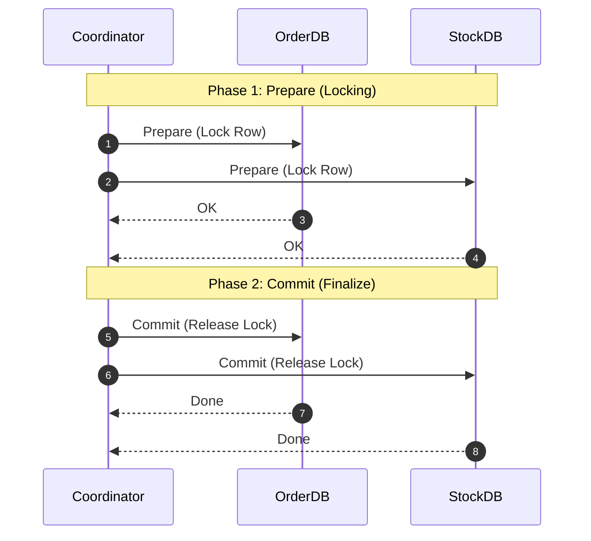
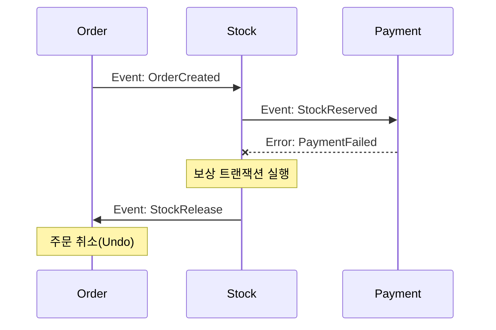
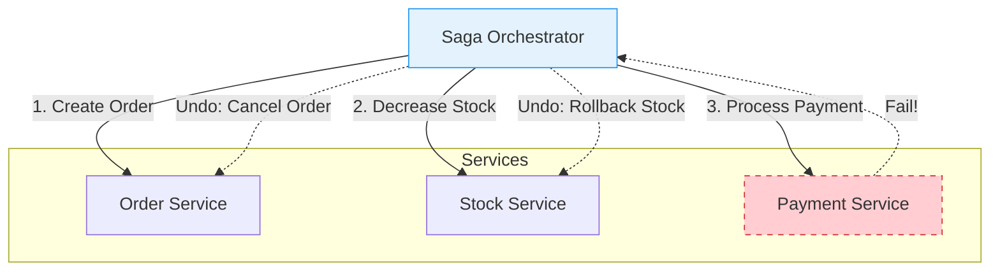

## 🤯 1. 문제: 서비스가 쪼개지면 트랜잭션도 깨진다

모놀리스(Monolith) 시절에는 `@Transactional` 애노테이션 하나면 세상이 평화로웠습니다.
주문 생성과 재고 차감이 하나의 DB 연결에서 일어나기 때문입니다.

하지만 **마이크로서비스(MSA)** 환경에서는 각자 다른 DB를 씁니다.

**시나리오**:
1. 주문 서비스: 주문 생성 (커밋 완료)
2. 재고 서비스: 재고 차감 시도 -> **에러 발생! (Rollback)**
3. **결과**: 주문은 됐는데 재고는 그대로인 대참사 발생.

---

## 🔒 2. 전통적 해결책: 2PC (Two-Phase Commit)

"다 같이 커밋하거나, 다 같이 죽자"는 방식입니다. 이를 **XA 트랜잭션**이라고도 합니다.

### 왜 안 쓸까? (2PC vs Saga)

| 특징 | 2PC (XA) | Saga Pattern |
| :--- | :--- | :--- |
| **일관성** | **Strong Consistency** (즉시 일치) | **Eventual Consistency** (결과적 일치) |
| **성능** | 낮음 (Global Locking, Blocking) | 높음 (Local Tx, Non-blocking) |
| **구현 난이도** | 낮음 (DB가 알아서 해줌) | 높음 (보상 트랜잭션 직접 구현) |
| **사용처** | 금융 코어, 강한 정합성 필요 시 | 대부분의 MSA 비즈니스 로직 |

1.  **Blocking**: 한 놈이라도 대답이 늦으면 전체가 멈춥니다. (Deadlock 위험)
2.  **SPOF**: 코디네이터가 죽으면 DB 락이 영원히 안 풀릴 수 있습니다.
3.  **NoSQL 불가**: MongoDB, DynamoDB 등은 XA를 지원하지 않습니다.

---

## 🔄 3. 현대적 해결책: SAGA 패턴

긴 트랜잭션을 잘게 쪼개서 순서대로 실행합니다.
중간에 실패하면? **"되감기(Undo)"**를 실행합니다. 이를 **보상 트랜잭션(Compensating Transaction)**이라 합니다.

### 3.1 Choreography (안무가 없는 댄스)

각 서비스가 이벤트를 주고받으며 다음 행동을 결정합니다.

- **장점**: 구축이 쉽고 서비스 간 결합도가 낮습니다.
- **단점**: 프로세스가 복잡해지면 "누가 누구를 호출하는지" 파악하기 힘들어집니다. (순환 참조 지옥)

### 3.2 Orchestration (지휘자)

**Saga Orchestrator**라는 중앙 지휘자가 명령을 내립니다.

- **장점**: 비즈니스 로직이 한눈에 보입니다. 관리가 쉽습니다.
- **단점**: 오케스트레이터가 너무 비대해질 수 있습니다.

## 요약

> [!TIP]
> **Saga Pattern Checklist**:
> - [ ] **Idempotency (멱등성)**: 보상 트랜잭션이 중복 실행되어도 결과는 같아야 함. (네트워크 타임아웃 대비)
> - [ ] **Compensation (보상)**: `do()`에 대한 `undo()` 로직이 반드시 존재해야 함.
> - [ ] **Monitoring**: 트랜잭션 상태(Started, Pending, Aborted)를 추적할 수 있어야 함. (Saga ID 필수)

1. **ACID는 포기해라**: MSA에서는 **BASE** (Basically Available, Soft state, Eventual consistency)를 따릅니다.
2. **2PC는 성능의 적**: 강한 정합성이 필수(은행 등)가 아니면 피하세요.
3. **SAGA가 표준**: "실패하면 되돌린다(보상 트랜잭션)"는 개념만 기억하면 됩니다.
