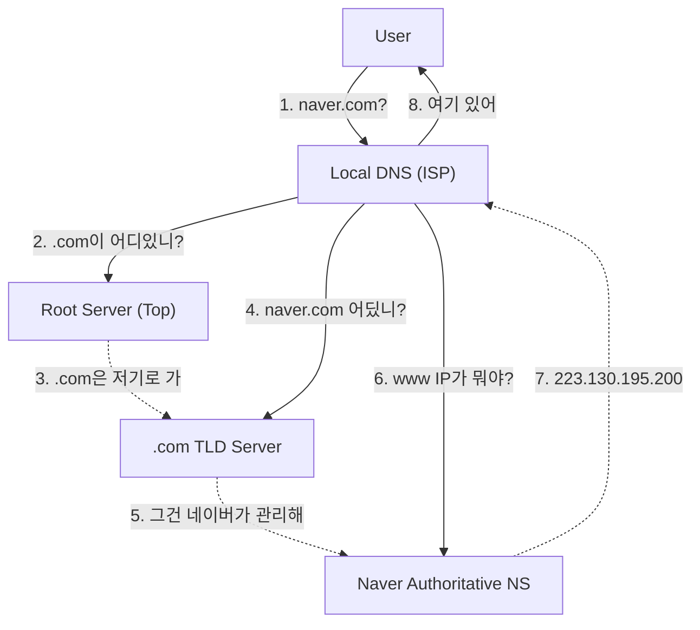

## 🌍 1. 인터넷의 전화번호부

우리는 `223.130.195.200`을 외울 수 없습니다. 그래서 `naver.com`을 씁니다.
이 변환 과정을 담당하는 시스템이 **DNS (Domain Name System)**입니다.

단순해 보이지만, 전 세계 수십억 개의 도메인을 **계층적(Hierarchy)**으로 관리하는 거대한 분산 데이터베이스입니다.

---

## 🔄 2. Recursive Lookup (재귀적 질의)

브라우저가 "naver.com IP가 뭐야?"라고 물어보면, Local DNS 서버는 탐정 놀이를 시작합니다.



1. **Root Server**: 전 세계에 몇 개 없는 최상위 서버. `.com`, `.net` 관리자를 알려줍니다.
2. **TLD Server**: `.com` 관리 서버. `naver.com` 관리자를 알려줍니다.
3. **Authoritative Server**: 실제 네이버가 운영하는 서버. 여기서 최종 IP를 알려줍니다.

> **캐싱(Caching)**: 매번 이렇게 물어보면 인터넷이 마비됩니다. 그래서 `TTL(Time To Live)` 동안 결과를 저장해둡니다.

---

## 🌐 3. GSLB (Global Server Load Balancing)

DNS는 단순히 IP만 알려주는 게 아닙니다. **가장 가까운 서버**를 알려줍니다.
넷플릭스를 켜면 미국 서버가 아니라 한국 서버에 붙는 이유입니다.

1. DNS 서버가 사용자의 IP를 봅니다. ("어? 한국에서 왔네?")
2. 한국 리전의 IP (`1.1.1.1`)를 반환합니다.
3. 미국 유저에게는 미국 IP (`2.2.2.2`)를 반환합니다.

## 🛠️ 4. 트러블슈팅 도구

백엔드 개발자라면 `dig` 명령어를 쓸 줄 알아야 합니다.

```bash
# 전체 경로 추적 (어디서 막히는지 확인)
dig +trace google.com

# 특정 DNS 서버에게 물어보기
dig @8.8.8.8 google.com
```

## 요약

- **Recursive Query**: 뿌리(Root)부터 잎(Leaf)까지 찾아가는 과정.
- **TTL**: 캐싱 시간. 배포 후 DNS 반영이 느리다면 TTL이 긴 것이다.
- **GSLB**: DNS 레벨에서 트래픽을 전 세계로 분산시키는 기술.
