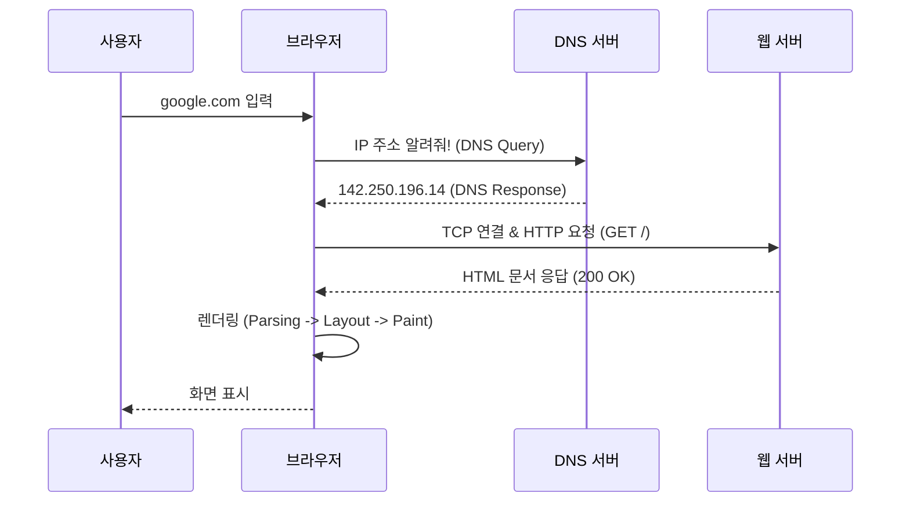

## 이 글에서 얻는 것

- **면접 단골 질문**: "주소창에 google.com을 쳤을 때 일어나는 일"을 구조적으로 설명할 수 있습니다.
- **DNS 동작 원리**: Recursive, Root, TLD, Authoritative 서버의 역할을 이해합니다.
- **웹의 기본 흐름**: 요청(Request) -> 처리(Processing) -> 응답(Response) -> 렌더링(Rendering)의 사이클을 익힙니다.

---

## 1. 전체 흐름 요약 (Big Picture)



---

## 2. DNS (Domain Name System): 인터넷 전화번호부

사람은 `google.com`을 기억하지만, 컴퓨터는 `142.250.196.14` 같은 IP 주소만 이해합니다. DNS는 이 둘을 매핑해주는 시스템입니다.

### 2.1 DNS 조회 4단계 (계층 구조)

캐시에 주소가 없다면, **재귀적 질의(Recursive Query)**가 일어납니다.

1.  **Local DNS (Recursive Resolver)**: ISP(통신사)나 구글(8.8.8.8) DNS. "내가 대신 찾아줄게" 하고 발로 뜁니다.
2.  **Root Name Server (.)**: "나는 몰라. 하지만 `.com` 관리하는 애(TLD) 주소는 알아."
3.  **TLD Name Server (.com)**: "나는 몰라. 하지만 `google.com` 관리하는 애(Authoritative) 주소는 알아."
4.  **Authoritative Name Server (google.com)**: "찾았다! 내 IP는 `142.250.xxx.xxx` 야."

```mermaid
graph TD
    Client[Client] -->|Query| Local[Local DNS/Resolver]
    Local -->|1. Ask| Root[Root Server (.)]
    Root -->|2. Refer to .com| Local
    Local -->|3. Ask| TLD[TLD Server (.com)]
    TLD -->|4. Refer to google.com| Local
    Local -->|5. Ask| Auth[Authoritative Server (google.com)]
    Auth -->|6. Answer IP| Local
    Local -->|7. Return IP| Client
```

### 2.2 주요 DNS 레코드

*   **A (Address)**: 도메인 -> IPv4 주소 매핑 (가장 기본)
*   **AAAA**: 도메인 -> IPv6 주소 매핑
*   **CNAME (Canonical Name)**: 도메인 -> 다른 도메인 (별칭). `www.example.com` -> `example.com`
*   **NS (Name Server)**: 해당 도메인을 관리하는 네임서버 지정
*   **MX (Mail Exchanger)**: 메일 서버 지정

---

## 3. 브라우저와 서버의 통신

IP를 알았으니 이제 데이터를 주고받아야 합니다.

### 3.1 연결 수립 (Connection)
*   **TCP 3-Way Handshake**: 
    1. SYN (나 보낼게)
    2. SYN-ACK (어, 확인했어. 나도 보낼게)
    3. ACK (연결 확정)
*   **TLS Handshake (HTTPS)**: 암호화 키 교환 (Client Hello -> Server Hello -> Key Exchange)

### 3.2 요청과 응답 (Request & Response)
*   **Request**: `GET / HTTP/1.1` 헤더와 함께 서버에 문서를 요청합니다.
*   **Web Server / WAS**: 
    *   **정적(Static)**: 미리 만들어진 HTML/이미지 파일 그대로 전송 (Nginx, Apache)
    *   **동적(Dynamic)**: DB 조회, 로직 처리 후 HTML 생성 (Tomcat, Node.js, Spring Boot)
*   **Response**: `HTTP/1.1 200 OK` 상태 코드와 HTML 본문을 보냅니다.

---

## 4. 브라우저 렌더링 (화면에 그리기)

HTML을 받았다고 끝이 아닙니다. 브라우저 엔진(Chrome V8/Blink 등)이 열일합니다.

1.  **Parsing (파싱)**:
    *   HTML -> **DOM Tree** 변환
    *   CSS -> **CSSOM Tree** 변환
2.  **Style (스타일 결합)**: DOM + CSSOM = **Render Tree** 생성 (화면에 보일 것만 추림. `display: none` 제외)
3.  **Layout (Reflow)**: 각 요소의 정확한 위치와 크기 계산 (너비, 높이 등)
4.  **Paint (Repaint)**: 픽셀 단위로 색칠하기
5.  **Composite**: 여러 레이어를 합쳐서 최종 화면 출력

> **Tip**: 프론트엔드 성능 최적화는 주로 3번(Layout)과 4번(Paint)을 최소화하는 것입니다.

---

## 요약

1.  **DNS**: 도메인 이름을 IP로 바꾼다. (Recursive -> Root -> TLD -> Authoritative)
2.  **연결**: TCP/TLS로 안전한 통로를 만든다.
3.  **요청/응답**: HTTP 프로토콜로 HTML을 받아온다.
4.  **렌더링**: 파싱 -> 렌더 트리 -> 레이아웃 -> 페인트 과정을 거쳐 눈에 보인다.
