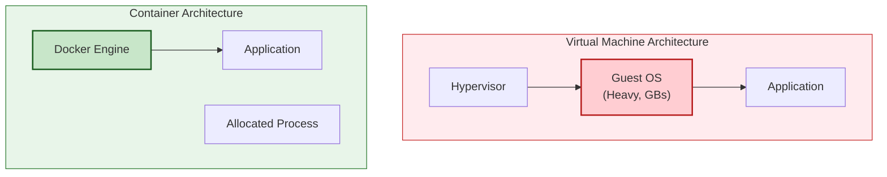
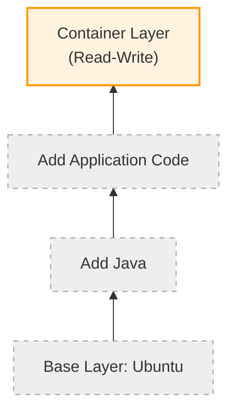
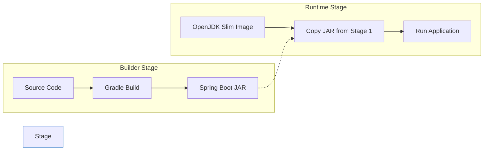

## 🏗️ 1. VM vs Container: 아키텍처의 차이

왜 Docker는 "가볍다"고 할까요? 비밀은 **Guest OS의 유무**에 있습니다.



- **VM**: 하드웨어를 가상화합니다. 각 VM마다 Windows/Linux를 통째로 설치하므로 무겁고(GB 단위), 부팅이 느립니다.
- **Container**: OS(리눅스 커널)를 공유합니다. 격리된 **프로세스**일 뿐이므로 가볍고(MB 단위), 1초 만에 켜집니다.

---

## 🍰 2. 이미지 레이어(Layer)와 Copy-on-Write

Docker 이미지는 통짜 파일이 아닙니다. **여러 겹의 케이크**입니다.



이미지의 모든 레이어는 **Read-Only**입니다.
컨테이너를 실행하면 그 위에 **얇은 R/W 레이어** 한 장만 올라갑니다.

1. **효율성**: 여러 컨테이너가 Base Image(Ubuntu, Java 등)를 **공유**합니다. 디스크를 아낍니다.
2. **속도**: 이미지는 읽기 전용이라 캐싱하기 좋습니다.

---

## 📜 3. Dockerfile의 핵심 (멀티 스테이지 빌드)

"이미지 크기를 줄이는 법"이 실무의 핵심입니다.



```dockerfile
# 🏗️ Build Stage
FROM gradle:jdk17 AS builder
COPY . .
RUN ./gradlew build  # 여기서 소스 컴파일 (무거움)

# 🚀 Run Stage
FROM openjdk:17-slim # 가벼운 런타임 이미지
COPY --from=builder /app/build/libs/myapp.jar .
ENTRYPOINT ["java", "-jar", "myapp.jar"]
```

빌드 도구(Gradle, Maven)는 런타임에 필요 없습니다.
결과물(Jar)만 쏙 빼서 새 이미지에 담는 **Multi-stage Build**를 쓰면 용량이 1/10으로 줄어듭니다.

---

## 🐙 4. Docker Compose: "나의 작은 오케스트라"

컨테이너 하나(App)만 띄우는 일은 드뭅니다. DB도 띄워야 하고 Redis도 띄워야 하죠.
이들을 한 방에 관리하는 도구입니다.

```yaml
services:
  app:
    build: .
    depends_on: [db, redis] # 순서 보장
    ports: ["8080:8080"]

  db:
    image: mysql:8.0
    volumes: ["db_data:/var/lib/mysql"] # 데이터 영속성

  redis:
    image: redis:alpine
```

가장 중요한 건 `volumes`입니다. 컨테이너를 지워도 DB 데이터가 날아가면 안 되니까요.

## 요약

1. **가벼움**: OS 커널을 공유하는 프로세스 격리 기술이다.
2. **레이어**: 이미지는 겹겹이 쌓이며 재사용된다. 컨테이너는 그 위에 쓰는 얇은 종이다.
3. **Dockerfile**: 빌드 단계와 실행 단계를 나누는 것이 국룰이다.
