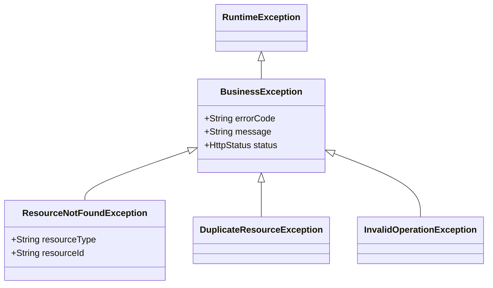

## 이 글에서 얻는 것

- **비즈니스 예외 계층**을 설계합니다
- **글로벌 예외 핸들링**으로 일관된 에러 응답을 제공합니다
- **예외 로깅 전략**을 구현합니다

---

## 예외 계층 설계

### 기본 구조



### 기본 예외 클래스

```java
@Getter
public abstract class BusinessException extends RuntimeException {
    
    private final String errorCode;
    private final HttpStatus status;
    
    protected BusinessException(String errorCode, String message, HttpStatus status) {
        super(message);
        this.errorCode = errorCode;
        this.status = status;
    }
    
    protected BusinessException(String errorCode, String message, 
                                 HttpStatus status, Throwable cause) {
        super(message, cause);
        this.errorCode = errorCode;
        this.status = status;
    }
}
```

### 구체 예외 클래스

```java
public class ResourceNotFoundException extends BusinessException {
    
    private final String resourceType;
    private final String resourceId;
    
    public ResourceNotFoundException(String resourceType, String resourceId) {
        super(
            "RESOURCE_NOT_FOUND",
            String.format("%s not found with id: %s", resourceType, resourceId),
            HttpStatus.NOT_FOUND
        );
        this.resourceType = resourceType;
        this.resourceId = resourceId;
    }
    
    // 팩토리 메서드
    public static ResourceNotFoundException user(Long id) {
        return new ResourceNotFoundException("User", id.toString());
    }
    
    public static ResourceNotFoundException order(String orderId) {
        return new ResourceNotFoundException("Order", orderId);
    }
}

public class DuplicateResourceException extends BusinessException {
    
    public DuplicateResourceException(String resourceType, String field, String value) {
        super(
            "DUPLICATE_RESOURCE",
            String.format("%s already exists with %s: %s", resourceType, field, value),
            HttpStatus.CONFLICT
        );
    }
}

public class InvalidOperationException extends BusinessException {
    
    public InvalidOperationException(String message) {
        super("INVALID_OPERATION", message, HttpStatus.BAD_REQUEST);
    }
}
```

---

## 서비스 레이어에서 사용

```java
@Service
public class UserService {
    
    public User findById(Long id) {
        return userRepository.findById(id)
            .orElseThrow(() -> ResourceNotFoundException.user(id));
    }
    
    public User create(CreateUserRequest request) {
        // 중복 검사
        if (userRepository.existsByEmail(request.getEmail())) {
            throw new DuplicateResourceException("User", "email", request.getEmail());
        }
        
        return userRepository.save(new User(request));
    }
    
    public void deactivate(Long id) {
        User user = findById(id);
        
        if (user.isAlreadyDeactivated()) {
            throw new InvalidOperationException("User is already deactivated");
        }
        
        user.deactivate();
    }
}
```

---

## 글로벌 예외 핸들러

```java
@RestControllerAdvice
@Slf4j
public class GlobalExceptionHandler {
    
    // 비즈니스 예외 처리
    @ExceptionHandler(BusinessException.class)
    public ResponseEntity<ErrorResponse> handleBusinessException(
            BusinessException ex, WebRequest request) {
        
        log.warn("Business exception: {} - {}", ex.getErrorCode(), ex.getMessage());
        
        ErrorResponse response = ErrorResponse.builder()
            .code(ex.getErrorCode())
            .message(ex.getMessage())
            .timestamp(LocalDateTime.now())
            .path(extractPath(request))
            .build();
        
        return ResponseEntity.status(ex.getStatus()).body(response);
    }
    
    // Validation 예외
    @ExceptionHandler(MethodArgumentNotValidException.class)
    public ResponseEntity<ErrorResponse> handleValidation(
            MethodArgumentNotValidException ex, WebRequest request) {
        
        List<FieldError> fieldErrors = ex.getBindingResult()
            .getFieldErrors()
            .stream()
            .map(e -> new FieldError(e.getField(), e.getDefaultMessage()))
            .collect(Collectors.toList());
        
        ErrorResponse response = ErrorResponse.builder()
            .code("VALIDATION_ERROR")
            .message("입력값이 올바르지 않습니다")
            .timestamp(LocalDateTime.now())
            .path(extractPath(request))
            .errors(fieldErrors)
            .build();
        
        return ResponseEntity.badRequest().body(response);
    }
    
    // 알 수 없는 예외
    @ExceptionHandler(Exception.class)
    public ResponseEntity<ErrorResponse> handleUnexpected(
            Exception ex, WebRequest request) {
        
        // 예상치 못한 에러는 ERROR 레벨로 로깅
        log.error("Unexpected error occurred", ex);
        
        ErrorResponse response = ErrorResponse.builder()
            .code("INTERNAL_ERROR")
            .message("서버 오류가 발생했습니다")
            .timestamp(LocalDateTime.now())
            .path(extractPath(request))
            .build();
        
        return ResponseEntity.status(HttpStatus.INTERNAL_SERVER_ERROR).body(response);
    }
    
    private String extractPath(WebRequest request) {
        return request.getDescription(false).replace("uri=", "");
    }
}
```

### 에러 응답 DTO

```java
@Getter @Builder
public class ErrorResponse {
    private String code;
    private String message;
    private LocalDateTime timestamp;
    private String path;
    private List<FieldError> errors;
    
    @Getter @AllArgsConstructor
    public static class FieldError {
        private String field;
        private String message;
    }
}
```

---

## 로깅 전략

### 로깅 레벨 기준

| 예외 유형 | 로깅 레벨 | 이유 |
|---------|---------|------|
| 404 Not Found | WARN | 클라이언트 오류, 주의 필요 |
| 400 Bad Request | WARN | 입력 오류 |
| 401/403 | WARN | 보안 관련 |
| 500 | ERROR | 서버 오류, 조사 필요 |
| 예상된 비즈니스 오류 | INFO | 정상 흐름 |

### 에러 컨텍스트 포함

```java
@ExceptionHandler(BusinessException.class)
public ResponseEntity<ErrorResponse> handleBusinessException(
        BusinessException ex, WebRequest request, HttpServletRequest httpRequest) {
    
    // 디버깅에 유용한 컨텍스트 로깅
    log.warn("Business exception: code={}, message={}, path={}, userId={}, traceId={}",
        ex.getErrorCode(),
        ex.getMessage(),
        httpRequest.getRequestURI(),
        getCurrentUserId(),
        MDC.get("traceId")
    );
    
    // ...
}
```

---

## Checked vs Unchecked

### Unchecked 권장 (RuntimeException)

```java
// ✅ Unchecked - 비즈니스 예외
public class OrderNotFoundException extends RuntimeException { ... }

// 사용: throws 선언 불필요
public Order findOrder(String id) {
    return orderRepository.findById(id)
        .orElseThrow(() -> new OrderNotFoundException(id));
}
```

### Checked는 복구 가능할 때만

```java
// Checked - 복구 가능한 예외
public class RetryableException extends Exception {
    // 재시도로 복구 가능한 경우
}

public void processWithRetry() throws RetryableException {
    // 호출자가 재시도 로직 구현
}
```

---

## 예외 래핑

### 저수준 예외를 비즈니스 예외로

```java
@Repository
public class OrderRepository {
    
    public Order save(Order order) {
        try {
            return jdbcTemplate.update(...);
        } catch (DataIntegrityViolationException e) {
            // DB 제약조건 위반 → 비즈니스 예외로 변환
            throw new DuplicateOrderException(order.getOrderNumber(), e);
        } catch (DataAccessException e) {
            // 데이터 접근 오류 → 인프라 예외로 변환
            throw new DatabaseAccessException("Failed to save order", e);
        }
    }
}
```

---

## 요약

### 예외 처리 체크리스트

| 항목 | 권장 |
|------|------|
| 예외 타입 | Unchecked (RuntimeException) |
| 계층 구조 | BusinessException 기반 |
| 에러 코드 | 일관된 코드 체계 |
| 핸들링 | @RestControllerAdvice |
| 로깅 | 레벨별 분리 |

### 핵심 원칙

1. **명확한 예외 계층**: 의미있는 예외 타입
2. **일관된 응답 형식**: 글로벌 핸들러
3. **적절한 로깅**: 레벨별 분리
4. **예외 래핑**: 저수준 → 비즈니스 예외

---

## 🔗 Related Deep Dive

- **[Spring Validation](/learning/deep-dive/deep-dive-spring-validation/)**: 입력 검증과 예외.
- **[구조화 로깅](/learning/deep-dive/deep-dive-structured-logging/)**: 에러 로깅 전략.
