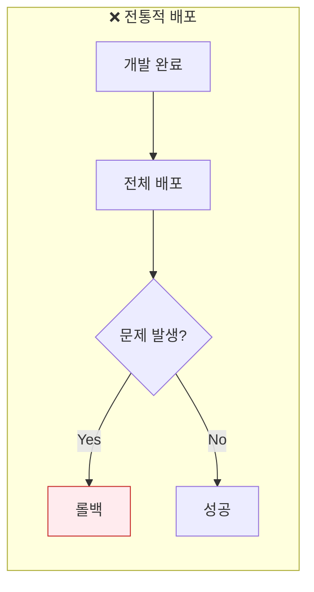
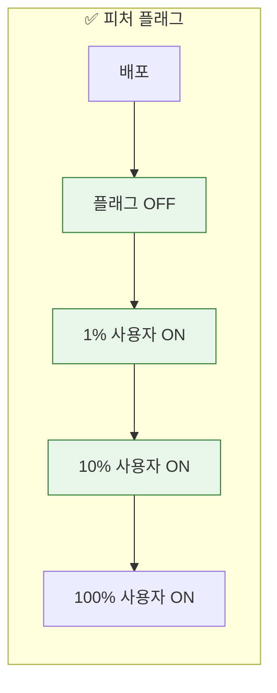
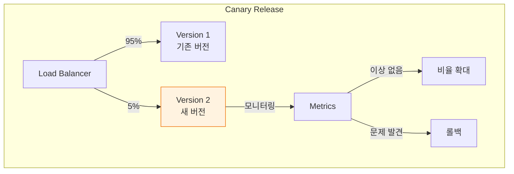
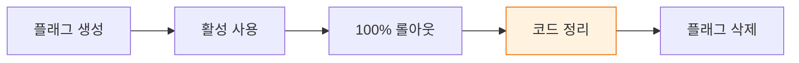

## 이 글에서 얻는 것

- **피처 플래그**로 배포와 릴리스를 분리하는 방법을 이해합니다
- **카나리 릴리스**와 **A/B 테스트** 구현 패턴을 알아봅니다
- **피처 플래그 베스트 프랙티스**와 관리 전략을 익힙니다

---

## 왜 피처 플래그인가?

### 문제: 빅뱅 릴리스



**문제점**:
- 모든 사용자에게 동시 노출
- 문제 시 전체 롤백 필요
- 테스트 환경과 프로덕션 차이

### 해결: 피처 플래그



**배포 ≠ 릴리스**: 코드는 배포하되, 기능 노출은 점진적으로

---

## 기본 구현

### 간단한 피처 플래그

```java
@Component
public class FeatureFlags {
    
    @Value("${feature.new-checkout:false}")
    private boolean newCheckoutEnabled;
    
    @Value("${feature.dark-mode:false}")
    private boolean darkModeEnabled;
    
    public boolean isNewCheckoutEnabled() {
        return newCheckoutEnabled;
    }
    
    public boolean isDarkModeEnabled() {
        return darkModeEnabled;
    }
}

// 사용
@Service
public class CheckoutService {
    
    @Autowired
    private FeatureFlags featureFlags;
    
    public CheckoutResult checkout(Cart cart) {
        if (featureFlags.isNewCheckoutEnabled()) {
            return newCheckoutFlow(cart);  // 새 로직
        } else {
            return legacyCheckoutFlow(cart);  // 기존 로직
        }
    }
}
```

### 동적 플래그 (DB 기반)

```java
@Entity
@Table(name = "feature_flags")
public class FeatureFlag {
    @Id
    private String key;
    private boolean enabled;
    private Integer rolloutPercentage;  // 0-100
    private String targetUserIds;        // 특정 사용자
    private LocalDateTime expiresAt;     // 만료일
}

@Service
public class DynamicFeatureFlags {
    
    @Autowired
    private FeatureFlagRepository repository;
    
    @Cacheable("featureFlags")
    public boolean isEnabled(String key) {
        return repository.findById(key)
            .map(FeatureFlag::isEnabled)
            .orElse(false);
    }
    
    public boolean isEnabledForUser(String key, String userId) {
        FeatureFlag flag = repository.findById(key).orElse(null);
        if (flag == null) return false;
        
        // 특정 사용자 체크
        if (flag.getTargetUserIds() != null 
            && flag.getTargetUserIds().contains(userId)) {
            return true;
        }
        
        // 롤아웃 비율 체크
        if (flag.getRolloutPercentage() != null) {
            int hash = Math.abs(userId.hashCode() % 100);
            return hash < flag.getRolloutPercentage();
        }
        
        return flag.isEnabled();
    }
}
```

---

## 점진적 롤아웃

### 카나리 릴리스



### 사용자 기반 롤아웃

```java
@Service
public class RolloutService {
    
    /**
     * 사용자 ID 해시 기반 일관된 롤아웃
     * 같은 사용자는 항상 같은 그룹에 속함
     */
    public boolean isInRollout(String userId, int percentage) {
        int hash = Hashing.murmur3_32()
            .hashString(userId, StandardCharsets.UTF_8)
            .asInt();
        int bucket = Math.abs(hash % 100);
        return bucket < percentage;
    }
}

// 사용
if (rolloutService.isInRollout(user.getId(), 10)) {
    // 10%의 사용자에게 새 기능 노출
    showNewFeature();
} else {
    showOldFeature();
}
```

### 단계별 롤아웃 전략

```yaml
# feature-rollout.yaml
features:
  new-payment:
    stages:
      - name: "내부 테스터"
        percentage: 0
        userIds: ["internal-1", "internal-2", "qa-team"]
      - name: "얼리 어답터"
        percentage: 1
        startDate: "2024-01-15"
      - name: "확대"
        percentage: 10
        startDate: "2024-01-17"
      - name: "전체 공개"
        percentage: 100
        startDate: "2024-01-20"
```

---

## A/B 테스트

### 구현

```java
@Service
public class ABTestService {
    
    public String getVariant(String experimentId, String userId) {
        // 일관된 변이 할당
        String seed = experimentId + ":" + userId;
        int hash = Math.abs(seed.hashCode() % 100);
        
        Experiment experiment = experimentRepository.findById(experimentId)
            .orElseThrow();
        
        int cumulative = 0;
        for (Variant variant : experiment.getVariants()) {
            cumulative += variant.getPercentage();
            if (hash < cumulative) {
                return variant.getName();
            }
        }
        
        return "control";  // 기본값
    }
}

// 사용
String variant = abTestService.getVariant("checkout-button-color", userId);

switch (variant) {
    case "control":
        return "blue";
    case "variant-a":
        return "green";
    case "variant-b":
        return "orange";
    default:
        return "blue";
}
```

### 결과 추적

```java
@Service
public class ExperimentTracker {
    
    @Autowired
    private MetricsService metricsService;
    
    public void trackConversion(String experimentId, String variant, String userId) {
        metricsService.increment(
            "ab_test.conversion",
            Tags.of(
                "experiment", experimentId,
                "variant", variant
            )
        );
        
        // 이벤트 저장
        eventStore.save(new ConversionEvent(experimentId, variant, userId));
    }
}
```

---

## 피처 플래그 도구

### 오픈소스 / SaaS 비교

| 도구 | 유형 | 특징 |
|------|------|------|
| **Unleash** | 오픈소스 | 셀프 호스팅, 무료 |
| **Flagsmith** | 오픈소스/SaaS | 다양한 SDK |
| **LaunchDarkly** | SaaS | 엔터프라이즈급 |
| **Split.io** | SaaS | A/B 테스트 특화 |

### Unleash 연동 예시

```xml
<dependency>
    <groupId>io.getunleash</groupId>
    <artifactId>unleash-client-java</artifactId>
    <version>8.4.0</version>
</dependency>
```

```java
@Configuration
public class UnleashConfig {
    
    @Bean
    public Unleash unleash() {
        return new DefaultUnleash(
            UnleashConfig.builder()
                .appName("my-app")
                .instanceId("instance-1")
                .unleashAPI("http://unleash-server/api/")
                .fetchTogglesInterval(10)  // 10초마다 동기화
                .build()
        );
    }
}

@Service
public class FeatureService {
    
    @Autowired
    private Unleash unleash;
    
    public boolean isEnabled(String feature) {
        return unleash.isEnabled(feature);
    }
    
    public boolean isEnabledForUser(String feature, String userId) {
        UnleashContext context = UnleashContext.builder()
            .userId(userId)
            .build();
        return unleash.isEnabled(feature, context);
    }
}
```

---

## 베스트 프랙티스

### 플래그 수명 관리



```java
// ❌ 안티패턴: 영구적인 플래그
if (featureFlags.isEnabled("new-checkout")) {  // 2년째 유지 중...
    newCheckout();
}

// ✅ 플래그에 만료일 설정
@FeatureFlag(
    name = "new-checkout",
    description = "새로운 결제 플로우",
    owner = "payment-team",
    expiresAt = "2024-06-01"  // 정리 기한
)
public boolean isNewCheckoutEnabled() { ... }
```

### 플래그 정리 자동화

```java
@Scheduled(cron = "0 0 9 * * MON")  // 매주 월요일
public void checkExpiredFlags() {
    List<FeatureFlag> expired = repository.findExpiredFlags();
    
    for (FeatureFlag flag : expired) {
        slackService.notify(
            flag.getOwner(),
            String.format("피처 플래그 '%s' 정리가 필요합니다. 만료일: %s",
                flag.getName(), flag.getExpiresAt())
        );
    }
}
```

### 테스트 전략

```java
@Test
void newCheckout_whenEnabled_shouldUseNewFlow() {
    // Given
    when(featureFlags.isNewCheckoutEnabled()).thenReturn(true);
    
    // When
    CheckoutResult result = checkoutService.checkout(cart);
    
    // Then
    assertThat(result.getFlow()).isEqualTo("NEW");
}

@Test
void newCheckout_whenDisabled_shouldUseLegacyFlow() {
    // Given
    when(featureFlags.isNewCheckoutEnabled()).thenReturn(false);
    
    // When
    CheckoutResult result = checkoutService.checkout(cart);
    
    // Then
    assertThat(result.getFlow()).isEqualTo("LEGACY");
}
```

---

## 요약

### 피처 플래그 유형

| 유형 | 용도 | 수명 |
|------|-----|------|
| **릴리스 플래그** | 점진적 롤아웃 | 단기 |
| **실험 플래그** | A/B 테스트 | 중기 |
| **운영 플래그** | 킬 스위치, 기능 토글 | 장기 |
| **권한 플래그** | 유료 기능, 권한 | 영구 |

### 핵심 원칙

1. **배포 ≠ 릴리스**: 코드 배포와 기능 노출 분리
2. **점진적 롤아웃**: 1% → 10% → 100%
3. **모니터링 필수**: 새 기능의 메트릭 추적
4. **정리 문화**: 사용 완료된 플래그는 제거

---

## 🔗 Related Deep Dive

- **[CI/CD 보안](/learning/deep-dive/deep-dive-cicd-security-supply-chain/)**: 안전한 배포 파이프라인.
- **[Rate Limiter](/learning/deep-dive/deep-dive-rate-limiter-design/)**: 기능별 트래픽 제어.
