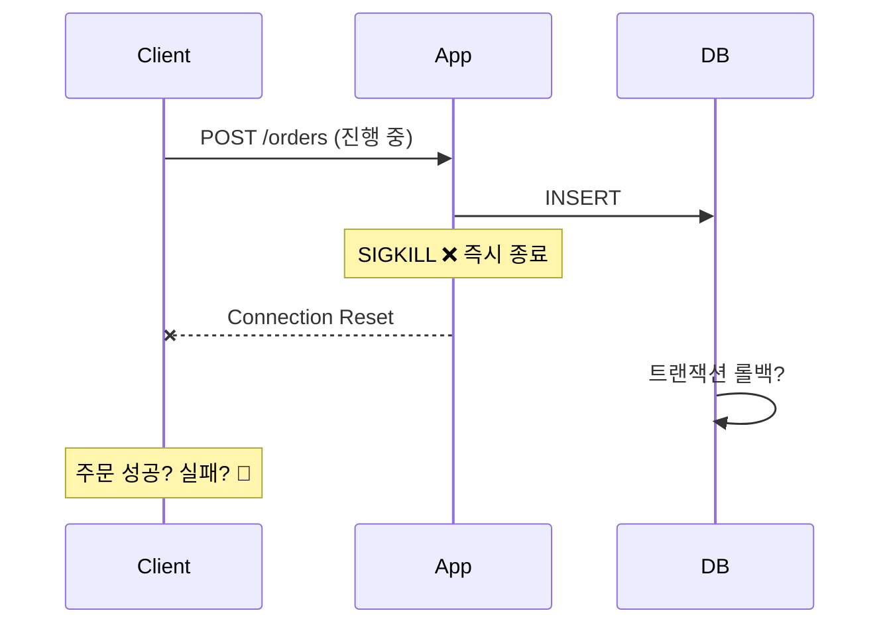
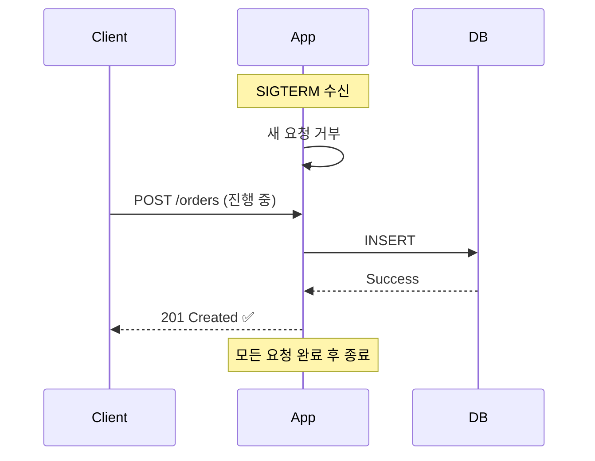
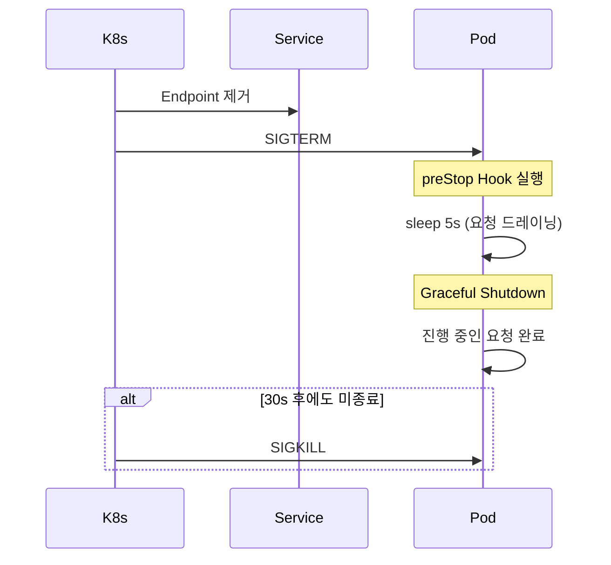
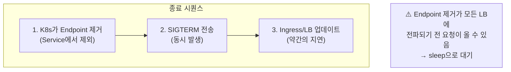

## 이 글에서 얻는 것

- **Graceful Shutdown**의 필요성을 이해합니다
- **Spring Boot**에서 안전한 종료를 구현합니다
- **Kubernetes**에서 Zero-Downtime 배포를 위한 설정을 알아봅니다

---

## 왜 Graceful Shutdown인가?

### 문제: 즉시 종료



### 해결: Graceful Shutdown



---

## Spring Boot Graceful Shutdown

### 설정

```yaml
# application.yml
server:
  shutdown: graceful  # 기본값: immediate

spring:
  lifecycle:
    timeout-per-shutdown-phase: 30s  # 최대 대기 시간
```

### 동작 과정

1. **SIGTERM 수신**
2. **새 HTTP 요청 거부** (503 반환)
3. **진행 중인 요청 대기**
4. **timeout 후 강제 종료**

### 커스텀 종료 로직

```java
@Component
public class ShutdownHandler implements DisposableBean, ApplicationListener<ContextClosedEvent> {
    
    @Autowired
    private ThreadPoolTaskExecutor taskExecutor;
    
    @Override
    public void onApplicationEvent(ContextClosedEvent event) {
        log.info("Application shutdown initiated");
        
        // 백그라운드 작업 완료 대기
        taskExecutor.setWaitForTasksToCompleteOnShutdown(true);
        taskExecutor.setAwaitTerminationSeconds(30);
    }
    
    @Override
    public void destroy() {
        log.info("Cleanup resources");
        
        // 외부 연결 정리
        closeExternalConnections();
        
        // 캐시 플러시
        flushCache();
    }
    
    @PreDestroy
    public void preDestroy() {
        log.info("PreDestroy - final cleanup");
    }
}
```

---

## 컴포넌트별 종료 처리

### 스레드 풀

```java
@Bean
public ThreadPoolTaskExecutor taskExecutor() {
    ThreadPoolTaskExecutor executor = new ThreadPoolTaskExecutor();
    executor.setCorePoolSize(10);
    executor.setMaxPoolSize(20);
    
    // Graceful shutdown 설정
    executor.setWaitForTasksToCompleteOnShutdown(true);
    executor.setAwaitTerminationSeconds(60);
    
    return executor;
}
```

### Kafka Consumer

```java
@Component
public class KafkaShutdownHandler {
    
    @Autowired
    private KafkaListenerEndpointRegistry registry;
    
    @PreDestroy
    public void shutdown() {
        log.info("Stopping Kafka consumers");
        
        // 모든 컨슈머 중지
        registry.stop();
        
        // 현재 처리 중인 메시지 완료 대기
        // (ContainerProperties.setAckMode 설정에 따라)
    }
}
```

### 스케줄러

```java
@Configuration
public class SchedulerConfig {
    
    @Bean
    public TaskScheduler taskScheduler() {
        ThreadPoolTaskScheduler scheduler = new ThreadPoolTaskScheduler();
        scheduler.setPoolSize(5);
        
        // Graceful shutdown
        scheduler.setWaitForTasksToCompleteOnShutdown(true);
        scheduler.setAwaitTerminationSeconds(30);
        
        return scheduler;
    }
}
```

---

## Kubernetes 연동

### Pod 종료 시퀀스



### PreStop Hook

```yaml
apiVersion: v1
kind: Pod
spec:
  containers:
    - name: app
      lifecycle:
        preStop:
          exec:
            command: ["/bin/sh", "-c", "sleep 5"]
      # 또는 HTTP
      # preStop:
      #   httpGet:
      #     path: /actuator/shutdown
      #     port: 8080
  terminationGracePeriodSeconds: 30  # 총 종료 대기 시간
```

### 왜 sleep이 필요한가?



### 완전한 Deployment 예시

```yaml
apiVersion: apps/v1
kind: Deployment
metadata:
  name: order-service
spec:
  replicas: 2
  strategy:
    type: RollingUpdate
    rollingUpdate:
      maxUnavailable: 0  # 모든 Pod 유지
      maxSurge: 1
  template:
    spec:
      terminationGracePeriodSeconds: 60
      containers:
        - name: app
          image: order-service:latest
          ports:
            - containerPort: 8080
          readinessProbe:
            httpGet:
              path: /actuator/health/readiness
              port: 8080
            initialDelaySeconds: 10
            periodSeconds: 5
          livenessProbe:
            httpGet:
              path: /actuator/health/liveness
              port: 8080
            initialDelaySeconds: 30
            periodSeconds: 10
          lifecycle:
            preStop:
              exec:
                command: ["/bin/sh", "-c", "sleep 10"]
```

---

## 헬스체크 연동

### Readiness vs Liveness

```java
@Component
public class CustomHealthIndicator implements HealthIndicator {
    
    private final AtomicBoolean shuttingDown = new AtomicBoolean(false);
    
    @EventListener(ContextClosedEvent.class)
    public void onShutdown() {
        shuttingDown.set(true);
    }
    
    @Override
    public Health health() {
        if (shuttingDown.get()) {
            return Health.down()
                .withDetail("reason", "Shutting down")
                .build();
        }
        return Health.up().build();
    }
}
```

```yaml
# application.yml
management:
  endpoint:
    health:
      probes:
        enabled: true
      group:
        readiness:
          include: readinessState, db, redis
        liveness:
          include: livenessState
```

---

## 테스트

### 로컬 테스트

```bash
# 애플리케이션 시작
java -jar app.jar &
APP_PID=$!

# 요청 진행 중에 종료 시도
curl -X POST http://localhost:8080/api/long-running &
sleep 1
kill -TERM $APP_PID

# 로그 확인
tail -f app.log
```

### 종료 시간 측정

```java
@Component
public class ShutdownTimer {
    
    private long shutdownStartTime;
    
    @EventListener(ContextClosedEvent.class)
    public void onShutdownStart() {
        shutdownStartTime = System.currentTimeMillis();
        log.info("Shutdown started");
    }
    
    @PreDestroy
    public void onShutdownComplete() {
        long duration = System.currentTimeMillis() - shutdownStartTime;
        log.info("Shutdown completed in {}ms", duration);
    }
}
```

---

## 요약

### Graceful Shutdown 체크리스트

| 항목 | 설정 |
|------|------|
| Spring Boot | `server.shutdown=graceful` |
| 스레드 풀 | `waitForTasksToCompleteOnShutdown=true` |
| K8s preStop | `sleep 5-10s` |
| terminationGracePeriod | 애플리케이션 타임아웃 + 여유 |

### 핵심 원칙

1. **새 요청 거부**: 종료 시작 시 즉시
2. **진행 요청 완료**: 충분한 대기 시간
3. **리소스 정리**: DB 연결, 캐시 플러시
4. **K8s 연동**: preStop + Readiness 조합

---

## 🔗 Related Deep Dive

- **[Kubernetes 기본](/learning/deep-dive/deep-dive-kubernetes-basics/)**: Pod 라이프사이클.
- **[헬스체크](/learning/deep-dive/deep-dive-load-balancer-healthchecks/)**: Liveness/Readiness 설계.
