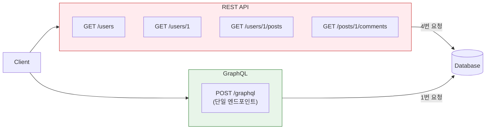
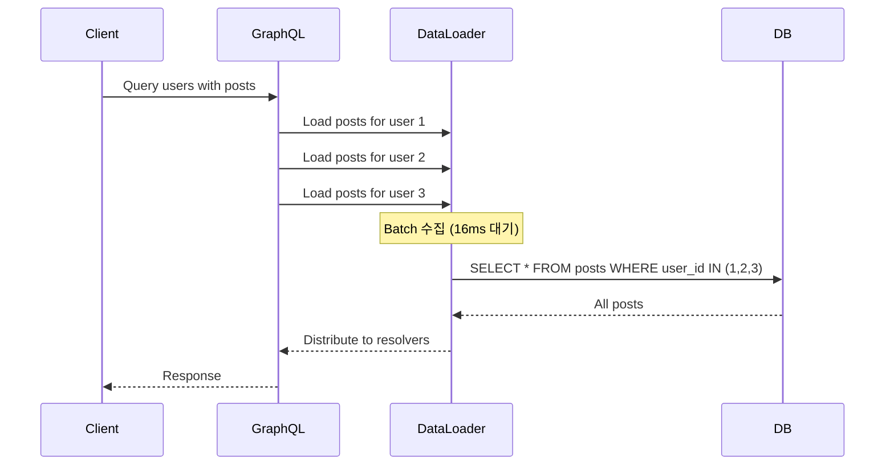

## 이 글에서 얻는 것

- GraphQL과 REST의 **본질적 차이**를 이해합니다
- **N+1 문제**를 DataLoader로 해결하는 패턴을 익힙니다
- 실시간 기능을 위한 **Subscription** 구현 방법을 알아봅니다

---

## GraphQL vs REST

### 핵심 차이



| 특성 | REST | GraphQL |
|------|------|---------|
| 엔드포인트 | 리소스별 다수 | 단일 `/graphql` |
| 데이터 결정 | 서버가 결정 | 클라이언트가 결정 |
| Over-fetching | 발생 가능 | 필요한 것만 요청 |
| Under-fetching | N+1 요청 필요 | 한 번에 해결 |
| 캐싱 | HTTP 캐시 활용 | 별도 전략 필요 |
| 버전 관리 | URL 버전 (/v1, /v2) | Schema Evolution |

### Under-fetching 문제 해결

```graphql
# REST: 3번 요청 필요
# GET /users/1
# GET /users/1/posts
# GET /posts/1/comments

# GraphQL: 1번 요청으로 해결
query GetUserWithPosts {
  user(id: 1) {
    id
    name
    email
    posts {
      id
      title
      comments {
        id
        content
        author {
          name
        }
      }
    }
  }
}
```

---

## Schema 설계 패턴

### Type 정의

```graphql
# schema.graphql

# 기본 타입
type User {
  id: ID!
  email: String!
  name: String!
  posts: [Post!]!
  createdAt: DateTime!
}

type Post {
  id: ID!
  title: String!
  content: String!
  author: User!
  comments: [Comment!]!
  publishedAt: DateTime
}

type Comment {
  id: ID!
  content: String!
  author: User!
  post: Post!
}

# Input 타입 (mutation용)
input CreatePostInput {
  title: String!
  content: String!
}

input UpdatePostInput {
  title: String
  content: String
}

# Query & Mutation
type Query {
  user(id: ID!): User
  users(first: Int, after: String): UserConnection!
  post(id: ID!): Post
  posts(filter: PostFilter): [Post!]!
}

type Mutation {
  createPost(input: CreatePostInput!): Post!
  updatePost(id: ID!, input: UpdatePostInput!): Post!
  deletePost(id: ID!): Boolean!
}
```

### Pagination (Cursor-based)

```graphql
# Relay 스타일 Connection
type UserConnection {
  edges: [UserEdge!]!
  pageInfo: PageInfo!
  totalCount: Int!
}

type UserEdge {
  node: User!
  cursor: String!
}

type PageInfo {
  hasNextPage: Boolean!
  hasPreviousPage: Boolean!
  startCursor: String
  endCursor: String
}

# 사용
query GetUsers {
  users(first: 10, after: "cursor123") {
    edges {
      node {
        id
        name
      }
      cursor
    }
    pageInfo {
      hasNextPage
      endCursor
    }
  }
}
```

### 장점
- Offset 방식의 "Page Drift" 문제 해결
- 무한 스크롤에 적합
- 대용량 데이터에서도 일관된 성능

---

## N+1 문제와 DataLoader

### 문제 상황

```java
// ❌ N+1 문제 발생
@QueryMapping
public List<User> users() {
    return userRepository.findAll();  // 1번 쿼리
}

@SchemaMapping(typeName = "User")
public List<Post> posts(User user) {
    // 각 User마다 호출됨 → N번 쿼리!
    return postRepository.findByUserId(user.getId());
}

// 실행 쿼리:
// 1. SELECT * FROM users (1번)
// 2. SELECT * FROM posts WHERE user_id = 1 (N번)
// 3. SELECT * FROM posts WHERE user_id = 2
// ...
// → 총 N+1번 쿼리!
```

### DataLoader로 해결



```java
// ✅ DataLoader 사용
@Component
public class PostDataLoader extends MappedBatchLoader<Long, List<Post>> {
    
    @Autowired
    private PostRepository postRepository;
    
    @Override
    public CompletionStage<Map<Long, List<Post>>> load(Set<Long> userIds) {
        // 한 번의 쿼리로 모든 posts 조회
        List<Post> allPosts = postRepository.findByUserIdIn(userIds);
        
        // userId별로 그룹화
        Map<Long, List<Post>> postsByUserId = allPosts.stream()
            .collect(Collectors.groupingBy(Post::getUserId));
        
        return CompletableFuture.completedFuture(postsByUserId);
    }
}

// Resolver에서 사용
@SchemaMapping(typeName = "User")
public CompletableFuture<List<Post>> posts(
        User user, 
        DataLoader<Long, List<Post>> postDataLoader) {
    return postDataLoader.load(user.getId());
}
```

**결과**: N+1 쿼리 → 2번 쿼리로 최적화

---

## Subscription (실시간)

### WebSocket 기반 실시간 업데이트

```graphql
# Schema
type Subscription {
  postCreated: Post!
  commentAdded(postId: ID!): Comment!
  userOnlineStatusChanged: UserStatus!
}

type UserStatus {
  userId: ID!
  isOnline: Boolean!
}
```

```java
// Spring GraphQL + WebSocket
@Controller
public class SubscriptionController {
    
    @SubscriptionMapping
    public Flux<Post> postCreated() {
        return postEventPublisher.getPostStream();
    }
    
    @SubscriptionMapping
    public Flux<Comment> commentAdded(@Argument String postId) {
        return commentEventPublisher.getCommentStream()
            .filter(comment -> comment.getPostId().equals(postId));
    }
}

// 이벤트 발행
@Service
public class PostService {
    
    @Autowired
    private Sinks.Many<Post> postSink;
    
    public Post createPost(CreatePostInput input) {
        Post post = postRepository.save(new Post(input));
        postSink.tryEmitNext(post);  // 구독자에게 전파
        return post;
    }
}
```

### 클라이언트 사용

```javascript
// Apollo Client
const POST_SUBSCRIPTION = gql`
  subscription OnPostCreated {
    postCreated {
      id
      title
      author {
        name
      }
    }
  }
`;

function NewPostNotifier() {
  const { data, loading } = useSubscription(POST_SUBSCRIPTION);
  
  if (data) {
    showNotification(`New post: ${data.postCreated.title}`);
  }
  
  return null;
}
```

---

## 보안 및 성능

### Query Complexity 제한

```java
// 쿼리 복잡도 제한
@Configuration
public class GraphQLConfig {
    
    @Bean
    public Instrumentation complexityInstrumentation() {
        return new MaxQueryComplexityInstrumentation(100);  // 최대 100
    }
}
```

```graphql
# 복잡도 계산 예시
query {
  users(first: 10) {           # 복잡도: 10
    posts {                    # 복잡도: 10 * 10 = 100
      comments {               # 복잡도: 100 * 10 = 1000 ❌ 초과!
        author { name }
      }
    }
  }
}
```

### Query Depth 제한

```java
@Bean
public Instrumentation depthInstrumentation() {
    return new MaxQueryDepthInstrumentation(5);  // 최대 5단계
}
```

---

## 요약

### GraphQL vs REST 선택 기준

| GraphQL 선택 | REST 선택 |
|-------------|----------|
| 복잡한 데이터 관계 | 단순 CRUD |
| 모바일 앱 (대역폭 중요) | 캐싱 필수 |
| 다양한 클라이언트 | 파일 업로드/다운로드 |
| 실시간 기능 필요 | 간단한 API |

### 핵심 포인트

- **DataLoader**: N+1 문제 필수 해결책
- **Cursor Pagination**: 대용량 데이터 페이징
- **Subscription**: WebSocket 기반 실시간
- **Complexity/Depth 제한**: DoS 방어

---

## 🔗 Related Deep Dive

- **[gRPC 서비스 설계](/learning/deep-dive/deep-dive-grpc-service-design/)**: Protobuf와 HTTP/2 기반 API.
- **[API Gateway 설계](/learning/deep-dive/deep-dive-api-gateway-design/)**: 인증, 라우팅, Rate Limiting.
