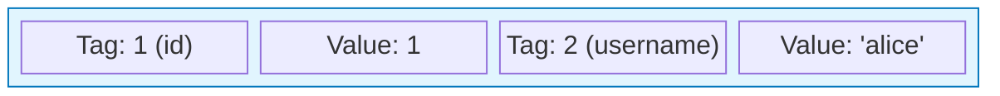
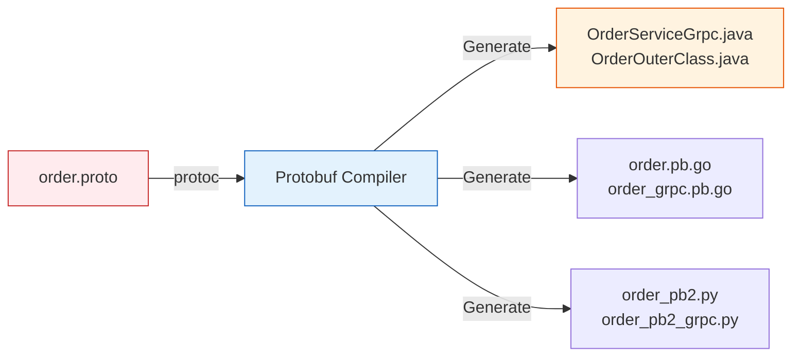
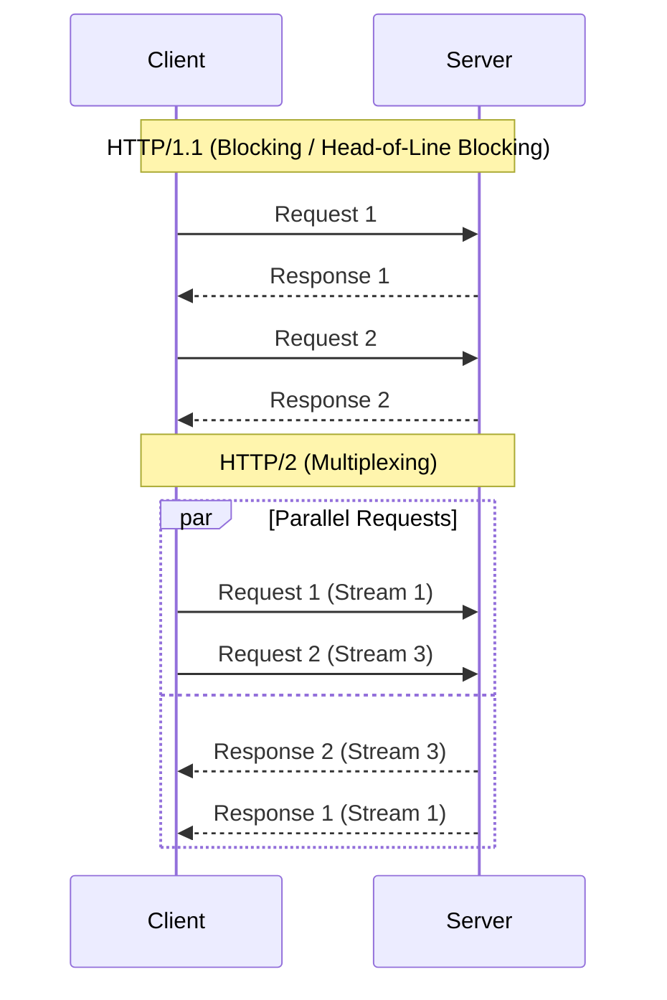

## 이 글에서 얻는 것

- gRPC를 “빠른 REST” 정도로 오해하지 않고, **IDL/코드 생성/스트리밍/데드라인** 중심의 설계 감각을 잡습니다.
- proto 스키마를 호환성 있게 진화시키는 규칙(필드 번호/예약/reserved, deprecated)을 이해합니다.
- 데드라인/리트라이/스트리밍 백프레셔 같은 운영 포인트를 포함해 서비스 계약을 설계할 수 있습니다.

## 0) gRPC는 “계약(Contract) 기반”이다

gRPC의 강점은 **Protobuf(Protocol Buffers)**를 사용한 고효율 바이너리 통신입니다.

### 0.1 Protobuf vs JSON

**JSON**: 사람이 읽을 수 있지만, 필드 이름이 반복되어 용량이 큽니다.
```json
{ "id": 1, "username": "alice" }  // 30 bytes
```

**Protobuf**: 바이너리로 직렬화되며, 필드 번호(Tag)로 데이터를 식별해 매우 작습니다.

*(실제로는 [Tag|Type] + [Length] + [Value] 구조의 TLV 패킹으로 약 9~10 bytes)*

### 0.2 gRPC Interface Definition (IDL)
gRPC는 **계약(Proto)**을 먼저 정의하고, 코드를 자동 생성합니다.


- **Service Stub**: 클라이언트/서버가 통신하기 위한 기본 코드.
- **Message Class**: 데이터를 담는 DTO (Builder 패턴 등 제공).


좋은 gRPC 설계의 핵심 질문:

- 클라이언트가 어떤 타입/에러/타임아웃을 기대할 수 있는가?
- 호출이 멱등(idempotent)한가? 재시도해도 안전한가?
- 스트리밍이 필요한가, 단순 Unary가 충분한가?

## 1) Unary vs Streaming (feat. HTTP/2)

gRPC는 **HTTP/2** 위에서 동작하며, 하나의 커넥션으로 여러 요청을 동시에 처리(Multiplexing)합니다.



### 1.1 Communication Patterns
- **Unary**: 단순 Req/Res (대부분의 API).
- **Server Streaming**: `returns (stream response)` (알림, 피드, 로그).
- **Client Streaming**: `(stream request)` (대용량 업로드).
- **Bidirectional**: `(stream request) returns (stream response)` (실시간 채팅, 게임).

필요한 경우에만 스트리밍을 사용하세요. (운영 복잡도 증가)

## 2) proto 설계: 호환성 규칙이 ‘운영 안전성’이다

proto는 시간이 지나며 바뀝니다. 그래서 호환성 규칙을 지키는 게 중요합니다.

- 필드 번호는 절대 재사용하지 않는다
- 삭제는 `deprecated`로 표시하고, 실제 삭제는 충분히 오래 뒤에
- 제거한 번호/이름은 `reserved`로 막아 사고를 방지
- 타입 변경은 사실상 breaking change일 수 있음(특히 string ↔ int)

예시(개념):

```proto
message Order {
  string id = 1;
  string user_id = 2;
  // deprecated: use created_at instead
  int64 createdAtMillis = 3 [deprecated = true];
  reserved 4, 5;
  reserved "old_field_name";
}
```

## 3) 데드라인/타임아웃: “서버가 아니라 클라이언트가 정한다”

gRPC는 데드라인(deadline)이 문화입니다.

- 클라이언트는 “얼마까지 기다릴지”를 정하고,
- 서버는 데드라인을 넘기면 불필요한 작업을 중단해야 합니다.

서버에서 타임아웃을 무시하면:

- 이미 클라이언트는 포기했는데 서버는 계속 일한다(낭비)
- 부하가 누적돼 장애로 이어질 수 있습니다

## 4) 재시도/멱등성: 자동 재시도는 항상 위험하다

gRPC/클라이언트 SDK는 재시도 기능이 있지만, 무턱대고 켜면 사고가 납니다.

- 멱등한 요청만 재시도(조회/상태 확인 등)
- 쓰기 요청은 idempotency key를 도입하거나, 재시도 정책을 더 보수적으로
- 백오프 + jitter, retry budget 같은 “증폭 방지”가 필요

## 5) 인증/메타데이터/관측성

- 인증 토큰은 메타데이터로 전달(Authorization)
- traceId/correlationId를 메타데이터로 전파
- 서버/클라이언트 인터셉터로 로깅/메트릭/트레이싱을 표준화

## 6) gRPC-Gateway(외부 공개가 필요할 때)

브라우저/외부 파트너는 HTTP/JSON이 필요할 수 있습니다.
이때 gRPC-Gateway로 변환하면 “내부는 gRPC, 외부는 REST” 같은 구조가 가능합니다.

포인트:

- 외부에서 들어오는 rate limit/인증은 게이트웨이에서 1차로 처리하는 편이 안전합니다.

## 연습(추천)

- 간단한 `OrderService` proto를 설계해보고, “필드 추가/이름 변경/삭제” 시나리오에서 호환성을 어떻게 지킬지 `reserved/deprecated`로 표현해보기
- Unary API에 데드라인을 적용하고, 데드라인 초과 시 서버가 작업을 중단하도록 구현해보기
- 서버 스트리밍 API에서 느린 소비자(클라이언트)를 시뮬레이션하고, 백프레셔/버퍼 정책을 어떻게 둘지 실험해보기
