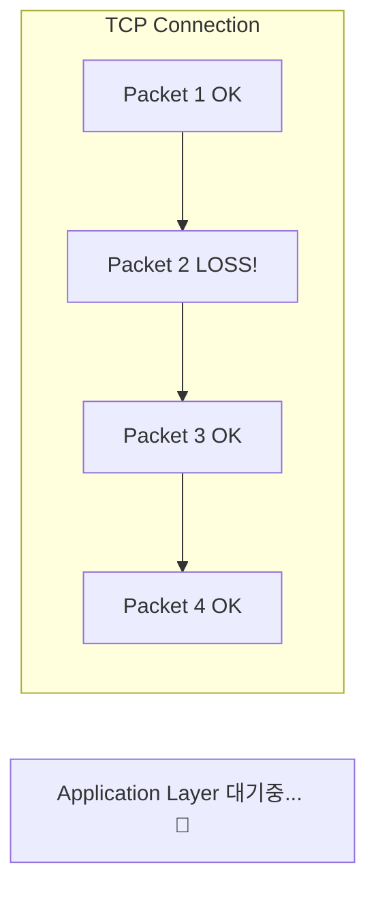
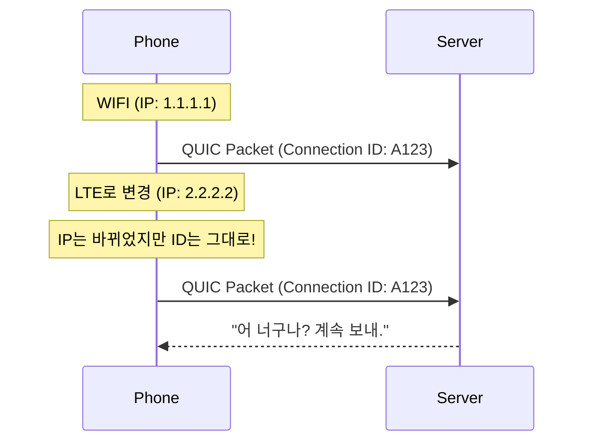

## 🐌 1. TCP는 억울하다 (하지만 느리다)

TCP는 1970년대에 만들어졌습니다. "신뢰성"이 최우선이었죠.
하지만 현대 웹(이미지, CSS, JS 수백 개 로딩) 환경에서는 **구조적 결함**이 드러났습니다.

### Head-of-Line (HOL) Blocking



- 패킷 2번이 손실되면, **이미 도착한 3, 4번도 줄을 서서 기다려야 합니다.**
- "앞차가 고장 나면 뒷차들도 못 가는" 왕복 1차선 도로와 같습니다.
- HTTP/2는 하나의 TCP 연결에 여러 요청을 구겨 넣었기(Multiplexing) 때문에, 이 문제가 더 심각했습니다.

---

## 🚀 2. QUIC: UDP 위의 혁명

구글은 생각했습니다. *"TCP를 고치려면 전 세계 OS를 다 업데이트해야 하네? 불가능해. 그냥 UDP 위에 새로 만들자!"*
그게 바로 **QUIC (Quick UDP Internet Connections)**입니다.

### 프로토콜 스택 비교

```mermaid
graph BT
    subgraph HTTP/2
    H2[HTTP/2] --> TLS[TLS 1.2/1.3] --> TCP --> IP1[IP]
    end
    
    subgraph HTTP/3
    H3[HTTP/3] --> QUIC[QUIC (Reliability + TLS)] --> UDP --> IP2[IP]
    end
    
    style QUIC fill:#f96
    style UDP fill:#f96
```

### 1) Independent Streams (진정한 멀티플렉싱)
- QUIC은 각각의 요청(Stream)이 **독립적**입니다.
- 이미지 A 패킷이 날아가도, CSS 파일 패킷은 멈추지 않고 처리됩니다.

### 2) 0-RTT Handshake (연결 속도 혁명)
- **TCP+TLS**: 통성명(Syn/Ack)하고 암호키 교환하느라 2~3번 왔다 갔다 합니다.
- **QUIC**: "안녕!" 할 때 암호키 정보와 데이터를 같이 보냅니다. (1-RTT). 한 번 본 사이트는 바로 데이터부터 쏘기도 합니다 (0-RTT).

---

## 📱 3. Connection Migration (모바일 최적화)

와이파이 잡고 유튜브 보다가, 현관문 나가면서 LTE로 바뀌는 순간 영상이 멈칫하죠?
TCP 연결이 끊어지고 다시 맺기 때문입니다.



- **TCP**: `IP:Port`로 식별 -> IP 바뀌면 끊김.
- **QUIC**: `Connection ID`로 식별 -> IP 바뀌어도 유지됨.

## 요약

1. **HOL Blocking 제거**: 패킷 하나 잃어버려도 전체가 안 멈춘다.
2. **0-RTT**: 연결 수립이 미친듯이 빠르다.
3. **Connection Migration**: 와이파이 갈아탈 때 안 끊긴다.
4. 이 모든 게 **UDP** 덕분이다. (HTTP/3 = HTTP over QUIC)
