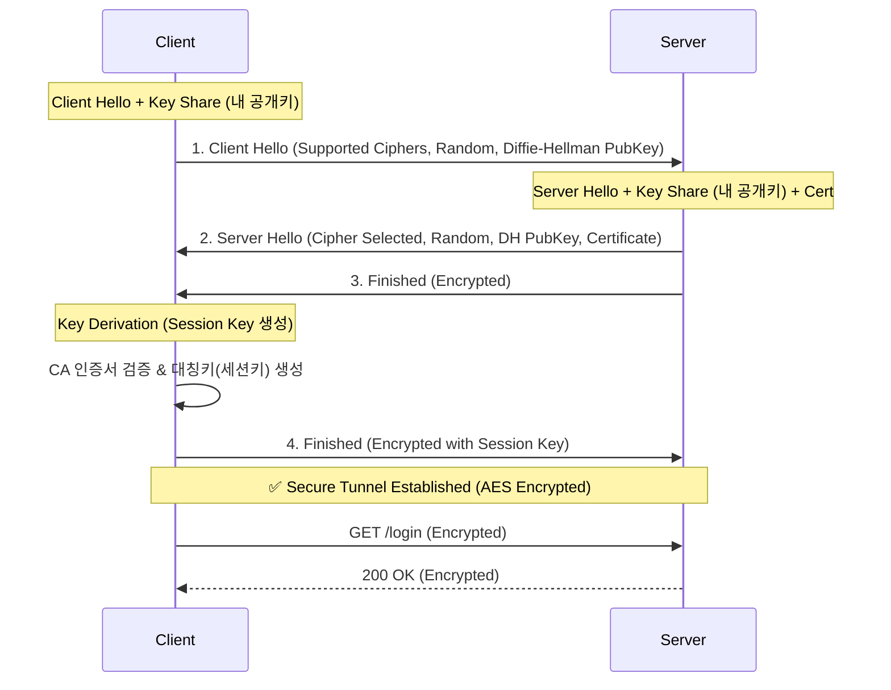

## 이 글에서 얻는 것

- **대칭키**와 **비대칭키** 암호화가 HTTPS에서 어떻게 섞여 쓰이는지 이해합니다.
- **TLS 1.3 Handshake** (1-RTT) 과정을 다이어그램으로 설명할 수 있습니다.
- **CA(인증 기관)**와 **Chain of Trust**의 개념을 잡습니다.

## 0) HTTP는 왜 위험한가?

HTTP는 텍스트(Plain Text)로 통신합니다.
와이어사크(Wireshark) 같은 툴로 패킷을 감청하면, 로그인할 때 보낸 비밀번호가 그대로 보입니다.

**HTTPS**는 이 HTTP 메시지를 **SSL/TLS 프로토콜**로 감싸서 암호화합니다.

## 1) 대칭키 vs 비대칭키 (핵심: 하이브리드)

| 방식 | 설명 | 장점 | 단점 |
|:---|:---|:---|:---|
| **대칭키 (Symmetric)** | 암호화/복호화 키가 **같음** (AES) | 속도가 매우 빠름 | 키를 어떻게 상대방에게 안전하게 전달할 것인가? (Key Exchange Problem) |
| **비대칭키 (Asymmetric)** | 공개키(Public)로 암호화, 개인키(Private)로 복호화 (RSA) | 키 공유 불필요 (공개키는 줘도 됨) | 속도가 매우 느림 (대칭키보다 약 1000배 느림) |

**HTTPS의 전략 (하이브리드 암호화):**
1.  처음 연결할 때만 **비대칭키**를 사용해서,
2.  앞으로 사용할 **대칭키(Session Key)**를 안전하게 교환하고,
3.  이후 통신은 빠른 **대칭키**로 암호화합니다.

## 2) TLS 1.2 vs TLS 1.3 Handshake

TLS 1.3은 핸드셰이크 과정을 획기적으로 줄였습니다(1-RTT).

### TLS 1.3 Handshake (간소화)



**과정 요약:**
1.  **Client Hello**: "나 TLS 1.3 지원해. 내 임시 공개키(Diffie-Hellman) 받아."
2.  **Server Hello**: "그래. 내 인증서랑 내 공개키도 받아."
3.  **검증 & 키 생성**: 클라이언트는 서버 인증서를 CA(Root Certificate)로 검증하고, 서로 교환한 공개키를 조합해 **공동의 비밀키(Session Key)**를 만듭니다.

## 3) Chain of Trust (신뢰 사슬)

브라우저는 어떻게 서버가 보낸 인증서를 믿을까요?
브라우저(OS)에는 이미 전 세계적으로 신뢰받는 **Root CA**들의 공개키가 내장되어 있습니다.

```mermaid
graph BT
    EndEntity[My Server Cert<br/>(google.com)] -->|Signed by| Intermediate[Intermediate CA<br/>(GTS CA 1C3)]
    Intermediate -->|Signed by| Root[Root CA<br/>(DigiCert Global Root)]
    
    Root -.->|Built-in Trust| Browser[Browser/OS<br/>Trusted Store]

    style Root fill:#e8f5e9,stroke:#2e7d32,stroke-width:2px
    style Intermediate fill:#fff9c4,stroke:#fbc02d
    style EndEntity fill:#e1f5fe,stroke:#0277bd
```

서버 인증서는 중간 인증기관(Intermediate CA)이 서명하고, 중간 인증기관은 루트 인증기관(Root CA)이 서명합니다.
브라우저는 루트 인증기관의 서명을 확인함으로써, 이 연결고리(Chain)를 따라 최종 서버 인증서를 신뢰합니다.

## 요약

- **HTTPS**는 비대칭키로 대칭키를 교환하고, 대칭키로 데이터를 암호화합니다.
- **TLS 1.3**은 핸드셰이크 횟수를 줄여 연결 속도를 높였습니다.
- **CA(인증 기관)** 시스템 덕분에 우리는 처음 방문하는 사이트도 신뢰할 수 있습니다.

## 다음 단계

- **Phase 13 완료**: 보안 기초를 모두 다뤘습니다.
- **Phase 14**: 모던 백엔드 개발자 스펙 (gRPC, Redis, Kafka의 심화 운영)으로 넘어갑니다.
