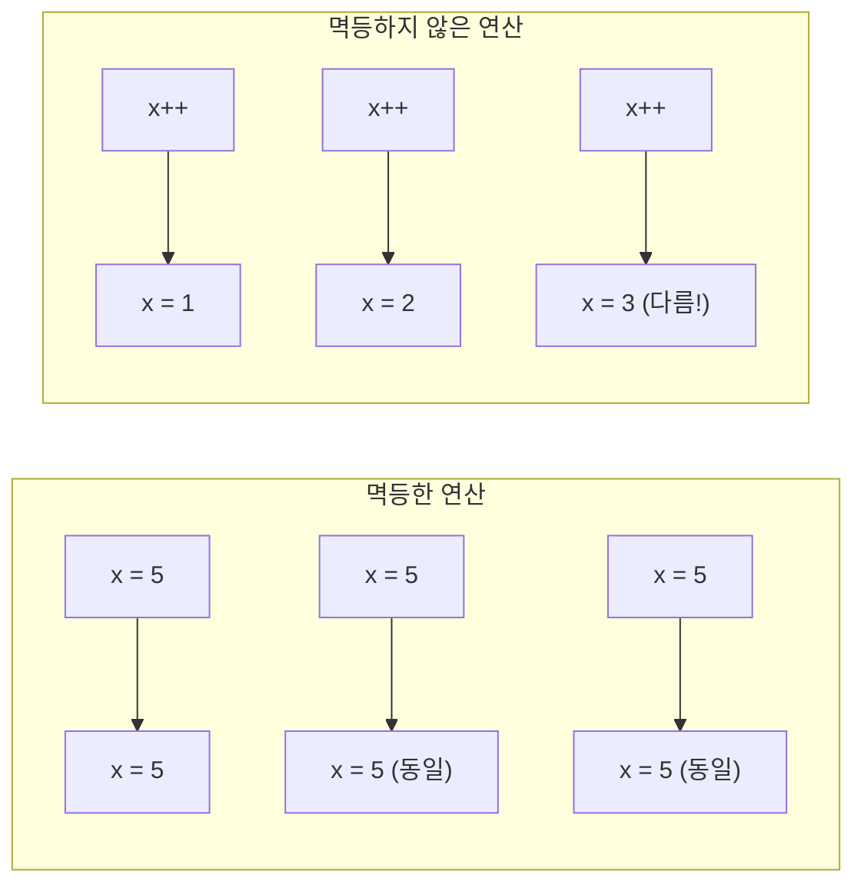
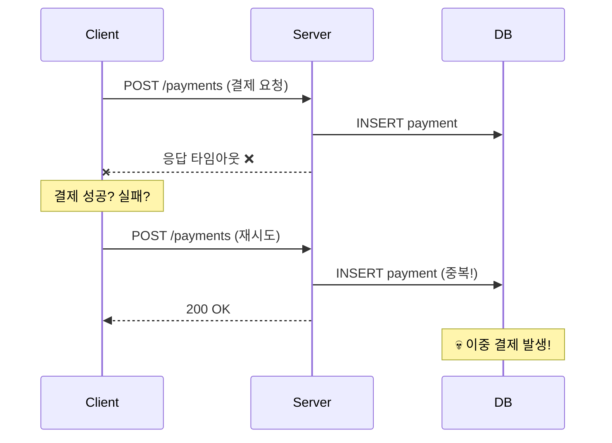
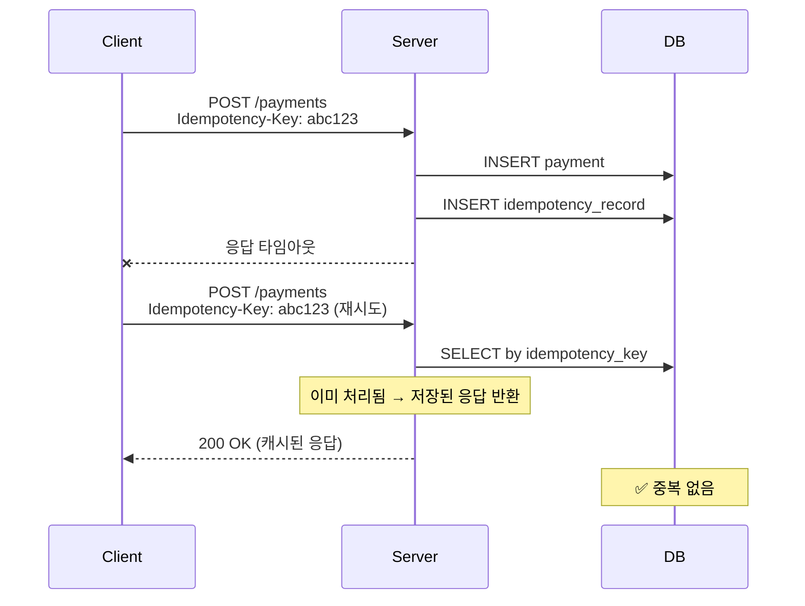

## 이 글에서 얻는 것

- **멱등성(Idempotency)**의 개념과 중요성을 이해합니다
- **Idempotency Key 패턴**으로 중복 요청을 처리합니다
- **결제/주문 API**에서 멱등성을 구현하는 방법을 알아봅니다

---

## 멱등성이란?

### 정의

**멱등성**: 동일한 요청을 여러 번 보내도 결과가 같음



### HTTP 메서드별 멱등성

| 메서드 | 멱등성 | 안전성 | 예시 |
|--------|--------|--------|------|
| GET | ✅ | ✅ | 조회 |
| PUT | ✅ | ❌ | 전체 업데이트 |
| DELETE | ✅ | ❌ | 삭제 |
| **POST** | ❌ | ❌ | 생성 |
| PATCH | ❌ | ❌ | 부분 업데이트 |

---

## 왜 멱등성이 필요한가?

### 문제: 네트워크 불확실성



### 해결: 멱등성 보장



---

## Idempotency Key 패턴

### 구현

```java
@Entity
@Table(name = "idempotency_records")
public class IdempotencyRecord {
    @Id
    private String key;
    
    private String requestHash;    // 요청 본문 해시
    private String response;       // 저장된 응답
    private Integer statusCode;
    private LocalDateTime createdAt;
    private LocalDateTime expiresAt;
}

@Service
public class IdempotencyService {
    
    @Autowired
    private IdempotencyRepository repository;
    
    public Optional<IdempotencyRecord> findByKey(String key) {
        return repository.findById(key)
            .filter(r -> r.getExpiresAt().isAfter(LocalDateTime.now()));
    }
    
    @Transactional
    public IdempotencyRecord save(String key, String requestHash, 
                                   String response, int statusCode) {
        IdempotencyRecord record = new IdempotencyRecord();
        record.setKey(key);
        record.setRequestHash(requestHash);
        record.setResponse(response);
        record.setStatusCode(statusCode);
        record.setCreatedAt(LocalDateTime.now());
        record.setExpiresAt(LocalDateTime.now().plusHours(24));  // 24시간 유지
        return repository.save(record);
    }
}
```

### Controller 적용

```java
@RestController
@RequestMapping("/api/payments")
public class PaymentController {
    
    @Autowired
    private IdempotencyService idempotencyService;
    @Autowired
    private PaymentService paymentService;
    
    @PostMapping
    public ResponseEntity<?> createPayment(
            @RequestHeader("Idempotency-Key") String idempotencyKey,
            @RequestBody PaymentRequest request) {
        
        // 1. 기존 요청 확인
        Optional<IdempotencyRecord> existing = 
            idempotencyService.findByKey(idempotencyKey);
        
        if (existing.isPresent()) {
            IdempotencyRecord record = existing.get();
            
            // 요청 본문 검증 (같은 키, 다른 요청 방지)
            String requestHash = hashRequest(request);
            if (!record.getRequestHash().equals(requestHash)) {
                return ResponseEntity.status(HttpStatus.UNPROCESSABLE_ENTITY)
                    .body("Idempotency key reused with different request");
            }
            
            // 캐시된 응답 반환
            return ResponseEntity.status(record.getStatusCode())
                .body(record.getResponse());
        }
        
        // 2. 새 요청 처리
        try {
            PaymentResponse response = paymentService.processPayment(request);
            
            // 3. 멱등성 레코드 저장
            idempotencyService.save(
                idempotencyKey,
                hashRequest(request),
                objectMapper.writeValueAsString(response),
                200
            );
            
            return ResponseEntity.ok(response);
            
        } catch (PaymentException e) {
            // 실패도 저장 (같은 요청 재시도 시 같은 에러)
            idempotencyService.save(
                idempotencyKey,
                hashRequest(request),
                e.getMessage(),
                400
            );
            throw e;
        }
    }
    
    private String hashRequest(PaymentRequest request) {
        return DigestUtils.sha256Hex(
            request.getAmount() + request.getCurrency() + request.getOrderId()
        );
    }
}
```

---

## AOP로 공통화

### 커스텀 어노테이션

```java
@Target(ElementType.METHOD)
@Retention(RetentionPolicy.RUNTIME)
public @interface Idempotent {
    String keyHeader() default "Idempotency-Key";
    int ttlHours() default 24;
}
```

### Aspect

```java
@Aspect
@Component
public class IdempotencyAspect {
    
    @Autowired
    private IdempotencyService idempotencyService;
    
    @Around("@annotation(idempotent)")
    public Object handleIdempotency(ProceedingJoinPoint pjp, 
                                     Idempotent idempotent) throws Throwable {
        
        HttpServletRequest request = getCurrentRequest();
        String key = request.getHeader(idempotent.keyHeader());
        
        if (key == null) {
            throw new IllegalArgumentException("Idempotency key required");
        }
        
        // 기존 응답 확인
        Optional<IdempotencyRecord> existing = idempotencyService.findByKey(key);
        if (existing.isPresent()) {
            return deserializeResponse(existing.get());
        }
        
        // 새 요청 처리
        Object result = pjp.proceed();
        
        // 결과 저장
        idempotencyService.save(key, getRequestHash(request), 
            serializeResponse(result), HttpStatus.OK.value());
        
        return result;
    }
}
```

### 사용

```java
@RestController
public class OrderController {
    
    @PostMapping("/api/orders")
    @Idempotent  // 간단히 어노테이션 추가
    public OrderResponse createOrder(@RequestBody OrderRequest request) {
        return orderService.createOrder(request);
    }
}
```

---

## 분산 환경 고려사항

### Redis 기반 구현

```java
@Service
public class RedisIdempotencyService {
    
    @Autowired
    private StringRedisTemplate redisTemplate;
    
    private static final String PREFIX = "idempotency:";
    
    public boolean tryAcquire(String key, Duration ttl) {
        // SETNX로 원자적 락 획득
        Boolean acquired = redisTemplate.opsForValue()
            .setIfAbsent(PREFIX + key, "processing", ttl);
        return Boolean.TRUE.equals(acquired);
    }
    
    public void saveResponse(String key, String response, Duration ttl) {
        redisTemplate.opsForValue()
            .set(PREFIX + key, response, ttl);
    }
    
    public Optional<String> getResponse(String key) {
        String response = redisTemplate.opsForValue().get(PREFIX + key);
        if ("processing".equals(response)) {
            return Optional.empty();  // 아직 처리 중
        }
        return Optional.ofNullable(response);
    }
}
```

### 동시 요청 처리

```java
@PostMapping("/api/payments")
public ResponseEntity<?> createPayment(
        @RequestHeader("Idempotency-Key") String key,
        @RequestBody PaymentRequest request) {
    
    // 1. 이미 완료된 요청 확인
    Optional<String> cachedResponse = idempotencyService.getResponse(key);
    if (cachedResponse.isPresent()) {
        return ResponseEntity.ok(cachedResponse.get());
    }
    
    // 2. 락 획득 시도
    if (!idempotencyService.tryAcquire(key, Duration.ofMinutes(5))) {
        // 다른 요청이 처리 중 → 잠시 대기 후 재시도 유도
        return ResponseEntity.status(HttpStatus.CONFLICT)
            .header("Retry-After", "2")
            .body("Request is being processed");
    }
    
    try {
        // 3. 처리
        PaymentResponse response = paymentService.process(request);
        
        // 4. 응답 저장
        idempotencyService.saveResponse(key, 
            objectMapper.writeValueAsString(response), Duration.ofHours(24));
        
        return ResponseEntity.ok(response);
        
    } catch (Exception e) {
        // 실패 시에도 응답 저장 (선택적)
        idempotencyService.saveResponse(key, 
            "ERROR:" + e.getMessage(), Duration.ofHours(24));
        throw e;
    }
}
```

---

## 클라이언트 측 구현

### Idempotency Key 생성

```javascript
// 클라이언트에서 UUID 생성
const idempotencyKey = crypto.randomUUID();

fetch('/api/payments', {
  method: 'POST',
  headers: {
    'Content-Type': 'application/json',
    'Idempotency-Key': idempotencyKey
  },
  body: JSON.stringify(paymentData)
});
```

### 재시도 로직

```javascript
async function createPaymentWithRetry(data, maxRetries = 3) {
  const idempotencyKey = crypto.randomUUID();
  
  for (let i = 0; i < maxRetries; i++) {
    try {
      const response = await fetch('/api/payments', {
        method: 'POST',
        headers: {
          'Idempotency-Key': idempotencyKey  // 동일한 키 사용
        },
        body: JSON.stringify(data)
      });
      
      if (response.status === 409) {  // Conflict - 처리 중
        await sleep(2000);  // 대기 후 재시도
        continue;
      }
      
      return await response.json();
      
    } catch (error) {
      if (i === maxRetries - 1) throw error;
      await sleep(1000 * Math.pow(2, i));  // Exponential backoff
    }
  }
}
```

---

## 요약

### 멱등성 체크리스트

| 항목 | 구현 |
|------|------|
| 키 저장소 | DB / Redis |
| 키 TTL | 24시간 권장 |
| 동시 요청 | 락 또는 409 Conflict |
| 요청 검증 | 해시 비교 |
| 실패 처리 | 에러도 저장 (선택) |

### 핵심 원칙

1. **클라이언트가 키 생성**: 재시도 시 동일 키 사용
2. **요청 본문 검증**: 같은 키, 다른 요청 차단
3. **응답 캐싱**: 성공/실패 모두 저장
4. **TTL 설정**: 무한 저장 방지

---

## 🔗 Related Deep Dive

- **[분산 트랜잭션](/learning/deep-dive/deep-dive-distributed-transactions/)**: SAGA와 보상 트랜잭션.
- **[API Gateway](/learning/deep-dive/deep-dive-api-gateway-design/)**: 중앙 집중식 멱등성 처리.
