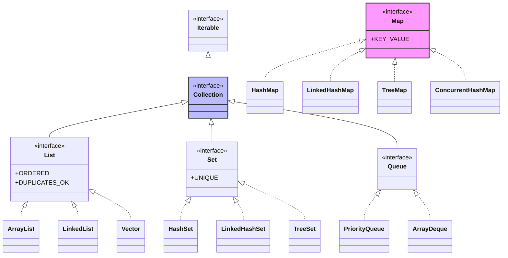
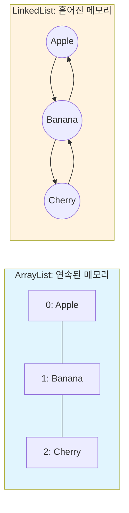
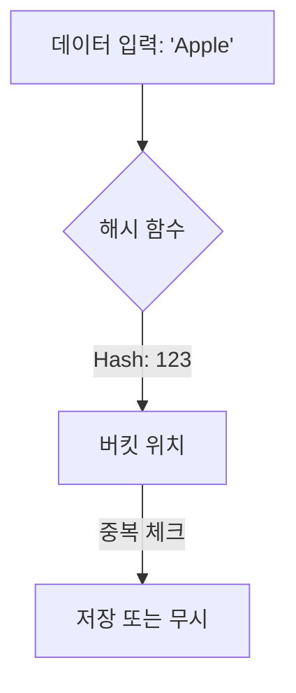
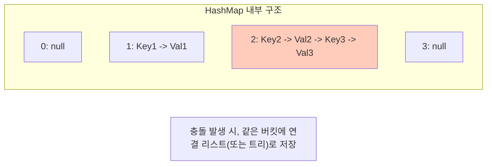

## 이 글에서 얻는 것

- **List/Set/Map의 핵심 차이**를 시간 복잡도와 사용 목적으로 설명할 수 있습니다.
- ArrayList vs LinkedList, HashMap vs TreeMap 같은 선택 기준을 **실제 사용 패턴**으로 판단합니다.
- 동시성 환경에서의 컬렉션 선택(ConcurrentHashMap, CopyOnWriteArrayList)을 이해합니다.
- 컬렉션 성능 이슈(N+1, 불필요한 복사)를 예방하는 습관을 갖습니다.

## 0) Collection Framework는 '자료구조'를 일관된 인터페이스로 제공한다

Java Collection Framework는 데이터를 저장하고 조작하는 표준화된 방법을 제공합니다.
핵심은 **"어떤 데이터를 어떻게 저장하고 찾을 것인가"**를 상황에 맞게 선택하는 것입니다.



## 1) List: 순서가 있고, 중복을 허용하는 컬렉션

> [!TIP]
> **List의 핵심**: "줄 서기"입니다. 들어온 순서대로 저장되고, 번호표(Index)로 찾습니다.



### 1-1) ArrayList: 가장 많이 쓰는 리스트

```java
// ArrayList: 내부적으로 배열 사용
List<String> list = new ArrayList<>();
list.add("Apple");      // O(1) - 끝에 추가
list.add("Banana");
list.get(0);            // O(1) - 인덱스 접근
list.remove(0);         // O(n) - 중간 삭제 시 shift 발생

// 초기 용량 지정 (성능 최적화)
List<String> optimized = new ArrayList<>(1000);  // 미리 공간 확보
```

**언제 사용:**
- 인덱스 기반 조회가 많을 때
- 끝에 추가/삭제가 주된 작업일 때
- 대부분의 경우 ArrayList가 기본 선택

**시간 복잡도:**
- get(index): O(1)
- add(element): O(1) amortized (배열 확장 시 O(n))
- add(index, element): O(n) (shift 필요)
- remove(index): O(n) (shift 필요)
- contains(element): O(n)

### 1-2) LinkedList: 중간 삽입/삭제가 많을 때

```java
List<String> linkedList = new LinkedList<>();
linkedList.add("Apple");        // O(1)
linkedList.add(0, "Banana");    // O(n) - 탐색 후 O(1) 삽입
linkedList.remove(0);           // O(1) - 첫 번째 삭제

// Deque로 사용 (양방향 큐)
Deque<String> deque = new LinkedList<>();
deque.addFirst("First");        // O(1)
deque.addLast("Last");          // O(1)
deque.pollFirst();              // O(1)
```

**언제 사용:**
- 앞/뒤에서 자주 추가/삭제할 때 (Deque로 사용)
- 중간 삽입/삭제가 정말 많을 때 (드뭄)

**주의:**
- 인덱스 접근(get)이 O(n)이라 느림
- 메모리 오버헤드가 큼 (노드마다 포인터 저장)
- **대부분의 경우 ArrayList가 더 빠름** (캐시 지역성)

### 1-3) ArrayList vs LinkedList 실전 선택

```java
// ✅ ArrayList 선택
List<Order> orders = new ArrayList<>();
// - 조회가 많고, 끝에 추가만 함
// - 대부분의 일반적인 경우

// ✅ LinkedList 선택 (Deque로 사용)
Deque<Task> taskQueue = new LinkedList<>();
taskQueue.addFirst(urgentTask);   // 우선 작업 앞에 추가
taskQueue.pollLast();              // 마지막 작업 제거

// ❌ 피해야 할 패턴
List<String> bad = new LinkedList<>();
for (int i = 0; i < 1000; i++) {
    bad.get(i);  // O(n) * 1000 = O(n²) - 매우 느림!
}
```

## 2) Set: 중복을 허용하지 않는 컬렉션

> [!NOTE]
> **Set의 핵심**: "주머니 속 구슬"입니다. 순서가 없고, 같은 구슬(데이터)은 두 번 넣을 수 없습니다.

### 2-1) 주요 구현체 비교

| 구현체 | 특징 | 정렬/순서 | 시간 복잡도 |
| :--- | :--- | :--- | :--- |
| **HashSet** | 가장 빠름 (일반적 선택) | X | $O(1)$ |
| **TreeSet** | 데이터가 자동 정렬됨 | 정렬됨 (Binary Tree) | $O(\log n)$ |
| **LinkedHashSet** | 입력한 순서대로 조회 가능 | 입력 순서 유지 | $O(1)$ |

### 2-2) HashSet: 가장 빠른 Set



### 2-2) TreeSet: 정렬된 Set

```java
Set<Integer> sorted = new TreeSet<>();
sorted.add(5);
sorted.add(1);
sorted.add(3);
System.out.println(sorted);  // [1, 3, 5] - 자동 정렬

// 범위 검색
TreeSet<Integer> scores = new TreeSet<>();
scores.addAll(Arrays.asList(85, 90, 75, 95, 80));
System.out.println(scores.subSet(80, 90));  // [80, 85] - 80 이상 90 미만
```

**언제 사용:**
- 자동 정렬이 필요
- 범위 검색이 필요 (subSet, headSet, tailSet)

**시간 복잡도:**
- add/remove/contains: O(log n)

### 2-3) LinkedHashSet: 순서를 보장하는 Set

```java
Set<String> insertOrder = new LinkedHashSet<>();
insertOrder.add("Banana");
insertOrder.add("Apple");
insertOrder.add("Cherry");
System.out.println(insertOrder);  // [Banana, Apple, Cherry] - 삽입 순서 유지
```

**언제 사용:**
- 중복 제거 + 삽입 순서 유지

## 3) Map: Key-Value 쌍을 저장하는 컬렉션

> [!IMPORTANT]
> **Map의 핵심**: "사물함"입니다. 열쇠(Key)로 사물함(Value)을 엽니다. 열쇠는 중복될 수 없습니다.



### 3-1) 주요 구현체 비교

| 구현체 | 특징 | 정렬/순서 | 시간 복잡도 |
| :--- | :--- | :--- | :--- |
| **HashMap** | 가장 빠름 (표준) | X | $O(1)$ |
| **TreeMap** | Key 기준 자동 정렬 | 정렬됨 (Red-Black Tree) | $O(\log n)$ |
| **LinkedHashMap** | 입력 순서 or 접근 순서 유지 | 입력/LRU 순서 | $O(1)$ |


### 3-2) HashMap: 가장 많이 쓰는 Map

```java
Map<String, Integer> ages = new HashMap<>();
ages.put("Alice", 25);          // O(1)
ages.put("Bob", 30);
ages.get("Alice");              // O(1) - 25
ages.containsKey("Alice");      // O(1)
ages.remove("Bob");             // O(1)

// 초기 용량 지정 (성능 최적화)
Map<String, User> users = new HashMap<>(10000, 0.75f);
// 10000개 수용, load factor 0.75

// getOrDefault 활용
int count = wordCount.getOrDefault("hello", 0);

// computeIfAbsent 활용 (초기화 간소화)
Map<String, List<Order>> ordersByCustomer = new HashMap<>();
ordersByCustomer.computeIfAbsent("customer1", k -> new ArrayList<>())
    .add(new Order());
```

**언제 사용:**
- Key로 빠르게 조회
- 순서가 중요하지 않을 때
- 대부분의 경우 HashMap이 기본 선택

**시간 복잡도:**
- get/put/remove/containsKey: O(1) average

### 3-2) TreeMap: 정렬된 Map

```java
Map<Integer, String> sorted = new TreeMap<>();
sorted.put(3, "Three");
sorted.put(1, "One");
sorted.put(2, "Two");
System.out.println(sorted);  // {1=One, 2=Two, 3=Three} - Key 정렬

// 범위 검색
TreeMap<Integer, String> scores = new TreeMap<>();
scores.put(85, "B");
scores.put(90, "A");
scores.put(75, "C");
System.out.println(scores.subMap(80, 90));  // {85=B} - 80 이상 90 미만
```

**언제 사용:**
- Key 기준 자동 정렬
- 범위 검색 필요

**시간 복잡도:**
- get/put/remove: O(log n)

### 3-3) LinkedHashMap: 순서를 보장하는 Map

```java
Map<String, Integer> insertOrder = new LinkedHashMap<>();
insertOrder.put("Banana", 1);
insertOrder.put("Apple", 2);
insertOrder.put("Cherry", 3);
System.out.println(insertOrder);  // {Banana=1, Apple=2, Cherry=3} - 삽입 순서

// LRU 캐시 구현
Map<String, String> lruCache = new LinkedHashMap<>(16, 0.75f, true) {
    @Override
    protected boolean removeEldestEntry(Map.Entry<String, String> eldest) {
        return size() > 100;  // 최대 100개 유지
    }
};
```

**언제 사용:**
- 삽입/접근 순서 유지
- LRU 캐시 구현

## 4) 동시성 컬렉션

### 4-1) ConcurrentHashMap

```java
// ❌ HashMap (멀티스레드 환경에서 안전하지 않음)
Map<String, Integer> unsafe = new HashMap<>();

// ✅ ConcurrentHashMap (멀티스레드 안전)
Map<String, Integer> concurrent = new ConcurrentHashMap<>();
concurrent.put("count", 0);
concurrent.compute("count", (k, v) -> v == null ? 1 : v + 1);  // 원자적 연산

// putIfAbsent (원자적)
concurrent.putIfAbsent("key", 1);  // key가 없을 때만 추가
```

**언제 사용:**
- 멀티스레드 환경에서 Map 사용
- 높은 동시성 필요

### 4-2) CopyOnWriteArrayList

```java
// 읽기가 많고 쓰기가 적을 때
List<Listener> listeners = new CopyOnWriteArrayList<>();
listeners.add(listener1);  // 복사 발생 (느림)
listeners.forEach(l -> l.onEvent());  // 반복 중 수정 안전
```

**언제 사용:**
- 읽기가 압도적으로 많고, 쓰기가 드물 때
- 이벤트 리스너 목록 등

## 5) 실전 선택 가이드

### 5-1) 상황별 컬렉션 선택 Cheat Sheet

> [!TIP]
> 5초 안에 결정하는 법:
> 1. 순서 중요? → **List** (대부분 `ArrayList`)
> 2. 중복 제거? → **Set** (`HashSet`)
> 3. Key-Value? → **Map** (`HashMap`)

### 5-2) 자주 하는 실수 (Performance Anti-patterns)

> [!WARNING]
> **Anti-pattern 1: 초기 용량(Initial Capacity) 무시**
> `new ArrayList<>()`는 크기가 찰 때마다 배열을 2배로 늘리고 데이터를 **복사**합니다. 데이터 개수를 안다면 `new ArrayList<>(10000)`처럼 지정하세요.

```java
// ❌ 실수: 여러 번 재할당 발생
Map<String, User> users = new HashMap<>(); 
// ✅ 수정: 초기 용량 지정
Map<String, User> users = new HashMap<>(10000);
```

> [!WARNING]
> **Anti-pattern 2: `contains()` 남발**
> `ArrayList.contains()`는 $O(n)$입니다. 반복문 안에서 쓰면 $O(n^2)$이 됩니다. 존재 여부 확인은 **Set**($O(1)$)을 쓰세요.

### 5-3) 성능 체크리스트

```java
// 1️⃣ 초기 용량 지정
List<String> list = new ArrayList<>(expectedSize);
Map<String, Integer> map = new HashMap<>(expectedSize);

// 2️⃣ 적절한 컬렉션 선택
// 조회 많음 → ArrayList, HashMap
// 정렬 필요 → TreeSet, TreeMap
// 순서 유지 → LinkedHashSet, LinkedHashMap

// 3️⃣ 불변 컬렉션 (읽기 전용)
List<String> immutable = List.of("a", "b", "c");  // Java 9+
Set<Integer> immutableSet = Set.of(1, 2, 3);
Map<String, Integer> immutableMap = Map.of("a", 1, "b", 2);

// 4️⃣ Stream API 활용
List<String> filtered = list.stream()
    .filter(s -> s.startsWith("A"))
    .collect(Collectors.toList());
```

## 6) 컬렉션 유틸리티

```java
// Collections 유틸리티
Collections.sort(list);                          // 정렬
Collections.reverse(list);                       // 역순
Collections.shuffle(list);                       // 랜덤 섞기
Collections.frequency(list, "Apple");            // 빈도 수
Collections.max(list);                           // 최댓값
Collections.unmodifiableList(list);              // 읽기 전용

// Arrays 유틸리티
List<String> list = Arrays.asList("a", "b", "c");  // 배열 → 리스트 (고정 크기)
String[] array = list.toArray(new String[0]);      // 리스트 → 배열

// 비교: asList vs List.of (Java 9+)
List<String> mutable = new ArrayList<>(Arrays.asList("a", "b"));  // 수정 가능
List<String> immutable = List.of("a", "b");                       // 수정 불가
```

## 연습 (추천)

1. ArrayList와 LinkedList의 성능 차이를 직접 측정해보기
   - 10만 개 데이터 삽입/조회 시간 비교

2. HashMap 초기 용량에 따른 성능 차이 확인
   - 용량 지정 vs 미지정, 1만 개 데이터 삽입 시간

3. ConcurrentHashMap의 동시성 테스트
   - 여러 스레드에서 동시에 put/get 실행

4. 실무 코드에서 컬렉션 선택이 적절한지 검토
   - contains() 반복 사용 → Set으로 변경
   - HashMap 초기 용량 미지정 → 용량 지정

## 요약: 스스로 점검할 것

- List/Set/Map의 차이와 시간 복잡도를 설명할 수 있다
- ArrayList vs LinkedList 선택 기준을 말할 수 있다 (대부분 ArrayList)
- HashMap vs TreeMap 선택 기준을 말할 수 있다 (정렬 필요 시 TreeMap)
- 멀티스레드 환경에서 ConcurrentHashMap을 사용할 수 있다
- 초기 용량 지정으로 성능을 최적화할 수 있다

## 다음 단계

- Java Stream/Optional: `/learning/deep-dive/deep-dive-java-stream-optional/`
- Java 동시성 기초: `/learning/deep-dive/deep-dive-java-concurrency-basics/`
- 자료구조 복잡도: `/learning/deep-dive/deep-dive-data-structure-complexity/`
