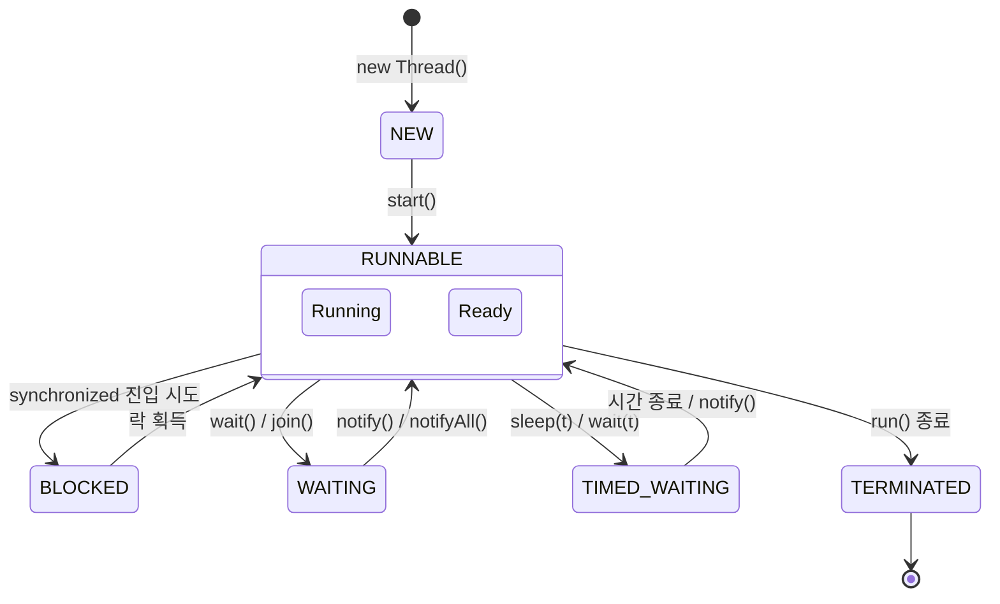
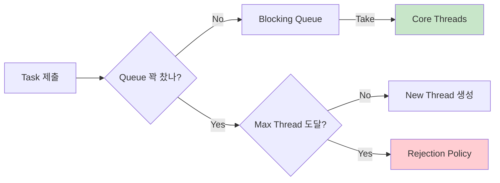

## 이 글에서 얻는 것

- 동시성 버그의 전형적인 형태(레이스, 가시성, 데드락)를 “왜 생기는지” 수준에서 설명할 수 있습니다.
- `volatile`/`synchronized`/`Lock`/`Atomic`/`LongAdder` 중 무엇을 언제 써야 하는지 선택 기준이 생깁니다.
- `ExecutorService`/`ThreadPoolExecutor`를 “그냥 쓰는” 게 아니라 큐/거부 정책/풀 크기를 근거 있게 잡을 수 있습니다.
- 장애/성능 이슈가 났을 때 스레드 덤프/로그로 원인 범위를 좁히는 방법을 알게 됩니다.

## 실무에서 동시성이 나타나는 곳

- 웹 서버 요청 처리(서블릿 스레드/비동기 작업), 배치/스케줄러, 메시지 컨슈머, 캐시/카운터, 락 기반 동시성 제어(재고 차감 등)

## 1) 문제에서 시작하기: Race condition

> [!NOTE]
> **스레드의 생애(Lifecycle)**: 스레드는 태어나서(`NEW`) 일하다가(`RUNNABLE`), 자리가 없으면 기다리고(`BLOCKED/WAITING`), 일이 끝나면 죽습니다(`TERMINATED`).



아래 코드는 “겉보기엔” 맞아 보이지만, 멀티 스레드에서 값이 틀어질 수 있습니다.

```java
class Counter {
    private int value = 0;
    public void inc() { value++; } // read -> add -> write (원자적이지 않음)
    public int get() { return value; }
}
```

`value++`는 한 번의 연산처럼 보여도 실제로는 **읽기 → 증가 → 쓰기**로 쪼개집니다. 두 스레드가 동시에 들어오면 “마지막에 쓴 값”만 남아 누락이 발생합니다.

### 해결 전략(대표 3가지)

#### A. synchronized (모니터 락)

```java
class Counter {
    private int value = 0;
    public synchronized void inc() { value++; }
    public synchronized int get() { return value; }
}
```

- 장점: 가장 직관적, JMM 관점에서 happens-before(가시성)까지 같이 해결
- 단점: 경쟁이 심하면 성능 저하, 락 범위 설계가 중요

#### B. AtomicInteger (CAS 기반)

```java
class Counter {
    private final AtomicInteger value = new AtomicInteger();
    public int inc() { return value.incrementAndGet(); }
    public int get() { return value.get(); }
}
```

- 장점: 간단한 카운터/플래그에 적합, 락 없이 원자성 제공
- 단점: 경쟁이 극심하면 CAS 재시도로 비용 증가

#### C. LongAdder (고경합 카운터)

```java
class Counter {
    private final LongAdder value = new LongAdder();
    public void inc() { value.increment(); }
    public long get() { return value.sum(); }
}
```

- 장점: 카운터가 “핫”할 때(초당 수만~수십만 증가) 성능 유리
- 단점: `sum()`이 완전히 즉시 일관(Linearizable)하다고 보장되는 형태가 필요하면 부적합할 수 있음

## 2) Java Memory Model(JMM): 가시성/순서 보장

동시성 이슈는 “값이 틀린다”만이 아니라 **값이 보이지 않는다**로도 나타납니다.

### volatile은 무엇을 해결하고, 무엇을 해결 못하나?

- 해결: **가시성(visibility)**, 일부 **순서(ordering)** 제약
- 미해결: `count++` 같은 **복합 연산의 원자성(atomicity)**

```java
class Flag {
    private volatile boolean running = true;
    public void stop() { running = false; }
    public void loop() {
        while (running) { /* ... */ }
    }
}
```

위처럼 “한 번 쓰고 여러 번 읽는 플래그”는 `volatile`이 잘 맞습니다. 하지만 카운터/적립 같은 복합 업데이트는 `Atomic*`나 락이 필요합니다.

### happens-before(핵심만)

- 같은 모니터 락에서 `unlock`은 이후 `lock`보다 happens-before
- 같은 `volatile` 변수에서 write는 이후 read보다 happens-before
- 같은 Atomic 연산에서도 가시성/순서가 보장되는 경우가 많음(구현/연산별 특성은 문서 확인)

## 3) 락 선택: synchronized vs ReentrantLock vs ReadWriteLock

### 주요 락 비교

| 락 종류 | 특징 | 장점 | 단점 |
| :--- | :--- | :--- | :--- |
| **synchronized** | 키워드(언어 내장) | 간편함, JVM 최적화(자동) | 타임아웃/공정성 설정 불가 |
| **ReentrantLock** | 클래스(API) | 타임아웃(`tryLock`), 공정성 제어 | `unlock()` 필수(복잡도↑) |
| **ReadWriteLock** | 읽기/쓰기 분리 | 읽기끼리는 락 공유 (성능↑) | 구현 복잡, 쓰기 기아 발생 가능 |

```java
class Counter {
    private final Lock lock = new ReentrantLock();
    private int value;
    public void inc() {
        lock.lock();
        try { value++; }
        finally { lock.unlock(); }
    }
}
```

실무 결론은 보통 “단순하면 synchronized, 더 많은 제어가 필요하면 ReentrantLock”입니다.

## 4) Executor/ThreadPool: 백엔드에서 가장 중요한 이유

요청/작업마다 `new Thread()`를 만들면:

- 생성/컨텍스트 스위칭 비용 증가
- 무제한 스레드로 인한 메모리 고갈(OOM) 위험
- 지연이 스파이크 형태로 튀기 쉬움

그래서 서버는 보통 스레드풀(Executor)을 씁니다.

### ThreadPoolExecutor 동작 원리



- core/max: 기본/최대 스레드 수
- queue: 작업 대기열(무제한 큐는 OOM 위험, bounded 큐 권장)
- rejection policy: 큐가 꽉 찼을 때 처리(실패/호출자 실행/드롭 등)

```java
ExecutorService pool = new ThreadPoolExecutor(
    4, 8,
    60, TimeUnit.SECONDS,
    new LinkedBlockingQueue<>(100),
    new ThreadPoolExecutor.CallerRunsPolicy() // 포화 시 호출 스레드가 실행(스로틀 역할)
);
```

### 풀 크기 감각(초기값)

- CPU 바운드: 대략 코어 수 근처
- IO 바운드: 코어 수보다 크게 잡되, **queue/timeout/거부 정책**을 같이 설계
- 블로킹 작업(느린 외부 API/DB): 전용 풀로 분리(“웹 요청 스레드”와 분리)

### 종료(리소스 누수 방지)

```java
pool.shutdown();
pool.awaitTermination(10, TimeUnit.SECONDS);
```

## 5) 대표 사고 패턴 3가지

### A. Deadlock(교착)

- 서로 다른 락을 서로 반대 순서로 잡을 때 자주 발생
- 해결: 락 순서 통일, 타임아웃 tryLock, 락 범위 최소화

### B. Thread starvation(기아)

- 작은 풀에서 블로킹 작업이 쌓여 중요 작업이 못 돌 때
- 해결: 풀 분리, 큐 제한, 타임아웃/백오프

### C. “동시성 버그”처럼 보이는 성능 문제

- 과도한 락 경쟁(핫 락), false sharing, 지나친 컨텍스트 스위칭
- 해결: 락 분할(Striped), LongAdder, 자료구조 교체, 병목 지점 분리

## 6) 디버깅: 무엇부터 보면 좋은가

### 6-1) Thread dump: “어디에서 멈췄나”를 먼저 본다

수집 방법(상황에 맞게 하나만):

- `jcmd <pid> Thread.print`
- `jstack -l <pid>`
- (리눅스) `kill -3 <pid>`: 표준 에러로 스레드 덤프가 출력되는 경우가 많습니다

읽는 순서:

1) 스레드 상태(`java.lang.Thread.State`)가 `BLOCKED/WAITING/TIMED_WAITING`에 몰려 있나?  
2) 스택 최상단에 공통으로 반복되는 프레임이 있나? (같은 락/같은 외부 호출/같은 큐 대기)  
3) 한 락을 기다리는 스레드가 수십 개면 “핫 락” 가능성이 큽니다.

상태 해석(최소만):

- `BLOCKED`: 모니터 락 진입 대기(대부분 `synchronized`)
- `WAITING/TIMED_WAITING`: `Object.wait`, `LockSupport.park`, `Condition.await` 등 “대기/슬립”
- `RUNNABLE`: 실제 CPU 사용 중일 수도 있고, 네이티브 IO에서 대기 중일 수도 있습니다(스택 프레임을 같이 봅니다)

### 6-2) JFR: “경합/CPU/할당”을 같이 본다

스레드 덤프가 “정지 화면”이라면, JFR은 “동영상”에 가깝습니다.

- CPU가 바쁜지 vs 락 경합이 심한지 vs 할당이 폭증하는지(→ GC) 를 한 번에 구분하는 데 좋습니다.

### 6-3) 풀/큐 지표: 포화를 조기에 감지한다

- 작업 큐 길이, reject 횟수, 타임아웃 비율, 평균/상위 퍼센타일 지연
- “포화”는 동시성 버그처럼 보일 수 있으니(지연/타임아웃) 지표로 먼저 확인합니다.

## 연습(추천)

- `AtomicInteger`/`synchronized`/`LongAdder`로 동일 카운터를 구현하고 “경쟁이 심할 때” 어떤 차이가 나는지 비교해보기
- bounded queue + CallerRunsPolicy로 포화 시 지연이 어떻게 바뀌는지 관찰하기

## 요약: 실무에서 자주 틀리는 지점

- 공유 상태는 동시성 컬렉션 + 락/원자 연산으로 “한 곳에서” 보호합니다. (단일 핫 카운터는 `LongAdder` 고려)
- `volatile`은 가시성/순서 보장이지 원자성이 아닙니다. `count++` 같은 복합 업데이트엔 쓰지 않습니다.
- 스레드풀은 `core/max/queue/rejection`을 명시하고, 포화 신호(큐 길이/거부/timeout)를 지표로 남깁니다.
- CPU 바운드와 블로킹 IO를 같은 풀에 섞지 않습니다. (전용 풀 + 타임아웃/취소 경로)
- 재현이 어렵다면 `Thread dump` → `JFR` 순으로 범위를 줄입니다. (`RUNNABLE/BLOCKED/WAITING` 상태 해석 포함)
- 종료 시 `shutdown()`/`awaitTermination()`로 자원을 회수합니다.

## 추가 학습

- Java Concurrency in Practice
- Effective Java 아이템 78~82

## 연결해서 읽기

- OS 관점(스케줄링/컨텍스트 스위칭): `/learning/deep-dive/deep-dive-os-concurrency-basics/`
- 실행 모델(동기/비동기, 블로킹/논블로킹): `/learning/deep-dive/deep-dive-io-execution-model/`
