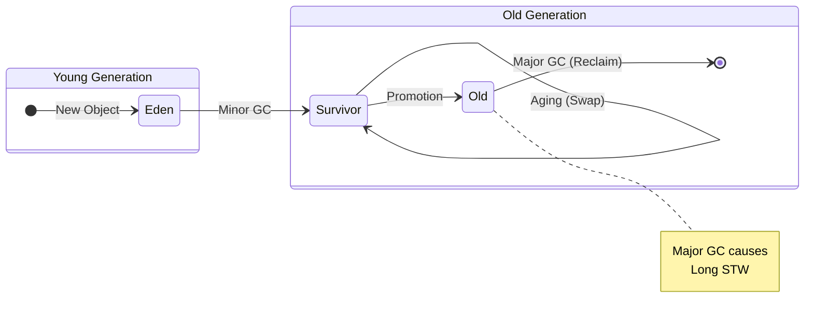
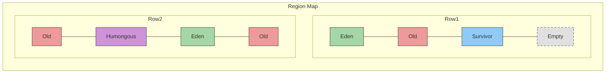

## 🗑️ 1. GC는 '청소부'가 아니라 '생존자 선별기'다

GC(Garbage Collection)를 "쓰레기를 줍는 과정"이라고 생각하기 쉽습니다.
하지만 실제로는 **"살아있는 객체(Live Object)를 마킹하고, 나머지를 날리는"** 과정에 가깝습니다.

- **Reachability**: GC Root(스택 변수, Static 변수 등)에서 닿을 수 있는 객체만 살아남습니다.
- **Stop-The-World (STW)**: 청소를 하려면 잠깐 세상을 멈춰야 합니다. 이걸 줄이는 게 GC 튜닝의 핵심입니다.

---

## 👶 2. 약한 세대 가설 (Weak Generational Hypothesis)

"대부분의 객체는 금방 죽는다."
이 가설 때문에 힙 메모리는 **Young**과 **Old**로 나뉩니다.



1. **Eden**: 갓 태어난 객체들의 요람. 금방 죽는 객체는 여기서 Minor GC로 사라집니다.
2. **Survivor**: Eden에서 살아남은 객체가 잠시 머무는 곳.
3. **Old**: 산전수전 겪고 살아남은 객체들이 모이는 곳. 여기가 차면 **Major GC (Full GC)** 가 발생하며, 이는 매우 느립니다.

---

## 🚦 3. GC 알고리즘 진화

JVM의 역사는 STW(멈춤 시간)를 줄이기 위한 투쟁의 역사입니다.

### 1. STW vs Concurrent 비교

```mermaid
gantt
    title Stop-The-World vs Concurrent
    dateFormat X
    axisFormat %s
    
    section Parallel GC
    App Running       : 0, 10
    GC (STW)          : crit, 10, 5
    App Running       : 15, 10
    
    section G1/CMS GC
    App Running       : 0, 25
    Concurrent Mark   : active, 5, 10
    Remark (Short STW): crit, 15, 2
```



### 1. Serial / Parallel GC
- **단순 무식**: 청소할 때 모든 스레드 올스탑.
- **Parallel**: 청소부(GC 스레드) 숫자를 늘려서 빨리 끝냄. (Throughput 중심)

### 2. CMS (Concurrent Mark Sweep)
- **눈치 보기**: 애플리케이션 돌면서 몰래몰래 마킹함.
- **단점**: 메모리 파편화(Fragmentation)가 심함.

### 3. G1 GC (Garbage First) - *표준*
- **바둑판**: 힙을 잘게 쪼개서(Region), 쓰레기가 많은 곳부터 청소함.
- **예측 가능**: "200ms 안에 끝내줘"라고 설정 가능.



### 4. ZGC / Shenandoah
- **마법**: TB급 힙에서도 멈춤 시간 10ms 미만.
- **원리**: 포인터 자체에 색칠(Coloring)을 하거나 로드 배리어(Load Barrier)를 써서 위상 이동을 실시간 처리.

---

## 🔍 4. GC 로그 분석 실전

GC 튜닝의 시작은 **로그(Log)** 입니다. "느려요"라고 말하기 전에 로그를 봐야 합니다.

```
[GC (Allocation Failure) [PSYoungGen: 65536K->10752K(76288K)] 65536K->10760K(251392K), 0.0123456 secs]
```

- **Allocation Failure**: Eden 꽉 차서 발생. (정상)
- **PSYoungGen**: Young 영역 줄어듦 (청소 성공!)
- **0.012 secs**: 12ms 멈췄음. (양호)

> **Full GC**가 빈번하다면?
> 1. **메모리 누수(Leak)**: 쓸데없는 객체를 static 컬렉션 같은 데 쌓아두고 있지 않은지?
> 2. **객체 크기**: 불필요하게 큰 객체를 계속 만드는지?
> 3. **힙 크기**: 물리 메모리에 비해 힙이 너무 작은지?

## 요약

1. **세대 분리**: 금방 죽는 놈(Young)과 오래 사는 놈(Old)을 나눠서 관리한다.
2. **Minor GC**: 자주 일어나고 빠르다. (Eden 청소)
3. **Major GC**: 가끔 일어나고 느리다. (Old 청소, STW 주범)
4. **G1 GC**: 요즘 서버의 기본. 큰 힙을 효율적으로 쓴다.
