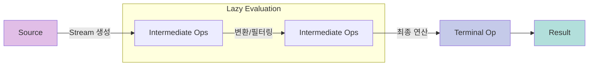
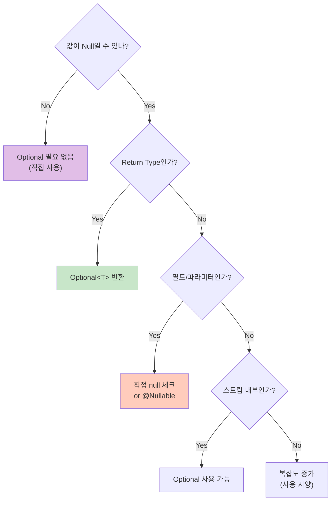

## 이 글에서 얻는 것

- **Stream API**로 컬렉션을 필터링/변환/집계하는 선언적 코드를 작성할 수 있습니다.
- **중간 연산(filter/map)과 최종 연산(collect/reduce)의 차이**를 이해하고 효율적으로 조합합니다.
- **Optional**로 null 체크를 안전하게 처리하고, "null 반환"을 피하는 습관을 갖습니다.
- Stream/Optional의 흔한 실수(무한 스트림, 과도한 Optional 사용)를 예방합니다.

## 0) Stream과 Optional은 "null과 반복문"을 더 안전하게 만든다

> [!NOTE]
> **Stream의 핵심**: 데이터의 흐름(Flow)을 정의하는 것입니다. "어떻게(How)"가 아니라 "**무엇을(What)**" 할지 기술합니다.

### Imperative vs Declarative 비교

| 스타일 | 방식 | 장점 | 단점 |
| :--- | :--- | :--- | :--- |
| **명령형(Imperative)** | `for`, `if` 로 직접 제어 | 세밀한 성능 튜닝 가능 | 코드가 길고 실수하기 쉬움 |
| **선언형(Declarative)** | `filter`, `map` 으로 선언 | 가독성 높음, 병렬화 쉬움 | 디버깅이 조금 더 어려움 |

### 1-0) Stream Pipeline 시각화



Java 8 이후:
```java
// ✅ 선언형 스타일: 무엇을(what) 할지 명시
List<String> result = orders.stream()
    .filter(order -> order.getStatus() == OrderStatus.COMPLETED)
    .map(Order::getCustomerName)
    .collect(Collectors.toList());
```

핵심 이점:
- 코드가 짧고 의도가 명확
- 병렬 처리 가능 (parallelStream)
- 중간 연산 최적화 (lazy evaluation)

## 1) Stream API 기초

### 1-1) Stream 생성

```java
// 컬렉션에서 생성
List<String> list = Arrays.asList("a", "b", "c");
Stream<String> stream = list.stream();

// 배열에서 생성
String[] array = {"a", "b", "c"};
Stream<String> streamFromArray = Arrays.stream(array);

// 직접 생성
Stream<String> streamOf = Stream.of("a", "b", "c");

// 빈 스트림
Stream<String> empty = Stream.empty();

// 무한 스트림 (limit 필수!)
Stream<Integer> infinite = Stream.iterate(0, n -> n + 1)
    .limit(10);  // [0, 1, 2, ..., 9]

Stream<Double> random = Stream.generate(Math::random)
    .limit(5);   // 랜덤 5개

// 범위 생성
IntStream range = IntStream.range(1, 5);      // [1, 2, 3, 4]
IntStream rangeClosed = IntStream.rangeClosed(1, 5);  // [1, 2, 3, 4, 5]
```

### 1-2) 중간 연산 vs 최종 연산 비교

| 구분 | 역할 | Lazy 여부 | 반환값 | 예시 |
| :--- | :--- | :--- | :--- | :--- |
| **중간 연산** (Intermediate) | 스트림 변환, 필터링 | ✅ Yes | `Stream<T>` | `filter`, `map`, `sorted` |
| **최종 연산** (Terminal) | 결과 도출, 부수 효과 | ❌ No | 비-스트림 (List, int 등) | `collect`, `forEach`, `count` |

> [!TIP]
> **Lazy Evaluation (지연 평가)**:
> 최종 연산이 호출되기 전까지는 중간 연산이 실행되지 않습니다. 덕분에 필요한 만큼만 계산하는 최적화(Short-circuit)가 가능합니다.

### 1-3) 중간 연산 (Intermediate Operations)

중간 연산은 **lazy 평가**됩니다 (최종 연산이 호출되기 전까지 실행 안 됨).

```java
// filter: 조건에 맞는 요소만 선택
List<Order> completed = orders.stream()
    .filter(order -> order.getStatus() == OrderStatus.COMPLETED)
    .collect(Collectors.toList());

// map: 각 요소를 변환
List<String> names = users.stream()
    .map(User::getName)
    .collect(Collectors.toList());

// flatMap: 중첩된 구조를 평탄화
List<List<String>> nested = Arrays.asList(
    Arrays.asList("a", "b"),
    Arrays.asList("c", "d")
);
List<String> flat = nested.stream()
    .flatMap(List::stream)
    .collect(Collectors.toList());  // [a, b, c, d]

// distinct: 중복 제거
List<Integer> unique = numbers.stream()
    .distinct()
    .collect(Collectors.toList());

// sorted: 정렬
List<String> sorted = names.stream()
    .sorted()  // 기본 정렬
    .collect(Collectors.toList());

List<User> sortedByAge = users.stream()
    .sorted(Comparator.comparing(User::getAge))  // 나이순
    .collect(Collectors.toList());

// limit/skip: 개수 제한/건너뛰기
List<String> firstThree = list.stream()
    .limit(3)
    .collect(Collectors.toList());

List<String> skipTwo = list.stream()
    .skip(2)
    .collect(Collectors.toList());

// peek: 중간 확인 (디버깅용)
List<String> result = list.stream()
    .peek(s -> System.out.println("Processing: " + s))
    .filter(s -> s.startsWith("A"))
    .collect(Collectors.toList());
```

### 1-4) 최종 연산 (Terminal Operations)

최종 연산이 호출되어야 **실제로 실행**됩니다.

```java
// collect: 리스트/셋/맵으로 수집
List<String> list = stream.collect(Collectors.toList());
Set<String> set = stream.collect(Collectors.toSet());
Map<Long, User> map = users.stream()
    .collect(Collectors.toMap(User::getId, u -> u));

// forEach: 각 요소에 대해 작업
users.forEach(user -> System.out.println(user.getName()));

// count: 개수
long count = orders.stream()
    .filter(order -> order.getStatus() == OrderStatus.COMPLETED)
    .count();

// anyMatch/allMatch/noneMatch: 조건 검사
boolean hasCompleted = orders.stream()
    .anyMatch(order -> order.getStatus() == OrderStatus.COMPLETED);

boolean allCompleted = orders.stream()
    .allMatch(order -> order.getStatus() == OrderStatus.COMPLETED);

// findFirst/findAny: 첫 번째 요소 찾기
Optional<Order> first = orders.stream()
    .filter(order -> order.getAmount() > 1000)
    .findFirst();

// reduce: 집계 (합계, 최댓값 등)
int sum = numbers.stream()
    .reduce(0, Integer::sum);  // 초깃값 0, 합산

Optional<Integer> max = numbers.stream()
    .reduce(Integer::max);

// min/max: 최솟값/최댓값
Optional<Order> mostExpensive = orders.stream()
    .max(Comparator.comparing(Order::getAmount));
```

## 2) Stream 실전 패턴

### 2-1) 그룹핑 (Grouping)

```java
// 상태별 주문 그룹화
Map<OrderStatus, List<Order>> byStatus = orders.stream()
    .collect(Collectors.groupingBy(Order::getStatus));

// 고객별 주문 개수
Map<String, Long> orderCountByCustomer = orders.stream()
    .collect(Collectors.groupingBy(
        Order::getCustomerId,
        Collectors.counting()
    ));

// 고객별 총 금액
Map<String, Integer> totalAmountByCustomer = orders.stream()
    .collect(Collectors.groupingBy(
        Order::getCustomerId,
        Collectors.summingInt(Order::getAmount)
    ));
```

### 2-2) 파티셔닝 (Partitioning)

```java
// 금액 기준으로 두 그룹으로 분할
Map<Boolean, List<Order>> partitioned = orders.stream()
    .collect(Collectors.partitioningBy(
        order -> order.getAmount() > 1000
    ));

List<Order> expensive = partitioned.get(true);   // 1000 초과
List<Order> cheap = partitioned.get(false);      // 1000 이하
```

### 2-3) 조인 (Joining)

```java
// 문자열 연결
String names = users.stream()
    .map(User::getName)
    .collect(Collectors.joining(", "));  // "Alice, Bob, Charlie"

String withPrefix = users.stream()
    .map(User::getName)
    .collect(Collectors.joining(", ", "[", "]"));  // "[Alice, Bob, Charlie]"
```

### 2-4) 통계 (Statistics)

```java
// 숫자 통계
IntSummaryStatistics stats = orders.stream()
    .mapToInt(Order::getAmount)
    .summaryStatistics();

System.out.println("Count: " + stats.getCount());
System.out.println("Sum: " + stats.getSum());
System.out.println("Min: " + stats.getMin());
System.out.println("Max: " + stats.getMax());
System.out.println("Average: " + stats.getAverage());
```

### 2-5) 복잡한 변환

```java
// 주문 → DTO 변환
List<OrderDTO> dtos = orders.stream()
    .filter(order -> order.getStatus() == OrderStatus.COMPLETED)
    .map(order -> new OrderDTO(
        order.getId(),
        order.getCustomerName(),
        order.getAmount()
    ))
    .collect(Collectors.toList());

// flatMap으로 중첩 구조 평탄화
List<String> allProductNames = orders.stream()
    .flatMap(order -> order.getItems().stream())
    .map(OrderItem::getProductName)
    .distinct()
    .collect(Collectors.toList());
```

## 3) Optional: null 안전성 확보

> [!NOTE]
> **Optional은 "값을 감싸는 상자"입니다.**
> 상자가 비어있을 수도(null), 차있을 수도 있습니다. 우리는 상자를 열어보지 않고도 안전하게 메서드(`map`, `orElse`)를 사용할 수 있습니다.

### 3-1) Optional 기본 사용법

```java
// Optional 생성
Optional<String> present = Optional.of("value");           // null이면 NullPointerException
Optional<String> nullable = Optional.ofNullable(maybeNull); // null 허용
Optional<String> empty = Optional.empty();                 // 빈 Optional

// 값 확인
if (optional.isPresent()) {
    String value = optional.get();  // 값 존재 시 반환
}

// ✅ 권장: ifPresent 사용
optional.ifPresent(value -> System.out.println(value));

// ✅ 권장: orElse/orElseGet 사용
String result = optional.orElse("default");           // 값이 없으면 기본값
String result = optional.orElseGet(() -> getDefault()); // 값이 없으면 함수 실행 (lazy)
String result = optional.orElseThrow(() -> new IllegalStateException()); // 예외 발생
```

### 3-2) Optional 변환

```java
// map: 값 변환
Optional<String> upperCase = optional.map(String::toUpperCase);

// flatMap: 중첩 Optional 평탄화
Optional<User> user = findUserById(userId);
Optional<String> email = user.flatMap(User::getEmail);  // User::getEmail이 Optional<String> 반환

// filter: 조건 필터링
Optional<String> filtered = optional.filter(s -> s.length() > 5);
```

### 3-3) Optional 실전 패턴

```java
// ❌ 나쁜 예: get() 직접 호출
Optional<User> user = findUser(id);
if (user.isPresent()) {
    User u = user.get();  // 위험: isPresent 없으면 NoSuchElementException
}

// ✅ 좋은 예: orElse/orElseThrow 사용
User user = findUser(id)
    .orElseThrow(() -> new UserNotFoundException(id));

// ✅ 좋은 예: ifPresentOrElse (Java 9+)
findUser(id).ifPresentOrElse(
    user -> System.out.println("Found: " + user),
    () -> System.out.println("Not found")
);

// ❌ 나쁜 예: Optional을 필드로 사용
class User {
    private Optional<String> email;  // ❌ 직렬화 문제, 불필요한 복잡도
}

// ✅ 좋은 예: 필드는 nullable, 메서드만 Optional 반환
class User {
    private String email;  // nullable

    public Optional<String> getEmail() {
        return Optional.ofNullable(email);
    }
}

// ❌ 나쁜 예: Optional을 파라미터로 사용
void updateUser(Optional<String> name) { }  // ❌ 복잡도만 증가

// ✅ 좋은 예: nullable 파라미터 또는 오버로딩
void updateUser(String name) { }  // name이 null일 수 있음을 문서화
```

### 3-5) Optional 올바른 사용법 결정 트리



### 3-4) Optional 체이닝

```java
// 중첩된 null 체크를 Optional로 간결하게
// Before (Java 7)
String city = null;
if (user != null) {
    Address address = user.getAddress();
    if (address != null) {
        city = address.getCity();
    }
}

// After (Java 8+)
String city = Optional.ofNullable(user)
    .flatMap(User::getAddress)
    .map(Address::getCity)
    .orElse("Unknown");
```

## 4) 자주 하는 실수

### 4-1) Stream 재사용

```java
// ❌ Stream은 한 번만 사용 가능
Stream<String> stream = list.stream();
stream.filter(s -> s.startsWith("A")).collect(Collectors.toList());
stream.filter(s -> s.startsWith("B")).collect(Collectors.toList());  // IllegalStateException!

// ✅ 새로운 Stream 생성
list.stream().filter(s -> s.startsWith("A")).collect(Collectors.toList());
list.stream().filter(s -> s.startsWith("B")).collect(Collectors.toList());
```

### 4-2) Optional.get() 남용

```java
// ❌ isPresent + get 조합 (null 체크와 동일)
if (optional.isPresent()) {
    return optional.get();
} else {
    return "default";
}

// ✅ orElse 사용
return optional.orElse("default");
```

### 4-3) Stream에서 부수 효과 (Side Effects)

> [!WARNING]
> **Functional Style 위반**: 스트림 내부에서 외부 변수(`results`)를 수정하면 안 됩니다. 이는 병렬 처리 시 심각한 동시성 문제를 일으킵니다.

```java
// ❌ Stream 안에서 외부 상태 변경
List<String> results = new ArrayList<>();
stream.forEach(s -> results.add(s.toUpperCase()));  // 부수 효과!

// ✅ collect 사용
List<String> results = stream
    .map(String::toUpperCase)
    .collect(Collectors.toList());
```

### 4-4) 불필요한 박싱/언박싱

```java
// ❌ 박싱 오버헤드
List<Integer> numbers = Arrays.asList(1, 2, 3, 4, 5);
int sum = numbers.stream()
    .reduce(0, Integer::sum);  // Integer → int 변환 반복

// ✅ 기본형 Stream 사용
int sum = numbers.stream()
    .mapToInt(Integer::intValue)  // IntStream으로 변환
    .sum();

// 더 간단한 방법
int sum = numbers.stream()
    .mapToInt(i -> i)
    .sum();
```

## 5) 병렬 Stream

```java
// 순차 Stream
long count = list.stream()
    .filter(s -> s.length() > 5)
    .count();

// 병렬 Stream (멀티스레드 활용)
long count = list.parallelStream()
    .filter(s -> s.length() > 5)
    .count();

// 주의: 병렬 Stream은 항상 빠르지 않음
// - 데이터가 적으면 오버헤드가 더 큼
// - 순서가 중요하면 사용 불가
// - 상태 공유 시 동기화 문제 발생
```

> [!WARNING]
> **병렬 스트림 주의사항**:
> 무조건 빨라지지 않습니다. 스레드 생성/관리 오버헤드가 더 클 수 있으며, 데이터 소스가 `ArrayList`나 배열처럼 분할이 쉬워야 효과적입니다. `LinkedList`는 병렬 처리에 최악입니다.

**병렬 Stream 사용 기준:**
- 데이터가 충분히 큼 (수천 개 이상)
- CPU 집약적 작업
- 순서가 중요하지 않음
- 부수 효과(Side Effect)가 없음

## 6) 실전 예제

```java
// 예제 1: 주문 통계
class OrderService {
    public OrderStatistics getStatistics(List<Order> orders) {
        Map<OrderStatus, Long> countByStatus = orders.stream()
            .collect(Collectors.groupingBy(Order::getStatus, Collectors.counting()));

        Map<String, Integer> totalByCustomer = orders.stream()
            .collect(Collectors.groupingBy(
                Order::getCustomerId,
                Collectors.summingInt(Order::getAmount)
            ));

        Optional<Order> mostExpensive = orders.stream()
            .max(Comparator.comparing(Order::getAmount));

        return new OrderStatistics(countByStatus, totalByCustomer, mostExpensive);
    }
}

// 예제 2: 유저 검색
class UserService {
    public Optional<User> findActiveUserByEmail(String email) {
        return userRepository.findByEmail(email)
            .filter(User::isActive);
    }

    public List<UserDTO> searchUsers(String keyword) {
        return userRepository.findAll().stream()
            .filter(user -> user.getName().contains(keyword) ||
                           user.getEmail().contains(keyword))
            .map(user -> new UserDTO(user.getId(), user.getName(), user.getEmail()))
            .collect(Collectors.toList());
    }
}

// 예제 3: 복잡한 집계
class ReportService {
    public Map<String, List<OrderSummary>> getDailyReport(LocalDate date) {
        List<Order> orders = orderRepository.findByDate(date);

        return orders.stream()
            .collect(Collectors.groupingBy(
                order -> order.getCreatedAt().getHour() + ":00",  // 시간대별
                Collectors.mapping(
                    order -> new OrderSummary(order.getId(), order.getAmount()),
                    Collectors.toList()
                )
            ));
    }
}
```

## 연습 (추천)

1. 기존 반복문 코드를 Stream으로 리팩터링
   - for 루프 → filter/map/collect
   - null 체크 → Optional

2. 성능 비교
   - Stream vs for 루프 (작은 데이터 vs 큰 데이터)
   - 순차 Stream vs 병렬 Stream

3. 복잡한 데이터 변환 연습
   - 중첩된 리스트 평탄화 (flatMap)
   - 그룹핑 + 집계 (groupingBy + summingInt)

## 요약: 스스로 점검할 것

- Stream의 중간 연산과 최종 연산의 차이를 설명할 수 있다
- filter/map/flatMap/collect를 실무에서 활용할 수 있다
- Optional로 null 안전성을 확보하고, get() 대신 orElse/orElseThrow를 사용한다
- Stream에서 부수 효과를 피하고, 순수 함수형 스타일로 작성한다
- 병렬 Stream의 적절한 사용 시점을 판단할 수 있다

## 다음 단계

- Java 동시성 기초: `/learning/deep-dive/deep-dive-java-concurrency-basics/`
- 객체지향 설계 원칙(SOLID): `/learning/deep-dive/deep-dive-oop-solid-principles/`
- 자료구조 복잡도: `/learning/deep-dive/deep-dive-data-structure-complexity/`
