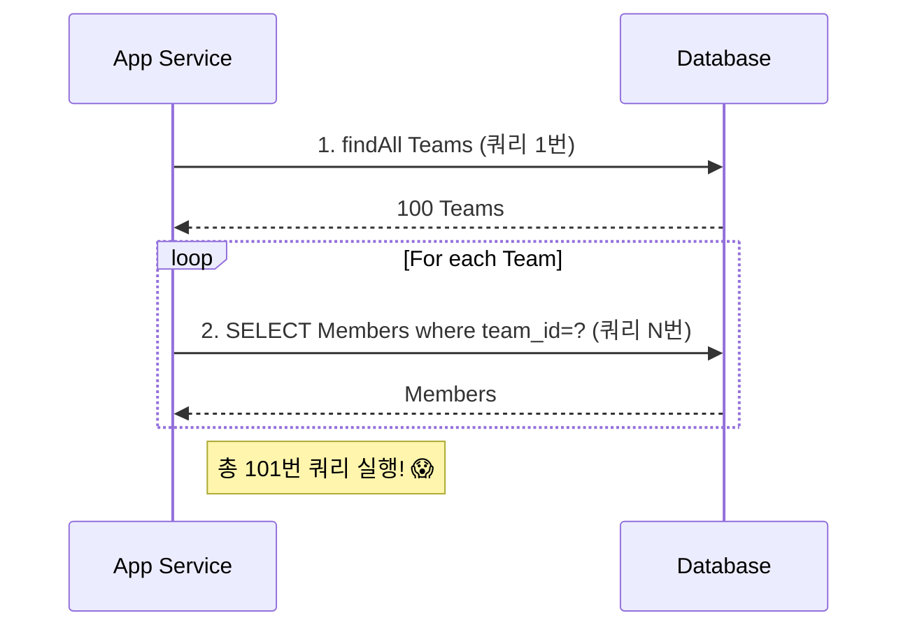
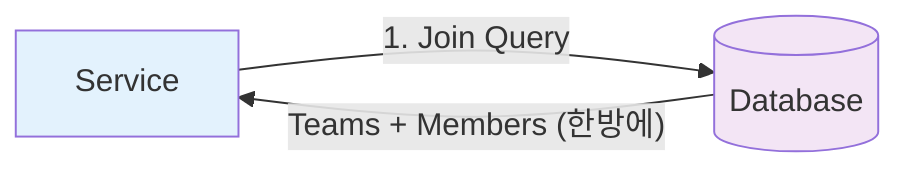

### 💣 1. "쿼리가 왜 100번 나가죠?"

> [!WARNING]
> **N+1 문제란?**
> 하버드 대학생(1)을 조회했는데, 학생들의 수강신청 목록(N)을 가져오기 위해 **추가 쿼리가 N번 더 실행되는 현상**입니다.
> - **결과**: DB 부하 급증, 응답 속도 저하.

`findAll()` 하나 불렀을 뿐인데, 콘솔에 SQL이 폭포수처럼 쏟아집니다.
이것이 바로 **N+1 문제**입니다.



1개의 쿼리(Team 조회)를 날렸는데, 결과 개수(N)만큼 추가 쿼리(Members 조회)가 나가는 현상입니다.

### 발생 원인
JPA는 기본적으로 연관된 엔티티를 **진짜 쓸 때(getMembers())** 가져오려고 합니다(Lazy Loading).
그래서 루프를 돌면서 `team.getMembers()`를 호출할 때마다 `SELECT * FROM member WHERE team_id = ?`를 날리는 것입니다.

---

## 🛠️ 2. 해결책 3대장

### 2-1. Fetch Join (가장 확실함)
"가져올 때 한방에 Join해서 다 가져와!"



```sql
SELECT t FROM Team t JOIN FETCH t.members
```
- **장점**: 쿼리 1방으로 끝남.
- **단점**: 페이징(Paging) 시 메모리 이슈 발생 가능. (DB에서 페이징 안 하고 다 퍼올려서 메모리에서 자름 😱)


### 2-2. @EntityGraph (간편함)
JPQL 짜기 귀찮을 때 애노테이션으로 해결.

```java
@EntityGraph(attributePaths = {"members"})
List<Team> findAll();
```
- **특징**: `LEFT OUTER JOIN`을 사용합니다.

### 2-3. @BatchSize (in 쿼리)
"1개씩 가져오지 말고 100개씩 묶어서(in) 가져와."

```yaml
spring.jpa.properties.hibernate.default_batch_fetch_size: 100
```

```sql
SELECT * FROM member WHERE team_id IN (1, 2, 3, ... 100)
```
- **장점**: 페이징 문제 해결! Fetch Join과 다르게 데이터 뻥튀기가 없음.
- **실무 꿀팁**: **컬렉션 조회 + 페이징**이 필요하면, `Fetch Join` 대신 `Batch Size`가 답입니다.

---

## 📊 3. 비교 요약

| 방법 | 쿼리 수 | 페이징 가능? | 데이터 중복 | 권장 상황 |
|---|---|---|---|---|
| **Just Lazy** | 1 + N | O | X | 단건 상세 조회 |
| **Fetch Join** | 1 | X (List) | O (Distinct 필요) | 목록 전체 조회 |
| **Batch Size** | 1 + 1 | O | X | 페이징 목록 조회 |

## 요약: Best Practice

> [!TIP]
> **실무 JPA 최적화 공식**:
> 1. 기본은 **Lazy Loading** (`Fetch=LAZY`)으로 설정한다.
> 2. 목록 조회(List)가 필요하면 **Fetch Join**으로 N+1을 잡는다.
> 3. 페이징이 필요하면 **`default_batch_fetch_size`**(100~1000)를 켠다.

1. **원인**: Lazy Loading 때문에 루프 돌 때마다 쿼리가 나간다.
2. **해결 1**: 목록 조회는 **Fetch Join**이 기본.
3. **해결 2**: 페이징이 필요하면 **default_batch_fetch_size**를 켜라.
