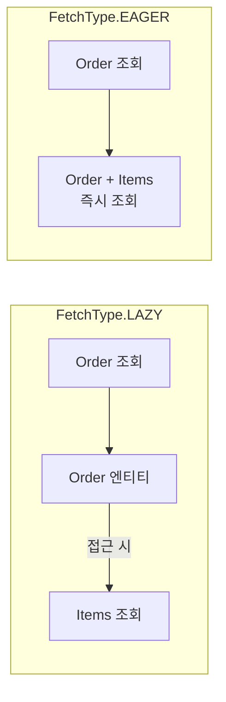

## 이 글에서 얻는 것

- **Fetch 전략** (Lazy vs Eager)의 동작과 함정을 이해합니다
- **Batch Size**와 **Fetch Join**으로 N+1을 최적화합니다
- **대용량 배치 처리** 패턴을 익힙니다

---

## Fetch 전략

### Lazy vs Eager



```java
@Entity
public class Order {
    @Id
    private Long id;
    
    // ✅ 기본값: LAZY (권장)
    @OneToMany(mappedBy = "order", fetch = FetchType.LAZY)
    private List<OrderItem> items;
    
    // ❌ EAGER: 항상 조회 → 불필요한 쿼리
    @ManyToOne(fetch = FetchType.EAGER)  // 기본값이 EAGER
    private User user;
}
```

### EAGER의 함정

```java
// ❌ EAGER 설정 시 문제
List<Order> orders = orderRepository.findAll();  // 1개 쿼리

// 실제 실행 쿼리:
// 1. SELECT * FROM orders
// 2. SELECT * FROM users WHERE id = 1
// 3. SELECT * FROM users WHERE id = 2
// ...N개 추가 쿼리 (N+1)

// ✅ 해결: 모든 @ManyToOne도 LAZY로
@ManyToOne(fetch = FetchType.LAZY)
private User user;
```

---

## N+1 해결 전략

### 1. Fetch Join

```java
// ✅ JPQL Fetch Join
@Query("SELECT o FROM Order o JOIN FETCH o.items WHERE o.id = :id")
Order findByIdWithItems(@Param("id") Long id);

// ✅ EntityGraph
@EntityGraph(attributePaths = {"items", "user"})
@Query("SELECT o FROM Order o WHERE o.id = :id")
Order findByIdWithGraph(@Param("id") Long id);
```

**주의**: 컬렉션 Fetch Join 시 페이징 불가

```java
// ❌ 컬렉션 Fetch Join + 페이징 = 메모리 페이징 경고
@Query("SELECT o FROM Order o JOIN FETCH o.items")
Page<Order> findAllWithItems(Pageable pageable);
// WARN: firstResult/maxResults specified with collection fetch; applying in memory!
```

### 2. Batch Size (권장)

```java
// application.yml
spring:
  jpa:
    properties:
      hibernate:
        default_batch_fetch_size: 100
```

```java
// 또는 엔티티에 직접 설정
@BatchSize(size = 100)
@OneToMany(mappedBy = "order")
private List<OrderItem> items;
```

**동작 원리**:

```sql
-- 배치 사이즈 없이
SELECT * FROM order_items WHERE order_id = 1;
SELECT * FROM order_items WHERE order_id = 2;
SELECT * FROM order_items WHERE order_id = 3;
-- ... N개 쿼리

-- 배치 사이즈 100 적용
SELECT * FROM order_items WHERE order_id IN (1, 2, 3, ..., 100);
-- 1개 쿼리로 100개 Order의 Items 조회
```

### 전략 비교

| 전략 | 장점 | 단점 | 사용 시점 |
|------|------|------|----------|
| Fetch Join | 1개 쿼리 | 페이징 불가, 카테시안 곱 | 단건 조회 |
| Batch Size | 페이징 가능 | N/batch 쿼리 | 목록 조회 |
| EntityGraph | 선언적 | 동적 변경 어려움 | 다양한 조합 |

---

## 대용량 배치 처리

### 문제: 메모리 부족

```java
// ❌ 10만 건 한 번에 조회 → OutOfMemoryError
List<Order> orders = orderRepository.findAll();
for (Order order : orders) {
    order.updateStatus(OrderStatus.COMPLETED);
}
```

### 해결 1: 페이징 처리

```java
public void processAllOrders() {
    int pageSize = 1000;
    int page = 0;
    Page<Order> orderPage;
    
    do {
        orderPage = orderRepository.findByStatus(
            OrderStatus.PENDING,
            PageRequest.of(page, pageSize)
        );
        
        for (Order order : orderPage.getContent()) {
            order.updateStatus(OrderStatus.PROCESSING);
        }
        
        entityManager.flush();
        entityManager.clear();  // 영속성 컨텍스트 초기화
        
        page++;
    } while (orderPage.hasNext());
}
```

### 해결 2: Stateless Session

```java
// Hibernate Stateless Session (영속성 컨텍스트 없음)
@Transactional
public void bulkUpdate() {
    StatelessSession session = sessionFactory.openStatelessSession();
    Transaction tx = session.beginTransaction();
    
    try {
        ScrollableResults scroll = session
            .createQuery("FROM Order WHERE status = :status")
            .setParameter("status", OrderStatus.PENDING)
            .scroll(ScrollMode.FORWARD_ONLY);
        
        int count = 0;
        while (scroll.next()) {
            Order order = (Order) scroll.get(0);
            order.setStatus(OrderStatus.COMPLETED);
            session.update(order);
            
            if (++count % 100 == 0) {
                session.getTransaction().commit();
                session.beginTransaction();
            }
        }
        
        tx.commit();
    } finally {
        session.close();
    }
}
```

### 해결 3: Bulk Update (권장)

```java
// ✅ JPQL Bulk Update - 가장 효율적
@Modifying
@Query("UPDATE Order o SET o.status = :status WHERE o.createdAt < :date")
int bulkUpdateStatus(@Param("status") OrderStatus status, 
                     @Param("date") LocalDateTime date);

// 사용
@Transactional
public void archiveOldOrders() {
    int updated = orderRepository.bulkUpdateStatus(
        OrderStatus.ARCHIVED,
        LocalDateTime.now().minusYears(1)
    );
    log.info("Archived {} orders", updated);
    
    // ⚠️ 영속성 컨텍스트 동기화 필요
    entityManager.clear();
}
```

---

## Hibernate 통계 & 디버깅

### 통계 활성화

```yaml
spring:
  jpa:
    properties:
      hibernate:
        generate_statistics: true
        session.events.log.LOG_QUERIES_SLOWER_THAN_MS: 100
```

```java
@Aspect
@Component
public class JpaStatisticsAspect {
    
    @Autowired
    private EntityManagerFactory emf;
    
    @Around("@annotation(org.springframework.transaction.annotation.Transactional)")
    public Object logStatistics(ProceedingJoinPoint pjp) throws Throwable {
        Statistics stats = emf.unwrap(SessionFactory.class).getStatistics();
        stats.clear();
        
        long start = System.currentTimeMillis();
        Object result = pjp.proceed();
        long duration = System.currentTimeMillis() - start;
        
        log.info("=== JPA Statistics for {} ===", pjp.getSignature().getName());
        log.info("Queries: {}", stats.getQueryExecutionCount());
        log.info("Entity loads: {}", stats.getEntityLoadCount());
        log.info("Collection loads: {}", stats.getCollectionLoadCount());
        log.info("Duration: {}ms", duration);
        
        if (stats.getQueryExecutionCount() > 10) {
            log.warn("⚠️ Too many queries! Possible N+1 issue");
        }
        
        return result;
    }
}
```

### p6spy로 쿼리 로깅

```xml
<dependency>
    <groupId>com.github.gavlyukovskiy</groupId>
    <artifactId>p6spy-spring-boot-starter</artifactId>
    <version>1.9.0</version>
</dependency>
```

```properties
# spy.properties
logMessageFormat=com.p6spy.engine.spy.appender.CustomLineFormat
customLogMessageFormat=%(executionTime)ms | %(sql)
```

---

## QueryDSL 활용

### 동적 쿼리 최적화

```java
@Repository
public class OrderQueryRepository {
    
    private final JPAQueryFactory queryFactory;
    
    public List<OrderDto> searchOrders(OrderSearchCondition condition) {
        return queryFactory
            .select(new QOrderDto(
                order.id,
                order.status,
                order.totalAmount,
                order.createdAt
            ))
            .from(order)
            .leftJoin(order.user, user)
            .where(
                statusEq(condition.getStatus()),
                userIdEq(condition.getUserId()),
                createdAfter(condition.getFromDate())
            )
            .orderBy(order.createdAt.desc())
            .offset(condition.getOffset())
            .limit(condition.getLimit())
            .fetch();
    }
    
    private BooleanExpression statusEq(OrderStatus status) {
        return status != null ? order.status.eq(status) : null;
    }
}
```

---

## 요약

### 최적화 체크리스트

| 항목 | 권장 설정 |
|------|----------|
| @ManyToOne | FetchType.LAZY |
| @OneToMany | FetchType.LAZY + BatchSize |
| 목록 조회 | Batch Size 100 |
| 단건 조회 | Fetch Join / EntityGraph |
| 대용량 수정 | Bulk Update JPQL |
| 모니터링 | Hibernate Statistics |

### N+1 해결 순서

1. **확인**: Hibernate Statistics로 쿼리 수 체크
2. **Batch Size**: 목록 조회에 기본 적용
3. **Fetch Join**: 특정 조회에 필요 시 추가
4. **DTO 프로젝션**: 불필요한 필드 제외

---

## 🔗 Related Deep Dive

- **[JPA N+1 문제](/learning/deep-dive/deep-dive-jpa-n-plus-1/)**: N+1의 원인과 해결.
- **[인덱스 기본](/learning/deep-dive/deep-dive-database-indexing/)**: 쿼리 성능의 핵심.
