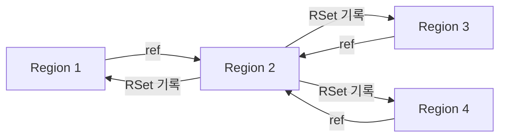
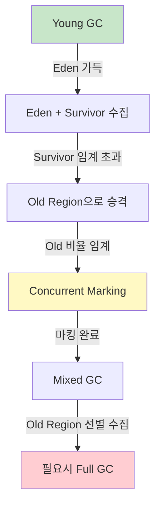
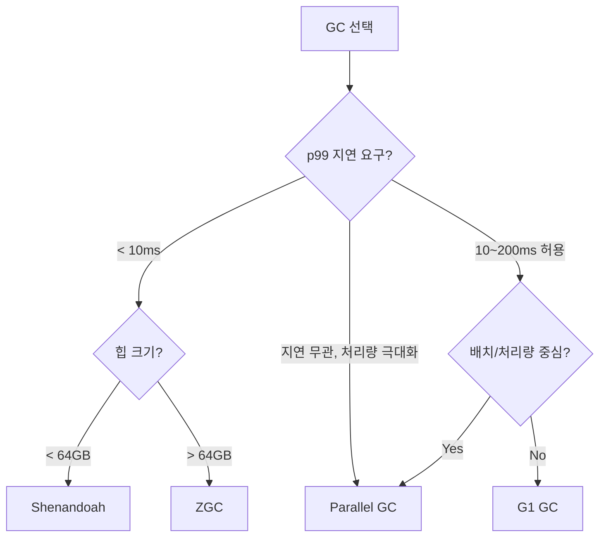

## 이 글에서 얻는 것

- 객체 할당이 실제로 **어떤 경로로 빠르게 수행되는지(TLAB)** 설명할 수 있습니다.
- **Card Table/Remembered Set**이 왜 필요한지, Minor GC 스캔 범위를 어떻게 줄이는지 이해합니다.
- GC가 사용하는 **Write/Read Barrier**의 역할을 인지하고, 성능에 미치는 영향을 감 잡을 수 있습니다.
- **G1/ZGC/Shenandoah 비교**를 통해 프로젝트에 맞는 GC를 선택할 수 있습니다.
- **GC 로그 분석**으로 운영 환경에서 성능 병목을 진단할 수 있습니다.

---

## 1) 객체 할당 경로: TLAB와 bump-pointer

JVM에서 객체 할당이 느리면, 애플리케이션 전체가 느려집니다. 그래서 대부분의 할당은 **락 없는 빠른 경로**를 탑니다.

### 1-1. TLAB 개념

- 각 스레드가 **자기 전용 버퍼(TLAB)** 를 받아 **동기화 없이** 객체를 할당합니다.
- 할당은 bump-pointer(포인터를 앞으로 이동) 한 번이면 끝입니다.

```java
// 개념적 표현 (실제 JVM 내부는 C++ 구현)
Object allocate(int size) {
    if (tlab.remaining() >= size) {
        Object obj = tlab.bump(size);
        return obj;
    }
    return slowPathAllocate(size); // TLAB 부족 -> 전역 힙에서 재할당
}
```

### 1-2. TLAB 내부 구조

```text
Thread-1의 TLAB:
┌──────────────────────────────────────────┐
│ [obj1][obj2][obj3][  free space  ...   ] │
│                    ↑                     │
│                   top (bump pointer)     │
│                              ↑           │
│                             end          │
└──────────────────────────────────────────┘

할당: top += objectSize (원자적 연산 불필요)
TLAB 소진: JVM이 새 TLAB을 Eden에서 할당 (이때만 CAS 필요)
```

### 1-3. Fast Path vs Slow Path

| 경로 | 조건 | 비용 | 빈도 |
|------|------|------|------|
| **Fast Path** | TLAB 내 공간 충분 | bump-pointer 1회 (< 10ns) | ~98% |
| **Slow Path 1** | TLAB 소진, 새 TLAB 할당 | CAS 1회 | ~1.5% |
| **Slow Path 2** | Eden 부족, Minor GC 필요 | STW + GC | ~0.5% |
| **Slow Path 3** | Humongous Object (Region 50% 초과) | 별도 영역 직접 할당 | 극히 드묾 |

### 1-4. TLAB 크기 자동 조정

```text
JVM은 스레드별 할당 속도에 따라 TLAB 크기를 동적으로 조정합니다.

할당이 빠른 스레드 → 큰 TLAB (waste 줄임)
할당이 느린 스레드 → 작은 TLAB (메모리 절약)

모니터링: -XX:+PrintTLAB (JDK 8) 또는 -Xlog:gc+tlab=debug (JDK 11+)
```

> **실무 팁**: TLAB 부족으로 slow path가 잦다면 두 가지를 의심하세요.
> 1. 대용량 객체를 빈번하게 생성 → 객체 풀링 또는 byte[] 재사용 고려
> 2. 스레드 수 대비 Eden이 너무 작음 → `-Xmn` 또는 `-XX:NewRatio` 조정

---

## 2) Card Table: Old → Young 참조 추적의 핵심

Minor GC는 Young 영역만 정리합니다. 그런데 Old 영역에서 Young을 참조하고 있으면, 그 Young 객체는 살아있어야 합니다.

문제: **Old 전체를 스캔하면 너무 느립니다.**
해결: **Card Table**로 변경된 영역만 추적합니다.

### 2-1. Card Table 동작 원리

- 힙을 작은 카드(512B) 단위로 나눕니다.
- Old 객체의 참조가 변경될 때, 해당 카드에 **dirty 표시**를 합니다.
- Minor GC에서는 **dirty 카드만** 스캔하면 됩니다.

```text
[Heap - Old Region]
| Card0 | Card1 | Card2 | Card3 | Card4 | Card5 | ... |
  clean   dirty   clean   dirty   clean   clean

Card Table (byte array):
[0x00] [0x01] [0x00] [0x01] [0x00] [0x00] ...

Minor GC → Card1(512B), Card3(512B)만 스캔 (Old 전체 수 GB 대신)
```

### 2-2. Card Table 메모리 오버헤드

```text
카드 크기: 512 bytes
카드 테이블 엔트리: 1 byte per card
오버헤드: 1/512 ≈ 0.2% (힙 크기 대비)

예) 4GB 힙 → 카드 테이블 약 8MB
```

### 2-3. Card Table의 한계: False Sharing

```text
문제: 같은 캐시 라인(64B)에 여러 카드 엔트리가 들어감
     → 여러 스레드가 인접 카드를 동시에 dirty 표시할 때 캐시 라인 경합

해결: JDK 7u4+에서 -XX:+UseCondCardMark 옵션
     → 이미 dirty인 카드는 다시 쓰지 않음 (조건부 기록)
     
if (cardTable[index] != DIRTY) {
    cardTable[index] = DIRTY;  // 이미 dirty면 skip → cache bounce 방지
}
```

---

## 3) Remembered Set (RSet): G1의 지역적 스캔

G1은 힙을 여러 Region으로 쪼개고, 각 Region마다 **외부에서 들어오는 참조 집합(RSet)** 을 유지합니다.

### 3-1. RSet 구조



- Region A를 수집할 때, **A를 참조하는 다른 Region만** 확인하면 됨
- "전체 스캔"이 아니라 "지역 스캔"으로 비용 절감

### 3-2. RSet 세밀도(Granularity)

G1은 RSet 항목의 양에 따라 3단계 저장 구조를 사용합니다:

```text
1. Sparse: PRT(Per Region Table)에 카드 인덱스 직접 저장
   → 참조하는 Region이 적을 때 (공간 효율)

2. Fine-grained: 비트맵으로 카드 단위 추적
   → 참조하는 Region이 중간 수준일 때

3. Coarse-grained: Region 전체를 하나의 비트로 표시
   → 참조하는 Region이 너무 많을 때 (fallback)
```

### 3-3. RSet 메모리 오버헤드

```text
문제: RSet은 힙의 5~20%를 소비할 수 있음 (특히 Region 간 참조가 많을 때)

모니터링:
  -Xlog:gc+remset=debug  (JDK 11+)
  
출력 예시:
  "Remembered Sets: ... total 45.2M, static 12.3M, occupied 32.9M"

튜닝:
  -XX:G1HeapRegionSize=8m  (Region 크기 키우기 → Region 수 줄임 → RSet 축소)
  단, Region이 너무 크면 Mixed GC 효율 저하
```

---

## 4) Write Barrier / Read Barrier: GC의 신경망

### 4-1. Write Barrier 상세

참조 필드가 변경되는 **모든 순간**에 JVM이 삽입하는 짧은 코드입니다.

```java
// Java 코드
parent.child = newChild;

// JVM이 실제로 실행하는 것 (의사코드)
void writeReference(Object parent, Object newChild) {
    parent.child = newChild;                    // 실제 할당
    
    // === Write Barrier 시작 ===
    if (isOldToYoung(parent, newChild)) {
        cardTable.markDirty(parent);            // Card Table 갱신
    }
    if (isG1()) {
        rememberedSet.update(parent, newChild); // RSet 갱신
        satbQueue.enqueue(oldChild);            // SATB 마킹 (동시 마킹 지원)
    }
    // === Write Barrier 끝 ===
}
```

### 4-2. SATB (Snapshot-At-The-Beginning) — G1의 동시 마킹 지원

```text
문제: GC가 동시에 마킹하는 동안 애플리케이션이 참조를 변경하면?
     → 살아있는 객체를 "죽었다"고 잘못 판단할 수 있음 (floating garbage보다 심각)

해결: SATB Write Barrier
  1. 참조 변경 전에 기존 값(old reference)을 SATB 큐에 기록
  2. GC 마킹 단계에서 SATB 큐를 처리하여 누락 방지
  
트레이드오프: 마킹 시작 시점의 "스냅샷"을 기준으로 하므로,
             마킹 중에 죽은 객체가 이번 사이클에서 수집되지 않을 수 있음 (Floating Garbage)
             → 다음 사이클에서 수집됨
```

### 4-3. Read Barrier — ZGC/Shenandoah의 접근

```text
Write Barrier 대신 Read Barrier를 사용하는 이유:

G1: Write Barrier + STW Remark 단계 필요
ZGC: Read Barrier + Colored Pointer로 STW를 1ms 이하로

ZGC Read Barrier 의사코드:
Object read(Object* ref) {
    Object obj = *ref;
    if (needsRelocation(obj)) {
        obj = relocateAndRemap(obj);   // 객체가 이동했으면 새 주소로 포워딩
        *ref = obj;                     // 참조 자체를 업데이트 (self-healing)
    }
    return obj;
}

비용: 읽기마다 1~2 사이클 추가 (조건 분기)
이점: STW 없이 객체 이동/압축 가능
```

### 4-4. Barrier 비용 비교

| GC | Write Barrier | Read Barrier | STW Pause | 적합 환경 |
|----|--------------|-------------|-----------|----------|
| **Parallel GC** | Card Table만 | 없음 | 높음 (수백ms~초) | 배치, 처리량 우선 |
| **G1** | Card + SATB | 없음 | 중간 (10~200ms) | 범용, 힙 4~32GB |
| **ZGC** | 없음 | Colored Pointer | 극저 (< 1ms) | 저지연, 힙 8GB~16TB |
| **Shenandoah** | 있음 | Brooks Pointer | 극저 (< 1ms) | 저지연, OpenJDK |

---

## 5) GC 알고리즘 비교: 실무 선택 가이드

### 5-1. G1 GC 동작 단계



### 5-2. ZGC vs Shenandoah vs G1 상세 비교

| 항목 | G1 | ZGC | Shenandoah |
|------|-----|-----|------------|
| **최대 STW** | 10~200ms (힙 크기 비례) | < 1ms (힙 크기 무관) | < 1ms |
| **힙 크기 권장** | 4~32GB | 8GB~16TB | 4~64GB |
| **처리량 오버헤드** | 기준 | 3~5% | 5~8% |
| **메모리 오버헤드** | RSet (5~20%) | Colored Pointer (페이지 테이블) | Brooks Pointer (객체당 8B) |
| **JDK 버전** | JDK 9+ 기본 | JDK 15+ Production | JDK 12+ (Red Hat 기여) |
| **동시 압축** | 불가 (Full GC 시 STW) | 가능 | 가능 |
| **String Dedup** | 지원 | JDK 18+ | 미지원 |

### 5-3. 선택 의사결정 트리



---

## 6) GC 로그 분석: 실전 트러블슈팅

### 6-1. GC 로그 활성화 (JDK 17+)

```bash
# 운영 환경 권장 설정
java \
  -Xlog:gc*:file=/var/log/app/gc.log:time,uptime,level,tags:filecount=10,filesize=50m \
  -Xlog:gc+heap=debug \
  -Xlog:gc+age=debug \
  -Xlog:safepoint=info \
  -jar app.jar
```

### 6-2. G1 GC 로그 읽기

```text
[2026-03-28T11:00:00.123+0900] GC(142) Pause Young (Normal) (G1 Evacuation Pause)
[2026-03-28T11:00:00.123+0900] GC(142)   Eden regions: 150->0(148)
[2026-03-28T11:00:00.123+0900] GC(142)   Survivor regions: 12->14(20)
[2026-03-28T11:00:00.123+0900] GC(142)   Old regions: 380->382
[2026-03-28T11:00:00.123+0900] GC(142)   Humongous regions: 4->4
[2026-03-28T11:00:00.123+0900] GC(142) Pause Young (Normal) 2150M->400M(4096M) 12.345ms

읽기:
- Eden 150개 Region → 0개 (전부 수집, 148개 새로 할당 예정)
- Survivor 12 → 14 (일부 승격 전 생존)
- Old 380 → 382 (2개 Region에 승격 발생)
- 총 힙: 2150MB → 400MB (1750MB 회수)
- STW: 12.345ms ✅ (양호)
```

### 6-3. 문제 징후별 진단

| 로그 패턴 | 의미 | 원인 | 조치 |
|----------|------|------|------|
| `Pause Full` 빈번 | Full GC 발생 | Old 영역 가득, 메모리 누수 의심 | 힙 덤프 분석, 누수 추적 |
| `To-space exhausted` | Survivor/Old 공간 부족 | 승격 속도 > 회수 속도 | 힙 증가, `-XX:G1ReservePercent` 조정 |
| Young GC 시간 증가 | RSet 처리 비용 증가 | Region 간 참조 과다 | Region 크기 증가, 데이터 지역성 개선 |
| `Humongous Allocation` 잦음 | 대형 객체 빈번 생성 | byte[]/String 대량 할당 | 객체 풀링, Region 크기 증가 |
| `concurrent-mark-abort` | 동시 마킹 중단 | Full GC 발생으로 마킹 무효화 | IHOP 조정, 힙 증가 |

### 6-4. GC 로그 분석 도구

```text
1. GCViewer (오픈소스)
   - GC 로그 파일을 시각화
   - Pause time 분포, 힙 사용량 추이 확인
   
2. GCEasy (온라인)
   - https://gceasy.io
   - 로그 업로드 → 자동 분석 리포트
   - 메모리 누수 탐지, 튜닝 제안

3. JFR (Java Flight Recorder)
   - JDK 내장, 프로덕션 오버헤드 < 1%
   - GC 이벤트 + 할당 프로파일링 통합

# JFR 시작
jcmd <pid> JFR.start duration=60s filename=gc-analysis.jfr

# JFR 분석 (JDK Mission Control)
jmc gc-analysis.jfr
```

---

## 7) GC 튜닝 실전 시나리오

### 시나리오 1: API 서버 — 지연 최소화

```bash
# G1 기반 저지연 튜닝
java \
  -Xms4g -Xmx4g \
  -XX:+UseG1GC \
  -XX:MaxGCPauseMillis=50 \
  -XX:G1HeapRegionSize=4m \
  -XX:InitiatingHeapOccupancyPercent=35 \
  -XX:G1ReservePercent=15 \
  -XX:+ParallelRefProcEnabled \
  -jar api-server.jar

# 해설:
# MaxGCPauseMillis=50  → GC에게 "50ms 이내로 끝내라" 목표 제시
# IHOP=35              → Old 35%부터 동시 마킹 시작 (Full GC 예방)
# G1ReservePercent=15  → To-space exhausted 방지용 예비 공간
```

### 시나리오 2: 배치 서버 — 처리량 극대화

```bash
# Parallel GC 처리량 튜닝
java \
  -Xms8g -Xmx8g \
  -XX:+UseParallelGC \
  -XX:ParallelGCThreads=8 \
  -XX:MaxGCPauseMillis=500 \
  -XX:GCTimeRatio=19 \
  -jar batch-worker.jar

# 해설:
# ParallelGC           → 처리량 우선 (STW 길어도 OK)
# GCTimeRatio=19       → GC 시간 비율 5% 이하 목표 (1/(1+19))
# Pause 500ms          → 배치에선 충분히 허용 가능
```

### 시나리오 3: 대용량 힙 — ZGC 적용

```bash
# ZGC (JDK 17+)
java \
  -Xms32g -Xmx32g \
  -XX:+UseZGC \
  -XX:+ZGenerational \
  -XX:SoftMaxHeapSize=28g \
  -jar realtime-service.jar

# 해설:
# ZGenerational        → JDK 21+ 세대별 ZGC (처리량 30% 향상)
# SoftMaxHeapSize      → 이 값 초과 시 더 적극적으로 GC (OOM 방지)
# STW: 항상 < 1ms      → 32GB 힙에서도 보장
```

---

## 8) 메모리 누수와 GC의 관계

### 8-1. GC가 메모리 누수를 숨기는 패턴

```text
시간 →
힙 사용량:
  ╱╲    ╱╲    ╱╲    ╱╲        ← 정상: GC 후 기준선 일정
 ╱  ╲  ╱  ╲  ╱  ╲  ╱  ╲
╱    ╲╱    ╲╱    ╲╱    ╲──

  ╱╲   ╱╲   ╱╲   ╱╲   ╱╲    ← 누수: GC 후 기준선이 점진적으로 상승
 ╱  ╲ ╱  ╲ ╱  ╲ ╱  ╲ ╱  ╲
╱    ╲   ╲   ╲   ╲   ╲
     ↗ 기준선 상승 ↗
```

### 8-2. 누수 진단 플로우

```text
1. GC 로그에서 Full GC 후 힙 사용량 추세 확인
   → 기준선이 계속 올라가면 누수 의심

2. 힙 덤프 확보
   jmap -dump:live,format=b,file=heap.hprof <pid>
   또는 -XX:+HeapDumpOnOutOfMemoryError (사전 설정)

3. MAT(Memory Analyzer Tool)로 분석
   → Dominator Tree에서 큰 객체 확인
   → Leak Suspects 리포트 확인

4. 일반적 원인:
   - static Map/List에 무한 누적
   - 이벤트 리스너 해제 안 함
   - ThreadLocal 정리 안 함 (스레드 풀 환경)
   - ClassLoader 누수 (동적 클래스 로딩)
```

---

## 9) GC 내부 구조가 실무에 주는 힌트

| 내부 구조 | 실무 영향 | 행동 지침 |
|----------|----------|----------|
| **TLAB** | 할당 경합 = 성능 저하 | 대량 할당 시 객체 풀링, TLAB 통계 모니터링 |
| **Card Table** | Old→Young 참조 많으면 Minor GC 느려짐 | 장기 생존 객체가 단기 객체를 참조하는 패턴 최소화 |
| **RSet** | Region 간 참조 과다 = 메모리 오버헤드 | 데이터 지역성 고려한 객체 설계 |
| **Write Barrier** | 참조 변경마다 비용 | 불필요한 참조 재할당 줄이기 |
| **SATB** | 동시 마킹 중 floating garbage | IHOP을 충분히 낮게 설정 |
| **Read Barrier** | 읽기마다 미세 비용 | ZGC 선택 시 throughput 3~5% 감소 감안 |

---

## ✅ GC 튜닝 체크리스트

- [ ] GC 로그 활성화 (운영 환경 필수)
- [ ] p99 GC Pause Time 목표 설정 (API: < 50ms, 배치: < 500ms)
- [ ] Full GC 빈도 모니터링 (주 1회 이상이면 조사)
- [ ] GC 후 힙 기준선 추세 확인 (상승 시 누수 의심)
- [ ] Humongous Allocation 빈도 확인 (잦으면 Region 크기 조정)
- [ ] RSet 메모리 비율 확인 (> 10%면 Region 크기 증가 고려)
- [ ] TLAB slow path 빈도 확인
- [ ] JDK 버전별 GC 기본값 확인 (JDK 17: G1, JDK 21: G1)
- [ ] 프로덕션 배포 전 GC 로그 기반 부하 테스트 수행
- [ ] `-XX:+HeapDumpOnOutOfMemoryError` 설정 확인

---

## 요약

- **TLAB**: 스레드별 빠른 할당 경로로 성능을 결정한다. Fast Path 98%, Slow Path 2%.
- **Card Table**: Old → Young 참조를 0.2% 메모리 오버헤드로 빠르게 추적한다.
- **RSet**: G1의 Region 단위 수집을 가능하게 하되, 메모리 비용(5~20%)이 든다.
- **Write/Read Barrier**: GC 비용을 런타임에 분산시키는 핵심 메커니즘이다.
- **GC 선택**: 저지연(ZGC/Shenandoah), 범용(G1), 처리량(Parallel)으로 워크로드에 맞게 선택한다.
- **GC 로그**: 운영 환경에서 반드시 활성화하고, Full GC 빈도와 힙 기준선 추세를 모니터링한다.

---

## 관련 글

- [Java GC 기초](/learning/deep-dive/deep-dive-java-gc/)
- [JVM 메모리 구조](/learning/deep-dive/deep-dive-jvm-memory/)
- [JVM 메모리 심화 (Part 2)](/learning/deep-dive/deep-dive-jvm-memory-part2/)
- [GC 튜닝 실전](/learning/deep-dive/deep-dive-gc-tuning-practical/)
- [메모리 누수 디버깅](/learning/deep-dive/deep-dive-memory-leak-debugging/)
- [Thread Pool 설계](/learning/deep-dive/deep-dive-thread-pool/)
- [Connection Pool](/learning/deep-dive/deep-dive-connection-pool/)
- [Java 동시성 기초](/learning/deep-dive/deep-dive-java-concurrency-basics/)
