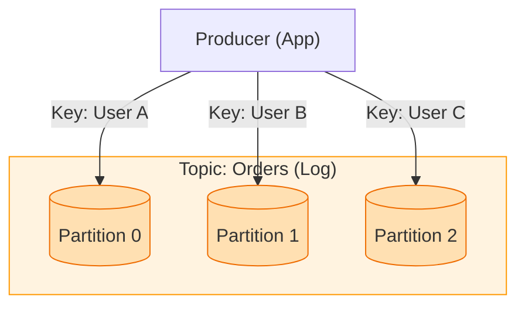
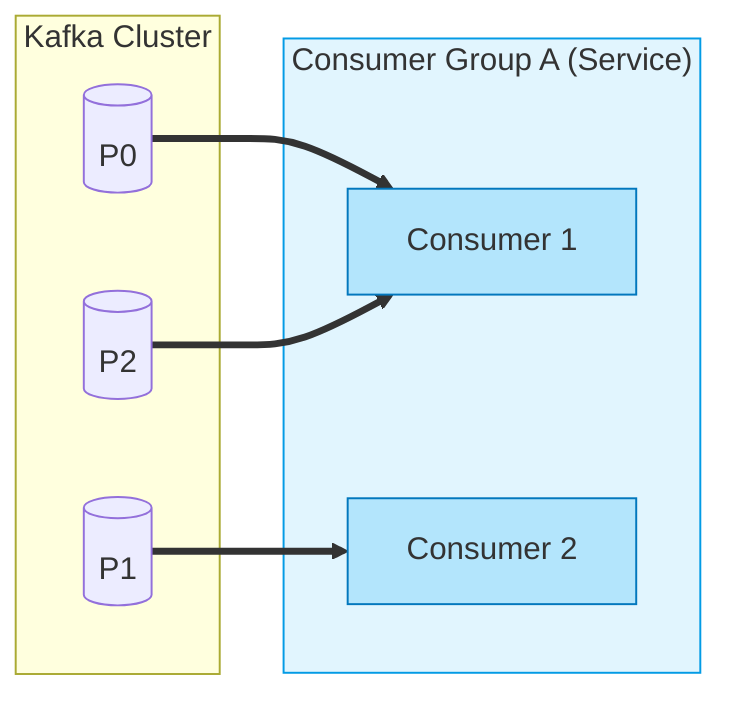

## 🪵 1. Kafka는 '큐(Queue)'가 아니라 '로그(Log)'다

RabbitMQ 같은 메시지 큐는 "소비하면 사라집니다(pop)".
하지만 Kafka는 **"파일에 기록(Log)하고, 소비자가 읽을 위치(Offset)를 관리"**합니다. 소비해도 데이터는 사라지지 않습니다.

이 차이 때문에 Kafka는 **재생(Replay)** 이 가능하고, **다수의 구독자**가 각자의 속도로 읽을 수 있습니다.

### Kafka vs RabbitMQ Comparison

| 특징 | Kafka | RabbitMQ |
| :--- | :--- | :--- |
| **철학** | **Distributed Log** (이벤트 저장소) | **Smart Broker, Dumb Consumer** (메시지 큐) |
| **메시지 수명** | 설정한 기간 동안 **보존** (Persistence) | 소비되면 **삭제** (Volatile) |
| **처리량** | 수십~수백만 TPS (Batch 처리) | 수만 TPS (개별 메시지 ACK) |
| **용도** | 대용량 이벤트 스트리밍, 로그 수집 | 복잡한 라우팅, 즉시 작업 처리 |

---

## 🧩 2. 토픽, 파티션, 그리고 병렬 처리

Kafka 성능의 핵심은 **파티셔닝(Partitioning)** 입니다.

- **Topic**: 폴더 이름 (예: `orders`)
- **Partition**: 그 안의 실제 파일들 (`orders-0`, `orders-1`...)

**중요한 규칙**:
1. **순서 보장**: *파티션 내부*에서는 순서가 보장됩니다. 토픽 전체에서는 보장 안 됩니다.
2. **병렬 처리**: 파티션 수가 3개면, 최대 3명의 소비자가 동시에 일할 수 있습니다.

---

## 👥 3. Consumer Group (컨슈머 그룹)

"우리 조(Group)는 이 일을 나눠서 처리한다."

- **1:1 매핑**: 하나의 파티션은 그룹 내 **단 하나의 컨슈머**만 연결됩니다.
- **스케일 아웃**: 컨슈머가 느리면? 컨슈머를 늘립니다. **단, 파티션 수만큼까지만!** (파티션 3개인데 컨슈머 4명이면 1명은 놉니다.)

---

## ⚖️ 4. 리밸런싱 (Rebalancing) - 헬게이트

컨슈머가 죽거나 새로 들어오면, "자, 다시 나누자!" 하고 파티션을 재분배합니다. 이 과정을 **리밸런싱**이라 합니다.

- **문제**: 리밸런싱 중에는 **Stop-The-World**. 아무도 일을 못 합니다.
- **원인**: 배포(Restart), 네트워크 불안정, GC로 인한 타임아웃 등.
- **운영 팁**: 리밸런싱을 최소화하는 것이 Kafka 운영의 핵심입니다. (heartbeat 설정 등)

---

## 🔑 5. 키(Key) 설계 전략

메시지를 보낼 때 Key를 줄지 말지 결정해야 합니다.

| 전략 | 설명 | 장점 | 단점 |
|---|---|---|---|
| **Key 없음 (Round Robin)** | 그냥 돌아가면서 뿌림 | 부하 분산 최고 | 순서 보장 안 됨 |
| **Key 있음 (Hash)** | `User:123`은 항상 `P0`로 | 특정 사용자의 순서 보장 | 핫 키(Hot Key) 문제 가능성 |

주문 시스템이라면 `OrderId`를 키로 써서, "주문 생성 -> 결제 -> 배송" 순서를 보장해야겠죠?

## 요약

> [!TIP]
> **Kafka Configuration Checklist**:
> - [ ] **Durability**: `acks=all`, `min.insync.replicas=2` (데이터 유실 방지).
> - [ ] **Retention**: `log.retention.hours` 확인 (디스크 Full 방지).
> - [ ] **Consumer**: `enable.auto.commit=false` 권장 (명시적 커밋으로 중복/누락 제어).
> - [ ] **Monitoring**: **Consumer Lag** 모니터링 필수.

1. **Log**: Kafka는 지워지지 않는 로그 파일이다.
2. **Partition**: 병렬 처리의 단위다.
3. **Consumer Group**: 파티션을 나눠 먹는 작업자 팀이다.
4. **Offset**: "나 여기까지 읽었어"라는 책갈피다.
