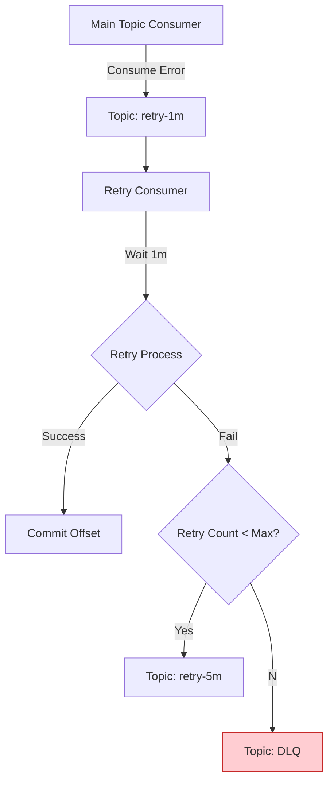
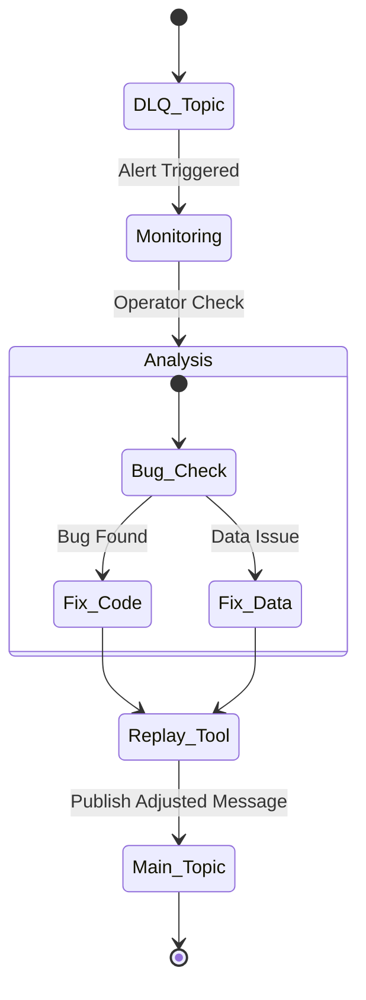
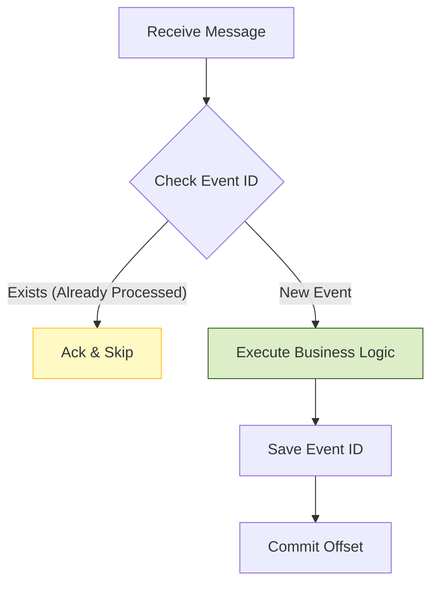

## 이 글에서 얻는 것

- “실패”를 일시적 실패/영구 실패로 분류하고, 재시도/지연/차단(DLQ)을 설계할 수 있습니다.
- 즉시 재시도와 지연 재시도의 차이를 이해하고, 컨슈머 폴 루프를 망가뜨리지 않게 운영할 수 있습니다.
- DLQ(Dead Letter Topic/Queue)를 “버리는 곳”이 아니라, **관측/재처리/원인 분석**의 도구로 설계할 수 있습니다.
- 재시도/중복이 필연적으로 생기는 환경에서 멱등 처리(중복 방지)를 시스템적으로 넣는 방법을 정리합니다.

## 0) 먼저 분류: 어떤 실패인가?

Kafka 소비 실패는 크게 두 부류입니다.

- **일시적(transient)**: 네트워크/외부 API 타임아웃, DB 일시 장애, 락 경합
- **영구(permanent)**: 잘못된 메시지 스키마, 필수 필드 누락, 비즈니스 규칙 위반(수정 없이는 성공 불가)

재시도는 “일시적 실패”에서만 가치가 있고, 영구 실패는 빠르게 분리(DLQ)해서 운영자가 볼 수 있게 해야 합니다.

## 1) 왜 “즉시 재시도”가 위험한가

컨슈머는 `poll()`로 레코드를 가져와 처리합니다.  
실패했을 때 같은 레코드를 즉시 반복 처리하면:

- 같은 파티션이 계속 막혀서 lag가 급격히 늘고,
- 스레드/리소스가 실패 레코드에 고정되며,
- 전체 처리량이 무너질 수 있습니다.

그래서 일반적으로는:

- 짧은 즉시 재시도(아주 소수) +  
- 그 다음은 지연 재시도(Delay) 또는 DLQ  

같은 형태가 안전합니다.

## 2) 재시도 설계 옵션

### 2-1) 컨슈머 내부 backoff(짧게만)

- 실패 시 잠깐 기다렸다가 다시 처리  
  단, 파티션을 “그 시간 동안” 막는다는 점이 근본 문제입니다.

### 2-2) 재시도 토픽(Delay Topic) 패턴(가장 흔함)

아이디어:

1) 원본 토픽에서 실패  
2) `retry-1` 같은 재시도 토픽으로 메시지를 옮김(헤더에 retry count/next attempt time)  
3) 재시도 컨슈머가 “시간이 됐을 때” 다시 원본(또는 다음 단계)으로 재발행  
4) 일정 횟수/시간을 넘으면 DLQ로 보냄  

장점:

- 원본 파티션 처리가 막히지 않음(가장 큰 장점)
- 재시도 정책을 단계별로 설계 가능(1m→5m→30m 등)

주의:

- 재시도 토픽이 늘어나고 운영 복잡도가 증가합니다(모니터링/정리/재처리 도구 필요).

### 2-3) DLQ(Dead Letter Topic): “포기”가 아니라 “운영 루프”

DLQ는 실패 메시지를 별도 토픽에 보내 운영자가:

- 실패 원인을 확인하고,
- 데이터를 수정하거나(또는 코드/설정을 수정하고),
- 재처리(replay)할 수 있게 만드는 장치입니다.

DLQ에 들어갈 때 포함하면 좋은 메타데이터:

- 원본 토픽/파티션/오프셋
- key, headers
- 실패 시각, retry count
- 예외 타입/메시지(스택은 로그/추적 시스템으로 넘기는 편이 안전할 수 있음)

### 2-4) DLQ 운영 루프 시각화

DLQ는 "끝"이 아니라 "새로운 시작"입니다.

## 3) 멱등 처리: 재시도/리밸런스가 있는 한 “중복”은 정상

Kafka 컨슈머는 보통 at-least-once(중복 가능)로 운영됩니다.
그래서 소비 로직은 “중복이 와도 결과가 한 번만 반영”되게 만들어야 합니다.

대표 패턴:

- 이벤트 ID(또는 비즈니스 키)를 DB에 저장하고, 이미 처리했으면 스킵
- upsert/유니크 키로 중복 삽입을 막고, 충돌이면 “이미 처리됨”으로 간주
- 외부 API 호출이라면 idempotency key를 사용(지원되는 경우)

핵심은 “재시도 정책”이 아니라, **중복 처리에 안전한 비즈니스 로직**입니다.

## 4) 관측(모니터링) 포인트

- retry 토픽 lag(쌓이고 있는가?)
- DLQ 유입량(갑자기 늘면 장애 신호)
- 실패 원인 분포(특정 예외가 집중되는가?)
- 재처리 성공률/소요 시간

DLQ는 “0”이 목표가 아니라, “갑자기 늘면 알람 + 처리 루프가 돌아간다”가 목표입니다.

## 5) 자주 하는 실수

- 모든 실패에 무제한 재시도(장애를 키움)
- 영구 실패를 DLQ로 안 보내서 한 파티션이 영원히 막힘
- 재시도만 하고 멱등 처리가 없어 중복 처리로 데이터가 오염됨
- DLQ를 쌓아두기만 하고 재처리 도구/프로세스가 없음

## 연습(추천)

- 실패를 “일시적/영구”로 분류하는 규칙을 만들고, 각각 retry/DLQ로 라우팅해보기
- 재시도 토픽을 2단계(1분/10분)로 만들고, retry count/next attempt time 헤더를 설계해보기
- 이벤트 ID 기반 중복 방지 테이블을 추가해 “중복 소비”에서도 결과가 한 번만 반영되게 만들기
