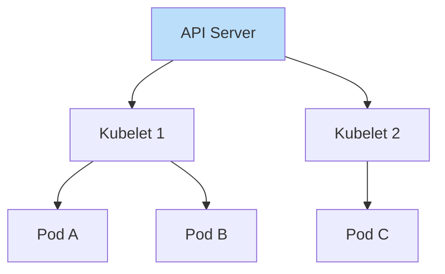
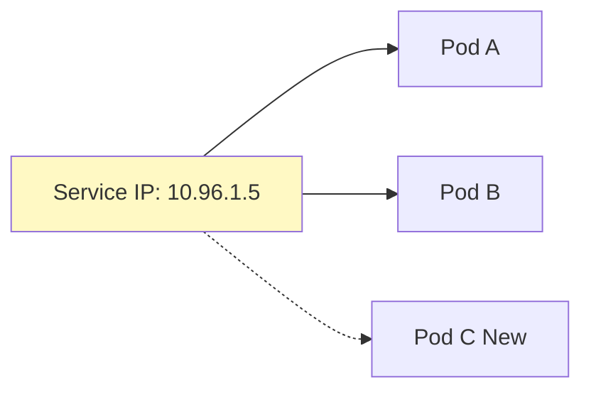

## ☸️ 1. Docker만 쓰면 되지 않나요?

컨테이너가 10개면 수동으로 관리할 수 있습니다.
하지만 100개, 1000개가 되면?

- 어떤 서버에 빈 자리가 있는지? (Scheduling)
- 컨테이너가 죽으면 누가 살려주는지? (Self-healing)
- 새로운 버전 배포할 때 무중단으로 어떻게 하는지? (Rolling Update)

이걸 **자동화**해주는 선장(Pilot)이 Kubernetes입니다.

### Docker Compose vs Kubernetes 비교

| 특징 | Docker Compose | Kubernetes (K8s) |
| :--- | :--- | :--- |
| **규모** | 단일 호스트 (로컬 개발용) | 다중 노드 클러스터 (대규모 운영용) |
| **스케일링** | 수동 (`scale` 명령) | 자동 (Auto-scaling, HPA) |
| **장애 복구** | 컨테이너 재시작 (단순) | 자가 치유 (Self-healing), 노드 간 이동 |
| **네트워크** | 단순 링크 | 복잡한 오버레이 네트워크 (CNI) |

---

## 🏗️ 2. 아키텍처: Master와 Node



1. **Control Plane**: 두뇌입니다. "Pod 3개 유지해"라는 명령을 기억하고 감시합니다.
2. **Worker Node**: 일꾼입니다. 실제 컨테이너(Pod)가 여기서 돌아갑니다.

---

## 📦 3. 핵심 3대장: Pod, Deployment, Service

가장 헷갈리는 3가지 개념을 정리합니다.

### 3-1. Pod (콩깍지)
- **가장 작은 단위**: 쿠버네티스는 컨테이너를 직접 다루지 않고, Pod라는 껍질로 감싸서 다룹니다.
- **특징**: IP를 하나 가집니다. (같은 Pod 내 컨테이너끼리는 `localhost` 통신 가능)

> [!WARNING]
> **Pod는 영원하지 않습니다 (Ephemeral)**.
> Pod가 죽으면 살려내는 게 아니라, **새로운 Pod**를 만들어서 갈아끼웁니다. 따라서 Pod의 IP는 언제든 바뀔 수 있습니다. 절대 Pod IP를 직접 설정에 박지 마세요!

### 3-2. Deployment (관리자)
- **역할**: "Pod 3개를 항상 유지해라" (ReplicaSet 관리)
- **배포**: 버전을 v1 -> v2로 올릴 때 하나씩 갈아끼우는 전략을 담당합니다.



### 3-3. Service (전화번호부)
- **문제**: Pod는 죽었다 살아나면 **IP가 바뀝니다.**
- **해결**: 고정된 IP(ClusterIP)를 제공해서, 뒤쪽 Pod가 바뀌든 말든 항상 연결되게 해줍니다. 일종의 **내부 로드밸런서**입니다.

---

## 🛠️ 4. 실무 패턴 (YAML 읽는 법)

```yaml
# Deployment: "3개 띄워줘"
kind: Deployment
spec:
  replicas: 3
  selector:
    matchLabels:
      app: my-server

---
# Service: "my-server 찾는 애들 이리로 보내줘"
kind: Service
spec:
  selector:
    app: my-server
  ports:
    - port: 80
      targetPort: 8080
```

`Label`로 서로를 찾습니다. Deployment가 만든 Pod에 붙은 라벨(`app: my-server`)을 Service가 보고 트래픽을 토스합니다.

> [!TIP]
> **디버깅 팁**:
> 내 Service가 Pod를 못 찾는 것 같다면? 라벨을 확인하세요.
> `kubectl get pod --show-labels`
> Service의 selector와 Pod의 labels가 **정확히(글자 하나라도 틀리면 안 됨)** 일치해야 합니다.

## 요약

1. **선언적 API**: "명령(Run)"이 아니라 "원하는 상태(State)"를 적어두면 알아서 맞춘다.
2. **Pod**: 배포의 최소 단위. 쉽게 죽고 다시 태어난다.
3. **Service**: 쉽게 죽는 Pod들에게 불멸의 주소를 부여한다.
