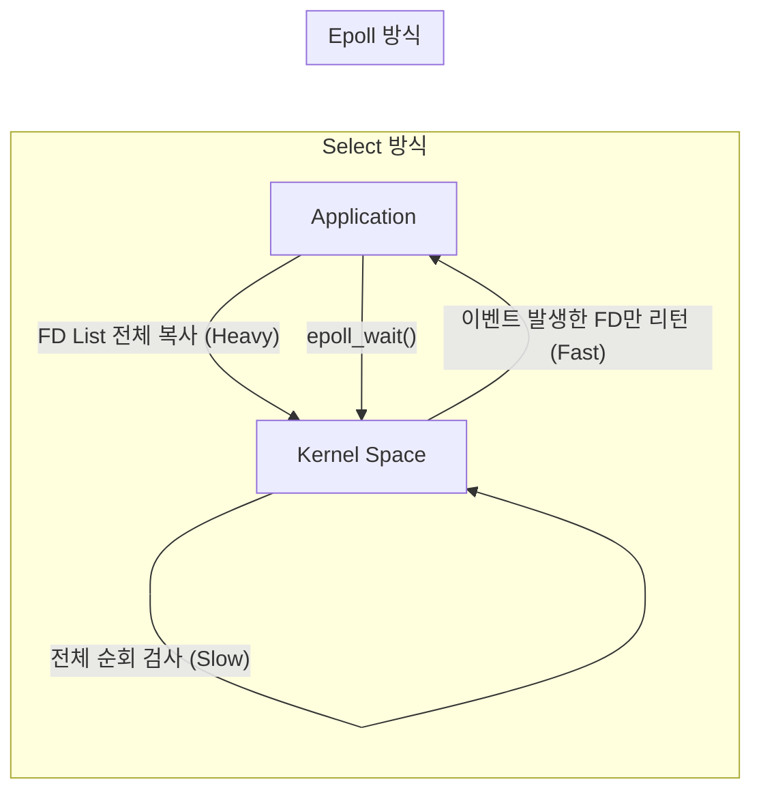
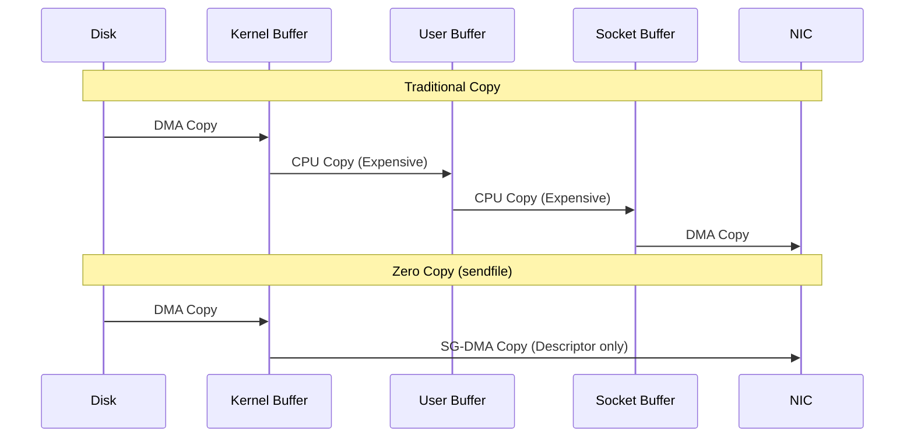

## 이 글에서 얻는 것

- **Blocking vs Non-blocking**과 **Sync vs Async**를 명확히 구분합니다.
- **I/O Multiplexing (select, poll, epoll)**의 진화 과정을 이해합니다.
- **Zero Copy** 기술이 Kafka나 Nginx의 성능을 어떻게 극대화하는지 배웁니다.

## 1) I/O 모델의 4가지 분류

IBM의 분류에 따르면, I/O는 크게 두 가지 축으로 나뉩니다.

1.  **Blocking 여부**: 커널이 응답할 때까지 기다리는가?
2.  **Synchronous 여부**: 애플리케이션이 직접 결과를 확인하는가?

```mermaid
quadrantChart
    title I/O Models Matrix
    x-axis Synchronous --> Asynchronous
    y-axis Non-blocking --> Blocking
    quadrant-1 AIO (Async Blocking - X)
    quadrant-2 BIO (Blocking I/O)
    quadrant-3 NIO (Non-blocking I/O)
    quadrant-4 AIO (Asynchronous I/O)
    
    "Java IO (InputStream)" : [0.2, 0.8]
    "Polling (wait)" : [0.2, 0.3]
    "Epoll / Kqueue" : [0.5, 0.5]
    "Windows IOCP / Linux io_uring" : [0.8, 0.2]
```

- **BIO (Blocking Sync)**: `read()` 호출 시 데이터가 올 때까지 스레드가 잠듭니다. (전통적인 Java Socket)
- **NIO (Non-blocking Sync)**: `read()` 호출 시 데이터가 없으면 즉시 에러(EWOULDBLOCK)를 리턴합니다. 앱은 계속 물어봐야 합니다(Polling).
- **I/O Multiplexing (Epoll)**: 여러 소켓을 감시하다가, "데이터가 온 소켓"만 알려줍니다. (Nginx, Netty, Redis의 핵심)
- **AIO (Asynchronous)**: "다 읽으면 콜백해줘"라고 맡기고 다른 일을 합니다. (Node.js의 libuv, Windows IOCP)

## 2) I/O Multiplexing: Select vs Poll vs Epoll

C10K 문제(동시 접속자 1만 명)를 해결하기 위해 진화해왔습니다.

### Select / Poll의 한계
- 관리하는 소켓 리스트(File Descriptor Set)를 매번 커널(Kernel)에 **복사**해서 넘김. (O(N) 비용)
- 커널은 모든 소켓을 순회하며 상태를 체크해야 함.

### Epoll (Linux) / Kqueue (BSD, macOS)
- **이벤트 기반**: 커널 내부에 상태를 저장해두고, **"변화가 생긴 소켓"**만 리턴합니다. (O(1)에 가까움)
- **Level Trigger vs Edge Trigger**: 상태 유지 방식의 차이. (보통 Edge Trigger가 더 고성능)



## 3) Zero Copy (sendfile)

파일 서버나 Kafka처럼 "디스크에서 읽어서 네트워크로 보내는" 작업에 필수적입니다.

### Traditional Data Transfer
1.  Disk -> Kernel Buffer (DMA)
2.  Kernel Buffer -> User Buffer (CPU Copy) 🐢
3.  User Buffer -> Socket Buffer (CPU Copy) 🐢
4.  Socket Buffer -> NIC (DMA)

총 **4번의 복사**와 **4번의 Context Switching**이 발생합니다.

### Zero Copy (sendfile)
1.  Disk -> Kernel Buffer (DMA)
2.  Kernel Buffer -> NIC (DMA, Descriptor만 복사) 🚀

USER 영역을 거치지 않고, 커널 안에서 바로 데이터를 쏘아 보냅니다.
**CPU Copy가 0번**이기에 "Zero Copy"라고 부릅니다.



## 요약

- **Epoll**은 수만 개의 연결을 효율적으로 관리하기 위한 Linux의 핵심 무기입니다. (vs Select/Poll)
- **Zero Copy**는 OS 차원에서 불필요한 데이터 복사를 없애 성능을 극대화합니다.
- 고성능 서버(Nginx, Kafka, Redis)는 모두 **Epoll + Non-blocking I/O** 기반입니다.

## 다음 단계

- **네트워크 심화**: `/learning/deep-dive/deep-dive-network-tcp-performance/` (TCP 혼잡 제어, Flow Control)
