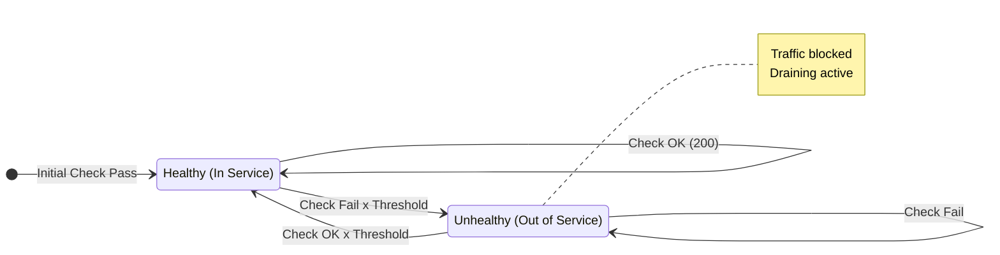
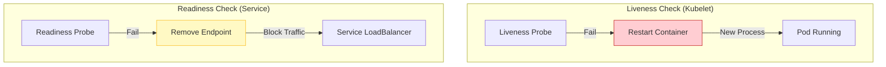

## 💓 1. 헬스체크는 '생존 확인'이 아니라 '신호등'이다

헬스체크를 단순히 "서버 켜졌나?" 확인하는 용도로만 쓰면 장애를 키웁니다.
헬스체크는 **"지금 트래픽을 받아도 되는가?"**를 묻는 것입니다.

이 "제외(Draining)" 과정이 얼마나 빠르고 정확하냐가 고가용성을 결정합니다.

---

## ⚖️ 2. L4 (NLB) vs L7 (ALB) 선택 가이드

"그냥 ALB 쓰면 되는 거 아냐?" -> **TCP/UDP 성능**이 중요하다면 NLB입니다.

| 특징 | NLB (Network Load Balancer) | ALB (Application Load Balancer) |
|---|---|---|
| **계층** | L4 (전송 계층) | L7 (응용 계층) |
| **속도** | 초고속 (패킷만 보고 토스) | 보통 (HTTP 헤더 파싱) |
| **IP 주소** | **고정 IP 할당 가능** | IP 변동됨 (DNS로만 접근) |
| **기능** | 단순 포트 포워딩, 소스 IP 보존 | 경로 라우팅(`/api`), 인증(OIDC), WAF |
| **용도** | 게임 서버, 실시간 스트리밍, Private Link | 웹 서비스, 마이크로서비스 API |

---

## 🩺 3. Liveness vs Readiness (이중 헬스체크)

Kubernetes나 최신 프레임워크는 헬스체크를 두 단계로 나눕니다.

### 3-1. Liveness Probe (생존 확인)
- **목적**: "프로세스가 살아있는가?"
- **실패 시**: **컨테이너 재시작 (Restart)**
- **체크 로직**: 데드락 걸렸는지, 메인 스레드 죽었는지 확인.

### 3-2. Readiness Probe (준비 확인)
- **목적**: "트래픽 받을 준비 됐어?"
- **실패 시**: **로드밸런서에서 제외 (Traffic Cut)**
- **체크 로직**: DB 연결 됐는지, 초기 데이터 로딩 끝났는지 확인.

> ⚠️ **주의**: Liveness에 DB 체크를 넣지 마세요!
> DB가 잠깐 느려졌다고 멀쩡한 웹 서버를 **재시작**시켜버리는 대참사가 일어납니다. (Cascading Failure)

---

## ⏱️ 4. Flapping (깜빡임) 현상 막기

헬스체크가 너무 민감하면, 잠깐의 GC 멈춤에도 서버가 뺐다 꼈다를 반복합니다.

- **Threshold**: 실패를 **3회 연속** 감지해야 제외한다. (Unhealthy Threshold)
- **Interval**: 10초마다 체크한다.
- **Timeout**: 5초 안에 응답 없으면 실패.

**Golden Rule**:
"제외는 빠를수록 좋고(사용자 에러 방지), 복귀는 보수적일수록 좋다(확실히 나았을 때 투입)."

## 요약

1. **의미**: 헬스체크는 트래픽 스위치다.
2. **L4 vs L7**: 성능/고정IP는 NLB, 기능/웹은 ALB.
3. **Probe 분리**: 재시작용(Liveness)과 제외용(Readiness)을 구분해라.
4. **설정**: 너무 예민하게 설정하면 멀쩡한 서버가 널뛰기(Flapping)한다.
