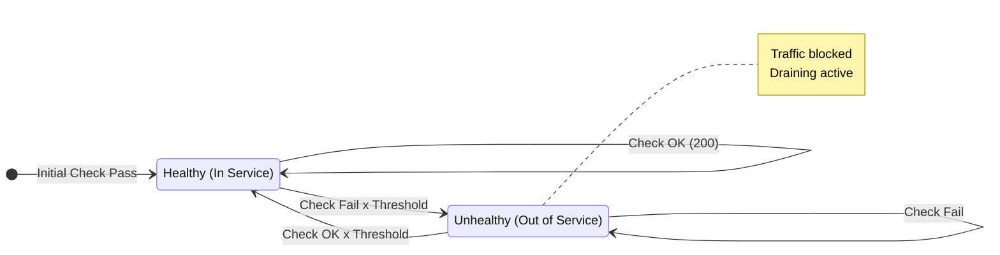
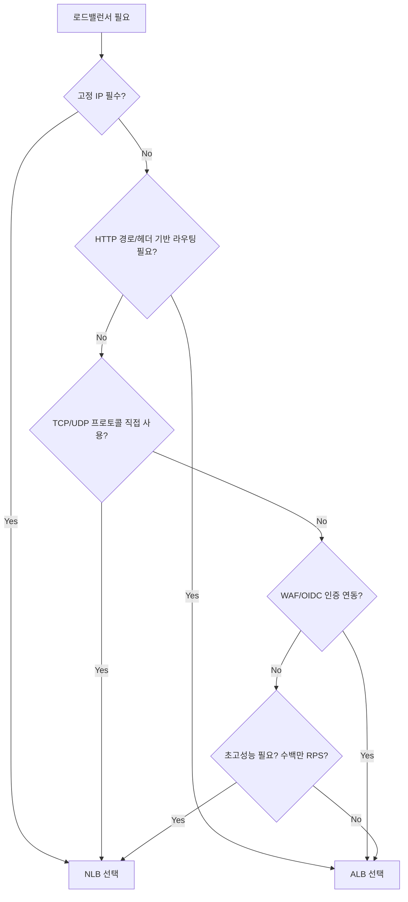
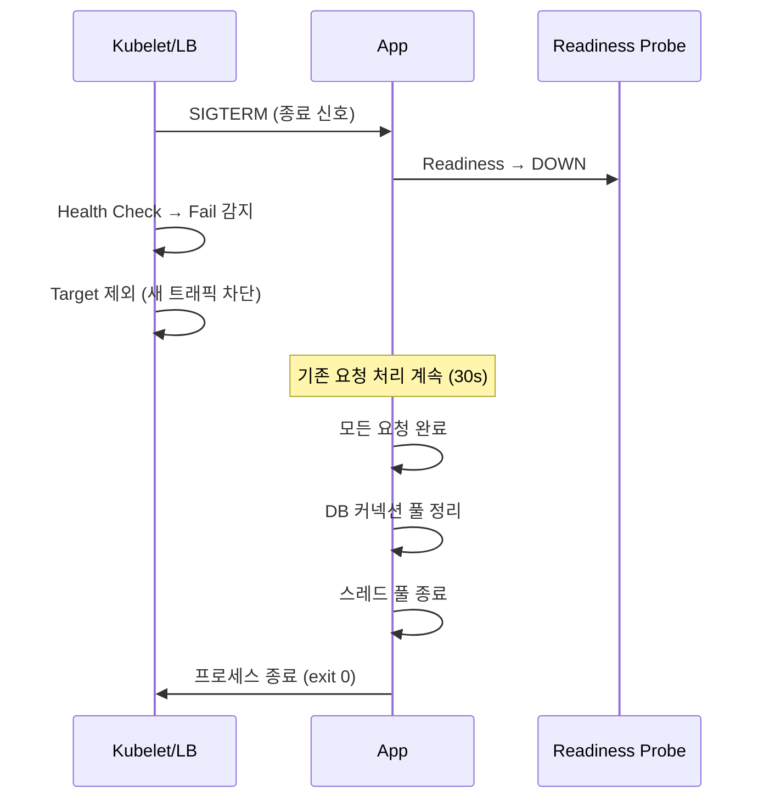

## 💓 1. 헬스체크는 '생존 확인'이 아니라 '신호등'이다

헬스체크를 단순히 "서버 켜졌나?" 확인하는 용도로만 쓰면 장애를 키웁니다.
헬스체크는 **"지금 트래픽을 받아도 되는가?"**를 묻는 것입니다.


```mermaid
stateDiagram-v2
    direction LR
    
    state "Healthy (In Service)" as Healthy
    state "Unhealthy (Out of Service)" as Unhealthy
    
    [*] --> Healthy : Initial Check Pass
    
    Healthy --> Healthy : Check OK (200)
    Healthy --> Unhealthy : Check Fail x Threshold
    
    Unhealthy --> Unhealthy : Check Fail
    Unhealthy --> Healthy : Check OK x Threshold
    
    note right of Unhealthy
        Traffic blocked
        Draining active
    end note
```

이 "제외(Draining)" 과정이 얼마나 빠르고 정확하냐가 고가용성을 결정합니다.

---

## ⚖️ 2. L4 (NLB) vs L7 (ALB) 선택 가이드

"그냥 ALB 쓰면 되는 거 아냐?" → **TCP/UDP 성능**이 중요하다면 NLB입니다.

| 특징 | NLB (Network Load Balancer) | ALB (Application Load Balancer) |
|---|---|---|
| **계층** | L4 (전송 계층) | L7 (응용 계층) |
| **속도** | 초고속 (패킷만 보고 토스) | 보통 (HTTP 헤더 파싱) |
| **IP 주소** | **고정 IP 할당 가능** | IP 변동됨 (DNS로만 접근) |
| **기능** | 단순 포트 포워딩, 소스 IP 보존 | 경로 라우팅(`/api`), 인증(OIDC), WAF |
| **헬스체크** | TCP/HTTP, 간격 10s 고정 | HTTP/HTTPS, 간격 5~300s 설정 가능 |
| **Cross-Zone** | 기본 비활성, 활성화 시 AZ 간 데이터 요금 발생 | 기본 활성화 |
| **SSL 종료** | 가능하지만 SNI 미지원 | SNI 지원, 다중 인증서 가능 |
| **용도** | 게임 서버, 실시간 스트리밍, Private Link, gRPC | 웹 서비스, 마이크로서비스 API, WebSocket |

### 선택 의사결정 플로우


```mermaid
flowchart TD
    A[로드밸런서 필요] --> B{고정 IP 필수?}
    B -->|Yes| NLB[NLB 선택]
    B -->|No| C{HTTP 경로/헤더 기반 라우팅 필요?}
    C -->|Yes| ALB[ALB 선택]
    C -->|No| D{TCP/UDP 프로토콜 직접 사용?}
    D -->|Yes| NLB
    D -->|No| E{WAF/OIDC 인증 연동?}
    E -->|Yes| ALB
    E -->|No| F{초고성능 필요? 수백만 RPS?}
    F -->|Yes| NLB
    F -->|No| ALB
```

### NLB + ALB 이중 구성 패턴

고정 IP도 필요하고 L7 라우팅도 필요한 경우, NLB → ALB 체이닝을 사용합니다.

```text
Client → NLB (고정 IP) → ALB (경로 라우팅) → Target Group → EC2/ECS
```

이 구성은 금융/보안이 엄격한 환경에서 방화벽 IP 등록과 L7 기능을 동시에 확보할 때 유용합니다. 단, 추가 비용과 레이턴시 증가(약 1~2ms)를 감수해야 합니다.

---

## 🩺 3. 다계층 헬스체크 설계: Shallow vs Deep

실무에서 가장 중요한 설계 결정 중 하나는 **헬스체크의 깊이**입니다.

### 3-1. Shallow Health Check (얕은 체크)

```java
// Spring Boot Actuator 기본
@RestController
public class HealthController {

    @GetMapping("/health/live")
    public ResponseEntity<String> liveness() {
        // 프로세스가 살아있으면 OK
        return ResponseEntity.ok("OK");
    }
}
```

- **용도**: Liveness Probe, LB 기본 체크
- **비용**: 거의 0 (CPU/IO 무관)
- **한계**: 앱은 떠있지만 DB 연결 끊긴 상태 감지 불가

### 3-2. Deep Health Check (깊은 체크)

```java
@Component
public class DeepHealthIndicator implements HealthIndicator {

    private final DataSource dataSource;
    private final RedisConnectionFactory redisFactory;
    private final KafkaTemplate<String, String> kafkaTemplate;

    public DeepHealthIndicator(DataSource dataSource,
                                RedisConnectionFactory redisFactory,
                                KafkaTemplate<String, String> kafkaTemplate) {
        this.dataSource = dataSource;
        this.redisFactory = redisFactory;
        this.kafkaTemplate = kafkaTemplate;
    }

    @Override
    public Health health() {
        Health.Builder builder = Health.up();
        Map<String, Object> details = new LinkedHashMap<>();

        // 1. DB 연결 체크 (타임아웃 2초)
        try (Connection conn = dataSource.getConnection()) {
            if (!conn.isValid(2)) {
                return builder.down().withDetail("db", "connection invalid").build();
            }
            details.put("db", "OK");
        } catch (SQLException e) {
            return builder.down().withDetail("db", e.getMessage()).build();
        }

        // 2. Redis 체크
        try {
            redisFactory.getConnection().ping();
            details.put("redis", "OK");
        } catch (Exception e) {
            // Redis 장애 시 degraded (down이 아님)
            details.put("redis", "DEGRADED: " + e.getMessage());
            builder.status("DEGRADED");
        }

        // 3. Kafka 메타데이터 체크
        try {
            kafkaTemplate.getDefaultTopic(); // 메타데이터 접근 확인
            details.put("kafka", "OK");
        } catch (Exception e) {
            details.put("kafka", "DEGRADED: " + e.getMessage());
            builder.status("DEGRADED");
        }

        return builder.withDetails(details).build();
    }
}
```

### 3-3. 계층별 헬스체크 매핑 전략

| 체크 유형 | 대상 | 응답 시간 | 매핑 대상 | 실패 결과 |
|-----------|------|----------|----------|----------|
| **Shallow** | 프로세스/메모리 | < 1ms | Liveness Probe | 컨테이너 재시작 |
| **Medium** | DB 연결 검증 | < 100ms | Readiness Probe | LB에서 제외 |
| **Deep** | DB + Redis + Kafka + 외부 API | < 2s | 모니터링 전용 | 대시보드 경고 |

> **핵심 원칙**: Liveness에는 외부 의존성을 절대 넣지 않는다. Readiness에는 핵심 의존성만 넣는다. Deep check는 모니터링 대시보드용으로만 쓴다.

---

## 🔄 4. Kubernetes Probe 심화: Startup + Liveness + Readiness

### 4-1. 세 가지 Probe의 역할 분리

```yaml
apiVersion: v1
kind: Pod
metadata:
  name: api-server
spec:
  containers:
    - name: app
      image: api-server:latest
      ports:
        - containerPort: 8080

      # 1. Startup Probe: 앱이 완전히 올라올 때까지 기다림
      #    성공 전까지 Liveness/Readiness가 작동하지 않음
      startupProbe:
        httpGet:
          path: /health/started
          port: 8080
        initialDelaySeconds: 5
        periodSeconds: 5
        failureThreshold: 30        # 최대 5 * 30 = 150초 기다림
        successThreshold: 1

      # 2. Liveness Probe: 프로세스 데드락/좀비 탐지
      livenessProbe:
        httpGet:
          path: /health/live
          port: 8080
        periodSeconds: 10
        failureThreshold: 3          # 30초 후 재시작
        successThreshold: 1
        timeoutSeconds: 3

      # 3. Readiness Probe: 트래픽 수신 가능 여부
      readinessProbe:
        httpGet:
          path: /health/ready
          port: 8080
        periodSeconds: 5
        failureThreshold: 3          # 15초 후 LB에서 제외
        successThreshold: 2          # 10초 연속 성공 시 복귀 (보수적)
        timeoutSeconds: 3
```

### 4-2. Startup Probe가 필요한 이유

Java/Spring Boot 앱은 초기화에 30초~2분이 걸릴 수 있습니다. Startup Probe 없이 Liveness를 일찍 걸면:

1. 앱이 아직 초기화 중 → Liveness 실패
2. kubelet이 컨테이너 재시작
3. 또 초기화 시작 → 또 실패
4. **CrashLoopBackOff** 무한 루프

```text
Pod 상태: Running → CrashLoopBackOff → Running → CrashLoopBackOff ...

원인: Liveness failureThreshold(3) × periodSeconds(10) = 30초
      앱 초기화 시간: 60초
      → 앱이 뜨기도 전에 계속 죽임
```

Startup Probe는 이 문제를 해결합니다. 성공할 때까지 Liveness/Readiness를 비활성화하고, 성공 후에야 정상 프로브 체크를 시작합니다.

### 4-3. Spring Boot Actuator와 Probe 매핑

```yaml
# application.yml
management:
  endpoint:
    health:
      probes:
        enabled: true                  # /actuator/health/liveness, /readiness 활성화
      group:
        liveness:
          include: livenessState       # 프로세스 상태만
        readiness:
          include:
            - readinessState
            - db                       # DataSource 연결
            - diskSpace                # 디스크 여유
  health:
    defaults:
      enabled: false                   # 기본 indicator 비활성화 후 명시 포함
```

```java
// 커스텀 Readiness 조건 추가
@Component
public class WarmupReadinessIndicator implements HealthIndicator {

    private final AtomicBoolean warmedUp = new AtomicBoolean(false);

    @EventListener(ApplicationReadyEvent.class)
    public void onReady() {
        // 캐시 워밍업 완료 후 Ready 전환
        warmUpCaches();
        warmedUp.set(true);
    }

    @Override
    public Health health() {
        if (warmedUp.get()) {
            return Health.up().withDetail("warmup", "complete").build();
        }
        return Health.down().withDetail("warmup", "in-progress").build();
    }

    private void warmUpCaches() {
        // 핵심 캐시 사전 로딩
    }
}
```

---

## ⏱️ 5. Connection Draining과 Graceful Shutdown 연동

헬스체크가 실패로 전환되었을 때, 기존 요청을 안전하게 완료하는 과정이 **Connection Draining**입니다.

### 5-1. AWS ALB Deregistration Delay

```text
Target이 Unhealthy로 전환되면:
1. 새 요청 → 다른 Target으로 전달
2. 기존 진행 중 요청 → Deregistration Delay 동안 유지
3. 딜레이 만료 → 강제 종료

기본값: 300초 (5분) — 대부분의 API는 30~60초가 적절
```

### 5-2. Spring Boot Graceful Shutdown

```yaml
# application.yml
server:
  shutdown: graceful

spring:
  lifecycle:
    timeout-per-shutdown-phase: 30s    # 최대 30초간 기존 요청 완료 대기
```

```java
@Component
public class GracefulShutdownHealthManager {

    private final AtomicBoolean shuttingDown = new AtomicBoolean(false);

    /**
     * SIGTERM 수신 시 Readiness를 먼저 DOWN으로 변경
     * → LB가 새 트래픽을 보내지 않음
     * → 기존 요청은 계속 처리
     */
    @PreDestroy
    public void onShutdown() {
        shuttingDown.set(true);
        
        // LB 헬스체크 주기(보통 5~10초)만큼 대기
        // → LB가 이 인스턴스를 제외할 시간을 줌
        try {
            Thread.sleep(10_000);
        } catch (InterruptedException e) {
            Thread.currentThread().interrupt();
        }
    }

    public boolean isShuttingDown() {
        return shuttingDown.get();
    }
}
```

### 5-3. Graceful Shutdown 타임라인


```mermaid
sequenceDiagram
    participant K as Kubelet/LB
    participant A as App
    participant R as Readiness Probe

    K->>A: SIGTERM (종료 신호)
    A->>R: Readiness → DOWN
    K->>K: Health Check → Fail 감지
    K->>K: Target 제외 (새 트래픽 차단)
    
    Note over A: 기존 요청 처리 계속 (30s)
    
    A->>A: 모든 요청 완료
    A->>A: DB 커넥션 풀 정리
    A->>A: 스레드 풀 종료
    A->>K: 프로세스 종료 (exit 0)
```

**핵심 타이밍 규칙**:

```text
preStop sleep (10s) + 앱 shutdown timeout (30s) < terminationGracePeriodSeconds (45s)
```

```yaml
# Pod 설정에서의 통합
spec:
  terminationGracePeriodSeconds: 45
  containers:
    - name: app
      lifecycle:
        preStop:
          exec:
            command: ["sh", "-c", "sleep 10"]  # LB 제외 대기
```

---

## 🚨 6. 헬스체크 안티패턴과 장애 사례

### 안티패턴 1: Liveness에 외부 의존성 포함

```yaml
# ❌ 절대 하지 마세요
livenessProbe:
  httpGet:
    path: /actuator/health    # DB, Redis, Kafka 전부 체크
    port: 8080
```

**실제 장애**: Redis 1분 점검 → 전체 Pod Liveness 실패 → 동시 재시작 → DB 커넥션 폭풍 → 전체 서비스 다운

```text
Redis 점검 (1분)
  → 100개 Pod Liveness 실패
  → kubelet이 100개 Pod 동시 재시작
  → 100개 Pod가 동시에 DB 커넥션 요청
  → DB max_connections 초과
  → 전체 서비스 장애 (복구 15분)
```

### 안티패턴 2: 헬스체크 엔드포인트에서 무거운 쿼리

```java
// ❌ 매 5초마다 full table scan
@GetMapping("/health")
public String health() {
    long count = orderRepository.count();  // SELECT COUNT(*) FROM orders
    return count > 0 ? "OK" : "FAIL";
}
```

**올바른 방법**: `SELECT 1` 또는 `connection.isValid(2)` 수준의 가벼운 체크

### 안티패턴 3: Readiness 복귀 기준이 너무 관대

```yaml
readinessProbe:
  successThreshold: 1    # 한 번 성공하면 즉시 트래픽 복귀
```

DB가 불안정하게 깜빡이면 트래픽이 들어왔다 나갔다를 반복합니다. **최소 successThreshold: 2** 이상 권장합니다.

### 안티패턴 4: 모든 인스턴스가 동시에 Unhealthy

```text
헬스체크 Threshold: Fail 1회 → 즉시 제외
GC Pause: 전체 인스턴스에서 동시 발생 (JVM Major GC)

결과: LB에 Healthy 타겟이 0개
      → 503 Service Unavailable 폭발
```

**방어**: failureThreshold 3 이상 + GC 튜닝으로 pause time 분산

---

## ⏱️ 7. Flapping 방지와 Threshold 설계

헬스체크가 너무 민감하면, 잠깐의 GC 멈춤에도 서버가 뺐다 꼈다를 반복합니다.

### 7-1. Threshold 설계 공식

```text
제외 판단 시간 = failureThreshold × periodSeconds
복귀 판단 시간 = successThreshold × periodSeconds

권장값:
  제외: 3 × 10s = 30초 (빠르게 차단)
  복귀: 3 × 10s = 30초 (보수적으로 투입)
```

### 7-2. 환경별 권장 설정

| 환경 | Period | Fail Threshold | Success Threshold | Timeout | 비고 |
|------|--------|---------------|-------------------|---------|------|
| **API 서버** | 10s | 3 | 2 | 5s | 빠른 제외, 신중한 복귀 |
| **배치 워커** | 30s | 5 | 1 | 10s | 느슨하게 (배치 실행 중 일시 정지 허용) |
| **실시간 서비스** | 5s | 2 | 3 | 2s | 빠른 감지, 확실한 복귀 |
| **DB Proxy** | 15s | 3 | 3 | 5s | 안정성 우선 |

### 7-3. Golden Rule

```text
"제외는 빠를수록 좋고(사용자 에러 방지),
 복귀는 보수적일수록 좋다(확실히 나았을 때 투입)."
```

---

## 📊 8. 헬스체크 모니터링과 운영 지표

### 8-1. 필수 모니터링 메트릭

```text
# Prometheus 메트릭 예시

# 1. 헬스체크 성공/실패 카운터
health_check_total{status="success", target="api-01"} 14400
health_check_total{status="failure", target="api-01"} 3

# 2. 헬스체크 응답 시간
health_check_duration_seconds{quantile="0.99"} 0.045

# 3. Target 상태 변경 이벤트
target_state_transitions_total{from="healthy", to="unhealthy"} 2

# 4. Healthy 인스턴스 비율
healthy_targets_ratio = healthy_count / total_count
```

### 8-2. 알람 기준

| 지표 | Warning | Critical | 대응 |
|------|---------|----------|------|
| Healthy Target 비율 | < 80% | < 50% | 인스턴스 상태 확인, 스케일 아웃 |
| HC 응답 시간 p99 | > 500ms | > 2s | 앱 성능 점검, DB 커넥션 확인 |
| 상태 전환 횟수/시간 | > 5회 | > 10회 | Flapping 의심, Threshold 조정 |
| Draining 인스턴스 수 | > 30% | > 50% | 배포/장애 확인 |

### 8-3. Grafana 대시보드 구성 예시

```text
Row 1: [Healthy Target Count] [Unhealthy Count] [Draining Count]
Row 2: [HC Response Time Heatmap] [State Transitions Timeline]
Row 3: [Per-Target Status Matrix] [Deregistration Duration P95]
```

---

## 🔗 9. DNS Failover와 헬스체크 연계

### 9-1. Route 53 Health Check + Failover

```text
Primary (ap-northeast-2):
  ALB → EC2 (정상 운영)
  Route 53 Health Check → ALB 엔드포인트 체크

Secondary (us-east-1):
  ALB → EC2 (대기)
  
Failover 조건: Primary HC 3회 연속 실패 → DNS TTL 만료 후 Secondary로 전환
```

### 9-2. 주의점

- DNS TTL이 60초면, 실제 failover까지 최대 60초 + HC 감지시간
- 클라이언트가 DNS 캐시를 오래 잡으면 failover가 안 될 수 있음
- **권장**: TTL 60초 이하, 클라이언트 DNS 캐시 respect 확인

---

## 🏗️ 10. IaC로 로드밸런서 + 헬스체크 구성 (Terraform 예시)

```hcl
# ALB + Target Group + Health Check 전체 구성

resource "aws_lb" "api" {
  name               = "api-alb"
  internal           = false
  load_balancer_type = "application"
  security_groups    = [aws_security_group.alb.id]
  subnets            = var.public_subnet_ids

  enable_deletion_protection = true

  tags = {
    Environment = "production"
  }
}

resource "aws_lb_target_group" "api" {
  name     = "api-tg"
  port     = 8080
  protocol = "HTTP"
  vpc_id   = var.vpc_id

  # Deregistration Delay: 배포 시 기존 요청 완료 대기
  deregistration_delay = 30

  health_check {
    enabled             = true
    path                = "/actuator/health/readiness"
    port                = "traffic-port"
    protocol            = "HTTP"
    healthy_threshold   = 3       # 3회 연속 성공 → Healthy
    unhealthy_threshold = 2       # 2회 연속 실패 → Unhealthy (빠른 제외)
    timeout             = 5
    interval            = 10
    matcher             = "200"
  }

  # Slow Start: 새 인스턴스에 점진적 트래픽 증가
  slow_start = 60

  stickiness {
    type            = "lb_cookie"
    cookie_duration = 86400
    enabled         = false       # API는 sticky 비권장
  }
}

resource "aws_lb_listener" "https" {
  load_balancer_arn = aws_lb.api.arn
  port              = 443
  protocol          = "HTTPS"
  ssl_policy        = "ELBSecurityPolicy-TLS13-1-2-2021-06"
  certificate_arn   = var.acm_certificate_arn

  default_action {
    type             = "forward"
    target_group_arn = aws_lb_target_group.api.arn
  }
}
```

---

## ✅ 운영 체크리스트

- [ ] Liveness Probe에 외부 의존성(DB/Redis/Kafka) 미포함 확인
- [ ] Readiness Probe에 핵심 의존성만 포함, 타임아웃 < 3s
- [ ] Startup Probe 설정 (Java/Spring 앱은 초기화 시간 고려)
- [ ] `failureThreshold × periodSeconds` 계산이 허용 장애 감지 시간 이내
- [ ] `successThreshold ≥ 2` (Flapping 방지)
- [ ] Deregistration Delay ≤ 앱 Graceful Shutdown Timeout
- [ ] `terminationGracePeriodSeconds > preStop sleep + shutdown timeout`
- [ ] 헬스체크 응답 시간 p99 모니터링 대시보드 구성
- [ ] Healthy Target 비율 알람 설정 (< 50% → Critical)
- [ ] 배포 시 Rolling Update와 헬스체크 연동 테스트 완료
- [ ] GC Pause로 인한 헬스체크 실패 시뮬레이션 테스트
- [ ] DNS Failover 헬스체크 설정 시 TTL ≤ 60s 확인

---

## 요약

1. **의미**: 헬스체크는 트래픽 스위치다. 생존 확인이 아니라 "트래픽을 받을 자격"을 판정한다.
2. **L4 vs L7**: 성능/고정IP는 NLB, 기능/웹은 ALB. 둘 다 필요하면 체이닝.
3. **Probe 분리**: Startup(초기화 보호) + Liveness(데드락 탐지) + Readiness(트래픽 제어)를 용도별로 분리.
4. **다계층 체크**: Shallow → Medium → Deep 순으로 설계하고, 깊은 체크는 모니터링 전용으로.
5. **Graceful Shutdown**: SIGTERM → Readiness Down → LB 제외 대기 → 기존 요청 완료 → 프로세스 종료.
6. **안티패턴 경계**: Liveness에 DB 넣기, 너무 민감한 Threshold, 무거운 쿼리 체크는 장애를 키운다.

---

## 관련 글

- [Timeout/Retry/Backoff 설계: 장애 전파를 막는 3종 세트](/learning/deep-dive/deep-dive-timeout-retry-backoff/)
- [Kubernetes 기초](/learning/deep-dive/deep-dive-kubernetes-basics/)
- [Kubernetes 롤아웃 전략](/learning/deep-dive/deep-dive-kubernetes-rollouts/)
- [Graceful Shutdown 패턴](/learning/deep-dive/deep-dive-graceful-shutdown/)
- [Resilience4j Circuit Breaker](/learning/deep-dive/deep-dive-resilience4j-circuit-breaker/)
- [Prometheus + Grafana 모니터링](/learning/deep-dive/deep-dive-prometheus-grafana/)
- [VPC 네트워크 기초](/learning/deep-dive/deep-dive-vpc-network-basics/)
- [API Rate Limit & Backpressure](/learning/deep-dive/deep-dive-api-rate-limit-backpressure/)
