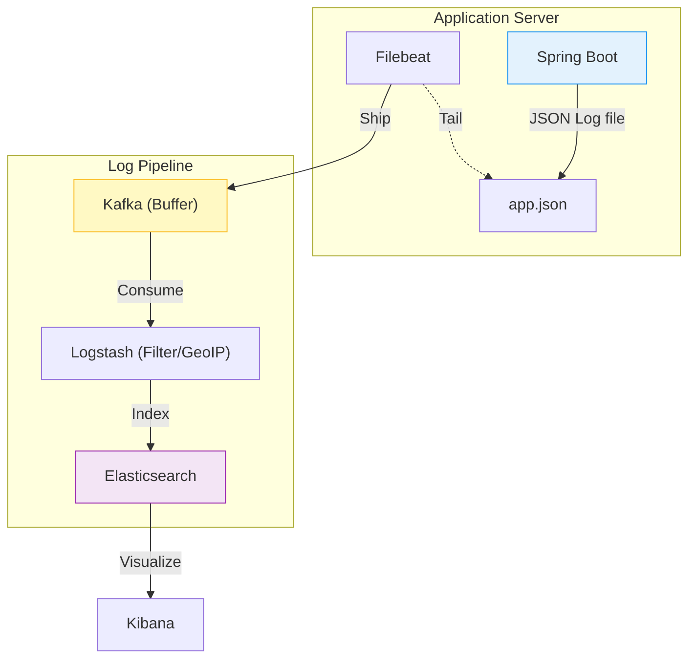
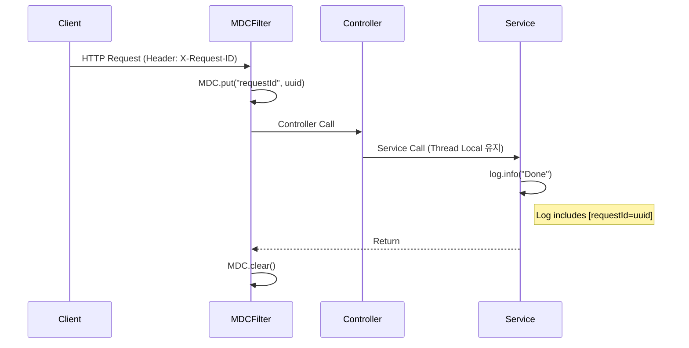

## 📝 1. 로그는 인간이 아니라 "기계"가 읽는 것이다

`System.out.println("User login: " + name)` -> 최악의 로그입니다.
서버가 10대고 로그가 초당 1000줄 쌓이면, `grep`으로는 답이 없습니다.

로그는 **수집하고, 인덱싱하고, 검색하기 위해** 남기는 데이터입니다.

---

## 📊 2. 구조화된 로그 (Structured Logging)

텍스트 대신 **JSON**으로 남기세요.

### Text vs JSON Comparison

| 특징 | Text Log (Bad) | JSON Log (Good) |
| :--- | :--- | :--- |
| **가독성** | 인간 친화적 | 기계 친화적 |
| **검색** | 정규식 (`grep`) 필요 | 키-값 필터링 (`order_id: 123`) |
| **확장성** | 필드 추가 시 파싱 로직 수정 필요 | 유연함 (New field = New key) |

**Structure Example:**
```json
{
  "@timestamp": "2025-01-01T10:00:00Z",
  "level": "ERROR",
  "message": "Order processing failed",
  "service": "order-service",
  "context": {
    "order_id": 123,
    "user_id": "userA",
    "reason": "connection_timeout"
  },
  "trace": {
    "id": "a1b2c3d4"
  }
}
```
-> `event="order_failed"` 로 검색 0.1초 컷. Kibana 대시보드 만들기 쉬움.

---

## 🕸️ 3. ELK Stack 아키텍처

로그를 어떻게 모으는지 흐름을 이해해야 합니다.



1. **App**: 로그를 파일(`app.json`)에 씁니다. (네트워크로 직접 쏘면 앱 느려짐)
2. **Filebeat**: 파일을 꼬리물기(tail)해서 가볍게 퍼나릅니다.
3. **Elasticsearch**: 검색 엔진에 저장합니다.
4. **Kibana**: 시각화합니다.

---

## 🔍 4. MDC: 분산 추적의 시작

멀티 스레드 환경에서 로그가 뒤섞이면 **"이 에러가 누구 요청에서 난 거지?"** 알 수 없습니다.
**MDC (Mapped Diagnostic Context)** 는 스레드 로컬에 "꼬리표"를 붙입니다.

**MDC Flow Visualization:**



```java
// MDC Usage Pattern
public class MdcFilter implements Filter {
    public void doFilter(...) {
        MDC.put("requestId", UUID.randomUUID().toString());
        try {
            chain.doFilter(request, response);
        } finally {
            MDC.clear(); // 필수: 스레드 풀 재사용 시 오염 방지
        }
    }
}
```

로그를 볼 때 `requestId` 하나로 전체 흐름을 필터링할 수 있게 됩니다.

## 요약

## 요약

> [!TIP]
> **Production Logging Checklist**:
> - [ ] **Async**: Logback AsyncAppender 사용 (Main 스레드 블로킹 방지)
> - [ ] **Rolling**: 시간/용량 기반 로그 회전 정책 설정 (Disk Full 방지)
> - [ ] **Trace**: 모든 로그에 `traceId` 포함 (MDC 활용)
> - [ ] **Sanitization**: 민감 정보(비밀번호, 카드번호) 마스킹 처리

1. **Format**: JSON으로 남겨라. (LogstashEncoder 등 사용)
2. **Context**: MDC를 써서 모든 로그에 요청 ID를 박아라.
3. **Async**: 별도 스레드로 로그를 수집해라. (App 성능 영향 최소화)
