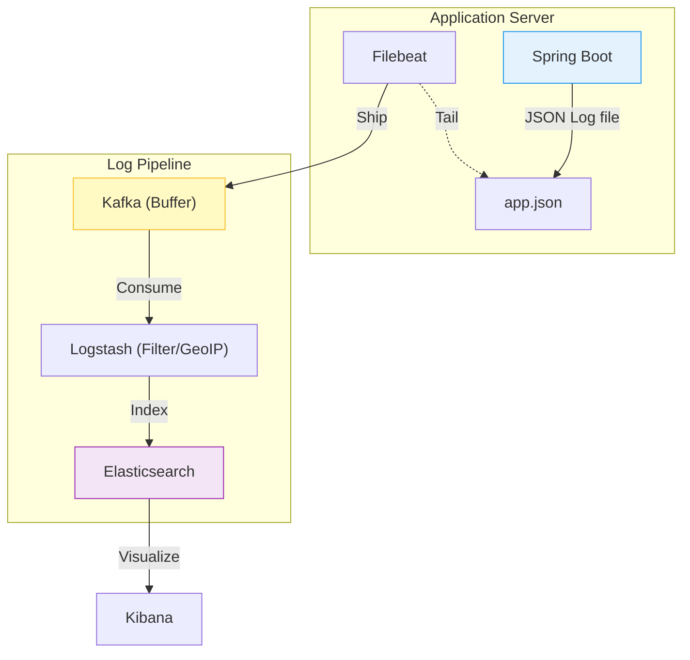
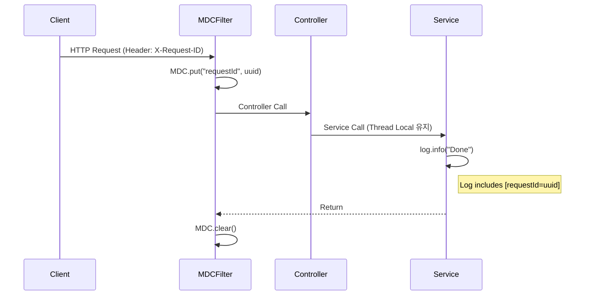

## 📝 1. 로그는 인간이 아니라 "기계"가 읽는 것이다

`System.out.println("User login: " + name)` -> 최악의 로그입니다.
서버가 10대고 로그가 초당 1000줄 쌓이면, `grep`으로는 답이 없습니다.

로그는 **수집하고, 인덱싱하고, 검색하기 위해** 남기는 데이터입니다.

---

## 📊 2. 구조화된 로그 (Structured Logging)

텍스트 대신 **JSON**으로 남기세요.

### Text vs JSON Comparison

| 특징 | Text Log (Bad) | JSON Log (Good) |
| :--- | :--- | :--- |
| **가독성** | 인간 친화적 | 기계 친화적 |
| **검색** | 정규식 (`grep`) 필요 | 키-값 필터링 (`order_id: 123`) |
| **확장성** | 필드 추가 시 파싱 로직 수정 필요 | 유연함 (New field = New key) |

**Structure Example:**
```json
{
  "@timestamp": "2025-01-01T10:00:00Z",
  "level": "ERROR",
  "message": "Order processing failed",
  "service": "order-service",
  "context": {
    "order_id": 123,
    "user_id": "userA",
    "reason": "connection_timeout"
  },
  "trace": {
    "id": "a1b2c3d4"
  }
}
```
-> `event="order_failed"` 로 검색 0.1초 컷. Kibana 대시보드 만들기 쉬움.

---

## 🕸️ 3. ELK Stack 아키텍처

로그를 어떻게 모으는지 흐름을 이해해야 합니다.


```mermaid
flowchart TD
    subgraph App_Server [Application Server]
        App[Spring Boot] -->|JSON Log file| File[app.json]
        Filebeat[Filebeat] -.->|Tail| File
    end
    
    subgraph Log_Pipeline [Log Pipeline]
        Filebeat -->|Ship| Kafka["Kafka (Buffer)"]
        Kafka -->|Consume| Logstash["Logstash (Filter/GeoIP)"]
        Logstash -->|Index| ES[Elasticsearch]
    end
    
    ES -->|Visualize| Kibana[Kibana]
    
    style App fill:#e3f2fd,stroke:#2196f3
    style Kafka fill:#fff9c4,stroke:#fbc02d
    style ES fill:#f3e5f5,stroke:#9c27b0
```

1. **App**: 로그를 파일(`app.json`)에 씁니다. (네트워크로 직접 쏘면 앱 느려짐)
2. **Filebeat**: 파일을 꼬리물기(tail)해서 가볍게 퍼나릅니다.
3. **Elasticsearch**: 검색 엔진에 저장합니다.
4. **Kibana**: 시각화합니다.

---

## 🔍 4. MDC: 분산 추적의 시작

멀티 스레드 환경에서 로그가 뒤섞이면 **"이 에러가 누구 요청에서 난 거지?"** 알 수 없습니다.
**MDC (Mapped Diagnostic Context)** 는 스레드 로컬에 "꼬리표"를 붙입니다.

**MDC Flow Visualization:**


```mermaid
sequenceDiagram
    participant Client
    participant Filter as MDCFilter
    participant Controller
    participant Service
    
    Client->>Filter: HTTP Request (Header: X-Request-ID)
    Filter->>Filter: MDC.put("requestId", uuid)
    
    Filter->>Controller: Controller Call
    Controller->>Service: Service Call (Thread Local 유지)
    Service->>Service: log.info("Done") 
    Note right of Service: Log includes [requestId=uuid]
    
    Service-->>Filter: Return
    Filter->>Filter: MDC.clear()
```

```java
// MDC Usage Pattern
public class MdcFilter implements Filter {
    public void doFilter(...) {
        MDC.put("requestId", UUID.randomUUID().toString());
        try {
            chain.doFilter(request, response);
        } finally {
            MDC.clear(); // 필수: 스레드 풀 재사용 시 오염 방지
        }
    }
}
```

로그를 볼 때 `requestId` 하나로 전체 흐름을 필터링할 수 있게 됩니다.

## 요약

> [!TIP]
> **Production Logging Checklist**:
> - [ ] **Async**: Logback AsyncAppender 사용 (Main 스레드 블로킹 방지)
> - [ ] **Rolling**: 시간/용량 기반 로그 회전 정책 설정 (Disk Full 방지)
> - [ ] **Trace**: 모든 로그에 `traceId` 포함 (MDC 활용)
> - [ ] **Sanitization**: 민감 정보(비밀번호, 카드번호) 마스킹 처리

1. **Format**: JSON으로 남겨라. (LogstashEncoder 등 사용)
2. **Context**: MDC를 써서 모든 로그에 요청 ID를 박아라.
3. **Async**: 별도 스레드로 로그를 수집해라. (App 성능 영향 최소화)

---

## 운영 설계 관점에서 한 번 더 보기

구조화 로그를 도입할 때 흔한 실수는 "JSON으로 찍히니까 끝"이라고 생각하는 것입니다.
실제 운영에서는 아래 네 가지가 같이 맞아야 장애 대응 시간이 줄어듭니다.

| 설계 축 | 확인 질문 | 실패 시 증상 |
| :--- | :--- | :--- |
| **식별자** | 모든 로그에 `requestId` 또는 `traceId`가 붙는가? | 에러 한 줄은 보이지만 앞뒤 요청 흐름을 찾지 못함 |
| **스키마** | `user_id`, `userId`처럼 같은 의미의 필드명이 섞이지 않는가? | 대시보드/쿼리가 누락 데이터를 만든다 |
| **보안** | 토큰, 비밀번호, 개인정보가 수집 전에 제거되는가? | 로그 저장소가 곧 민감정보 저장소가 된다 |
| **비용** | INFO 로그 양과 보존 기간을 숫자로 관리하는가? | 장애보다 로그 비용이 먼저 튄다 |

특히 필드명 표준화는 초기에 정하지 않으면 나중에 고치기 어렵습니다.
예를 들어 주문 서비스는 `orderId`, 결제 서비스는 `order_id`, 배송 서비스는 `oid`를 쓰면 세 서비스를 한 번에 검색할 수 없습니다.
처음부터 공통 필드와 도메인 필드를 나눠서 정해두는 편이 좋습니다.

### 권장 공통 필드

```json
{
  "timestamp": "2026-01-01T10:00:00.000+09:00",
  "level": "INFO",
  "service": "order-service",
  "environment": "prod",
  "traceId": "4bf92f3577b34da6a3ce929d0e0e4736",
  "spanId": "00f067aa0ba902b7",
  "requestId": "req-20260101-001",
  "event": "order_created",
  "message": "Order created"
}
```

`message`는 사람이 읽는 설명이고, `event`는 기계가 집계하는 안정적인 코드입니다.
대시보드와 알람은 가능하면 `message` 텍스트가 아니라 `event`, `level`, `service`, `traceId` 같은 필드에 의존하게 만드세요.
메시지는 문구가 자주 바뀌지만 이벤트 코드는 운영 계약처럼 관리할 수 있기 때문입니다.

### 로그 레벨을 운영 계약으로 다루기

로그 레벨은 개발자 취향이 아니라 운영 계약입니다.
`ERROR`가 많아도 아무도 보지 않는다면 그건 `ERROR`가 아니라 노이즈입니다.
반대로 고객 결제 실패가 `INFO`에 묻혀 있으면 장애 감지가 늦어집니다.

실무에서는 아래 기준으로 정리하면 좋습니다.

- **ERROR**: 사용자 영향이 있거나 즉시 조사해야 하는 실패. 알람 후보입니다.
- **WARN**: 재시도, 폴백, 일시적 제한처럼 복구는 됐지만 추세를 봐야 하는 이상.
- **INFO**: 비즈니스 이벤트와 요청 완료처럼 운영자가 정상 흐름을 확인할 때 필요한 사건.
- **DEBUG**: 로컬 또는 짧은 기간의 진단용. 운영 기본값으로 켜두지 않습니다.

로그 레벨을 정한 뒤에는 월 1회 정도 실제 로그 샘플을 보고 "알람해야 할 ERROR가 맞나?", "WARN이 너무 많아 무시되고 있나?"를 점검해야 합니다.
이 리뷰가 없으면 로그 정책은 시간이 지나며 자동으로 무너집니다.

### 내부 링크로 이어서 보기

- 더 구체적인 Logback JSON 설정과 MDC 전파 코드는 [구조화 로깅: 검색 가능한 로그 설계](/learning/deep-dive/deep-dive-structured-logging/)에서 이어서 볼 수 있습니다.
- 로그를 메트릭·트레이스와 묶어 운영 베이스라인으로 설계하려면 [관측성 베이스라인: 로그·메트릭·트레이스](/learning/deep-dive/deep-dive-observability-baseline/)를 같이 보면 좋습니다.
- traceId를 서비스 간 호출까지 연결하려면 [OpenTelemetry: 분산 추적 표준](/learning/deep-dive/deep-dive-opentelemetry/)가 다음 단계입니다.
