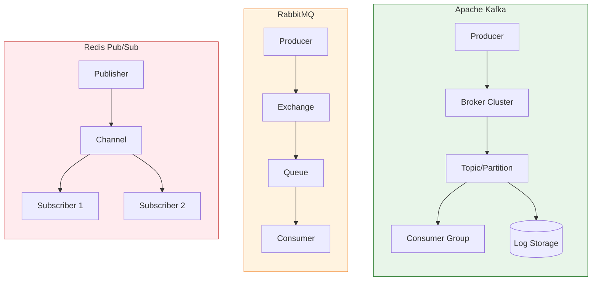
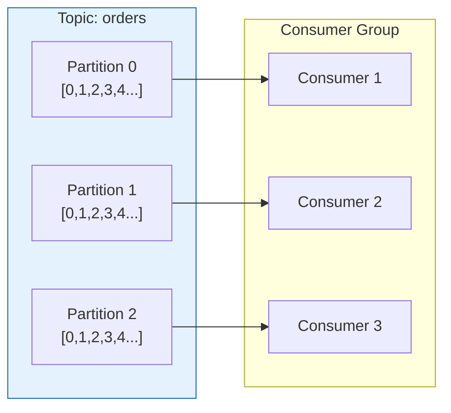
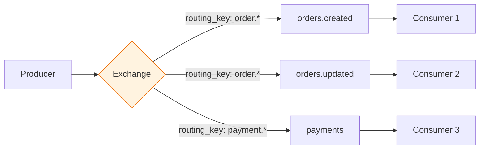
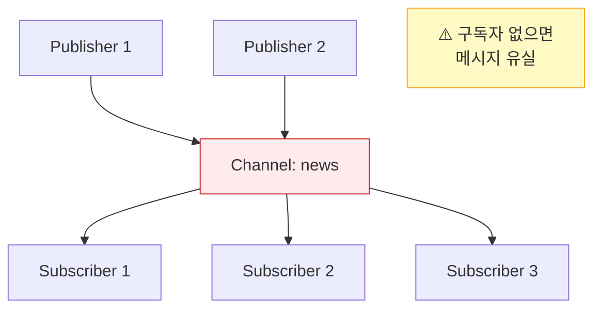
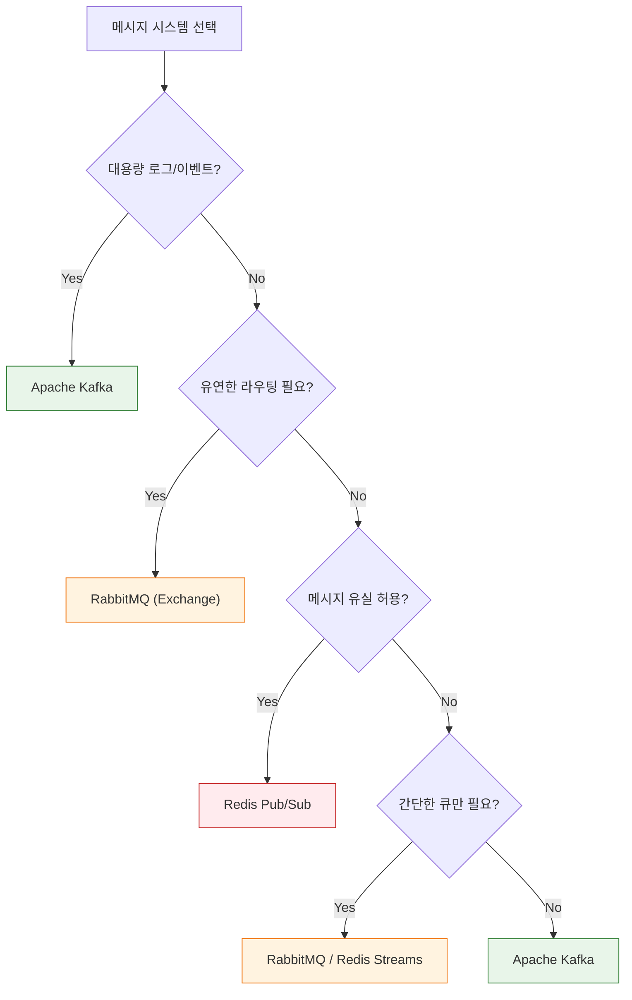
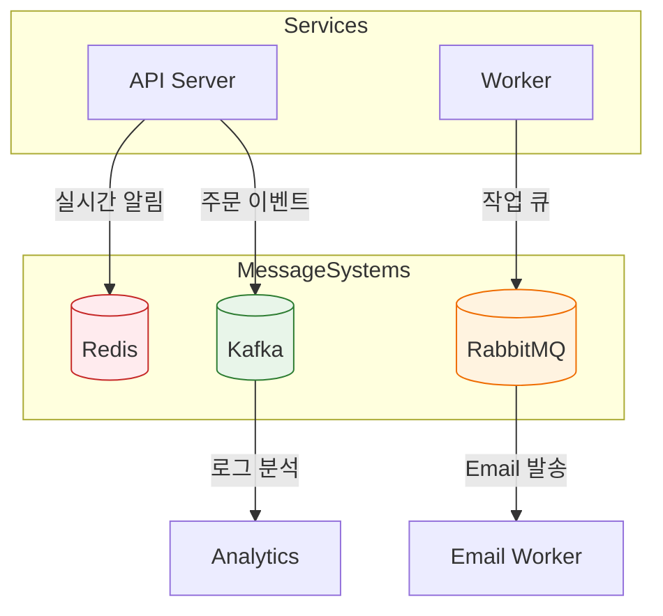

## 이 글에서 얻는 것

- **Kafka, RabbitMQ, Redis Pub/Sub**의 핵심 차이를 이해합니다
- 각 시스템의 **적합한 사용 사례**를 알아봅니다
- 프로젝트에 맞는 **메시지 시스템 선택 기준**을 정립합니다

---

## 아키텍처 비교

### 전체 구조



---

## Kafka

### 핵심 특징



**특징:**
- **분산 로그 스토리지**: 메시지를 디스크에 영구 저장
- **Consumer Group**: 여러 Consumer가 병렬 처리
- **Offset 기반**: Consumer가 읽은 위치 직접 관리
- **Replay 가능**: 과거 메시지 재처리 가능

```java
// Kafka Producer
@Service
public class OrderProducer {
    
    @Autowired
    private KafkaTemplate<String, OrderEvent> kafkaTemplate;
    
    public void sendOrder(OrderEvent order) {
        kafkaTemplate.send("orders", order.getOrderId(), order);
    }
}

// Kafka Consumer
@Service
public class OrderConsumer {
    
    @KafkaListener(
        topics = "orders",
        groupId = "order-processor"
    )
    public void processOrder(OrderEvent order) {
        // 병렬 처리 (Partition 수만큼 Consumer 확장 가능)
        orderService.process(order);
    }
}
```

### 장점 / 단점

| 장점 | 단점 |
|-----|------|
| 초고처리량 (100만 TPS+) | 운영 복잡도 높음 |
| 메시지 영구 보관 | 단순 큐로는 과함 |
| Replay 가능 | 실시간 라우팅 제한적 |
| 수평 확장 용이 | 메시지 순서 (파티션 단위) |

---

## RabbitMQ

### 핵심 특징



**Exchange 타입:**

| Exchange | 라우팅 방식 | 사용 예 |
|----------|-----------|--------|
| Direct | Exact match | 특정 큐에 전달 |
| Topic | Pattern match | `order.*`, `#.error` |
| Fanout | 모든 큐에 복제 | 브로드캐스트 |
| Headers | Header 기반 | 복잡한 라우팅 |

```java
// RabbitMQ Publisher
@Service
public class NotificationPublisher {
    
    @Autowired
    private RabbitTemplate rabbitTemplate;
    
    public void sendNotification(Notification notification) {
        rabbitTemplate.convertAndSend(
            "notifications.exchange",  // Exchange
            "user." + notification.getUserId(),  // Routing Key
            notification
        );
    }
}

// RabbitMQ Consumer
@Service
public class NotificationConsumer {
    
    @RabbitListener(queues = "user.notifications")
    public void handleNotification(Notification notification) {
        // 메시지 처리
        pushService.send(notification);
    }
}
```

### 장점 / 단점

| 장점 | 단점 |
|-----|------|
| 유연한 라우팅 | Kafka 대비 처리량 낮음 |
| 메시지 우선순위 | 메시지 영구 보관 X (기본) |
| ACK 기반 신뢰성 | 수평 확장 제한 |
| 플러그인 생태계 | 대용량에 부적합 |

---

## Redis Pub/Sub

### 핵심 특징



**특징:**
- **Fire-and-Forget**: 메시지 저장 없음
- **실시간 전달**: 구독자에게 즉시 푸시
- **메시지 유실 가능**: 구독자 없으면 버려짐
- **초저지연**: 메모리 기반

```java
// Redis Pub/Sub Publisher
@Service
public class CacheInvalidator {
    
    @Autowired
    private StringRedisTemplate redisTemplate;
    
    public void invalidateCache(String key) {
        // 모든 서버에 캐시 무효화 알림
        redisTemplate.convertAndSend("cache:invalidate", key);
    }
}

// Redis Pub/Sub Subscriber
@Service
public class CacheListener {
    
    @Autowired
    private LocalCache localCache;
    
    @PostConstruct
    public void subscribe() {
        redisTemplate.getConnectionFactory()
            .getConnection()
            .subscribe((message, pattern) -> {
                String key = new String(message.getBody());
                localCache.evict(key);
            }, "cache:invalidate".getBytes());
    }
}
```

### Redis Streams (대안)

Redis 5.0+에서 Kafka 유사 기능 제공:

```java
// Redis Streams (영구 저장 + Consumer Group)
@Service
public class OrderStreamProducer {
    
    @Autowired
    private StringRedisTemplate redisTemplate;
    
    public void addOrder(Order order) {
        Map<String, String> message = Map.of(
            "orderId", order.getId(),
            "status", order.getStatus()
        );
        redisTemplate.opsForStream().add("orders", message);
    }
}
```

### 장점 / 단점

| 장점 | 단점 |
|-----|------|
| 초저지연 | 메시지 유실 가능 |
| 설정 간단 | 영구 저장 없음 |
| 기존 Redis 활용 | Consumer Group 없음 |
| 실시간 이벤트 | 대용량 부적합 |

---

## 선택 가이드

### 비교표

| 기준 | Kafka | RabbitMQ | Redis Pub/Sub |
|------|-------|----------|---------------|
| **처리량** | 100만+ TPS | 10만 TPS | 100만+ TPS |
| **지연시간** | 5~50ms | 1~10ms | <1ms |
| **메시지 보관** | ✅ 영구 | ⚠️ 선택적 | ❌ 없음 |
| **Replay** | ✅ 가능 | ❌ 불가 | ❌ 불가 |
| **라우팅** | ⚠️ 제한적 | ✅ 유연 | ⚠️ 패턴만 |
| **운영 복잡도** | 높음 | 중간 | 낮음 |
| **확장성** | ✅ 수평 | ⚠️ 제한 | ✅ 수평 |

### 사용 사례별 선택



### 구체적 사용 사례

| 시스템 | 적합한 사용 사례 |
|--------|----------------|
| **Kafka** | 로그 집계, 이벤트 소싱, 스트림 처리, 데이터 파이프라인 |
| **RabbitMQ** | 작업 큐, 마이크로서비스 통신, 복잡한 라우팅, RPC |
| **Redis Pub/Sub** | 캐시 무효화, 실시간 알림, 임시 이벤트, 세션 동기화 |

---

## 실무 조합 패턴

### 하이브리드 아키텍처



**실무 조합 예시:**
- **Redis**: 캐시 무효화, 실시간 채팅
- **Kafka**: 주문/결제 이벤트, 로그 수집
- **RabbitMQ**: 이메일 발송, 백그라운드 작업

---

## 요약

### 핵심 선택 기준

| 이걸 원하면 | 이걸 선택 |
|-----------|----------|
| 대용량 + 재처리 | **Kafka** |
| 유연한 라우팅 | **RabbitMQ** |
| 초저지연 + 단순 | **Redis Pub/Sub** |
| 작업 큐 + 신뢰성 | **RabbitMQ** |
| 이벤트 소싱 | **Kafka** |
| 캐시 동기화 | **Redis** |

---

## 🔗 Related Deep Dive

- **[Kafka 기본](/learning/deep-dive/deep-dive-kafka-foundations/)**: 토픽, 파티션, Consumer Group 시각화.
- **[Kafka 재시도/DLQ](/learning/deep-dive/deep-dive-kafka-retry-dlq/)**: 실패 처리 전략.
- **[Redis 캐싱](/learning/deep-dive/deep-dive-redis-caching/)**: 캐시 전략과 운영.
