## 이 글에서 얻는 것

- **마이크로서비스 핵심 패턴**을 이해하고 적용 시점을 판단합니다
- **Service Discovery**와 **Service Mesh** 차이를 알아봅니다
- **BFF(Backend for Frontend)** 패턴으로 클라이언트별 최적화를 합니다

---

## Service Discovery

### 왜 필요한가?

```mermaid
flowchart TB
    subgraph "❌ 정적 설정의 문제"
        C1[Client] -->|"order-service:8080"| O1[Order Service]
        O1 -->|"payment-service:8081"| P1[Payment Service]
    end
    
    Note["서비스 IP/포트 변경 시\n모든 클라이언트 설정 수정 필요"]
```



마이크로서비스 환경에서는:
- 서비스 인스턴스가 동적으로 생성/삭제
- 오토스케일링으로 인스턴스 수 변동
- 컨테이너 재시작 시 IP 변경

### Service Discovery 패턴

```mermaid
flowchart LR
    subgraph "Client-side Discovery"
        C1[Client] --> R1[(Registry)]
        R1 -->|"인스턴스 목록"| C1
        C1 -->|"직접 호출"| S1[Service A]
        C1 -->|"직접 호출"| S2[Service A]
    end
```




| 패턴 | 장점 | 단점 | 예시 |
|------|-----|------|-----|
| Client-side | 직접 제어, 낮은 지연 | 클라이언트 복잡도 | Netflix Eureka |
| Server-side | 클라이언트 단순화 | LB가 병목 가능 | AWS ALB, K8s Service |

### Spring Cloud + Eureka 예시

```java
// Eureka Server
@SpringBootApplication
@EnableEurekaServer
public class EurekaServerApplication {
    public static void main(String[] args) {
        SpringApplication.run(EurekaServerApplication.class, args);
    }
}

// Eureka Client (서비스 등록)
@SpringBootApplication
@EnableDiscoveryClient
public class OrderServiceApplication {
    public static void main(String[] args) {
        SpringApplication.run(OrderServiceApplication.class, args);
    }
}

// 서비스 호출 (FeignClient)
@FeignClient(name = "payment-service")  // 서비스 이름으로 호출
public interface PaymentClient {
    @PostMapping("/api/payments")
    PaymentResponse processPayment(@RequestBody PaymentRequest request);
}
```

---

## Sidecar 패턴

### 개념


**Sidecar**: 애플리케이션과 함께 배포되어 **횡단 관심사**를 처리

- **로깅/모니터링**: Fluentd, Prometheus Agent
- **프록시**: Envoy, Linkerd
- **보안**: mTLS 처리
- **트래픽 관리**: Retry, Circuit Breaker

### Service Mesh


**Service Mesh 기능**:
- **트래픽 관리**: Canary 배포, A/B 테스트
- **보안**: mTLS 자동화, 인증/인가
- **관측성**: 분산 트레이싱, 메트릭 수집
- **복원력**: Retry, Timeout, Circuit Breaker

### Sidecar vs Library

| 비교 | Sidecar (Envoy) | Library (Resilience4j) |
|-----|-----------------|----------------------|
| 언어 독립 | ✅ 모든 언어 | ❌ 특정 언어 |
| 업데이트 | 앱 재배포 없이 | 앱 재배포 필요 |
| 리소스 | 추가 메모리/CPU | 앱 내부 사용 |
| 디버깅 | 복잡 | 단순 |
| 적합 케이스 | 다양한 언어, 큰 조직 | 단일 언어, 작은 팀 |

---

## BFF (Backend for Frontend)

### 문제: 클라이언트별 다른 요구사항

```mermaid
flowchart TB
    subgraph "❌ 단일 API의 문제"
        Mobile[Mobile App]
        Web[Web App]
        
        Mobile --> API[General API]
        Web --> API
        
        API --> US[User Service]
        API --> OS[Order Service]
        API --> PS[Product Service]
    end
    
    Note["Mobile: 최소 데이터 필요\nWeb: 풍부한 데이터 필요\n→ Over-fetching / Under-fetching"]
```



### 해결: 클라이언트별 BFF


### 구현 예시

```java
// Mobile BFF - 최소한의 데이터
@RestController
@RequestMapping("/mobile/api")
public class MobileBffController {
    
    @GetMapping("/orders/{orderId}")
    public MobileOrderResponse getOrder(@PathVariable String orderId) {
        Order order = orderService.getOrder(orderId);
        
        // Mobile에 필요한 최소 정보만 반환
        return MobileOrderResponse.builder()
            .orderId(order.getId())
            .status(order.getStatus())
            .totalAmount(order.getTotalAmount())
            .build();
    }
}

// Web BFF - 상세 데이터
@RestController
@RequestMapping("/web/api")
public class WebBffController {
    
    @GetMapping("/orders/{orderId}")
    public WebOrderResponse getOrder(@PathVariable String orderId) {
        Order order = orderService.getOrder(orderId);
        User user = userService.getUser(order.getUserId());
        List<Product> products = productService.getProducts(order.getProductIds());
        List<Review> reviews = reviewService.getReviewsForProducts(order.getProductIds());
        
        // Web에 필요한 풍부한 정보 반환
        return WebOrderResponse.builder()
            .order(order)
            .user(user)
            .products(products)
            .reviews(reviews)
            .shippingDetails(order.getShipping())
            .paymentHistory(paymentService.getHistory(orderId))
            .build();
    }
}
```

### BFF 장단점

| 장점 | 단점 |
|-----|------|
| 클라이언트 최적화 | BFF 수 증가 (관리 비용) |
| 백엔드 변경 격리 | 코드 중복 가능성 |
| 팀별 독립 개발 | 배포 복잡도 증가 |

---

## Strangler Fig 패턴

### 레거시 시스템 점진적 마이그레이션

```mermaid
flowchart TB
    subgraph "Phase 1: Proxy 추가"
        C1[Client] --> P1[Proxy]
        P1 --> L1[Legacy System]
    end
```

```mermaid
flowchart TB
    subgraph "Phase 2: 일부 기능 마이그레이션"
        C2[Client] --> P2[Proxy]
        P2 -->|"/orders"| MS[New Microservice]
        P2 -->|"나머지"| L2[Legacy System]
    end
    
    style MS fill:#e8f5e9,stroke:#2e7d32
```

```mermaid
flowchart TB
    subgraph "Phase 3: 완전 마이그레이션"
        C3[Client] --> P3[Proxy]
        P3 --> MS1[Order Service]
        P3 --> MS2[User Service]
        P3 --> MS3[Payment Service]
        
        L3[Legacy System]
        L3 -.->|"제거"| X[❌]
    end
    
    style MS1 fill:#e8f5e9,stroke:#2e7d32
    style MS2 fill:#e8f5e9,stroke:#2e7d32
    style MS3 fill:#e8f5e9,stroke:#2e7d32
    style L3 fill:#ffebee,stroke:#c62828
```







### 구현 전략

```nginx
# Nginx 기반 라우팅 예시
upstream legacy {
    server legacy-monolith:8080;
}

upstream new_orders {
    server order-service:8080;
}

server {
    listen 80;
    
    # 새 서비스로 라우팅
    location /api/orders {
        proxy_pass http://new_orders;
    }
    
    # 나머지는 레거시로
    location / {
        proxy_pass http://legacy;
    }
}
```

---

## 요약

### 패턴 선택 가이드

| 패턴 | 언제 사용 |
|------|----------|
| **Service Discovery** | 동적 스케일링, 컨테이너 환경 |
| **Sidecar** | 횡단 관심사 분리, 다양한 언어 |
| **Service Mesh** | 대규모 마이크로서비스, 복잡한 네트워크 |
| **BFF** | 다양한 클라이언트, 최적화 필요 |
| **Strangler Fig** | 레거시 마이그레이션 |

---

## 🔗 Related Deep Dive

- **[API Gateway 설계](/learning/deep-dive/deep-dive-api-gateway-design/)**: 진입점 패턴과 인증.
- **[Circuit Breaker](/learning/deep-dive/deep-dive-resilience4j-circuit-breaker/)**: 장애 전파 차단.
- **[분산 트랜잭션](/learning/deep-dive/deep-dive-distributed-transactions/)**: SAGA 패턴.
