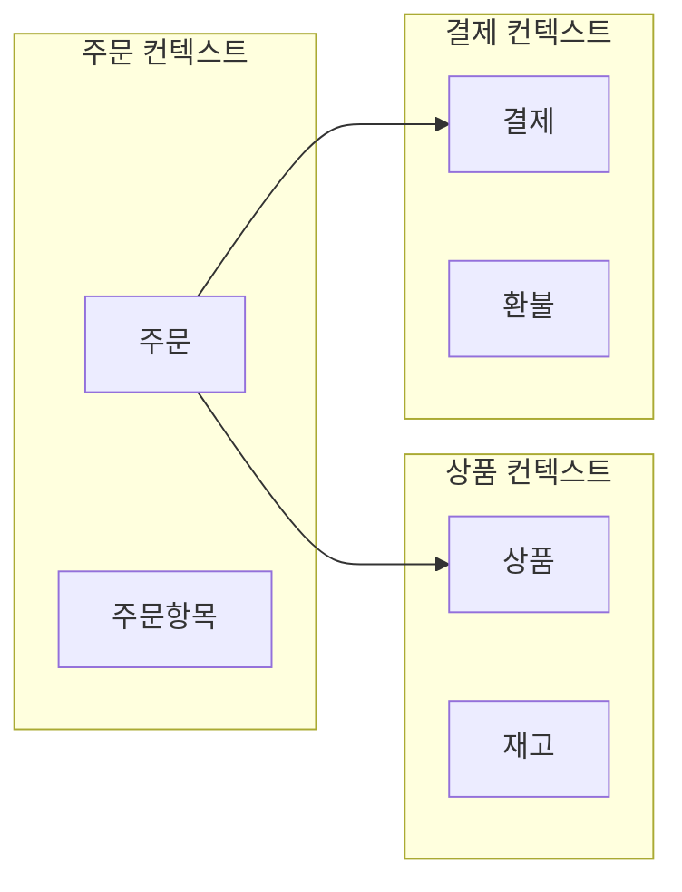
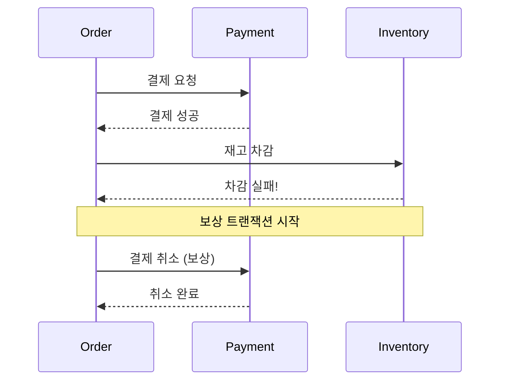

## 이 글에서 얻는 것

- **마이크로서비스 아키텍처**의 핵심 개념과 모놀리식 대비 장단점을 이해합니다.
- **서비스 분해 전략**과 도메인 경계를 정하는 방법을 익힙니다.
- **서비스 간 통신**(동기/비동기)과 데이터 일관성 패턴을 학습합니다.

---

## 1) 모놀리식 vs 마이크로서비스

### 모놀리식

```
┌─────────────────────────────────────────┐
│            단일 애플리케이션              │
│  ┌─────┐  ┌─────┐  ┌─────┐  ┌─────┐    │
│  │ 주문 │  │ 결제 │  │ 상품 │  │ 회원 │    │
│  └─────┘  └─────┘  └─────┘  └─────┘    │
│              ↓                          │
│         단일 데이터베이스                  │
└─────────────────────────────────────────┘
```

**장점**: 개발/배포 단순, 디버깅 용이, 트랜잭션 간단  
**단점**: 스케일링 어려움, 배포 단위 큼, 기술 스택 고정

### 마이크로서비스

```
┌─────────┐  ┌─────────┐  ┌─────────┐  ┌─────────┐
│ 주문 서비스 │  │ 결제 서비스 │  │ 상품 서비스 │  │ 회원 서비스 │
│   (DB)   │  │   (DB)   │  │   (DB)   │  │   (DB)   │
└─────────┘  └─────────┘  └─────────┘  └─────────┘
      ↑            ↑            ↑            ↑
      └────────────┴────────────┴────────────┘
                 API Gateway / Message Queue
```

**장점**: 독립 배포/스케일링, 기술 다양성, 장애 격리  
**단점**: 분산 시스템 복잡도, 운영 부담, 데이터 일관성 어려움

---

## 2) 서비스 분해 전략

### 도메인 기반 분해 (DDD Bounded Context)



### 분해 기준

- **비즈니스 능력(Business Capability)**: 조직이 수행하는 비즈니스 기능 단위
- **하위 도메인(Subdomain)**: DDD에서 식별한 Bounded Context
- **팀 구조**: Conway's Law - 시스템은 조직 구조를 반영

---

## 3) 서비스 간 통신

### 동기 통신 (Sync)

```java
// REST 호출
@Service
public class OrderService {
    
    @Autowired
    private RestTemplate restTemplate;
    
    public Order createOrder(OrderRequest request) {
        // 결제 서비스 동기 호출
        PaymentResponse payment = restTemplate.postForObject(
            "http://payment-service/api/payments",
            new PaymentRequest(request.getAmount()),
            PaymentResponse.class
        );
        
        if (!payment.isSuccess()) {
            throw new PaymentFailedException();
        }
        
        return orderRepository.save(new Order(request, payment));
    }
}
```

**장점**: 구현 단순, 즉시 응답  
**단점**: 강한 결합, 장애 전파, Timeout 관리 필요

### 비동기 통신 (Async)

```java
// 이벤트 발행
@Service
public class OrderService {
    
    @Autowired
    private KafkaTemplate<String, OrderEvent> kafkaTemplate;
    
    public Order createOrder(OrderRequest request) {
        Order order = orderRepository.save(new Order(request));
        
        // 이벤트 발행 (비동기)
        kafkaTemplate.send("order-events", 
            new OrderCreatedEvent(order.getId(), request));
        
        return order;  // 결제 완료를 기다리지 않음
    }
}

// 결제 서비스에서 이벤트 소비
@KafkaListener(topics = "order-events")
public void handleOrderCreated(OrderCreatedEvent event) {
    Payment payment = processPayment(event);
    kafkaTemplate.send("payment-events", 
        new PaymentCompletedEvent(event.getOrderId(), payment));
}
```

**장점**: 느슨한 결합, 장애 격리, 스케일링 유연  
**단점**: Eventual Consistency, 복잡한 에러 처리, 디버깅 어려움

---

## 4) 데이터 일관성 패턴

### Saga 패턴



### Outbox 패턴

```java
// 트랜잭션 내에서 Outbox에 이벤트 저장
@Transactional
public Order createOrder(OrderRequest request) {
    Order order = orderRepository.save(new Order(request));
    
    // 같은 트랜잭션에서 Outbox에 저장
    outboxRepository.save(new OutboxEvent(
        "ORDER_CREATED", 
        order.getId().toString(),
        objectMapper.writeValueAsString(new OrderCreatedEvent(order))
    ));
    
    return order;
}

// 별도 프로세스가 Outbox를 폴링하여 Kafka로 발행
@Scheduled(fixedDelay = 1000)
public void publishEvents() {
    List<OutboxEvent> events = outboxRepository.findUnpublished();
    for (OutboxEvent event : events) {
        kafkaTemplate.send(event.getType(), event.getPayload());
        event.markPublished();
        outboxRepository.save(event);
    }
}
```

---

## 5) 운영을 위한 필수 패턴

| 패턴 | 목적 | 예시 |
|------|------|------|
| **API Gateway** | 단일 진입점, 라우팅, 인증 | Spring Cloud Gateway, Kong |
| **Service Discovery** | 동적 서비스 위치 관리 | Eureka, Consul |
| **Config Server** | 중앙화된 설정 관리 | Spring Cloud Config |
| **Circuit Breaker** | 장애 전파 차단 | Resilience4j |
| **Distributed Tracing** | 요청 추적 | Zipkin, Jaeger |

---

## 요약

1. **모놀리식 vs MSA**: 상황에 맞게 선택 (작은 팀/프로젝트는 모놀리식이 유리할 수 있음)
2. **분해 전략**: 도메인 경계(Bounded Context)와 팀 구조 기반
3. **통신**: 동기(REST/gRPC)는 단순하지만 결합 강함, 비동기(이벤트)는 복잡하지만 유연
4. **데이터 일관성**: Database per Service는 Saga/Outbox 패턴 필요

---

## 다음 단계

- API Gateway 설계: `/learning/deep-dive/deep-dive-api-gateway-design/`
- 헥사고날 아키텍처: `/learning/deep-dive/deep-dive-hexagonal-architecture/`
- DDD 전술적 설계: `/learning/deep-dive/deep-dive-ddd-tactical/`
