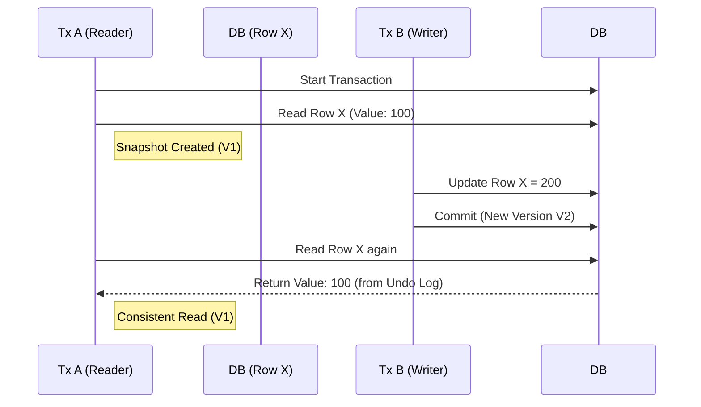
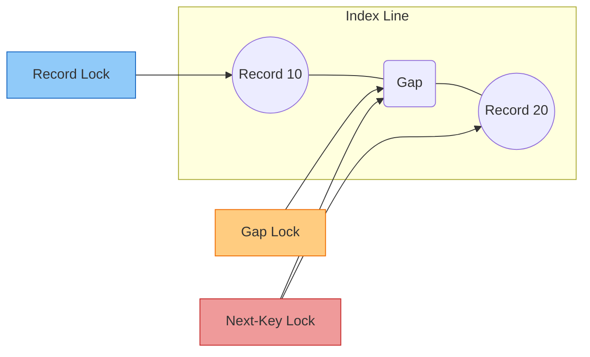
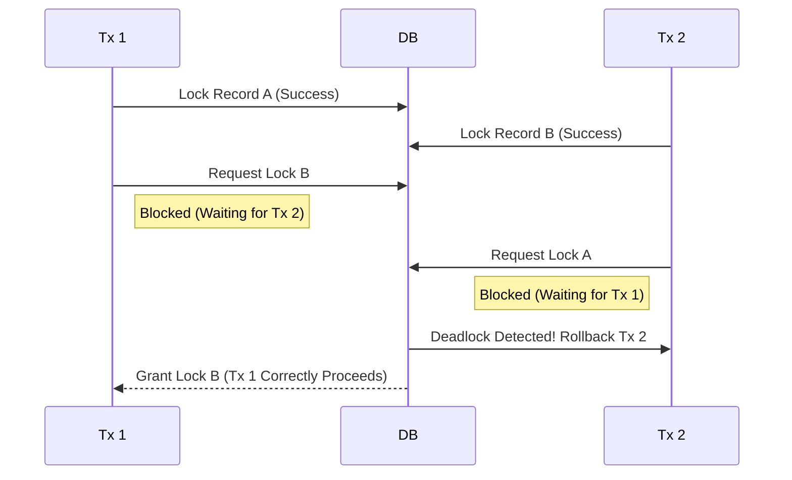

## 이 글에서 얻는 것

- 격리 수준(READ COMMITTED / REPEATABLE READ)이 “용어”가 아니라, 어떤 현상(팬텀/락 범위/재시도)으로 이어지는지 이해할 수 있습니다.
- InnoDB의 MVCC(스냅샷)와 락(레코드/갭/넥스트키)을 연결해서 설명할 수 있습니다.
- 데드락/락 대기를 만났을 때 원인을 추적하고(로그/상태), 재시도/설계로 완화할 수 있습니다.

## 0) 격리 수준은 “정합성 ↔ 동시성” 트레이드오프다

정합성을 더 강하게 잡을수록, 락/대기/경합이 늘어 동시 처리량이 떨어질 수 있습니다.
반대로 동시성을 높이면, 읽기/쓰기에서 “기대하지 않은 현상”이 나타날 수 있습니다.

그래서 격리 수준은 “무조건 높게”가 아니라, 요구사항에 맞춰 선택합니다.

## 1) InnoDB MVCC: 락 없이도 ‘일관된 읽기’를 만든다

InnoDB는 MVCC로 “스냅샷 기반 읽기(consistent read)”를 제공합니다.

- 같은 트랜잭션에서 같은 데이터를 다시 읽으면, 보통 같은 값을 봅니다(REPEATABLE READ에서 특히)
- 이때 모든 읽기가 락을 거는 건 아닙니다(일반 SELECT는 보통 락 없는 읽기)

반대로 “잠그고 읽기”가 필요할 때는:

- `SELECT ... FOR UPDATE`
- `SELECT ... LOCK IN SHARE MODE`

같은 문장을 사용합니다(요구사항/락 강도에 따라).

### 1-1) MVCC 동작 시각화 (REPEATABLE READ)

트랜잭션이 시작될 때 스냅샷을 만들어두고, 그 시점 이후의 변경사항은 Undo Log를 통해 과거 버전을 읽습니다.

## 2) 격리 수준 핵심(실무 감각)

### READ COMMITTED

- “커밋된 최신 버전”을 읽습니다.
- 같은 트랜잭션에서 다시 읽었을 때 값이 바뀔 수 있습니다(Non-repeatable read 가능).
- 범위 락(갭 락)이 상대적으로 줄어드는 경향이 있어 경합이 줄 수 있지만, 정합성 요구사항에 따라 주의가 필요합니다.

### REPEATABLE READ(InnoDB 기본)

- 트랜잭션 시작 시점(또는 첫 읽기 시점)의 스냅샷을 유지해 “같은 트랜잭션에서 같은 읽기 결과”를 보장하는 편입니다.
- 범위 조회/잠금 읽기에서 **갭/넥스트키 락**이 동작하면서, 예상보다 락 범위가 커질 수 있습니다.

### SERIALIZABLE

- 가장 강한 격리(동시성이 크게 떨어질 수 있음)
- 일반 SELECT도 락을 동반하는 형태가 될 수 있어, 일반적인 OLTP에서는 신중하게 접근합니다.

## 3) 락 유형: 레코드/갭/넥스트키

InnoDB에서 자주 등장하는 락:

- **레코드 락(Record lock)**: 특정 인덱스 레코드를 잠금
- **갭 락(Gap lock)**: 인덱스 레코드 “사이 구간”을 잠금(새로운 레코드 삽입을 막음)
- **넥스트키 락(Next-key lock)**: 레코드 + 앞/뒤 갭을 함께 잠금(범위 조건에서 자주 등장)

여기서 중요한 실전 포인트:

- 인덱스를 제대로 타지 못하면(풀스캔/범위 확대) 락 범위가 커져 락 대기가 늘어납니다.
- “범위 조건”과 “정렬/인덱스” 설계가 곧 락 범위를 결정합니다.

## 4) 데드락: 피할 수 없고, 다루는 기술이 필요하다

데드락은 “버그”라기보다 동시성 높은 시스템에서 자연스럽게 나타날 수 있습니다.
중요한 건 “0으로 만들기”보다 “자주 안 나게 + 나도 안전하게”입니다.

예방/완화 패턴:

- **접근 순서 고정**: 여러 레코드를 갱신할 때 항상 같은 순서로 접근
- **트랜잭션을 짧게**: 트랜잭션 안에서 외부 호출/긴 로직 금지
- **락 범위 축소**: 적절한 인덱스로 범위 락을 줄이기
- **재시도**: 데드락은 DB가 한쪽을 롤백시키므로, 애플리케이션은 짧은 backoff 후 재시도(멱등성 필수)

### 4-1) 데드락 시나리오 시각화

가장 흔한 교차 잠금(Cross Locking) 상황입니다.

## 5) 장애 분석: 락 대기/데드락을 어떻게 본다

실무에서는 다음이 빠릅니다.

- “지금 누가 누구를 막고 있나”를 확인(락 대기)
- 데드락이면 “어떤 쿼리 순서로 꼬였나”를 확인

자주 쓰는 도구/명령(환경에 따라):

- `SHOW ENGINE INNODB STATUS` (최근 데드락 정보)
- performance_schema의 락/트랜잭션 테이블

## 연습(추천)

- 두 세션에서 같은 두 레코드를 “서로 다른 순서”로 업데이트해서 데드락을 재현해보기
- 범위 조건에서 인덱스 유무에 따라 락 대기가 어떻게 달라지는지 관찰해보기
- 데드락 발생 시 재시도(backoff 포함)로 사용자 경험이 어떻게 달라지는지 정리해보기
