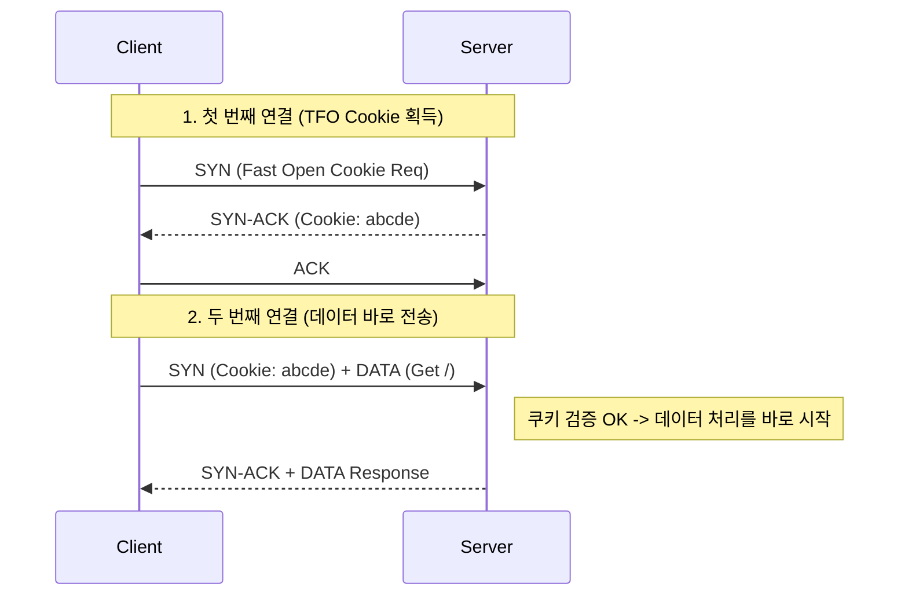

## 이 글에서 얻는 것

- **Flow Control**(흐름 제어)과 **Congestion Control**(혼잡 제어)의 차이를 명확히 구분합니다.
- **Nagle 알고리즘**과 **Delayed ACK**가 만났을 때 성능이 끔찍해지는 이유를 이해합니다.
- **TCP Fast Open(TFO)**이 핸드셰이크 시간을 어떻게 줄이는지 봅니다.

## 1) Flow Control vs Congestion Control

면접 단골 질문입니다.

| 구분 | 목적 | 주체 | 핵심 메커니즘 |
|:---|:---|:---|:---|
| **Flow Control** (흐름 제어) | **수신자(Receiver)**가 감당 못할까 봐 조절 | Receiver의 Window Size | Sliding Window |
| **Congestion Control** (혼잡 제어) | **네트워크망(Network)**이 막힐까 봐 조절 | Sender의 Congestion Window (Cwnd) | Slow Start, AIMD |

### Sliding Window (Flow Control)
수신자가 "나 지금 버퍼 10KB 남았어(Window Size=10KB)"라고 알리면, 송신자는 ACK가 안 와도 10KB까지는 미리 보냅니다.

## 2) Congestion Control: Slow Start & AIMD

네트워크 상태는 아무도 모릅니다. 그래서 TCP는 눈치게임을 합니다.

1.  **Slow Start**: 처음엔 패킷 1개, 성공하면 2개, 4개... (지수적 증가)
2.  **Packet Loss 발생**: "아, 네트워크 막혔네." -> 전송량 뚝 떨어뜨림.
3.  **Congestion Avoidance**: 조심스럽게 선형적으로 증가.

### CUBIC과 BBR
- **CUBIC**: Packet Loss 기반의 전통적 알고리즘(Linux Default).
- **BBR** (Google): Packet Loss가 아니라 **대역폭(Bandwidth)과 RTT**를 측정해서 제어. Loss가 있어도 속도를 유지하는 혁신적인 알고리즘.

## 3) 성능 킬러: Nagle 알고리즘 + Delayed ACK

이 둘은 각각 좋은 의도로 만들어졌지만, 같이 쓰면 재앙이 됩니다.

- **Nagle**: "작은 패킷 여러 개 보내지 말고, 모아서 보내자." (Sender)
- **Delayed ACK**: "ACK 하나하나 보내지 말고, 데이터 보낼 때 얹어서 보내거나 조금 기다렸다 보내자." (Receiver)

**문제 상황**:
Sender는 "ACK 오면 나머지 보내야지" (Nagle) 하고 기다리고,
Receiver는 "데이터 더 오면 ACK 보내야지" (Delayed ACK) 하고 기다립니다.
-> **Deadlock 같은 지연 발생 (약 40ms~200ms)**

**해결**: 실시간성이 중요한 서버(API 서버, 게임 서버)는 **`TCP_NODELAY` 옵션으로 Nagle을 끕니다.**

## 4) TCP Fast Open (TFO)

3-way Handshake(1.5-RTT)는 연결할 때마다 시간이 걸립니다.
TFO는 **"이전에 통신했던 사이라면, SYN 패킷에 데이터를 실어 보내자"**는 기술입니다.

- **장점**: 재연결 시 1-RTT 절약.
- **제약**: 서버가 멱등(Idempotent)하지 않은 요청(POST 등)에 대해 TFO를 허용하면 Replay Attack 위험이 있음.

## 요약

- **Flow Control**은 수신자를 배려, **Congestion Control**은 네트워크를 배려.
- **`TCP_NODELAY`**는 Nagle을 꺼서 반응 속도를 높이는 필수 옵션.
- **BBR** 알고리즘과 **TCP Fast Open** 등 최신 기술로 TCP 성능을 극한으로 끌어올릴 수 있다.
