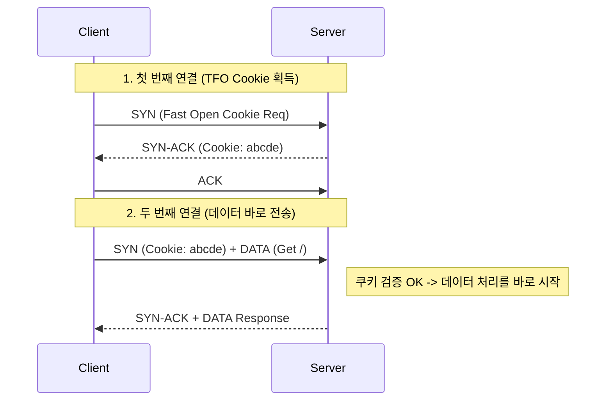

## 이 글에서 얻는 것

- **Flow Control**(흐름 제어)과 **Congestion Control**(혼잡 제어)의 차이를 명확히 구분합니다.
- **Nagle 알고리즘**과 **Delayed ACK**가 만났을 때 성능이 끔찍해지는 이유를 이해합니다.
- **TCP Fast Open(TFO)**이 핸드셰이크 시간을 어떻게 줄이는지 봅니다.
- **커널 파라미터 튜닝**과 **커넥션 풀링** 전략으로 실무 성능을 끌어올리는 방법을 배웁니다.

## 1) Flow Control vs Congestion Control

면접 단골 질문입니다.

| 구분 | 목적 | 주체 | 핵심 메커니즘 |
|:---|:---|:---|:---|
| **Flow Control** (흐름 제어) | **수신자(Receiver)**가 감당 못할까 봐 조절 | Receiver의 Window Size | Sliding Window |
| **Congestion Control** (혼잡 제어) | **네트워크망(Network)**이 막힐까 봐 조절 | Sender의 Congestion Window (Cwnd) | Slow Start, AIMD |

### Sliding Window (Flow Control)
수신자가 "나 지금 버퍼 10KB 남았어(Window Size=10KB)"라고 알리면, 송신자는 ACK가 안 와도 10KB까지는 미리 보냅니다.

### 실제 전송량은 둘 중 작은 값

실제 한 번에 보낼 수 있는 양은 `min(Cwnd, Rwnd)`입니다.
- 네트워크가 좋아도 수신자 버퍼가 작으면 → Flow Control이 제한
- 수신자 버퍼가 넉넉해도 네트워크가 혼잡하면 → Congestion Control이 제한

이 관계를 이해해야 "왜 대역폭이 충분한데 느린지"를 디버깅할 수 있습니다.

## 2) Congestion Control: Slow Start & AIMD

네트워크 상태는 아무도 모릅니다. 그래서 TCP는 눈치게임을 합니다.

1.  **Slow Start**: 처음엔 패킷 1개, 성공하면 2개, 4개... (지수적 증가)
2.  **ssthresh 도달**: Slow Start Threshold에 도달하면 선형 증가로 전환
3.  **Packet Loss 발생**: "아, 네트워크 막혔네." → 전송량 뚝 떨어뜨림
4.  **Congestion Avoidance**: 조심스럽게 선형적으로 증가

### 왜 첫 번째 요청이 느린가?

새 TCP 연결의 **초기 Cwnd(Initial Window)**는 보통 10 세그먼트(약 14KB)입니다.
즉, 아무리 빠른 네트워크라도 첫 RTT에는 14KB만 보낼 수 있습니다.

```
연결 직후:
  RTT 1: 14KB 전송
  RTT 2: 28KB 전송
  RTT 3: 56KB 전송
  ...

→ 100KB 파일을 보내려면 최소 3-4 RTT가 필요
→ RTT가 100ms인 환경이면 300~400ms
```

이것이 **HTTP Keep-Alive**와 **커넥션 풀링**이 중요한 이유입니다.

### CUBIC과 BBR

| 알고리즘 | 신호 | 특징 | 적합한 환경 |
|:---|:---|:---|:---|
| **CUBIC** | Packet Loss | 손실 발생 시 윈도우를 큐빅 함수로 감소/회복 | 일반 데이터센터 내부 |
| **BBR** (Google) | Bandwidth + RTT 측정 | Loss에 덜 민감, 실제 대역폭을 모델링 | 고지연/손실 있는 WAN, CDN |

**BBR이 혁신적인 이유:**
전통적 알고리즘은 "패킷이 사라지면 혼잡"이라고 판단합니다. 하지만 무선 네트워크에서는 신호 간섭으로도 패킷이 사라집니다. BBR은 손실이 아니라 **실측 대역폭과 RTT**를 기준으로 전송량을 결정하므로, 무선/장거리 환경에서 처리량이 크게 향상됩니다.

```bash
# Linux에서 BBR 활성화
sysctl -w net.core.default_qdisc=fq
sysctl -w net.ipv4.tcp_congestion_control=bbr

# 확인
sysctl net.ipv4.tcp_congestion_control
# → bbr
```

## 3) 성능 킬러: Nagle 알고리즘 + Delayed ACK

이 둘은 각각 좋은 의도로 만들어졌지만, 같이 쓰면 재앙이 됩니다.

- **Nagle**: "작은 패킷 여러 개 보내지 말고, 모아서 보내자." (Sender)
- **Delayed ACK**: "ACK 하나하나 보내지 말고, 데이터 보낼 때 얹어서 보내거나 조금 기다렸다 보내자." (Receiver)

**문제 상황**:
Sender는 "ACK 오면 나머지 보내야지" (Nagle) 하고 기다리고,
Receiver는 "데이터 더 오면 ACK 보내야지" (Delayed ACK) 하고 기다립니다.
→ **Deadlock 같은 지연 발생 (약 40ms~200ms)**

**해결**: 실시간성이 중요한 서버(API 서버, 게임 서버)는 **`TCP_NODELAY` 옵션으로 Nagle을 끕니다.**

```java
// Java에서 TCP_NODELAY 설정
Socket socket = new Socket();
socket.setTcpNoDelay(true);  // Nagle 비활성화

// Netty에서
bootstrap.childOption(ChannelOption.TCP_NODELAY, true);

// Spring Boot에서 (Tomcat 내장)
server.tomcat.connection-timeout=20000
# Tomcat은 기본적으로 TCP_NODELAY=true
```

### Nagle을 끄면 안 되는 경우

Telnet처럼 **키 하나당 패킷 하나**를 보내는 경우, Nagle이 없으면 네트워크에 1바이트 패킷이 넘쳐납니다 (Small Packet Problem). 대화형 터미널에서는 Nagle이 유용합니다.

## 4) TCP Fast Open (TFO)

3-way Handshake(1.5-RTT)는 연결할 때마다 시간이 걸립니다.
TFO는 **"이전에 통신했던 사이라면, SYN 패킷에 데이터를 실어 보내자"**는 기술입니다.


```mermaid
sequenceDiagram
    participant Client
    participant Server

    Note over Client,Server: 1. 첫 번째 연결 (TFO Cookie 획득)
    Client->>Server: SYN (Fast Open Cookie Req)
    Server-->>Client: SYN-ACK (Cookie: abcde)
    Client->>Server: ACK
    
    Note over Client,Server: 2. 두 번째 연결 (데이터 바로 전송)
    Client->>Server: SYN (Cookie: abcde) + DATA (Get /)
    Note right of Server: 쿠키 검증 OK -> 데이터 처리를 바로 시작
    Server-->>Client: SYN-ACK + DATA Response
```

- **장점**: 재연결 시 1-RTT 절약.
- **제약**: 서버가 멱등(Idempotent)하지 않은 요청(POST 등)에 대해 TFO를 허용하면 Replay Attack 위험이 있음.

```bash
# Linux에서 TFO 활성화
sysctl -w net.ipv4.tcp_fastopen=3  # 3 = 클라이언트+서버 모두 활성화
```

## 5) 커널 파라미터 튜닝 (실무 체크리스트)

고트래픽 서버에서 기본값으로는 성능이 부족한 경우가 많습니다.

### 버퍼 크기 (대역폭-지연 곱 BDP에 맞게)

```bash
# TCP 수신 버퍼 (min, default, max) - 바이트 단위
sysctl -w net.ipv4.tcp_rmem="4096 87380 16777216"

# TCP 송신 버퍼
sysctl -w net.ipv4.tcp_wmem="4096 65536 16777216"

# 전체 TCP 메모리
sysctl -w net.ipv4.tcp_mem="786432 1048576 1572864"
```

**BDP 계산 예시:**
대역폭 1Gbps, RTT 10ms 환경이라면:
`BDP = 1,000,000,000 bps × 0.01s / 8 = 1.25MB`
→ 버퍼 max를 최소 1.25MB 이상으로 설정해야 대역폭을 풀로 쓸 수 있습니다.

### 커넥션 관리

```bash
# TIME_WAIT 소켓 재사용 (클라이언트 역할일 때)
sysctl -w net.ipv4.tcp_tw_reuse=1

# SYN 백로그 (동시 접속 폭주 대비)
sysctl -w net.core.somaxconn=65535
sysctl -w net.ipv4.tcp_max_syn_backlog=65535

# Keep-Alive 설정
sysctl -w net.ipv4.tcp_keepalive_time=600    # 600초 후 첫 probe
sysctl -w net.ipv4.tcp_keepalive_intvl=60    # probe 간격
sysctl -w net.ipv4.tcp_keepalive_probes=3    # 3번 실패 시 연결 종료
```

### 파일 디스크립터 제한

```bash
# 시스템 전체
sysctl -w fs.file-max=2097152

# 프로세스별 (systemd service 파일 또는 limits.conf)
# LimitNOFILE=1048576
```

## 6) 커넥션 풀링과 Keep-Alive 전략

매번 TCP 연결을 새로 맺으면 Slow Start부터 다시 시작합니다. 이것이 커넥션 풀링의 핵심 근거입니다.

### HTTP Keep-Alive

```
[Keep-Alive 없이]
  요청 1: 3-way Handshake (1.5 RTT) + 데이터 전송 + 4-way Close
  요청 2: 3-way Handshake (1.5 RTT) + 데이터 전송 + 4-way Close
  → 매번 Slow Start, TIME_WAIT 누적

[Keep-Alive 사용]
  요청 1: 3-way Handshake (1.5 RTT) + 데이터 전송
  요청 2: 데이터 전송 (Cwnd 이미 성장한 상태)
  요청 3: 데이터 전송
  → Cwnd 재활용, TIME_WAIT 감소
```

### DB 커넥션 풀과 TCP

```
[풀 없이]
  쿼리 실행마다: TCP 3-way → TLS Handshake → 인증 → 쿼리 → 연결 종료
  → 오버헤드: 수~수십 ms

[HikariCP 등 풀 사용]
  초기화 시: 커넥션 N개 미리 생성
  쿼리 실행: 풀에서 빌려 쓰고 반환
  → TCP 연결 재사용, Cwnd 유지, TLS 세션 재사용
```

### 풀 크기 설정 가이드

```
적정 풀 크기 ≈ (CPU 코어 수 × 2) + 유효 디스크 수

예: 4코어 서버, SSD 1개
  → 풀 크기 ≈ (4 × 2) + 1 = 9~10
```

과도한 풀 크기는 오히려 컨텍스트 스위칭과 DB 서버 부하를 증가시킵니다.

## 7) 성능 진단 도구

문제가 의심될 때 쓸 수 있는 도구들입니다.

```bash
# 현재 TCP 연결 상태 분포 확인
ss -s

# TIME_WAIT 소켓 수 확인
ss -tan state time-wait | wc -l

# 특정 포트의 연결 상태
ss -tnp | grep :8080

# 혼잡 제어 알고리즘 확인
ss -ti | grep -E "cwnd|rtt|retrans"

# 네트워크 성능 측정
iperf3 -s           # 서버
iperf3 -c <서버IP>  # 클라이언트

# 패킷 캡처로 Nagle/Delayed ACK 확인
tcpdump -i eth0 -nn port 8080 -tttt
```

## 요약

- **Flow Control**은 수신자를 배려, **Congestion Control**은 네트워크를 배려.
- **`TCP_NODELAY`**는 Nagle을 꺼서 반응 속도를 높이는 필수 옵션.
- **BBR** 알고리즘과 **TCP Fast Open** 등 최신 기술로 TCP 성능을 극한으로 끌어올릴 수 있다.
- **커넥션 풀링**은 Slow Start 반복을 피하고 Cwnd를 재활용하는 가장 실용적인 전략이다.
- **커널 튜닝**은 BDP에 맞는 버퍼 크기와 커넥션 관리 파라미터 조정이 핵심이다.

---

## 연습 (추천)

1. `ss -ti`로 실행 중인 서비스의 cwnd와 rtt를 확인하고, 예상 처리량을 계산해보세요.
2. `TCP_NODELAY` 유무에 따른 응답 시간 차이를 간단한 에코 서버로 측정해보세요.
3. `iperf3`로 BDP를 계산하고, 커널 버퍼를 조정해 처리량 변화를 관찰해보세요.
4. TIME_WAIT 소켓이 많을 때 `tcp_tw_reuse`를 켜고 끄면서 커넥션 생성 속도를 비교해보세요.

---

## 관련 심화 학습

- [OSI 7계층과 네트워크 기초](/learning/deep-dive/deep-dive-network-osi-7layer/) — TCP가 위치한 전송 계층의 맥락
- [TCP/HTTP2 기초](/learning/deep-dive/deep-dive-tcp-http2-basics/) — HTTP/2 멀티플렉싱이 TCP 위에서 어떻게 동작하는지
- [HTTP/3와 QUIC](/learning/deep-dive/deep-dive-http3-quic/) — TCP의 한계를 넘는 QUIC 프로토콜
- [TLS Handshake 심화](/learning/deep-dive/deep-dive-tls-handshake/) — TCP 위에 쌓이는 TLS 오버헤드
- [로드 밸런서와 헬스체크](/learning/deep-dive/deep-dive-load-balancer-healthchecks/) — TCP 레벨 헬스체크와 커넥션 라우팅
